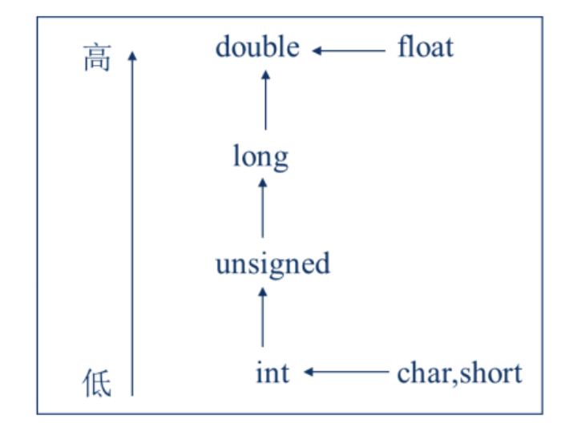

# 一、C++ 语言发展史

- 将程序设计语言分为低级语言、中级语言和高级语言。机器语言和汇编语言属于低级语言一类， 因为它们能够直接操纵计算机的寄存器和内存。机器语言是一种依赖于CPU的指令系统，使用机器指令的二进制代码编写程序，能够直接被计算机识别。汇编语言使用能够代表指令的助记符来编写程序，可以看作是符号化了的机器语言。
- 高级语言是面向用户的语言，很多语言在形式上接近于算术语言和自然语言,程序员编写方便。使用高级语言编写的程序易读且通用性强，但大部分不能直接与硬件打交道，也不能直接在计算机上运行，需要系统软件的支持，如需要编译程序及链接程序将高级语言编译链接为机器指令后才能运行。
- C语言是C+ +语言的前身，在进一步扩充和完善C语言的基础上得到了C+ +语言。

# 二、C++ 语言的特点

- 它是C语言的继承，尽量兼容C语言，既保持了C语言的简洁和高效，可以像C语言那样进行结构化程序设计，同时也增强了C语言对类型的处理。
- 加入了面向对的特征，可以进行以抽象数据类型为特点的基于对象的程序设计，还可以进行以继承和多态为特点的面向对象的程序设计。

与 C 语言相比，C++ 语言的特点：

1. 从程序运行的稳定性来说，C++语言比C语言更安全，它支持过程化编程、面向对象编程和泛型编程。因为能够支持面向对象的开发方式，所以C++语言
   的应用领域更加广泛。
2. C+ +语言可运行年多种平台上，如Windows、MAC操作系统及UNIX的多种版本。
3. C+ +语言中加入了面向对象的概念，虽然C语言的语法绝大部分都被保留在C++语言中，但C+ +的程序结构与C语言的程序结构存在很大差别。
4. C+ +语言对C语言做了很多改进，C+ +语言相对于C语言的最根本的变化是引进
   了类和对象的概念。

## （1） 基本的输入/输出

| 功能     | C语言中使用函数 | C++语言中提供类  | C++类中对象 | 运算符 |
| -------- | --------------- | ---------------- | ----------- | ------ |
| 键盘输入 | scanf()         | 输入流类 istream | cin         | >>     |
| 屏幕输出 | printf()        | 输出流类 ostream | cout        | <<     |

- 在C++中，可以使用流提取运算符 >> 从标准输人设备键盘取得.数据。例如，语句 cin>>x; 从键盘获取输入数据并赋给变量 x。使用 cin 可以获得多个来自键盘的输入值。
- cout是一个标准输出流对象，使用流插入运算符 << 向输出设备屏墓输出信息。

```c++
#include <iostream>
#include <string>

using namespace std;

int main (){
    int a;
    char c;
    cout << "以空格为分隔符输入 a c" << endl;
    cin >> a >> c;
    cout << ("%d",a) << "\n" << c << endl;
}
```

## （2） 头文件和命名空间

iostream是C + +的标准输入/输出流。当在程序中使用cin或cout时， 必须在程序的最前面包含这个流。如果还要使用其他的内容，那么需要包含其他的头文件。每条#include指令仅可以包含一个头文件，如果需要包含多个头文件，则需要使用多条#include指令。[嵌入指令 ]

在C++中，头文件不再以".h"结尾，以".h” 结尾的头文件是C语言中常用的头文件。

常用的头文件有以下一些：

- 标准输入输出流:` <iostream>`。
- 标准文件流:` <fstream>` 。
- 标准字符串处理函数: `<string> `。
- 标准数学函数: ` <cmath>`。

当使用尖括号时，C+ +编译器将首先在C+ +系统设定的目录中寻找要包含的文件，如果没有找到，再到指令中指定的目录中去查找。采用双引号时，C+ +编译器在用户当前目录下或指令中指定的目录下寻找要包含的文件。例如，要包含e:\myprog目录下的头文件ex1.h,相应的语句如下: 

```c++
#include "e:myprog\ex1.h"
```


C+ +中为了避免名字定义冲突,特别引入了“命名空间”的定义，即namespace。命名空间的作用是为了消除同名引起的歧义。

```c++
using namespace std;|
```

定义一个命名空间的语法格式如下: 

```c++
namespace name
{
  命名空间内各种声明（函数声明，类声明、...）
}
```

## （3） 强制类型转换运算符

static_ cast用于将一种数据类型转换成另一 种数据类型， 使用格式如下:

```c
static cast<类型名>(表达式)
```

其功能是把表达式转换为类型名所指定的类型。static cast也可以省略。以下四种写法都是正确的。

```c++
a = static_cast<int>(onedouble);  // 强制类型转换
a = int(onedouble);               // 强制类型转换运算符的新形式
a = (int)onedouble;               // 强制类型转换运算符的旧形式
a = onedouble;                    // 自动类型转换
```



横向必须转，就高不就低。

注： 便携 C++ 程序一般需要经过的几个步骤依次是： 编辑， 编译， 连接， 运行

## （4） 函数参数的默认值

C+ +语言规定，提供默认值时必须按从右至左的顺序提供，即有默认值的形参必须在形参列表的最后。如果有某个形参没有默认值,则它左侧的所有形参都不能有默认值。调用函数时，主调函数的实参与被调函数的形参按从左至右的顺序进行匹配对应。

```c
#include <iostream>

using namespace std;

void func(int a = 1);  // 声明中给出函数默认值，定义中不允许默认参数。

int main()
{
    float a = 123.1;
    a = int(a);
    func();
    func(a);
}

void func(int a)
{
    cout << "a=" << a << endl;
}
```

## （5） 引用和函数参数的传递

引用相当于给变量起了一个别名。变量对应于某个内存地址，如果给某个变量起了别名(不需要给它另开辟内存单元)，相当于变量和这个引用都对应到同一地址。程序中使用哪个名字都是允许的。在C++中，“引用” 的定义
格式如下:

```
类型名 &引用名=同类型的某变量名; 
```

举例如下:

```c
int a = 1;
int &b = a; // &在等号左边为引用符
const &c = a;
b = 8;      // a= 8 , b = 8 , c =8 
//c = 2;    // 错误，不能使用常引用对所引用的变量进行修改。 
```

## （6） const 与指针共同使用

- 如果唯一的const位于符号\*的左侧，表示指针所指数据是常量，数据不能通过本指针改变，但可以通过其他方式进行修改;指针本身是变量，可以指向其他的内存单元。
- 如果唯一的const位于符号\*的右侧， 表示指针本身是常量，不能让该指针指向其他内存地址;指针所指的数据可以通过本指针进行修改。
- 在符号\*的左右各有一个const时，表示指针和指针所指数据都是常量，既不能让指针指向其他地址，也不能通过指针修改所指向的内容。

```c
const char *const p = "ABCD";  // 都是常量， 无法修改。
char const  *const p = "ABCD"; // 同上
const char *p = "ABCD";        // 数据是常量（但数据可以通过其他方式修改） 可以指向其他内存地址
char *const p = "ABCD";        // 指针是常量 可以修改指针所指的数据
```

可以简单的记住 const 的修饰规则： const 修饰其左侧的内容， 如果 const 是本行第一个标识符，则它修饰其右侧的内容。

## （7） 内联函数

- 为了避免这种频繁的函数调用与返回，C+ +语言引入了内联函数的概念。使用内联函数，编译器在编译时并不生成函数调用，而是将程序中出现的每一个内联函数的调用表达式直接用该内联函数的函数体进行替换，就像整个函数体在调用处被重写了一遍一样。很显然，使用内联函数会使最终可执行程序的体积增大。这是以空间消耗节省时间开销。、
- 内联函数应该定义在前，调用在后，定义时只需在函数头返回值类型的前面加_上关键字inline。
- 内联函数主要应用3 F代码量少的函数，频繁调用;
- 如果函数体中有循环语句和switch语句则通常不定义为内联函数。

```c++
inline void a()
{
  ...
}
```

## （8） 函数的重载

所谓函数重载小是指在程序的同- 范围内声明几个功能类似的同名函数。

实现函数的重载必须满足下列条件之一

- 参数表中对应的参数类型不同。
- 参数表中参数个数不同。

如果函数参数表中不同类型参数的次序不同，也符合上面所说的条件。要注意的是，返回值类型不能用来区分函数,也就是说，如果两个函数的名字和参数表都是一样的， 仅仅是返回值类型不同，则这两个函数不是重载的,编译器认为它们是重复定义，编译时会报错。

```c
int bigger(int x, int y)
{
  if (x > y) return x;
  else return y;
}

float bigger(float x, float y)
{
  if (x > y) return x;
  else return y;
}

double bigger(double x, double y)
{
  if (x > y) return x;
  else return y;
}

// 调用函数时进行的必要的类型提升 （隐式类型转换）
```

如下会导致编译错误

```c
int Sum(int a, int c, int d=0);
int Sum(int a, int c);
```

## （9） 指针和动态内存分配

数组的长度是声明数组时指定的，在整个程序运行过程中通常是不变化的。C+ +语言不允许定义元素个数不确定的数组。例如:

```c++
int n;
int a[n];  //在有些编译环境下，这种定义是不允许的，因为n未知
```

在 C++ 语言中，使用 new 运算符实现动态内存分配。例如，可以写如下语句。

```c++
int *p;
p = new int;
*p = 1;
```

使用 new 运算符还可以动态分配一个任意大小的数组

```c++
int *p;
p = new int[n];
```

使用 new 分配的内存只能用 delete 运算符释放掉

```c++
delete []p;
delete p;
```

## （10） 用 string 对象处理字符串

C+ +标准模板库中提供了string数据类型，专]用于处理字符串。string是一个类，这个类型的变量称为"string对象"

要在程序中使用string对象，必须在程序中包含头文件string，即在程序的最前面，要加上如下语句:

```c++
#include <string>
```

声明一个string对象，与声明普通变量是类似的，格式如下:

```c++
string 变量名;
```

示例

```c++
string strs[];
string name;
strs[0] = "asd";
name = "nihao";
```

字符串之间也可以相互赋值，也可以用字符串常量和字符数据的名字对 string 对象进行赋值。赋值时不需要考虑被复制的对象是否有足够的空间来存储字符串。

```c++
string s1, s2 = "OK";
s1 = "china";
s2 = s1;   // s1 和 s2 表示的字符串不等长，赋值后 s2 的内容和 s1 相同
```

字符串长度

```c++
str.length()
```

字符串追加

```c++
str = str.append("abcdecgf")
```

字符串指针

```c++
const char *p = str.c_str();
```

字符串查找

```c++
str.find("de",0); // 从第 0 个位置开始找
```

字符串插入

```c++
str.insert(4,"123"); 
```


# 三、C++ 语言的程序结构

C+ +程序以.cpp作为文件扩展名，文件中包含若干个类和若干个函数。程序中必须有且仅有一个主函数main( ),这是程序执行的总入口。主函数也称为主程序。程序从主函数main( )的开始处执行，主函数可以在任何地方出现，按照其控制结构，-直执行到结束。程序的结束通常是遇到了以下两种情形之一。

- 在主函数中遇到return语句。
- 执行到主函数最后面的括号}。

主函数中可以调用程序中定义的其他函数，但其他函数不能调用主函数。主函数仅是系统为执行程序时所调用的。C+ +程序中，仍沿用C语言的注释风格，即注释有以下两种形式:

- 从`/*`开始，到`*/`结束， 这之间的所有内容都视作注释。
- 从`//`直到行尾，都是注释。

