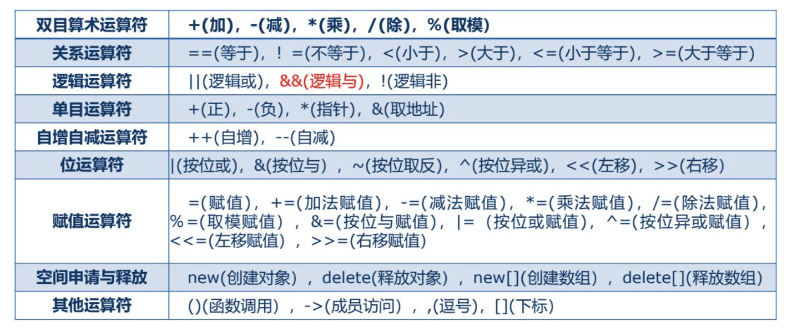
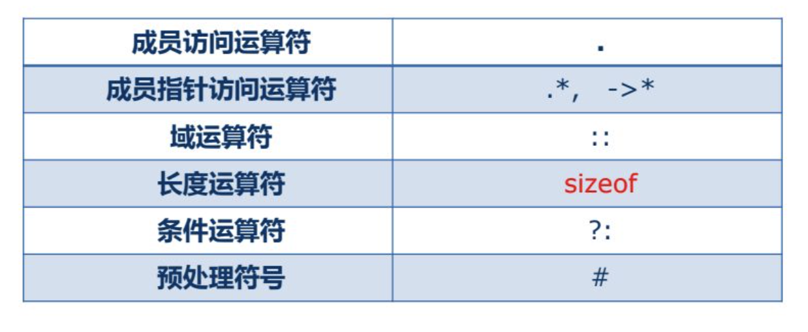

# 一、 运算符重载的概念

C+ +中的表达式由运算符和操作数按照规则构成。例如，算术运算符包括加、减、乘、除和取模。如果不做特殊处理，则这些算术运算符通常只能用于对基本数据类型的常量或变量进行运算，而不能用于对象之间的运算。

运算符重载，就是给已有的运算符赋予多重含义，使同一个运算符作用于不同类型的数据时产生不同的行为。运算符重载的目的是使得C+ +中的运算符也能够用来操作对象。

用于类运算的运算符通常都要重载。有两个运算符，系统提供了默认的重载版本:赋值运算符=和地址运算符&。

- 对于=,系统默认重载为对象成员变量的复制。
- 对于&,系统默认重载为返回任何类对象的地址。

**可以重载的运算符**



**不可重载的运算符**



与其他函数一样， 重载运算符有一个返回类型和一个参数列表。这样的函数称为运算符函数。

运算符可以被重载为**全局函数**，也可以被重载为类的**成员函数**。声明为全局函数时，通常应是**类的友元**。

故运算符函数是一种特殊的友元函数或成员函数。

```c++
#include <iostream>

using namespace std;

// 重载为类的成员函数


class classname
{
    private:
        int b;

    public:
        int a;
        classname();
        classname operator-(const classname &c);
        friend int operator+(const classname &t, const classname &c);       
        void setB(int n);
};

classname::classname():a(1),b(2){};

int operator+(const classname &t,const classname &c)
{
    return t.b + c.b;
}

void classname::setB(int n)
{
    b = n;
}

classname classname::operator-(const classname &c)
{
    this->a -=  c.a;
    return *this;
};

int main()
{
    classname ss1, ss2;
    ss1.a = 5;
    ss2.a = 1;
    cout << (ss1 - ss2).a << endl;
    cout << ss2.a << endl;
    ss1.setB(5);
    ss2.setB(6);
    cout << " ss2 加 ss1 " << ss2 + ss1 << endl;
}
```


# 二、 重载赋值运算符

- 重载后运算符的含义应该符合原有的用法习惯。例如，重载"+"运算符,完成的功能就应该类似于做加法，在重载的"+”运算符中做减法是不合适的。
- 运算符重载不能改变运算符原有的语义，包括运算符的优先级和结合性。
- 运算符重载不能改变运算符操作数的个数及语法结构。
- 不能创建新的运算符，即重载运算符不能超出C+ +语言允许重载的运算符范围。
- 重载运算符"( )”“[ ]”“->”或者赋值运算符“=”时，只能将它们重载为成员函数，不能重载为全局函数。
- 运算符重载不能改变该运算符用于基本数据类型对象的含义。

## （1） 重载赋值运算符

C+ +中的赋值运算符“="要求左右两个操作数的类型是匹配的，或至少是赋值兼容的。有时希望"白”两边的操作数的类型即使不赋值兼容也能够成立，这就需要对"E"进行重载。C+ +规定，“=”只能重载为成员函数。

若有类CL的两个对象s1和s2)，则它们之间的赋值语句通常是下面这样的形式:

```c++
s1=s2;
```

当类CL中定义了成员函数，重载了赋值运算符后，上述赋值语句将解释为函数调用的形式:

```c++
s1.operator=(s2);
```

**实例：**

```c++
#include <iostream>

using namespace std;

// 重载为类的成员函数


class classname
{
    private:
        int b;

    public:
        int a;
        classname();
        classname(classname &c);
        classname& operator-(const classname &c);
        classname& operator=(const classname &c);
        friend int operator+(const classname &t, const classname &c);       
        void setB(int n);
};

classname::classname():a(1),b(2){};

classname::classname(classname &c)
{
    this->a = 100;
    this->b = 100;
}

classname& classname::operator=(const classname &c)
{
    this->a = c.a;
    this->b = 11;
    return *this;
}

int operator+(const classname &t,const classname &c)
{
    return t.b + c.b;
}

void classname::setB(int n)
{
    b = n;
}

classname& classname::operator-(const classname &c)
{
    this->a -=  c.a;
    return *this;
};

int main()
{
    classname ss1, ss2, ss3;
    ss1.a = 5;
    ss2.a = 1;
    cout << (ss1 - ss2)->a << endl;
    cout << ss2.a << endl;
    ss1.setB(5);
    ss2.setB(6);
    cout << " ss2 加 ss1 " << ss2 + ss1 << endl;
    ss3 = ss2;          // 赋值运算符重载
    classname ss4(ss2); // 复制构造函数
    cout << " ss3 加 ss1 " << ss3 + ss1 << endl;
    cout << " ss4 加 ss1 " << ss4 + ss1 << endl;
}
```

## （2） 深拷贝和浅拷贝

同类对象之间可以通过赋值运算符“="互相赋值。如果没有经过重载，“="的作用就是将赋值号右侧对象的值一-赋值给左侧的对象。 这相当于值的拷贝,称为“浅拷贝”

重载赋值运算符后，赋值语句的功能是将一个对象中指针成员变量指向的内容复制到另一一个对象中指针成员变量指向的地方，这样的拷贝叫“深拷贝”。

**两个的区别**

- 在未定义显示拷贝构造函数的情况下，系统会调用默认的拷贝函数一即浅拷 贝，它能够完成成员的一一复制。当数据成员中没有指针时，浅拷贝是可行的;但当数据成员中有指针时，如果采用简单的浅拷贝，则两类中的两个指针将指向同一个地址，当对象快结束时，会调用两次析构函数，而导致指针悬挂现象，所以，此时，必须采用深拷贝。
- 深拷贝与浅拷贝的区别就在于深拷贝会在堆内存中另外申请空间来储存数据，从而也就解决了指针悬挂的问题。简而言之，当数据成员中有指针时，必须要用深拷贝。

```c
#include <iostream>

using namespace std;

// 深拷贝和浅拷贝

class classname1
{
    public:
        int a, *b;  
};

class classname2
{
    public:
        int a, *b;
        classname2& operator=(const classname2 &c);  
        ~classname2();
};

classname2::~classname2()
{
    delete b;
}

classname2& classname2::operator=(const classname2 &c)
{
    this->a = c.a;
    this->b = new int;   // 开辟新的空间去存放值
    *this->b = *c.b;
    return *this;
}

int main()
{
    //  浅拷贝
    cout << "浅拷贝" << endl;
    classname1 s1, s2;
    s1.a = 1;
    s1.b = new int;
    *s1.b = 2;
    cout << " s1 a " << s1.a << " s1 b " << *s1.b << endl; 
    s2 = s1;
    cout << " s2 a " << s2.a << " s2 b " << *s2.b << endl; 
    *s1.b = 5;
    cout << " s2 a " << s2.a << " s2 b " << *s2.b << endl; 

    // 深拷贝
    cout << "深拷贝" << endl;
    classname2 c1, c2;
    c1.a = 1;
    c1.b = new int;
    *c1.b = 2;
    cout << " c1 a " << c1.a << " c1 b " << *c1.b << endl; 
    c2 = c1;
    cout << " c2 a " << c2.a << " c2 b " << *c2.b << endl; 
    *c1.b = 10;
    cout << " c2 a " << c2.a << " c2 b " << *c2.b << endl; 
}
```


# 三、 重载流插入运算符和流提取运算符

**!! 必须承载为类的友元**

在C++中，左移运算符("<<)可以和cout- -起用于输出，故常被称为"流插入运算符”。右移运算符“>>"和cin一起用于输入，一般被称为流提取运算符。它们都是C+ +类库中提供的。在类库提供的头文件中已经对"<<" 和">>”进行了重载，使之分别作为流插入运算符和流提取运算符,能用来输出和输入C+ +基本数据类型的数据。cout是ostream类的对象，cin是istream类的对象，它们都是在头文件iostream中声明的。因此，凡是用"cout<<" 和"cin>>" 对基本数据类型数据进行输出/输入的，都要用#include指令把头文件iostream包含到本程序文件中。

```c
#include <iostream>

using namespace std;

// 重载流插入 流提取运算符

class classname
{
    public:
        int a;
        friend void operator<<(ostream &,classname &c);
        friend void operator>>(istream &,classname &c);
};


void operator<<(ostream & stream,classname &c)
{
    stream << "你好" <<endl;
} 

void operator>>(istream & stream,classname &c)
{
    stream >> c.a ;
}


int main()
{
    classname ss1;
    cout << ss1;
    cin >> ss1;
    cout << ss1.a << endl;
}
```


# 四、 重载强制类型转换运算符

在C++中，类型的名字(包括类的名字)本身也是一种运算符， 即强制类型转换运算符。强制类型转换运算符是单目运算符,也可以被重载,但只能重载为成员函数，不能重载为全局函数。经过适当重载后，

```
(类型名) 对象
```

这个对对象进行强制类型转换的表达式就等价于“

```
对象.operator 类型名( )
```

即变成对运算符函数的调用。


**实例：**

```c++
#include <iostream>

using namespace std;

// 重载强制类型转换运算符


class classname
{
    public:
        int a;
        operator int();
};

classname::operator int()
{
    return 18;
}


int main()
{
    classname ss1;
    cout << (int)ss1 << endl;
}
```


# 五、 重载自增自减运算符

自增运算符"++"和自减运算符都可以被重载，但是它们有前置和后置之分。以"++"为例,对于整数k，‘“++k"和"k++"的语义是不一-样的。当“++"用于对象时，也应该如此。例如，obj是一个类CDemo的对象， 那么"++obj" 和 "obj++" 的含义应该是不 -- 样的。按照自增运算符及自减运算符的本来定义，"++obj" 的返回值应该是obj 被修改后的值，而 "obj++" 的返回值应该是obj被修改前的值。

```c
#include <iostream>

using namespace std;

// 自增自减运算符重载

class classname
{
    public:
        int a;
        classname():a(0){};
        classname & operator++();      // 前置++
        classname & operator++(int);   // 后置++ 虽然多了一个参数，但是参数并没有实际的效用 只作为标识。
};

classname & classname::operator++(int)
{
    classname tmp(*this);
    a++;
    return tmp;   // 这里会有一个警告， 因为局部变量已经释放，返回的引用地址可能不存在啦。 return tmp 的时候， 会先把值符知道约定的保存返回值的地方， 然后 tmp 才被释放， 因为 tmp 值已经被复制啦 释放也没有关系
}

classname & classname::operator++()
{
    a++;
    return *this;
}


int main()
{
    classname ss1;
    cout << (ss1++).a << endl;   // 0
    cout << (++ss1).a << endl;   // 2

}
```


| 必须重载为成员函数的运算符 | 必须重载为友元函数的运算符 |
| -------------------------- | -------------------------- |
| =                          | <<                         |
| ()                         | >>                         |
| []                         |                            |
| ->                         |                            |

