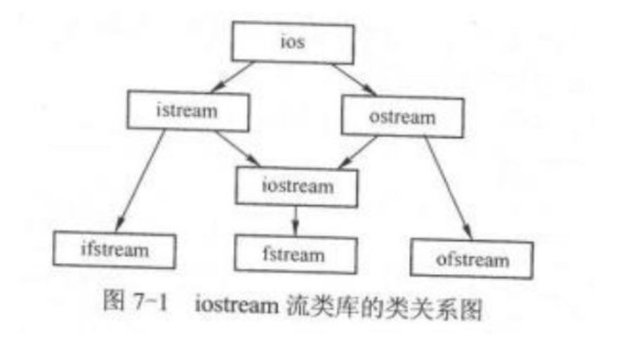
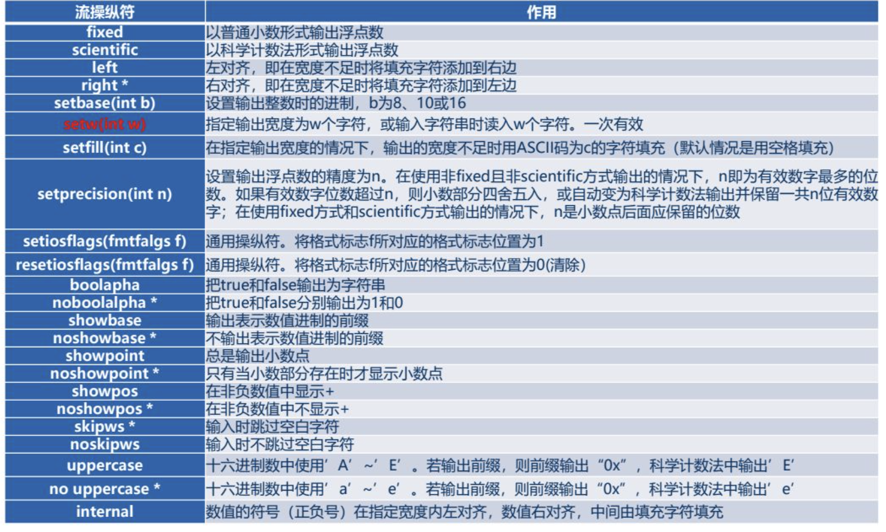
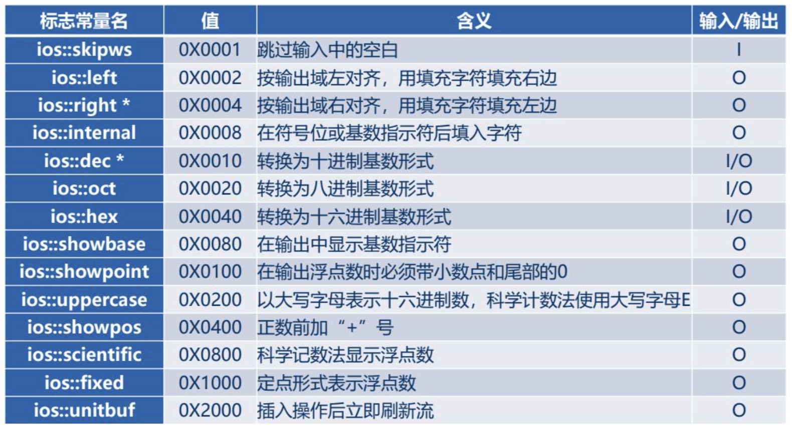

# 一、 流类简介

C+ +中凡是数据从- -个地方传输到另一-个地方的操作都是流的操作。因此，一般意义下的读操作在流数据抽象中被称为 (从流中) "提取” ，写操作被称为(向流中) "插入" 。



图7-1中的箭头代表派生关系。ios是抽象基类,提供输入/输出所需的公共操作，它派生出两个类istream和stream。为了避免多重继承的二义性,从ios派生istream和ostream时，均使用了virtaa关键字(虚继承)istream类提供了流的大部分输入操作，对系统预定义的所有输入流重载提取运算符">>”。ostream类对系统预定义的所有输出流重载插入运算符"<<"

由istream和ostream又共同派生了iostream类。

C+ +的iostream类库提供了数百种I/O功能，iostream类库的接口部分包含在几个头文件中。常见的头文件有以下3个:

- ipstream
  头文件iostream包含操作所有输入输出流所需的基本信息，因此大多数C+ +程序都应包含这个头文件。该文件含有4个标准流对象,提供了无格式化和格式化的I/O功能。
- iomanip
  例如: (setw() setprecision()， sefill(), setbase()等。
  头文件iomanip包含格式化I/O的带参数流操纵符，可用于指定数据输入/输出的格式。
- fstream
  头文件fstream包含处理文件的有关信息，提供建立文件、读/写文件的各种操作接口。

# 二、 标准流对象

 C+ +在头文件iostream中为用户预定义了4个标准流对象，分别是:

- cin（标准输入流）
  - cin与标准输入设备(键盘)相关联，用于读取数据，可以被重定向为从文件中读取数据
- cout（标准输出流）
  - cout与标准输出设备(显示器)相关联，用于输出数据，可以被重定向为向文件里写入数据
- cerr（非缓冲错误输出流）
  - cerr与标准错误信息输出设备(显示器)相关联(非缓冲)，用于输出出错信息，不能被重定
    向
- clog（缓冲错误输出流）
  - clog与标准错误信息输出设备相关联( 缓冲)，用于输出出错信息，不能被重定向。


# 三、 控制 I/O 格式

## （1） 流操纵符

| 流操纵符    | 作用                         | 输入/输出 |
| ----------- | ---------------------------- | --------- |
| endl        | 换行符                       | O         |
| ends        | 输出字符串结束，并清空流     | O         |
| flush       | 清空流缓冲区                 | O         |
| dec（默认） | 以十进制形式输入或输出整数   | I/O       |
| hex         | 以十六进制形式输入或输出整数 | I/O       |
| oct         | 以八进制形式输入或输出整数   | I/O       |
| ws          | 提取空白字符                 | O         |




```c++
#include <iostream>
#include <iomanip>

using namespace std;

int main()
{
    cout << setw(10) << hex << right  << 123 << "w" << endl;
}
```


## （2） 标志字



```c++
#include <iostream>
#include <iomanip>

using namespace std;

// 标志字

int main()
{
    double x = 12.34;
    cout << setw(20) << setiosflags(ios::right) << setfill('*') << setiosflags(ios::fixed)  << x << endl;
  	// resetiosflags  清除
}
```

# 四、 调用cout 的成员函数

| 成员函数            | 作用相同的流操作符    |
| ------------------- | --------------------- |
| precision(int np)   | setprecision(np)      |
| width(int nw)       | setw(nw)              |
| fill(char cFill)    | setfill(cFill)        |
| setf(long iFlags)   | setiosflags(iFlags)   |
| unsetf(long iFlags) | resetiosflags(iFlags) |


```c++
#include <iostream>
#include <iomanip>

using namespace std;

int main()
{
    cout.fill('*');
    cout.width(20);
    cout << 123 << endl;
}
```


| 成员函数      | 含义                               |
| ------------- | ---------------------------------- |
| put           | 将字符写到输出流                   |
| write(str,20) | 将 str  的前20个字节写入到输出流中 |

```c++
#include <iostream>
#include <iomanip>

using namespace std;

int main()
{
    cout.fill('*');
    cout.width(20);
    cout << 123 << endl;

    char s[100] = "hasdhasdjagdahdjasdgjasdgasdjdgshj";
    cout.write(s,10);
    cout <<endl;
    cout.put('a'+1); // b 只输出字符
    cout <<endl;
}
```

# 五、 调用 cin 的成员函数

istream类提供了一些公有成员函数，它们可以以不同的方式提取输入流中的数据。

## （1） get

```c++
int get();
istream& get(char &rch);
istream& get(char *pch, int nCount, char delim= '\n')  // nCount 读多少个字符
```

读取单个字符

```c++
#include <iostream>
#include <iomanip>

using namespace std;

// 调用 cin 成员函数

int main()
{
    char ch;
    ch = cin.get();
    cout.put(ch) << endl;
}
```

## （2） getline

读取一行字符

```c++
#include <iostream>
#include <iomanip>

using namespace std;

// 调用 cin 成员函数

int main()
{
    // char ch;
    // ch = cin.get();
    // cout.put(ch) << endl;
    

    char s1[20], s2[20];

    cin.getline(s1,20);     // 只能读取 20 -1 个字符 （\0） 长度和 \n 那个满足读取都会结束 超出给定长度会异常（可作为 while退出条件）
    cin.getline(s2,20,'c'); // 读到1 或者 \n 结束
    cout.write(s1,20) << endl;
    cout.write(s2,20) << endl;
}
```

## （3） eof

判断输入流是否已经结束

> 在应用程序中可以用 eof() 函数测试是否到达文件尾，当文件操作符遇到文件尾时， 函数返回 1； 否则返回 0；

```c++
#include <iostream>
#include <iomanip>
#include <fstream>

using namespace std;

// 调用 cin 成员函数

int main()
{
    char s[100];
    ifstream f("./test.txt");
    while (!f.eof())
    {
        f.getline(s,100);
        cout << s << endl;
    }
}
```

## （4） ignore

跳过输入流的 n 个字符

```c++
istream & ignore(int n=1, int delim = EOF);
```

> 此函数的作用是跳过输入流中的n个字符，或跳过delim及其之前的所有字符(哪个条件先满足就按哪个执行)。两个参数都有默认值。因此cin.ignore( )等效于cin.ignore(1,EOF)，即跳过一个字符。 该函数常用于跳过输入中的无用部分，以便提取有用的部分。

```c++
#include <iostream>
#include <iomanip>
#include <fstream>

using namespace std;

// 调用 cin 成员函数

int main()
{
    char s[100];
    cin.ignore(2,EOF) >> s; // qwer
    cout << s << endl;      // er
}
```

## （5） peek

返回输入流中的当前字符

> 函数peek()返回输入流中的当前字符，但是并不将该字符从输入流中取走一一相当于只是“看了一眼”将要读入的下一个字符，因此叫"窥视"。cin.peek( )不会跳过输入流中的空格和回车符。在输入流已经结束的情况下，cin.peek( )返回EOF。

```c++
#include <iostream>
#include <iomanip>
#include <fstream>

using namespace std;

// 调用 cin 成员函数

int main()
{
    char s[100];
    cout << cin.peek() << endl; // 113
    cin.ignore(2,EOF) >> s;     // qwer
    cout << s << endl;          // er
}
```

