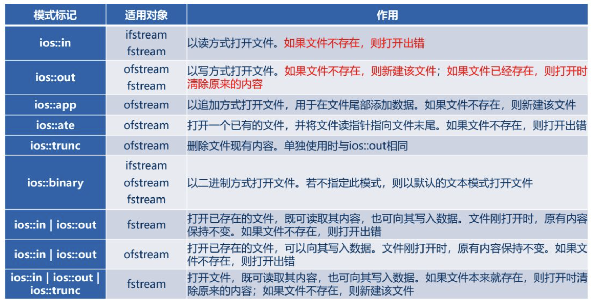

# 一、 文件的基本概念和文件流类

## （1） 文件的概念

从不同的角度来看待文件就可以得到不同的文件分类。C+ +根据文件数据的编码方式不同分为**文本文件**和**二进制文件**。根据存取方式不同分为**顺序存取文件**和**随机存取文件**。

所谓"文本文件”和“二进制文件”是从文件格式的角度进行分类，是约定俗成的、从计算机用户角度出发进行的分类。

所谓的“顺序存取文件”和“随机存取文件"是根据访问文件中数据的方式来划分的。顺序存取文件就是按照文件中数据存储次序进行顺序操作,为访问第i个数据，就首先要访问第i-1个数据，在整个文件操作过程中，将移动位置指针的工作交给系统自动完成。磁带文件就是一-个典型的顺序存取文件。随机访问文件是根据应用的需要,通过命令移动位置指针直接定位到文件内需要的位置并进行数据操作。

对文件的基本操作分为读文件和写文件。所谓"读文件”就是将文件中的数据读入内存之中，也称为“输入”。所谓“写文件"就是将内存中的数据存入文件之中，也称为“输出’


## （2） C++ 文件流类

C+ +标准类库中有3个流类可以用于文件操作，这3个类统称为文件流类,分别如下:

- ifstream:用于从文件中读取数据。
- ofstream:用于向文件中写入数据。
- fstream:既可用于从文件中读取数据，又可用于向文件中写入数据。

使用这3个流类时，程序中需要包含fstream头文件。

类ifstream和类fstream都是从类istream派生而来的，因此类ifstream拥有类istream的全部，成员函数。同样，类ofstream和类fstream也拥有类ostream的全部成员函数。这3个类中有一些十 分熟悉的成员函数可以使用,如operator<<、 operator>>、 peek( )、ignore( )、getline()、get( )等。

在程序中，要使用一个文件，必须包含3个基本步骤:打开(open)文件一操作文件一一关闭(close) 文件。操作文件就是对文件进行读/写。

C+ +文件流类有相应的成员函数来实现打开、读、写、关闭等文件操作。

# 二、 打开和关闭文件

## （1） 打开文件

打开文件的方式有以下两种

- 先建立对象，然后调用 open() 函数连接外部文件。

  ```c++
  流类 obj;
  obj.open(filename,模式);
  ```

  

- 调用流类带参数的构造函数，在建立流对象的同时连接外部文件

  ```c++
  流类 obj(filename,模式);
  ```

**流类：**(将文件和文件流相关联)

其中的' 流类”是C+ +流类库定义的文件流类ifstream、ofstream或fstream。 若要以读方式打开文件则应使用类ifstream,若以写方式打开文件则应使用类ofstream,若以读/写方式打开文件则应使用类fstream.

**模式：**



## （2） 关闭文件

使用fstream中的成员函数close( )关闭文件。

```c
obj.close();
```

# 三、 文件的读写操作

## （1）读写文本文件

假定现在要实现-个程序，从键盘输入学生的学号、姓名和成绩，将它们存入文件score.txt中。可以使用文本文件保存数据，文件中每一-行保存一 名学生的成绩信息， 学生成绩信息的数据项之间通过空格符分隔，格式存储如下:

学号 姓名 成绩

为了方便程序实现，假设学号不超过10个字节,姓名不超过20个字节，成绩为整型,

### a. 写文本文件

```c++
#include <iostream>
#include <fstream>


using namespace std;

int main()
{
    int grade;
    char sn[11], name[21];

    fstream scroe("./scroe.txt", ios::out);

    cout << "学号 姓名 成绩 " << endl;
    while (cin >> sn >> name >> grade)
        scroe << sn << " " << name  << " "<< grade << endl;
    
    scroe.close();
    return 0;
}
```

### b. 读文本文件

```c++
#include <iostream>
#include <fstream>


using namespace std;

// 读写文本文件

int main()
{

    char data[1000];
    fstream scroe("./scroe.txt", ios::in);
    scroe >> data;
    cout << data << endl;
    scroe.close();
    return 0;
}
```


## （2） 读写二进制文件

### a. 写二进制文件

对二进制文件进行读写不能使用前面提到的类似于cin、cout从流中读写数据的方法。C+ +用binary方式打开二进制文件，调用ifstream或fstream的read()成员函数从文件中读取数据，调用ofstream或fstream的write()成员函数向文件中写入数据。

用ostream::write()成员函数写文件ofstream和fstream的write()成员函数继承自ostream类，原型如下:

```c++
ostream & write(char * buffer, int nCount);
```

该成员函数将内存中buffer所指向的nCount个字节的内容写入文件，返回值是对函数所作用的对象的引用，如obj.write..)的返回值就是对obj的引用。 该函数是非格式化操作，将buffer所指的数据按字节序列直接存入文件中。

在使用write()与read(进行数据读写时，不必在数据之间再额外"插入”分隔符,这是因为它们都要求提供第2个参数来指定读写长度。

```c++
#include <iostream>
#include <fstream>


using namespace std;

// 读写文本文件

typedef struct
{
    char sn[11];
    char name[21];
    int grade;
} stduent;

int main()
{
    stduent stu;
    fstream scroe("./scroe_b.txt", ios::out | ios::binary);
    cout << "学号 姓名 成绩 " << endl;
    while (cin >>  stu.sn >> stu.name >> stu.grade)
        scroe.write((char*)&stu,sizeof(stu));
    scroe.close();
    return 0;
}
```

### b. 读二进制文件

**用istream::read( )成员函数读文件**

ifstream和fstream的成员函数read()实际上继承自类istream,原型如下:

```
istream &read(char * buffer, int nCount);
```

该成员函数从文件中读取nCount个字节的内容，存放到buffer所指向的内存缓冲区中，返回值是对函数所作用的对象的引用。该函数是非格式化操作,对读取的字节序列不进行处理，直接存入buffer中，由程序的类型定义解释。

**用ostream:gcount( )成员函数得到读取字节数**

如果要知道每次读操作成功读取了多少个字节，可以在read()函数执行后立即调用文件流对象的成员函数gcount(),其返回值就是最近一次read()函数执行时成功读取的字节数。gcount()成员函数原型如下: .

```c++
#include <iostream>
#include <fstream>

using namespace std;

int main()
{
    int c;
    char *a = (char*) malloc(sizeof(char));
    fstream scroe("./scroe_b.txt", ios::in | ios::binary); 
    scroe.read(a,20);
    c = scroe.gcount();
    cout << *a << endl;
    cout << c << endl;
}
```

## （3） 用成员 put 和 get 读写文件

### a. get

- ```c++
  int get( );
  ```

  不带参数的get( )函数从指定的输入流中提取一个字符(包含空白字符)，函数的返回值即为
  该字符。当遇到文件结束符时，返回系统常量EOF。

- ```c++
  istream& get(char &rch);
  ```

  从指定输入流中提取一个字符(包含空白字符)，将该字符作为rch引用的对象。当遇到文件
  结束符时，函数返回0;否则返回对istream对象的引用。

- ```c++
  istream& get(char *pch, int nCount, char delim=' \n' );
  ```

  从流的当前字符开始，读取nCount- 1个字符，或遇到指定的分隔符delim结束。函数把读取的
  字符(不包括分隔符)写入数组pch中，并在字符串后添加结束符'\0'。

### b. put

```c++
ostream& put(char ch);
```

函数的功能是向输出流中插入一个字节。成员函数get()和put()常用于读写字符或文本文件， 但它们不仅仅可用于对字符的处理，而且对于二进制文件同样可以进行有效的处理。

## （4） 文本文件和二进制文件的异同

在输入/输出过程中，系统要对内外存的数据格式进行相文本文件是以文本形式存储数据，其优点是具有较高的兼容性。缺点是存储一批纯数值信息时，要在数据之间人为地添加分隔符。应转换，文本文件的另一个缺点是不便于对数据进行随机访问。

二进制文件是以二进制形式存储数据，其优点是便于对数据实行随机访问(相同数据类型的数据所占空间的大小均是相同的，不必在数据之间人为地添加分隔符)。在输入/输出过程中，系统不需要对数据进行任何转换。缺点是数据兼容性差。

通常纯文本信息(如字符串)以文本文件形式存储，而将数值信息以二进制文件形式存储。


# 四、 随机访问文件

如果-一个文件只能进行顺序存取操作，则称为顺序文件。典型的顺序文件(设备)是键盘、显示器和保存在磁带上的文件。如果一个文件可以在文件的任意位置进行存取操作，则称为随机文件。磁盘文件就是典型的随机文件。

在访问文件的过程中，若严格按照数据保存的次序从头到尾访问文件,则称为顺序访问。

在访问文件的过程中，若不必按照数据的存储次序访问文件，而是要根据需要在文件的不同位置进行访问，则称为随机访问。显然，对于顺序文件只能进行顺序访问;对于随机文件既可以进行顺序访问，也可以进行随机访问。

类istream中与位置指针相关的函数如下:

## （1） 移动读指针函数

```
istream & seekg(long pos);
```

该函数的功能是将读指针设置为pos，即将读指针移动到文件的pos字节处。

```
istream & seekg(long offset, ios:seek_dir dir);
```

该函数的功能是将读指针按照seek_ dir的指示(方向)移动offset个字节，其中seek_ dir
是在类ios中定义的一个枚举类型。

```
enum seek_dir {beg=0, cur, end};
```

seek_ dir的常量值含义如下:

- ios::beg:表示流的开始位置。此时，offset应为非负整数。
- ios::cur:表示流的当前位置。此时，offset为正数则表示向后(文件尾)移动，为负数则表示向前(文件头)移动。
- iosend:表示流的结束位置。此时，offset应为非正整数。

## （2） 返回读指针当前位置

```c++
long tellg();
```

函数的返回值为流中读指针的当前位置

## （3）移动写指针函数

```c++
ostream & seekp(long pos);
```

该函数的功能是将写指针设置为pos,)即将写指针移动到文件的pos字节处。

```c++
ostream & seekp(long offset, iosseek_ dir dir);
```

该函数的功能是将写指针按seek dir指示的方向移动offset个字节。

## （4）返回写指针当前位置

```
long tellp();
```

函数的返回值为流中写指针的当前位置

注意:在类fstream中既提供了操作读指针函数seekg()和tellg(),又提供了操作写指针的函数seekp( )和tellp(),实际上在文件中这两个指针是同一个指针。

