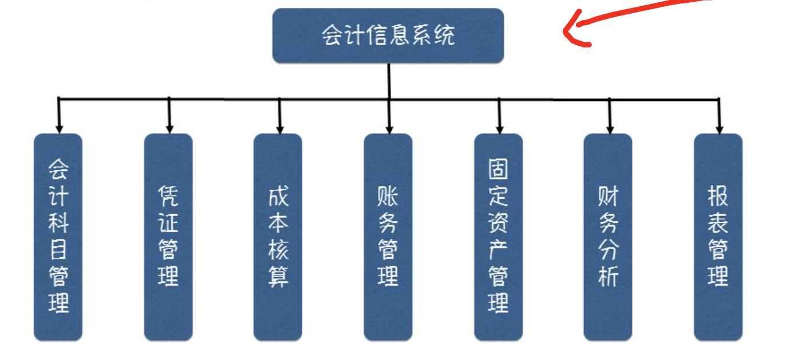
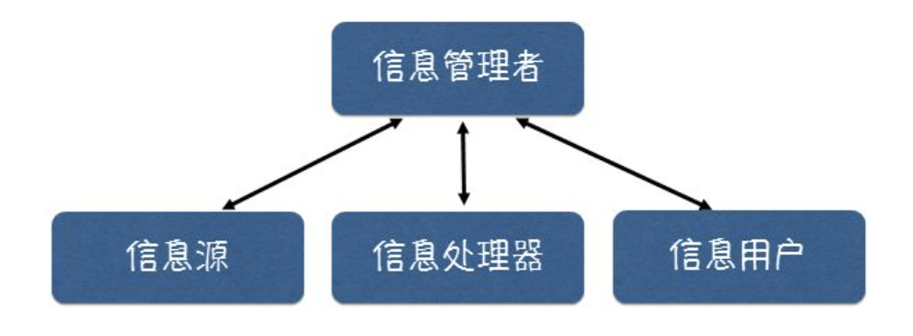

# 一、 管理信息系统概念及其发展

## （1） 管理信息系统的概念和起源

**信息化**是21世纪最重要的**经济发展模式**和最显著的**时代特征**,是目前使用频率最高的词语之一。

**开发与建设管理信息系统**是信息化的具体表现形式和主要内容之一。

管理信息系统是**管理**和**信息技术**不断融合的产物,是**信息化**的具体表现形式和主要内容。

## （2） 管理信息系统概念的演进

单个高度一体化的系统 -> 各子系统的联合

## （3） 管理信息系统的定义

**基本定义：**管理信息系统是一个由人、机(计算机)组成的能进行管理信息的收集、传递、存储、加工、维护和使用的系统。

**管理信息系统的作用：** 监测企业或组织的各种运行情况，利用过去的数据预测未来;从全局出发辅助决策;利用信息控制企业或组织行为;帮助其实现长远的规划目标。

信息系统是一个**人机**系统，同时它又是一个**一体化**系统。

管理信息系统=人+计算机，是一个人-机合成系统但是计算机并不一定是管理信息系统的必要条件，只要有管理，就要有信息 就必然有管理信息系统。

管理信息系统是一个**一体化系统**，或称**集成系统**

一体化具有两个含义:

- **数据的一体化**    数据在各部门之间共享，信息成为企业的资源
- **系统开发的一体化**    总体规划，分步实施

# 二、 管理信息系统的分类

## （1）按核心业务活动分类

- **电子业务系统** 主要针对一个组织内部的具体业务过程而建立 通常我们所说的管理信息系统均是指这类系统，我国大多数企业和组织的管理信息系统的核心部分都属于电子业务系统
  - 人力资源管理系统
  - 教务管理系统
  - 生产业务管理系统
  - 会计信息系统
  - 学籍管理系统
  - 铁路客票发售系统
  - 企业资源计划系统
  - 科技管理系统
- **电子政务系统**  主要针对政府部门1的政务管理活动和服务职能而建立，政府的主要职能包括经济管理、市场监督、社会管理和公共服务
  - 宏观经济管理系统
  - 市场监督管理系统
  - 社会治安管理系统
- **电子商务系统**  主要针对商贸活动而建立，主要依托Internet,，实现网。上购物、网上交易和在线支付等活动 电子商务系统的核心部分通常是以**网站**的形式出现的
  - 企业对企业 B2B
  - 企业对消费者 B2C
  - 消费者对消费者 C2C
  - 企业对政府 B2G

## （2）按数据处理方式分类

**操作型管理信息系统：**

面向具体的管理业务而建立，功能简单数据录入、修改、删除、打印、查找和简单的汇总计算

- 会计记账管理系统
- 工资发放管理系统
- 人事档案管理系统

**分析型管理信息系统：**

面向那些需要进行趋势分析、预测等管理决策需求而建立 基于操作型管理信息系统开发

- 基于会计记账管理系统开发的财务分析系统

## （3）按管理应用层次分类

**事务型：** 事务型管理信息系统主要服务于组织的**基层管理者**，主要目的是**具体业务过程的自动化**，操作型管理信息系统大多是事务型管理信息系统。

**管理型：**管理型管理信息系统主要服务于组织的**中层管理者**，提供**综合查询、统计分析和报表、报告等功能**，涉及多项业务的综合管理。主要目的是使组织的中层管理人员通过固定格式的报表、报告和综合查询、统计分析，**了 解和监视管理领域的运行情况**。

**战略型：** 战略型管理信息系统主要服务于**组织的高层管理者**，主要目的是为战略计划的制订和调整**提供辅助决策功能**。这类系统所需要的数据一般来源事务型管理信息系统和管理型管理信息系统,还有一些来自企业外部，其中外部数据所占的比例较大。

## （4）按行业和业务职能分类

**按行业或部门**

- 铁路管理信息系统
- 农业管理信息系统
- 房地产业管理信息系统

**按业务职能**

- 铁路统计系统
- 客票预发售糸统
- 危险品及安全管理系统

# 三、 管理信息系统的结构

结构是指管理信息系统的各部件的构成框架对这些部件的理解不同,就构成了不同的结构方式

## （1）功能结构

从使用者角度看，任何一个管理信息系统 均有明确的目标，并由若干具体功能组成 各功能相互联系，构成一个有机结合的整体，表现出系统的特性，这就是功能结构。

## （2）概念结构

管理信息系统的功能结构反映了管理的业务职能，比较直观，易于理解。如果对各个管理信息**系统的功能结构进行抽象**，会发现所有的管理信息系统均是由信息源、信息处理器、信息用户和信息管理者四大部件组成，这就是管理信息系统的概念结构。

信息管理者： 负责信息系统的设计， 实施， 维护等工作。

信息源： 信息产生地。

信息处理器： 担负着信息的传输，加工，存储等任务。

信息用户： 信息的最终使用者，应用信息进行管理决策。

## （3）管理职能结构

**纵向视野 :**

一般将管理活动分为高、中、低三个层次，即战略计划层、管理控制层和执行控制层。针对这三个层次所建设的系统称为战略计划子系统、管理控制子系统和执行控制子系统。分别属于战略型、管理型和事务型管理信息系统;

**横向视野:**

从横向来看一个组织，其管理活动是按职能排列的，可分为若干子系统:生产管理子系统销售管理子系统和物资管理子系统，财务会计管理子系统，人力资源管理子系统。

**综合视野:**
实际企业中的管理活动不单纯按层次或职能划分，是横、纵交又形成的完整的管理活动。

## （4）软硬件结构

**硬件结构：** 

- 管理信息系统的硬件结构是系统的实体部分，包括计算机、外设和网络硬件设备及其联机方式。
- 组成：
  - 客户机:  与管理信息系统用户直接交互的硬件设备(台式机、笔记本、pad、智能手机)
  - 服务器:  为客户端计算机提供各种服务的高性能计算机。

**软件结构:** 

- 管理信息系统的软件结构主要包括两方面:
  - 一是描述管理信息系统**应用软件的功能模块**，对管理信息系统功能结构的进一步补充和细化，一般可以用系统模块结构图的形式展示;
  - 二是**依附于硬件结构**的管理信息系统的**软件结构**，主要包括操作系统、数据库管理系统、应用开发工具和各种服务器软件等。

## （5）网络计算结构

**C/S：** 客户端/服务器模式

- 两层 ： 表现层/也五层 - 数据层
- 三层 ： 表现层 - 业务层 - 数据层

**B/S：** 浏览器/服务器模式

# 四、 管理信息系统几种典型应用

## （1） MRP

>  MRP 一种以物料需求的计划与控制为主线的管理思想，基于此种管理方法形成的管理信息系统被称为 MRP 系统。

**MRP系统逻辑流程**  MRP的基本内容是编制零件的生产计划和采购计划。首先定制主生产计划，据此定制物料需求计划、生产进度计划与能力需求计划。

**MRP计算依据**

- 主生产计划 MPS
- 物料清单 ROM
- 库存信息

**MRP系统管理理念**

- 供需平衡原则
- 优先级计划原则

## （2） MRPII

> MRP系统只涉及物流，只是企业生产管理的一个方面

> MRPII系统，制造资源计划(Manufacturing Resource Planning)集制造、财务、销售、采购、工程技术等各子系统为一体

## （3） ERP

> MRPII 系统仅仅局限于企业内部制造资源，不包括面向供应链管理的概念逐渐扩展为覆盖工程、财务、人力资源和项目管理等领域的企业内全部活动，演化成为新一代企业资源计划(Enterprise Resource Planning，ERP)

**ERP三大特征** （故事链）

- 顾客驱动
- 基于时间
- 面向整个供应链

**ERP四大元素**  （人钱物信息）

- 资金
- 货物
- 人员
- 信息

**ERP主要功能**

- 财务管理
  - 会计核算
  - 财务管理
- 物流管理
  - 分销管理
  - 库存控制
  - 采购管理
- 生产计划与控制管理（核心功能）
  - 主生产计划
  - 物料需求计划
  - 能力需求计划
  - 车间控制
  - 制造标准
- 人力资源管理
  - 招聘管理
  - 工资核算
  - 工时管理
  - 等等