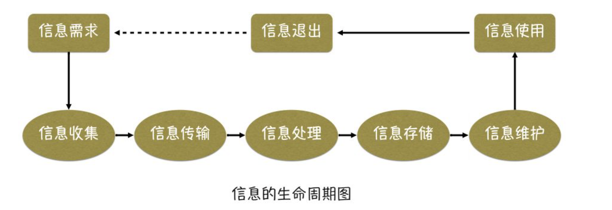
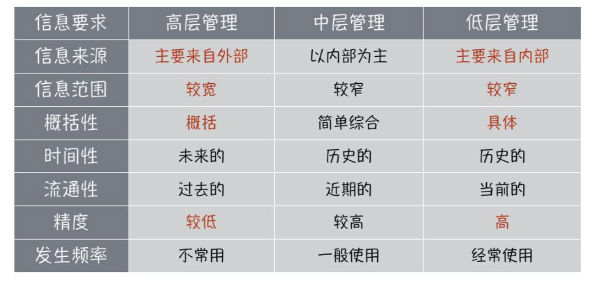

# 管理

# 一、 管理的含义

## （1）管理的概念

管理就是对工商企业、政府机关、人民团体以及其他各种组织的一切活动的指导。

管理就是由一个或更多的人来协调他人的活动，以便收到个人单独活动所不能收到的效果而进行的各种活动。

- 管理工作的中心是**管理**其他人的工作。
- 管理工作是通过**协调**其他人的活动来进行的，追求群体的协同效应。
- 管理就是去营造一种**激励**环境，使其所有工作人员努力工作，发挥群体的**协同**效应，达到企业或组织的目标。

## （2）管理与信息系统的关系

管理的过程就是基于**信息**的**决策过程**，它通常包含以下步骤:

- 发现问题
- 拟定方案
- 作出决策

## （3）管理现代化

> 管理现代化的内容是随着社会的变化、生产力的发展和科学技术水平的提高而不断更新和充实的

管理现代化是一个整体的概念，主要包括:

- 管理**思想**的现代化
- 管理**组织**的现代化
- 管理**方法**的现代化
- 管理**手段**的现代化

## （4）管理的基本职能

- 计划 ： **管理的首要职能**，对未来事件作出预测，以定制出行动方案
- 组织 ： 完成计划所需的组织结构、规章制度、人财物的配备等
- 协调 ： 使组织内部的每一部分或每一成员的个别行为都能服从于整个集体的目标，是管理过程中带有**综合性、整体性**的一种职能 
- 指挥 ： 对所属对象的行为进行发令、调度、检查
- 控制 ： 对下属人员的行为进行检测，纠正偏差，使其按规定的要求工作 

# 二、 组织结构

组织是保证管理目标实现的重要手段，是管理的重要问题了解管理的组织结构将有助于我们分析和设计管理信息系统。

## （1） 直线制

最早也是最简单的组织形式

特点: 企业各级行政单位从上到下实行垂直领导，下属部门只接受一个上级的指令，各级主管负责人对所属单位的一切问题负责。

直线制结构比较适用于任务明确，而又要求领导集中、控制严格的情况，是一种树状组织。

## （2） 职能制

各级行政单位除主管负责人外，还相应地设立一些职能机构。

- 优点: 减少了最高领导者的负担
- 缺点: 容易造成办事效率低下等现象

## （3） 矩阵式

两维组成，一维是直线组织，另一维是任务(如产品、 项目、地区等)

- 优点:加强了横向联系、具有较大的机动性
- 缺点:人员受双重领导，有时不易分清责任

# 三、 管理部门的划分方法

职能制和矩阵式是目前多数企业采用的组织结构，其中包含了若干管理部门

**一个企业可以按以下原则进行管理部门的划分:**

- 按职能划分
  - 制造业 商业
- 按地区划分
  - 政府机关 银行 法院 工商
- 按产品划分
  - 大规模组织中比较流行
  - 汽车 ： 发动机分厂  车身分厂
  - 学校 ： 院 系 专业

# 四、 管理幅度与层次

## （1）管理幅度

管理幅度又称“管理跨度”或“管理宽度”，是指一名管理者有效地监督管理其直接下属的人数是有限的，当超过某个限度时，管理的效率就会随之下降，所以须增加一个管理层次。

## （2）管理层次

- 高层管理
  - 属战略级管理，指一个组织最高领导层，主要职能是根据组织内外的全面情况，分析和制定该组织长远目标及策略。
- 中层管理
  - 属战术级管理，主要任务是根据最高层管理所确定的总体目标，对组织内部所拥有的各种资源，制定资源分配计划和进展表，并组织基层单位来实现总体标。中层管理有时也称为控制管理。
- 基层管理
  - 也称执行层或作业层管理，它是按照中层管理制定的计划，具体组织人力去完成计划。

## （3）管理的扁平化

按照管理幅度的大小及管理层次的多少，分成两种结构:

- 扁平结构:  管理层次少而管理宽度大
- 直式结构:  管理层次多而管理宽度小

为了达到有效管理，应尽可能地减少管理层次，我们将这一过程称为管理扁平化。

# 五、 管理层次与决策层次

决策是管理活动的中心，管理活动的低、中、高三个层次分别对应着三种类型的决策过程

- 结构化决策
  - 通常指确定型的管理问题,它根据一定的决策规则或通用的模型来实现其决策过程的自动化。
  - 财务处理， 物资出入库管理
- 半结构化决策
  - 通常指企业职能部门主管业务人员的计划控制等管理决策活动。
  - 市场预测
- 非结构化决策
  - 指很难用确定的模型来描述的一类管理决策活动，它强调决策者的主观意识，这类问题一般都带有全局性、战略性和复杂性。
  - 市场开发 企业发展战略

| 类型特点 | 结构化决策           | 半结构化决策 | 非结构化决策             |
| -------- | -------------------- | ------------ | ------------------------ |
| 识别程度 | 问题确定，参数量化   | 问题较难决定 | 问题不确定，参数难以量化 |
| 复杂程度 | 不太复杂             | 较复杂       | 很复杂                   |
| 模型描述 | 可用数学模型规范描述 | 较难描述     | 需开发专用模型或无法建模 |
| 信息来源 | 内部                 | 主要是内部   | 外部和内部综合信息       |
| 决策方式 | 自动化               | 半自动化     | 非自动化                 |

# 信息

# 六、 信息与数据

**数据：**  数据是对客观事物的记载，数据由一些可以鉴别的物理符号组成。

**信息：**  信息是经过加工的数据，是有一定含义、能减少不确定性、对决策或行为有现实或潛在价值的数据。

# 七、 信息的基本属性

**地位：**  客观信息、主观信息

**作用大小：**  有用信息、无用信息、干扰信息

**应用部门：**  工业信息、农业信息、军事信息、科技信息、市场信息、等

**共同的基本属性：**

- 普遍性
  - 信息是普遍存在的，它是事物运动和状态改变的方式。因此，只要有事物存在，只要有事物运动，就会有它们运动的状态和方式，就存在信息。
- 事实性
  - 信息描述了事物运动和状态的改变，因此，它具有事实性，这是信息的重要基本性质之一。
- 层次性
  - 通常将管理分成三个层次:高层管理、中层管理、基层管理。对于同一个问题，处于不同的管理层次，要求不同的信息。因此，信息与管理一样，也具有层次性。
- 可压缩性
  - 指信息经过浓缩、集中、综合和概括等处理后，而不至于丢失信息的本质。
- 扩散性
  - 信息的本性，信息力图冲破保密的、非自然的约束，通过各种渠道，和手段向四面八方传播。
- 非消耗性
  - 信息与其他物质资源不同，它在使用过程中不但不会被消耗，而且还可能出现再生或增殖。
- 共享性
  - 信息是一种特殊的资源，只能共享不能交换，只有将企业的全部信息集中管理，充分共享，信息才可能成为企业可利用的资源。
- 变换性
  - 信息是事物运动的状态和方式，不是事物本身，因此信息可以负载在其他一切尽可能的物质载体和能量形式上。
- 可转化性
  - 从潜在的意义上讲，信息是可以转化的。它在一定条件下(其中最主要的条件就是信息被人们有效利用)，可以转化为物质、能量、时间及其他。

# 八、 信息处理的生命周期

从信息的产生到最终被使用而发挥作用，可将信息的生命周期分为需求、收集、传输、处理、存储、维护、使用和退出等过程。

- 信息收集
  - 根据管理人员对信息的需求而进行的原始数据的获取过程。
  - 在进行信息收集阶段面临的首要问题是如何将需要的信息**识别**出来，其次是收集的方法问题，最后是用何种形式将收集结果表现出来的问题。
- 信息传输
  - 信息只有及时准确地送到需要信息的管理者手中，才能发挥作用。
  - 所谓及时准确，实际上是一个信息传递的效率问题，表现为信息传输的**速度和质量**。
- 信息处理
  - 信息处理/加工，就是对收集到的信息进行去伪存真、去粗取精、由表及里、由此及彼的加工过程。
  - 信息加工不可避免地产生时间延迟，这也是信息的一个重要特征 **滞后性**。
- 信息存储
  - 信息存储活动主要涉及**保存什么信息、存储介质、保存时间、存储方式**四个问题。
- 信息维护
  - 信息维护的主要目的是保证信息的**准确性、及时性、安全性、保密性**。

# 九、 管理信息与决策

**管理信息定义：**  指对企业的日常经营、决策和战略规划等管理活动有用的信息

**管理信息分类：**

- 按管理职能分:  产品设计信息、生产信息、市场销售信息、人力资源信息、等
- 按信息来源分:  内部信息、外部信息
- 按信息流向分:  输入信息、输出信息、控制信息、反馈信息、等

**管理信息的特点：**

- 信息来源的分散性
- 信息量大且多样性
- 信息处理方法的多样性
- 信息的发生、加工和使用时间、空间上的不一致性

**管理信息与决策的关系：**

- 决策需要信息的支持（决策可以视为一个信息处理的过程）
- 不同管理层次需要不同的信息

# 系统

# 十、 系统的概念

**系统的概念:**  系统是由一些相互联系、相互制约的若干组成部分结合而成的、具有特定功能的一个有机整体(集合) 。

**系统存在的三个基本条件：**

- 系统是由若干要素(部分) 组成的
- 系统有一定的结构
- 系统有一定的功能，或者说系统要有一定的目的性

**系统的基个要系：**  无论何种具体的系统，均可以分解为输入、处理、输出、反馈和控制五个基本要素。

# 十一、系统的分类

**按复杂程度分类：**

- 物理结构系统
- 生物系统
- 人类系统
- 社会系统
- 宇宙系统

**按系统与环境的关系分类：**

- 封闭系统
- 开放系统

**按是否有反馈机制分类：**

- 开环系统（不存在反馈）
- 闭环系统（存在反馈）

**按抽象程度分类：** 抽象程度从高到低

- 概念
- 逻辑
- 物理

# 十二、系统的属性

- 整体性： 系统的总体性能大于各要素性能之和
- 关联性： 指系统与其子系统之间、系统内部各子系统之间和系统与环境之间的相互作用、相互依存和相互关系
- 层次性： 一个系统总是由若干子系统组成的，该系统本身又可看做是一个更大的系统的一个子系统
- 统一性： 不同层次上系统运动规律的统一性，不同层次上的系统运动都存在组织化的倾向，而不同系统之间存在着系统同构

# 十三、系统的分解

**系统分解的目的：**  面对一个庞大而又复杂的系统，我们将其按一定原则划分为若千子系统，从而降低分析的难度，这种系统方法称为系统的分解。

**系统分解的原则:**

- 可控制性原则
- 功能聚合性原则
- 接口标准化原则

# 信息技术

# 十四、 网络技术

**计算机网络的概念：**  利用通信设备和线路将地理位置不同、功能独立的两台或两台以上的计算机互联起来，以功能完善的网络软件实现资源共享和信息传递的系统

**网络的分类：** 

- 按通信介质分
  - 有线网
  - 无线网
- 按地理范围分
  - 局域网
  - 广域网

**网络协议：**

常用协议: TCP/IP协议、IPX/SPX协议、NetBEUI协议

局域网中可以使用三种协议中任意一种， 但是访问Internet必须使用TCP/IP协议

**网络拓扑结构：**

指计算机及网络设备在空间，上的排列形式，最基本的拓扑结构有总线型、星形和环形三种

**网络安全：**

网络安全是指网络系统的硬件、软件及其系统中的数据受到保护，本质上讲就是网络上的信息安全。

安全的网络一般具有**保密性、完整性、可用性、可控性和可审查性**五个特征。

# 十五、 数据库技术

**数据库(Database)的概念：**  各种相关数据的集合和容器

**数据表(Table)的概念：** 数据库的重要组成部分，存放数据的基本数据结构.

**数据库管理系统DBMS：** 对数据库进行管理的系统软件，位于用户和操作系统之间，为用户或应用程序提供访问数据库的方法和工具

**结构化查询语言SQL：** 关系数据库的标准语言

# 十六、 计算机语言

**机器语言：** 第一代计算机语言，直接和机器打交道的语言

**汇编语言： ** 第二代计算机语言，基于助记符的语言

**高级语言：** 第三代计算机语言，语法和句法与自然语言接近的语言

