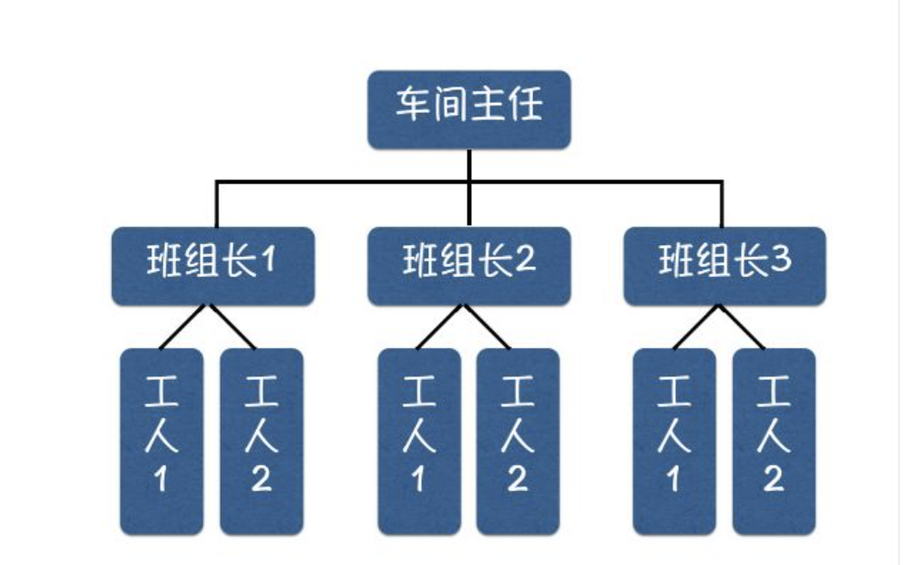
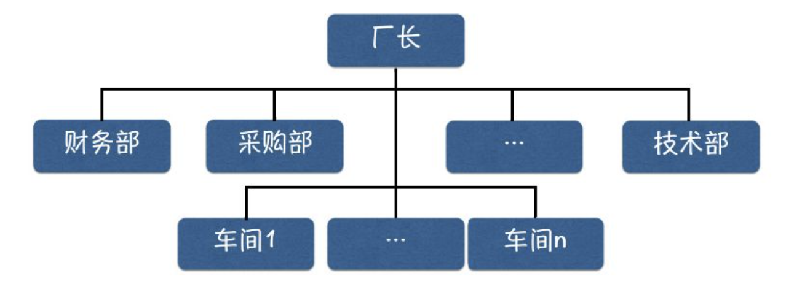
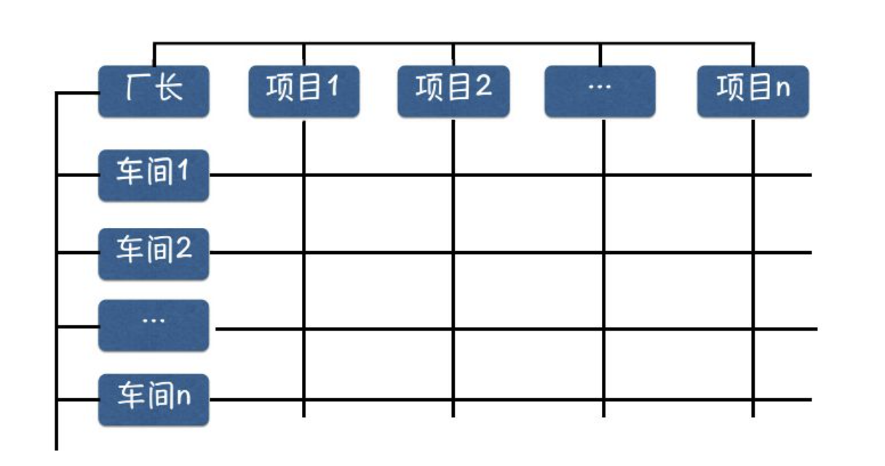

# 一、 管理的含义

## （1）管理的概念

管理就是对工商企业、政府机关、人民团体以及其他各种组织的一切活动的指导。

管理就是由一个或更多的人来协调他人的活动，以便收到个人单独活动所不能收到的效果而进行的各种活动。

- 管理工作的中心是**管理**其他人的工作。
- 管理工作是通过**协调**其他人的活动来进行的，追求群体的协同效应。
- 管理就是去营造一种**激励**环境，使其所有工作人员努力工作，发挥群体的**协同**效应，达到企业或组织的目标。

## （2）管理与信息系统的关系

管理的过程就是基于**信息**的**决策过程**，它通常包含以下步骤:

- 发现问题
- 拟定方案
- 作出决策

## （3）管理现代化

> 管理现代化的内容是随着社会的变化、生产力的发展和科学技术水平的提高而不断更新和充实的

管理现代化是一个整体的概念，主要包括:

- 管理**思想**的现代化
- 管理**组织**的现代化
- 管理**方法**的现代化
- 管理**手段**的现代化

## （4）管理的基本职能

- 计划 ： **管理的首要职能**，对未来事件作出预测，以定制出行动方案
- 组织 ： 完成计划所需的组织结构、规章制度、人财物的配备等
- 协调 ： 使组织内部的每一部分或每一成员的个别行为都能服从于整个集体的目标，是管理过程中带有**综合性、整体性**的一种职能 
- 指挥 ： 对所属对象的行为进行发令、调度、检查
- 控制 ： 对下属人员的行为进行检测，纠正偏差，使其按规定的要求工作 

# 二、 组织结构

组织是保证管理目标实现的重要手段，是管理的重要问题了解管理的组织结构将有助于我们分析和设计管理信息系统。

## （1） 直线制

最早也是最简单的组织形式

特点: 企业各级行政单位从上到下实行垂直领导，下属部门只接受一个上级的指令，各级主管负责人对所属单位的一切问题负责。

直线制结构比较适用于任务明确，而又要求领导集中、控制严格的情况，是一种树状组织。

## （2） 职能制

各级行政单位除主管负责人外，还相应地设立一些职能机构。

- 优点: 减少了最高领导者的负担
- 缺点: 容易造成办事效率低下等现象

## （3） 矩阵式

两维组成，一维是直线组织，另一维是任务(如产品、 项目、地区等)

- 优点:加强了横向联系、具有较大的机动性
- 缺点:人员受双重领导，有时不易分清责任

# 三、 管理部门的划分方法

职能制和矩阵式是目前多数企业采用的组织结构，其中包含了若干管理部门

**一个企业可以按以下原则进行管理部门的划分:**

- 按职能划分
  - 制造业 商业
- 按地区划分
  - 政府机关 银行 法院 工商
- 按产品划分
  - 大规模组织中比较流行
  - 汽车 ： 发动机分厂  车身分厂
  - 学校 ： 院 系 专业

# 四、 管理幅度与层次

## （1）管理幅度

管理幅度又称“管理跨度”或“管理宽度”，是指一名管理者有效地监督管理其直接下属的人数是有限的，当超过某个限度时，管理的效率就会随之下降，所以须增加一个管理层次。

## （2）管理层次

- 高层管理
  - 属战略级管理，指一个组织最高领导层，主要职能是根据组织内外的全面情况，分析和制定该组织长远目标及策略。
- 中层管理
  - 属战术级管理，主要任务是根据最高层管理所确定的总体目标，对组织内部所拥有的各种资源，制定资源分配计划和进展表，并组织基层单位来实现总体标。中层管理有时也称为控制管理。
- 基层管理
  - 也称执行层或作业层管理，它是按照中层管理制定的计划，具体组织人力去完成计划。

## （3）管理的扁平化

按照管理幅度的大小及管理层次的多少，分成两种结构:

- 扁平结构:  管理层次少而管理宽度大
- 直式结构:  管理层次多而管理宽度小

为了达到有效管理，应尽可能地减少管理层次，我们将这一过程称为管理扁平化。

# 五、 管理层次与决策层次

决策是管理活动的中心，管理活动的低、中、高三个层次分别对应着三种类型的决策过程

- 结构化决策
  - 通常指确定型的管理问题,它根据一定的决策规则或通用的模型来实现其决策过程的自动化。
  - 财务处理， 物资出入库管理
- 半结构化决策
  - 通常指企业职能部门主管业务人员的计划控制等管理决策活动。
  - 市场预测
- 非结构化决策
  - 指很难用确定的模型来描述的一类管理决策活动，它强调决策者的主观意识，这类问题一般都带有全局性、战略性和复杂性。
  - 市场开发 企业发展战略

| 类型特点 | 结构化决策           | 半结构化决策 | 非结构化决策             |
| -------- | -------------------- | ------------ | ------------------------ |
| 识别程度 | 问题确定，参数量化   | 问题较难决定 | 问题不确定，参数难以量化 |
| 复杂程度 | 不太复杂             | 较复杂       | 很复杂                   |
| 模型描述 | 可用数学模型规范描述 | 较难描述     | 需开发专用模型或无法建模 |
| 信息来源 | 内部                 | 主要是内部   | 外部和内部综合信息       |
| 决策方式 | 自动化               | 半自动化     | 非自动化                 |

