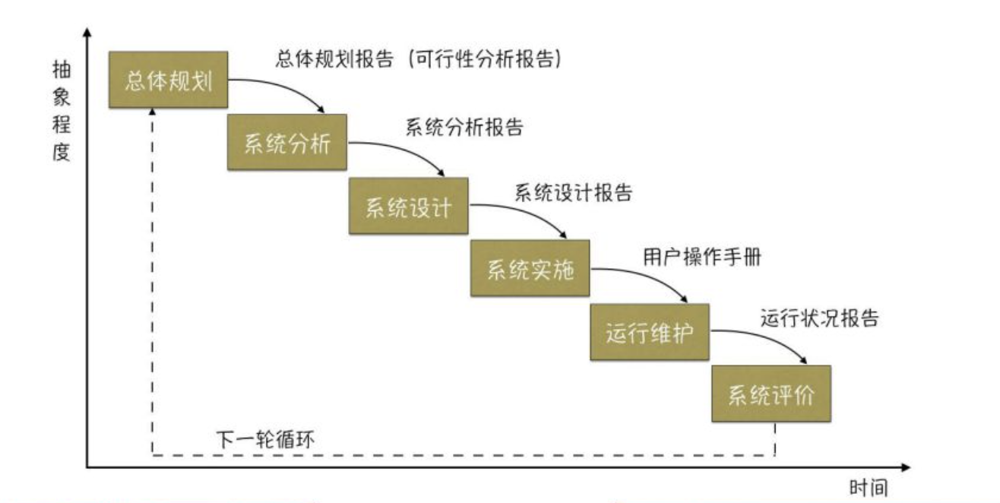
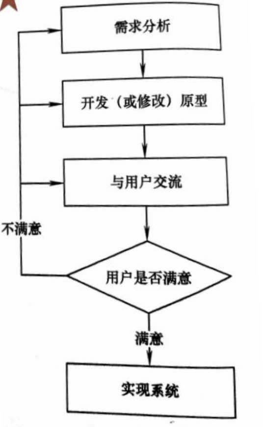
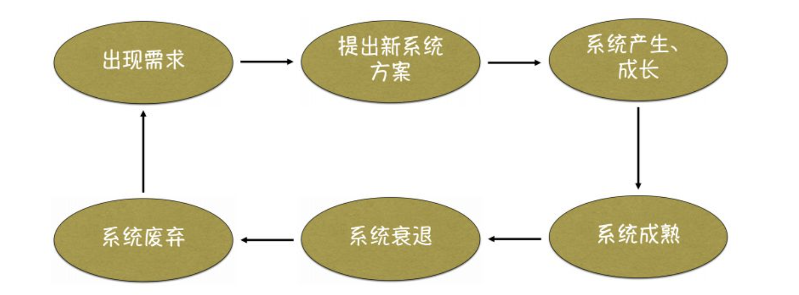

# 一、 管理信息系统开发的基本问题

## （1） 系统开发具备的条件

- 企业高层领导应重视和介入 （ 对系统开发和使用成败起决定作用的首要条件）
- 企业业务人员要有积极性     （企业各类**业务**人员是管理信息系统主要的直接操作者与使用者）
- 企业要有一定的科学管理基础
- 要有一定的投资保证  （ 管理信息系统投入运行后，**维护**费用占总投资的主要部分）

助记： 重鸡冠头

## （2） 系统开发前的准备工作

- 借鉴同类系统的开发经验
- 确定系统目标，开发策略和投资金额
- 收集和整理基础数据

## （3） 系统开发困难的因素

- 新系统对当前管理模式影响较大
- 管理信息系统的效益不易用货币形式直接反映
- 基础数据的准确性与完整性差
- 重视编程，轻视规划
- 采用增加开发人员的方式来加快进度
- 堆栈现象

# 二、 管理信息系统的开发方法

## （1） 系统开发方法的产生背景

**软件危机：**

- 软件开发费用和进度失控
- 软件的可靠性太差
- 生产出来的软件难以维护

为摆脱软件危机的影响，推进开发的成功率，管理信息系统的研制必经之路是**工程化**的道路。

## （2） 结构化开发方法

结构化方法是20世纪70年代基于瀑布模型提出的，是目前最成熟、应用最为广泛的管理信息系统开发方法之一。

**瀑布模型：**

**基本思想：**  自顶向下，逐步求精。

**基本手段：**  分解 和 抽象。

**基本策略：**  自顶向下，逐步求精。

**主要内容： ** 分析结果用图形表示，四部分组成

- 分层的数据流图
- 数据词典
- 加工(处理)说明
- 补充材料

**主要特点：**

- 相对独立、功能单一的模块结构
- 块内联系大，块间联系小
- 采用模块结构图的描述方式

**结构化开发方法：**

- 结构化分析
- 结构化设计
  - 总体设计
  - 详细设计

## （3） 原型化开发方法

在管理信息系统开发中，用“原型”来形象地表示**系统的一个早期可运行版本**，它能反映新系统的部分重要功能和特征。

- 获得一组基本的用户需求
- 开发出新系统的一个原型
- 试用原型
- 修改原型系统
- 提高新系统的质量

要求在获得一组基本的用户需求后，快速地开发出新系统的一个原型，用户、开发者及其他有关人员在试用原型的过程中，加强通信和反馈，通过反复评价和反复修改原型系统，逐步确定各种需求的细节，适应需求的变化，从而最终提高新系统的质量。

因此，原型化方法是一种确定用户需求的有效方法，它采用**启发式**方法，引导用户逐渐加深对系统的理解，最终提出**明确的需求**。

**原型化方法的三种类型：**

- 探索型：  主要是针对开发目标模糊、用户和开发人员对项目都缺乏经验的情况
- 实验型：  用于大规模开发和实现之前考核、验证方案是否合适，规格说明是否可靠
- 演化型：  该方法认为信息系统本质上就是不断演化的，重点关注问题是如何才能使信息系统适应不可避免的变化

## （4） 面向对象开发方法

将面向对象的思想应用于软件开发过程中，指导开发活动，主要包括面向对象分析方法OOA，面向对象设计方法OOD，面向对象编程方法OOP。

### a. 对象

> 一些联动的实体

**组成:**  对象的标识、对象中的操作集合、对象的数据结构、对象对外消息接口

**特性:**  封装、能动

换言之，对象是数据结构以及作用于此结构，上的数据操作的封装，这个封装具有自身行动能力

### b. 类和实例

类是对象的抽象描述，对象是类的实例，由类到对象的过程称为实例化过程，既可以由对象抽象出类，也可以从众多子类中抽象出超类

### c. 继承

继承是子类自动共享父类中的方法和数据的机制，它使管理信息系统的系统结构具有了开放性

### d. 封装

是一种信息隐藏技术，封装机制使对象成为数据与方法的集成体

# 三、 结构化方法的开发过程

## （1） 系统开发阶段划分

**系统的生命周期：**  任何一个系统都有其产生、发展和灭亡的生命历程，被称作系统的生命周期

## （2） 各阶段的主要内容

- 总体规划：总体规划是管理信息系统建设的第一步，意在通过初步的、总体的需求分析，回答“系统是什么”的问题，进行可行性论证。
  - 对当前系统进行初步调查
  - 分析和确定系统目标
  - 分析子系统的组成以及基本功能.
  - 拟定系统的实施方案
  - 进行系统的可行性研究
- 系统分析：  系统分析也称**系统逻辑设计**，在总体规划的指导下，对某个或某些子系统进行调查、研究、分析，旨在获得一一个合理的新系统逻辑模型。
  - 系统分析阶段主要是解决“干什么”的问题。系统分析阶段的主要任务是开发人员同用户一起，通过对当前系统的详细调查和分析充分理解新系统目标，即用户的需求，并将它明确地表达成书面资料 ---- 系统说明书。
  - 系统说明书作用
    - 描述新系统的逻辑模型，作为设计和实施的基础
    - 作为用户和开发人员之间的协议或合同，为双方交流和监督提供基础
    - 作为新系统验收和评价的依据
- 系统设计：  
  - 系统分析回答了“干什么”的问题，系统设计则回答 “怎么干”
  - 两个阶段：
    - 总体设计
    - 详细设计
- 系统实施： 
  - 主要包括：
    - 系统实现
    - 系统测试
    - 系统切换
      - 直接切换
      - 分段切换
      - 平行切换
  - 主要文档：用户操作手册
- 运行维护：
  - 新系统的正常使用和维护，并撰写运行状况报告
  - 维护的四个方面 （成熟码备）
    - 程序的维护
    - 数据的维护
    - 代码的维护
    - 设备的维护
- 系统评价
  - 从三个方面对系统进行评价:
    - 系统的功能和性能
    - 系统的经济效果
    - 其他方面的评估

# 四、 开发过程组织与管理方法

## （1） 项目管理的主要内容

为了使系统开发能够按照预定的成本、进度、质量顺利完成，需要对成本、人员、进度、质量、风险等进行分析和管理，这就是项目管理，它贯穿于系统开发生命周期的全过程。

- 任务划分
- 计划安排
- 经费管理 ： 杠杆经济
- 审计控制
- 风险管理
  - 风险识别
  - 风险分析
  - 风险缓和
  - 风险跟踪
- 质量保证 ： 重点和难点
  - 事前准备
  - 过程监控
  - 事后评审

## （2） 项目管理组的组成

- 项目组长： 整个项目领导者,保证整个开发项目顺利进行。
- 用户： 信息系统建设的参与者和最终使用者
- 系统分析员： 用户和系统开发其他人员之间的桥梁和接口，系统开发的核心人物
- 硬件网络设计员 ： 制定硬件网络配置方案并实施
- 数据库管理员 ： 数据库设计、定义和存储等数据库相关工作
- 系统设计员 ： 系统的整体设计、模块设计以及模块之间接口的设计工作
- 程序员 ： 进行程序设计，用户使用培训，系统测试和试运行

助记： 头尾分析设计，硬件数据程序员

## （3） 文档的管理

文档是系统开发建设的生命线，它贯穿于管理信息系统开发的整个过程，系统开发的各个层次和阶段都要有相应的文档。

**文档管理应遵循的原则：**

- 文档要标准化和规范化
- 维护文档的一致性
- 维护文档的可追踪性
- 文档管理的制度化