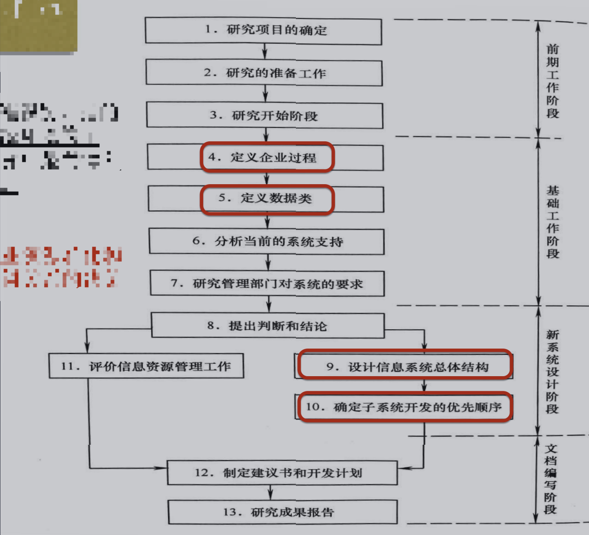
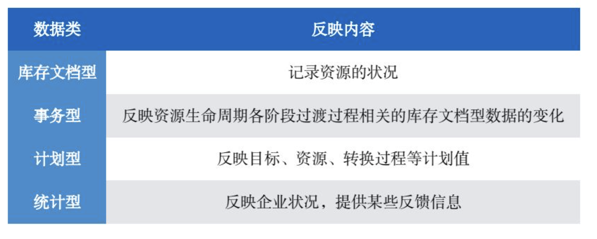

# 一、 总体规划的目的和步骤

## （1） 目的

总体规划是管理信息系统生命周期中的第一个阶段，也是系统开发过程的第一步,其目的可以用一句话来概括:即明确系统“是什么”的问题，也就是进行顶层设计,描绘出信息系统的架构，并对目标系统提出完整、准确、清晰、具体的要求。

- 保证信息共享
- 协调子系统间的工作
- 使开发工作有序进行

助记： 明确问题与设计，描绘架构提要求，共享协调有顺序。

## （2） 步骤

- 需求初步调查
  - 调查内容:
    - 现行系统的目标和任务;
    - 现行系统概况;
    - 现行系统的环境和约束条件;
    - 现行系统的业务流程和子系统的划分
    - 新系统的开发条件。
- 确定系统建设目标
  - 新系统目标具备的重要特性（一站是多长）
    - 目标的总体战略性
    - 目标的多重性
    - 目标的依附性
    - 目标的适应性
    - 目标的长期性
- 初步确定子系统组成与基本功能
- 拟定系统实施方案
- 可行性分析
  - 可能性 ： 开发的条件是否具备
  - 必要性 ： 客观上是否需要开发新系统
  - 四个方面分析：（寂静离开可行性）
    - 技术上的可行性
      - 技术上的可行性是根据新系统的目标来考虑系统的软硬件设备、计算机联网能力、网络及数据安全保护措施、输入输出设备、大容量存贮设备等。技术力量不仅考虑技术人员的数量，更应考虑他们的经验和水平。
    - 经济上的可行性
      - 新系统的经济可行性分析的含义是，估算新系统开发和运行所需的**费用**，以及新系统的**效益**，将投资和效益进行比较，说明在经济上是合算的。
    - 管理上的可行性
      - 管理上的可行性是考虑当前系统的管理体制是否有条件提供新系统所必需的**各种数据**，企业最高层领导及各级管理人员对开发建设一个新系统来替代现有系统的需求是否迫切，即新系统的必要性。
    - 开发环境的可行性
      - 企业领导意见是否一致，有无资金，**能否抽出骨干力量参加新系统开发**等，简单地说就是**企业能为新系统的开发建设提供一个长期的、良好的环境。**
- 编制可行性分析报告
  - 报告内容: （头尾新旧论）
    - 引言(主要包括项目摘要、开发背景、参考资料和专门术语等内容) ;
    - 现行系统调查与分析;
    - 新系统建设方案;
    - 可行性论证;
    - 结论。

# 二、 企业系统规划方法

## （1）Bsp方法概述

企业系统规划法(business system planning，简称BSP) :用于管理信息系统总体规划的方法，应用最为广泛。

**Bsp 方法原则：**（目标摆脱管理，上下结合整体）

- 支持企业的总目标
- 面向企业中管理各层次的要求
- 从方法论上摆脱信息系统对旧组织机构的依从性
- 使信息系统在结构上有良好的整体性
- 自上而下规划和自下而上实施相结合

## （2）Bsp工作流程

4 又称企业的过程识别，指的是对企业信息系统环境的了解，整个BSP研究中最关键和重要的活动之一

企业过程是指企业资源转化和资源管理中有逻辑关系的决策和活动。

5.也称为数据类的识别，就是对企业数据需求的了解，定义数据类后，要与企业过程关联起来。

数据类是指支持企业所必需的，在逻辑上相互联系的，并能组成相对独立的完整数据单位的那些数据部分。

## （3）定义企业过程

**企业资源：**

企业资源是被管理的对象，企业中的各项管理工作都要涉及资源的管理。

企业资源可分为关键性资源和支持性资源，此外，还有一些不以具体产品形式存在的‘‘资源”，就是企业的计划与控制。

**关键性资源： **  企业中的产品与服务

**支持性资源：**   为实现企业目标必须使用、引用和消耗的那些资源， 如原材料、资金、设备人员等

计划与控制、产品与服务、**支持性资源**是BSP法定义的企业三项资源。

**资源的生命周期： ** 资源的生命周期是指一项资源由取得到退出过程所经历的阶段

- 需求
- 获取
- 服务
- 退出

定义企业过程是 BSP 方法的核心。

**基本方法：**  对企业的现实活动进行调查，以企业的关键资源为线索，追溯其生命周期，通过分析与综合，最终完成企业过程的定义。

**一般步骤：**  定义企业过程应该从三方面入手:

- 计划与控制 ： 可以识别出企业战略规划与管理控制两个层次的过程。
- 产品与服务 ： 根据其需求、获取、服务、退出4阶段的生命周期，对每一阶段，用一些过程进行管理。
- 支持性资源 ： 其方法与产品/服务识别过程类似。

## （4）定义数据类

**企业数据四种类型：** 以资源生命周期不同阶段对信息的不同需求，可将企业中的数据分为4种类型：库存文档型、事务型、计划型和综合统计型。

**企业数据的识别方法：**

- 企业实体法 ： 企业的实体指:顾客、产品、材料及人员等企业中客观存在的东西列出企业实体，分析与每个实体联系比较紧密的数据，将结果表述出来企业实体法主要工具:数据/实体关系矩阵。
- 企业过程法 ： 利用以前识别过的企业过程，分析每一个过程利用什么数据，产生什么数据企业分析法主要工具:过程/数据关系矩阵

## （5）设计系统总体结构与开发顺序

**子系统划分的基本原则：**

- 子系统在功能上应有相对的独立性，通常子系统不应跨越两个或两个以上的企业过程。
- 子系统在数据上应有自身的完整性，一般一个数据类只能由一个子系统产生。

**子系统的类型：**

- 仅产生数据而不使用其他子系统数据的子系统
- 既使用数据，也产生数据的子系统
- 只使用数据而不产生数据的子系统

**U/C 矩阵图：**

- U代表使用
- C代表产生

**确定子系统开发顺序基本原则：**

- 子系统需求程度与潜在效益的评估
- 技术约束分析