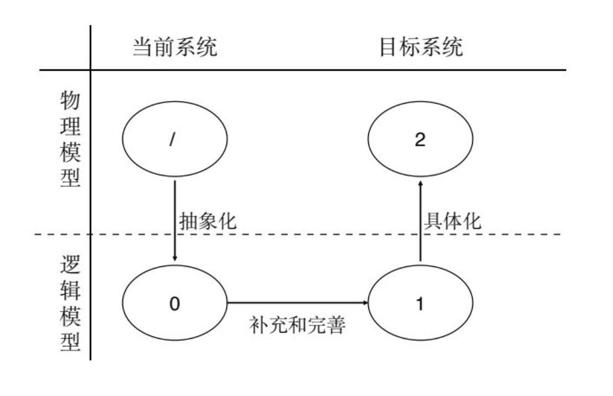
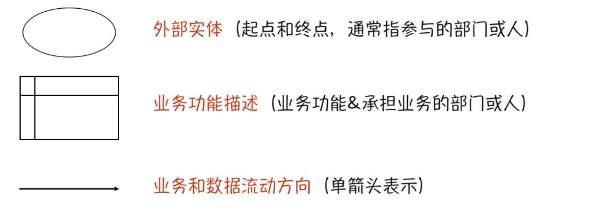
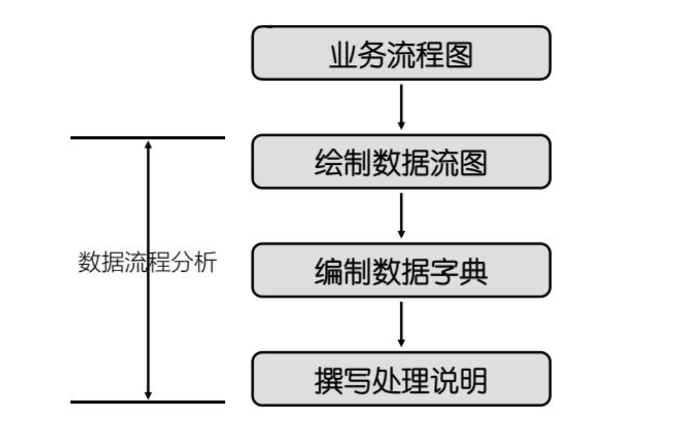
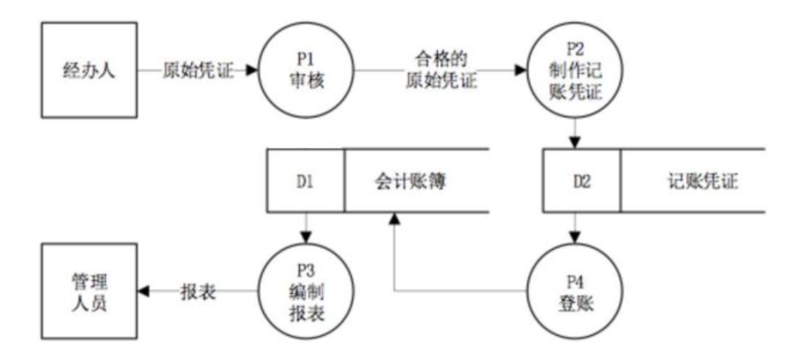

# 一、 系统分析概述

## （1） 系统分析的目的与难点

系统分析也称系统逻辑设计，是系统详细开发的关键性阶段，旨在获得 一个合理的新系统的**逻辑模型**，以便为后一阶段的系统设计提供较详细的开发方案。

系统分析的目的是将**用户的需求及其解决方法确定下来**，最终得到**系统分析说明书**。

系统分析说明书所确定的内容是今后**系统设计、系统实施和系统评价**的基础和依据，也是开发人员与用户签订协议和合同的依据。

**系统分析节点的主要任务：**

- 详细调查收集和分析用户需求
- 确定新系统初步的逻辑模型
- 编制系统说明书

**要点：**  **理解**和**表达**用户的需求

**难点：**

- 对于用户：提出的需求难以理解
- 对于系统分析人员：理解和表达出来的新系统逻辑模型可能与用户需求不一致

**对策：**

- 做好用户事前培训工作
- 做好系统开发人员的培训工作
- 选择正确的开发方法和良好的表达工具

## （2） 系统分析的逻辑与步骤

**逻辑模型： ** 做什么 反映了系统的性质

**物理模型： ** 如何做 反映系统的某一种具 体实现方案

**系统分析的主要步骤：**

- 详细调查
- 业务流程分析
- 数据流程分析
- 编写系统分析说明书

# 二、 详细调查

## （1）详细调查的目的和难点

**目的：**  详细调查的目的就是要搞清楚用户的想法和要求，换句话说，就是通过一系列的调研活动，尽可能准确、详细地了解**用户需求**。

**难点：**

- 没有足够的用户参与
- 用户的需求经常变更
- 用户与开发人员很难进行交流

## （2）详细调查的主要内容

- 组织结构的调查： 用组织结构图描述当前系统组织机构的层次和隶属关系
- 业务流程的调查： 从一个实际业务流程的角度将系统调查中有关该业务的资料串起来，以便于对企业现有的工作过程有一个动态的了解
- 数据流程的调查： 收集资料，调查清楚每个数据的出处，数据间的相互关系（分析 收集）
- 薄弱环节的调查： 座谈访问、书面调查、参加业务实践、分析调查资料等充分与用户交流，听取意见和建议
- 其他信息的调查： 如企业的发展战略规划、财务状况、人员情况、为什么要开发系统等

**公司管理的三个层次：**

- 领导决策层：
  由董事会成员组成;
  负责拟订各种规划方案、审议批准各种报告计划、任免批准经理职位等
- 业务管理层：
  由总经理、副总经理、及其下属的各业务处室组成;
  执行董事会决议、负责公司的经营管理及日常工作;拟订管理制度等
- 业务执行层：
  由下属分公司等机构组成;
  完成日常的生产、业务和调度等工作

## （3）详细调查的方法与原则

**基本方法：**

- 收集资料
- 开调查会或个别访问 -> 最有效的一种调查方法
- 书面调查
- 参加业务实践 -> 了解现行系统的最好方法

**调查原则：**

- 事先计划
- 采访持关键信息的人
- **自顶向下**全面展开
- 存在的**不一定**是合理的
- 分工和协作相**结合**
- 主动沟通的工作方式

**注意事项：**

- 选择默契的语言
- 倾听比表达更重要
- 及时反映避免误解
- 以学习的态度开展工作

# 三、 业务流程分析

## （1）业务流程的概念

- 流程的概念： 流程由一系列的活动或是事件组成，可以是渐变的连续型流程，也可以是突变的断续型流程。

- 业务流程： 业务流程是指一组共同为顾客创造价值而又相互关联的活动

- 业务流程的特点： 

  - 目标性
  - 逻辑性
  - 层次性

- 业务流程的功能： 

  - 实现不同分工活动的结果连接
  - 反映活动间的关系

  

## （2）业务流程分析的方法

业务流程分析主要是为了描述现行系统的物理模型

- 调查企业的组织结构
- 调查企业的具体业务流程
- 绘制业务流程图
- 业务流程优化

表达清楚三件事

- 业务功能是什么
- 谁负责该项业务
- 业务和数据的流动方向

业务流程分析采用自顶向下的方法，首先画出高层管理的业务流程图，再对每一个功能描述部分进行分解，画出详细的业务流程图。

## （3）业务流程重组

业务流程重组简称BPR，它是对企业的业务流程作**根本性的思考**和**彻底重建**，其目的是在**成本、质量、服务和速度等**方面取得显著的改善，使得企业能最大限度地适应以**顾客、竞争、变化**为特征的现代企业经营环境。 （思考重建，适应改善）

**基本特征：**

- 根本性
- 彻底性
- 显著改善 ->  业绩的显著增长是 BPR 的标志与特点 。
- 流程 ->  BPR 协同工作，整体优化思想的集中体现。

**业务流程重组的原则：**

- 围绕最终结果而非具体任务来实施再造工作
- 让后续过程的有关人员参与前端过程
- 将信息处理融入产生该信息的实际工作中去
- 将地域上分散的资源集中化
- 将平行工序连接起来而不是集成其结果
- 决策点下移并将控制融入过程中
- 在源头获取信息

# 四、 数据流程分析的概念

## （1）数据流程分析的概念

**什么是数据流：**   输入流、输出流、处理过程是任何一个系统的最基本组件

- 物流
- 事务流
- 资金流
- 人员流
- 等等

以上又可以用数字等形式表示出来 -> 企业的数据流

各种流在一个企业内的出现都会同时伴随着一个数据流的产生

**数据流分析的目的：**  在业务流程分析的基础上，勾画出先行系统的逻辑分析。

**分析用到的工具：**

- 数据流图： 用图形的方式对系统进行分解，描述系统由哪几部分组成，各部分间有什么联系，
- 数据字典： 用图表描述系统中的每一个数据组、数据存储和数据项
- 加工说明： 用文字等形式详细描述系统中的每一个基本处理的过程

## （2）数据流程分析的步骤

数据流程分析主要包括对信息**流动、传递、处理、存储**等的分析**目的是勾画数据流通现状**，并发现和解决数据流通中存在的问题

## （3）数据流图的基本画法

数据流图(Data Flow Diagram,简称DFD) 是便于用户理解、分析系统数括流程的图形工具

**绘制数据流图的指导原则：**

- 总体上自顶向下逐步分解的原则 
  - 即按照结构化方法的思想，采用分层的数据流图，把大问题、复杂的问题分解成若千个小问题，然后分别解决。
- 局部上由外向里的规则
  - 即先确定每一层数据流图的边界或范围，在考虑流图的内部,先画出加工的输入和输出，再画加工的内部

**绘制方法：**

- 识别系统的输入和输出
- 绘制系统内部数据流
- 对复杂加工进行分解
- 检查、修改、完善

**例：**

某企业的会计账务处理流程如下所述:首先本企业各种业务的经办人将经济活动中发生的各种原始凭证，交予财务进行审核;审核通过后，会计记账人员利用合格的原始凭证制作论账凭证;其他会计人员根据记账凭证登记会计账簿;最后根据各种会计账薄编制会计报表，交企业管理人员使用。请根据业务流程描述绘制数据流图。

**注意事项：**

- 合理编号
- 子图与父图的平衡(子图与父图的数据流必须平衡，这是分层数据流的重要性质)
- 分解的程度(最多不要超过7层)
- 其他事项 (应先给数据流命名;从左到右画出数据流图;画数据流图时，先只考虑稳定状态)

**数据流图检查：**

- 正确性检验
  - 数据守恒(最)
  - 文件使用
  - 子图和父图平衡
  - 加工和数据流的命名
- 提高可读性
  - 简化加工之间的联系
  - 分解应当均匀
  - 命名应当恰当

## （4）数据字典与加工说明

在数据流图的基础上，需要对其中的每个**数据流、文件和数据项**加以描述，我们把这些定义所组成的集合称为数据字典(Data Dictionary,缩写DD)。

**数据流和文件条目：**  一般从五部分来描述，**编号、名称、别名、组成、发生频率**

**数据项的条目：** 数据流或文件是由若干数据项组成的，数据项是数据的最小单位

**加工说明：**  加工说明是对数据流图中的“加工”部分的补充说明，描述了某个加工单元的数据处理过程, 为系统设计阶段的处理过程设计提供资料

一般可以用结构化语言、判定表和判定树等工具来描述加工说明

一个好的加工工说明，至少要描述清楚三件事情:**数据来源、处理逻辑、数据去向**

# 五、 新系统逻辑模型

## （1）新系统逻辑模型的任务

新系统逻辑模型是指：经过分析和优化后，新系统采用的管理模型和信息处理方法

新系统逻辑模型的建立是**系统分析阶段的最终结果**，是**系统设计和系统实施的依据**

**建立新系统逻辑模型的任务:**   对系统业务流程分析的结果进行整理，对数据流程分析的结果进行整理，在现行系统逻辑模型的基础上，结合新系统的目标，设计出新系统的逻辑模型。

**现行系统逻辑模型到新系统逻辑模型的转换:**

- 分析新系统与现行系统在逻辑上的区别，建立新系统的初步逻辑模型;
- 补充和完善，建立最终模型。

## （2）建立新系统的初步逻辑模型

- 确定合理的业务处理流程
  - 删去或合并那些多余的或重复的处理过程
  - 说明哪些业务过程进行了改动、改动原因是什么，改动后将带来哪些好处等问题
  - 给出最后确定的业务流程图
  - 指出在业务流程图中哪些部分新系统可以完成，哪些部分需要用户完成，也就是要确定人机配合方案
- 确定合理的数据和数据流程
  - 确认最终的数据指标体系和数据字典，如指标体系是否全面合理，数据精度是否满足要求等
  - 删去或合并多余的或重复的数据处理过程
  - 说明哪些数据处理过程进行了优化和改动，以及改动的原因是什么，有哪些好处等
  - 给出最后确定的数据流图，指出在数据流图中哪些部分新系统可以完成，哪些部分需要用户完成

## （3）对初步逻辑模型进行补充和完善

建立初步逻辑模型时，主要靠经验进行，是一项创造性的劳动

**在补充和完善时应重点考虑：**

- 首先，应考虑新系统的人-机界面

- 其次，考虑一些细节问题

# 六、 系统分析报告

## （1）系统分析报告的作用

- 描述了新系统的逻辑模型，作为系统设计和实施的依据
- 为用户和开发人员之间交流和监督提供基础
- 为新系统验收和评价提供依据

## （2）系统分析报告的组成

**一份完整的系统分析报告主要包括以下内容：**

- 组织情况概述
- 现行系统概况
- 系统逻辑模型
- 新系统在各个业务处理环节拟采用的管理办法、算法和模型.
- 与新系统相配套的管理制度和运行体制的建立
- 系统设计与实施的初步计划
- 用户领导审批意见

在系统分析报告中，数据流图、数据字典和加工说明，这三部分是主体，是必不可少的组成部分。

## （3）相关问题

系统分析报告形成后，必须组织各方面的人员一起对已经形成的逻辑方案进行论证，尽可能发现其中的问题和疏漏并及时纠正。

**问题和疏漏：** 及时纠正

**有争论的问题：** 重新核实原始调查资料或进一步深入调查研究

**重大的问题：** 可能需要调整或修改系统目标，重新进行系统分析