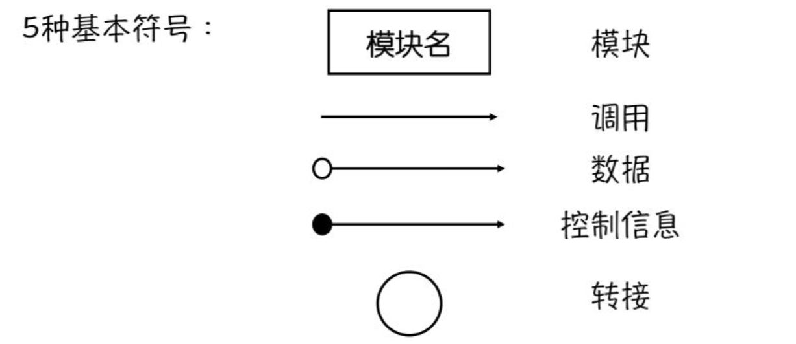
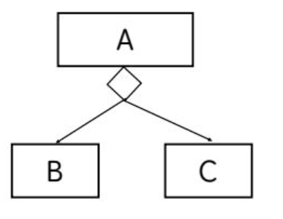
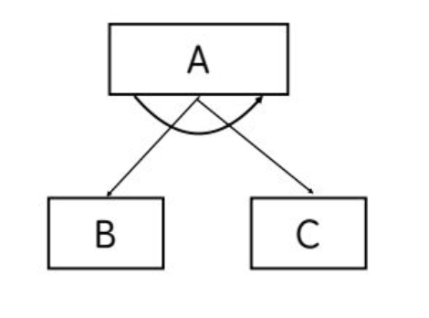
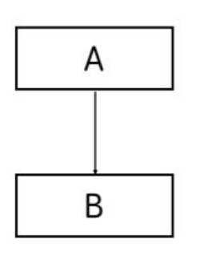
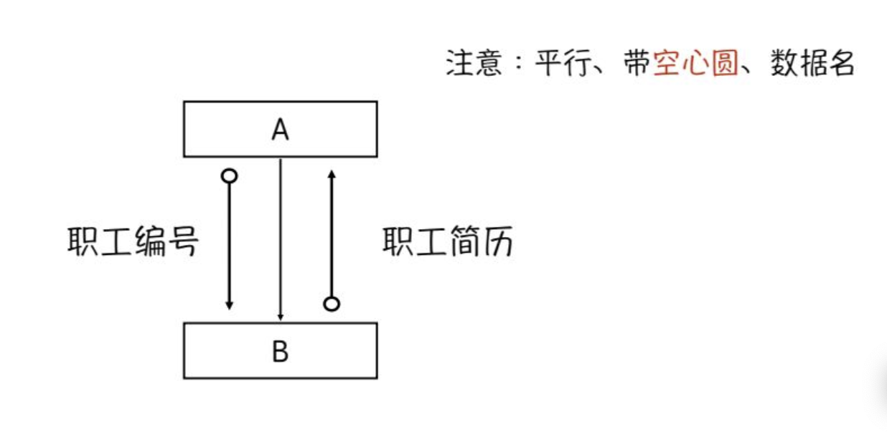
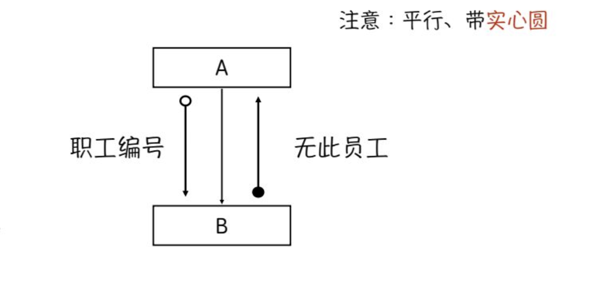
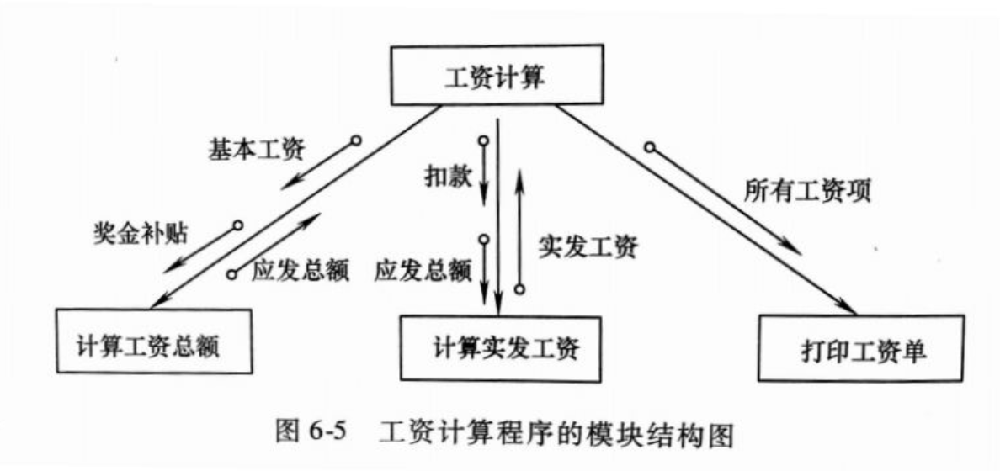
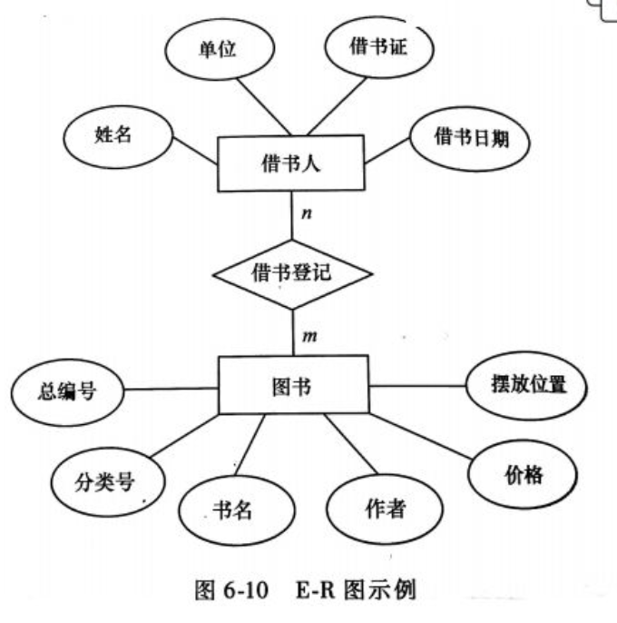

# 一、 系统设计概述

## （1） 系统设计的任务

**系统设计两个阶段：**  总体设计、详细设计

**最终交付：** 系统设计说明书

- 任务内容：
  - 根据分析阶段产生的文档资料，确定新系统在计算机内的程序模块组成，以及各模块之间连接方式;用一定工具将设计成果表达出来;
    - 代码设计、
    - 输入输出设计、
    - 人机界面设计、
    - 数据库设计、
    - 模块处理设计、
    - 安全设计等
- 完成人员：系统设计人员
- 培训工作：系统分析培训， 系统设计培训

## （2） 系统设计的原则

助记口诀： 减一零可安静

- 简单性：达到目标的前提下，系统尽可能简单.
- 一致性和完整性：应做到信息编码、采集、信息通信等内容的一致性，系统是一个统的整体，功能应尽量完整,一致性有利于子系统之间联系与合作
- 灵活和适应性：可降低管理信息系统的维护难度.
- 可靠性：可抵抗异常干扰和保证系统正常工作的能力
  - 衡量可靠性的指标:
    - 平均故障间隔时间
    - 平均维护时间
  - 系统必须是可靠的，否则就没有实用价值
- 安全性：特指系统的保密功能和防病毒功能
- 经济性：可给用户带来经济效益（很大一部分不能以货币来衡量）

# 二、 系统总体结构设计

## （1） 子系统的划分和确认

助记口诀： 独立冗余分阶段，机构设置用资源。

- 子系统要具有相对独立性 （子系统内部各功能具有“强耦合”关系）
- 使数据冗余较小
- 便于系统分阶段实现
- 适应组织管理机构的设置
- 充分利用各种资源

## （2） 子系划分的方法

- 按职能划分 （目前最常用）
- 按逻辑功能划分
- 按通信划分
- 按业务处理顺序划分
- 按业务处理的时间关系划分

## （3） 模块结构设计

模块结构设计的任务： 对各个子系统进行细化，确定划分后的子系统的模块结构，并画出模块结构图。

模块组合的图形表示就是模块结构图

- 模块

  - 模块名：组成系统的基本单位，特点:可以组合、分解和更换系统中任何一个处理功能都可以看出是一个模块
  - 模块的要素：
    - 输入和输出（外部）
    - 加工处理功能（外部）
    - 内部数据（内部）
    - 程序代码（内部）

- 调用

  - 模块间的调用分为3类

    - 判断调用： 一个模块是否调用一个从属模块取决于调用模块内部的判断条件

      

    - 循环调用： 一个模块通过其内部的循环功能，来循环调用一个或多个从属模块

      

    - 直接调用 ： 字面

      

- 数据

  

- 控制信息 ： 控制信息只反应数据的某种状态，不必进行处理

  

- 转接： 结构图在一张图上画不下，需要转接到另一张纸上，或为了避免图上线条交叉时使用转接符号

  

**例子：**

## （4） 模块结构的质量标准

- 块内联系 vs 块间联系
- 耦合 vs 内聚
  - 耦合：模块之间联系的程度
    - 紧密耦合
    - 松散耦合
    - 非耦合
  - 内聚：模块内部各成分之间的联系程度   (一般来说)各模块的内聚越大，模块间的耦合越小）

**耦合的方式：**

- 数据耦合
  - 模块间通信信息是若干数据项， 耦合度最低，性能最好
- 控制耦合
  - 模块间通信信息是控制信息， 耦合度最低，性能最好
- 内容耦合
  - 不经过调用关系，彼此直接使用或修改对方的数据  （最糟糕的耦合的方式）

**内聚：**

- 巧合内聚：模块内各成分之间毫无联系 （聚合程度最低 性能最差）
- 逻辑内聚：模块内各成分的逻辑功能相似
- 过程内聚：由一段公共的处理过程组合成的模块（模块内耦合度比较高）
- 通信内聚：模块中各成分引用或产生共同的数据
- 顺序内聚：模块中各成分有顺序关系，某一成分的输出是另一成分的输入
- 功能内聚：模块中各成分的联系是功能性的 （功能明确， 耦合简单， 便于维护， 聚合度最高，性能最好）

**模块结构图与框图的区别：**

软件具有过程性（框图）和层次性（模块结构图）两个特征

**模块结构图与数据流图的区别：**

- 数据流图:从数据在系统中的流动情况来考虑系统

- 模块结构图:从功能的层次关系.上来考虑系统

**模块结构图的推导策略：** 从数据流图得到初始模块结构图

- 以事务为中心的设计策略(事务分析)
  - 应用:将高层数据流图转换成模块结构图
  - 优点:能够把一个大的、复杂的系统分解成若干个较小的、简单的子系统
  - 原理:高层数据流图处理功能相对独立，可以把它们看成一类特定的事务，将其转换为模块结构图
- 以变换为中心的设计策略(变换分析)
  - 应用:将低层数据流图转换成模块结构图
  - 优点:能够将数据流图中的处理功能分解成具有输入、中心变换、输出功能的简单模块
  - 原理:首先对低层数据流图中的处理功能进行分类，分为输入功能、执行变换功能、输出功能3类

**模块结构图的改进：**  改进时需要考虑几个方面

- 按照'‘耦合小、内聚大”的模块结构质量标准进行修改和检查
- 模块的扇入和扇出数
  - 扇入数： 模块的直接上层模块个数
  - 扇出数： 模块拥有的直接下层模块个数扇出个数<=7

## （5） 网络设计与设备配置方案

**网络设计的主要步骤：**

- 选择网络拓扑结构
- 安排网络上的设备布局
- 网络节点的权限设计

**设备选配依据：**

- 根据实际业务需要考虑某个管理岗位是否要专门配备计算机设备
- 根据实际业务性质决定某个管理岗位配备的计算机设备的规格型号
- 根据办公室的物理位置分布和有无联机通信的要求，决定是否需要与网络连接以及连接的方式
- 根据系统分析和调查中估算的数据量，确定网络服务器的硬盘大小
- 根据实际业务要求、用户的习惯等确定新系统拟采用的软件工具
- 根据系统分析和调查得到的网络数据传输量的大小，确定拟采用的网络传递介质，以及对主要连接设备的规格要求等
- 根据投资预算对上述6项内容进行调整

# 三、 系统详细设计

## （1）编码设计

**编码设计的原则：**

- 唯一化
- 规律化
- 标准化
- 可扩充且容易修改

**编码的种类：**

- 顺序码 ： 连续数字代表编码对象，通常从1开始  0001张三
- 层次码 ： 也称区间码，将整个编码划分成若千个区间，每一区间规定不同含义  某个仓库物资编码001-  012 - 9601
  - 优点:检索、分类和排序很方便
  - 缺点:有时造成代码过长
- 助记码： 将编码对象的名称、规格等作为代码的一部分，以帮助记忆 CM厘米  USA美国  ZHS张三

## （2）输出与输入设计

**确定输出要求：**

- 详细分析现行系统的输出报表和内容
- 参考与用户同类型企业或部门的情况，借鉴业务性质类似的其他 管理信息系统的经验
- 与用户单位的实际业务人员讨论

**输出方式：**

- 按介质划分:
  - 屏幕输出(常用) (以数字或图形方式)
  - 打印报表输出(最 常用) (关键在于合理编排内容) (二维表、自由格式)
  - 磁盘文件输出(传输速度慢)

**输入方式：** 依照具体的管理需求确定数据的录入方式， 无论哪一种都可以有批处理和实时处理两种形式

- 键盘输入(常规)(大部分采用) 
- 模/数-数/模转换(常用) 条形码的自动检测、电子秤的自动检测
- 网络或通信传输(广泛重视和利用) E-Mail

**输入的校对方式：**  设计出一套合理的校对方式是保证数据准确录入的重要前提

- 人工校对(常用)(较慢较麻烦)
- 二次键入 网站登录修改密码时
- 根据取值范围进行控制 输入职工出生日期

## （3）人机界面设计

**人机界面的主要形式：**

- 界面设计包括
- 菜单方式
- 会话方式
- 操作提示方式
- 以及操作权限管理方式等

**系统输入界面是人机交互的重要界面**

**设计原则：**

- 可靠性
- 简单性
- 立即反馈性
- 明了性
- 色彩适中
- 风格统一

## （4）处理过程设计

处理过程设计，也称模块详细设计，任务是为模块结构图中的每一个模块，确定所采用的算法和数据结构，用某种选定的表达工具给出清晰的描述。

**设计原则：**

助记： 接通语数的特点，时空调试工作量

- 模块间的接口要符合通信的要求；
- 考虑将来实现时所用计算机语言的特点；
- 考虑数据处理的特点；
- 估计计算机执行时间不能超过要求；
- 考虑程序运行所占的存储空间；
- 使程序调试跟踪方便；
- 估计编程和上机调试的工作量；

**设计工具：**

- 程序流程图（程序框图）
- 过程设计语言（PDL） （伪代码）

## （5）数据库设计

**良好的数据组织结构是衡量系统开发工作好坏的重要指标之一**

**数据库设计的任务与步骤：**

- 任务
  - 依据数据库的规范化理论，按一定的步骤，对系统分析阶段的数据字典进行，规范整理，建立符合第三范式的数据组织结构
- 步骤
  - 概念设计
    - 目标：产生反映全用户信息需求的整体数据库概念结构，即概念模型
    - 方法：描述概念模型的有力工具是“实体-联系”方法(E-R方法)文大
  - 逻辑设计
    - 目的：得到一个计算机软硬件的具体性能无关的全局概念模式
    - 任务：将概念结构转换成特定DBMS所支持的数据模型
    - 过程：将概念设计结果(E-R图) 转换为某个DBMS所 支持的数据模型并优化
  - 物理设计
    - 任务和目标： 为逻辑数据模型选取一个最适合应用环境的物理结构

**E-R图方法：** 又想的信息抽象方法

实体 属性 联系

**实体间联系分类：**

- 一对一（1:1）
- 一对多（1:n）
- 多对多（m:n）

**相关术语：**

- 关系
- 元组
- 属性
- 主关键字(主键、主码)
- 外关键字(外键、 外码)

## （6）安全控制设计

**信息安全威胁分类：**

- 来源
  - 内部
  - 外部
- 信息系统自身看：
  - 硬件
  - 软件
  - 信息

**管理信息系统的不安全因素：**

- 计算机系统自身存在的脆弱性
- 各种自然灾害
- 人为操作失误或错误及各种计算机犯罪行为

**如何保证计算机系统的安全：**

- 计算机信息系统实体安全
- 计算机信息系统的运行安全
- 信息与数据安全

**安全设计需要考虑的具体内容：**

- 机房的安全(ABC要求由高到低)
- 操作系统的安全
- 数据库系统安全技术(身份识别、访问控制)
- 数据存储系统的安全(全量备份、增量备份)
  - 全量备份： 将当前服务器数据库中的所有数据全部复制到永久脱机存储介质中，若发生系统崩溃，可保证重装系统后数据的完整性。
  - 增量备份： 将上一次备份后数据库中发生变化的数据复制到永久脱机存储介质中。
- 网络的安全(网络安全 的特征)
  - 完整性
  - 保密性
  - 可用性

# 四、 系统设计报告

系统设计阶段的主要成果是系统设计说明书，它既是新系统的物理模型，也是系统实施的主要依据。

## （1） 引言

- 摘要
- 背景
- 系统环境和限制
- 参考资料和专门术语说明

## （2） 系统设计方案

- 模块设计
- 代码设计
- 输入设计
- 输出设计
- 数据库设计说明
- 网络设计
- 安全保密设计
- 系统实施方案及说明

