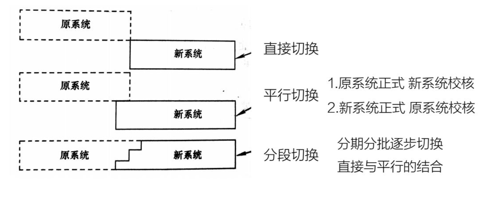

# 一、 系统实现

## （1）系统实现概述

根据系统设计的结构，利用计算机语言翻译成 可执行的代码 （开发管理信息应用软件的过程）

**系统实现的准备工作：**

- 制定计划
- 制定编程规范
- 组织技术攻关
- 准备软硬件开发环境

## （2）开发语言的选择

**参考两个方面：**

- 所选的语言是否易学、易用、易维护、操作简便
- 所选的开发语言是否与数据库管理系统有良好的数据接口

**考虑几个问题：**

- 语言的集成环境和交互功能
- 语言的结构化机制和数据管理能力
- 有较多的使用者，方便版本升级和互相学习交流
- 开发人员的熟练程度
- 软件的可移植性和用户的要求

## （3）程序质量的评价

- 可靠性： 满足预期需求
  - 系统或程序的安全可靠性
  - 程序运行时的可靠性
- 规范性：  系统的划分、书写的格式、变量的命名等按照统-规范
- 可读性： 程序内容清晰、明了、便于阅读和理解 （大规模开发的重要指标）
- 可维护性： 程序各部分相互独立，程序之间只有数据联系
- 适应性： 有变化时，调整和修改程序比较简便易行

## （4）编程风格

**程序的注释：**

- 序言性注释
  - 出现在模块的首部
  - 内容应包括:模块功能说明;界面描述;某些重要变量的使用、限制;开发信息
- 描述性注释
  - 嵌在程序之中
  - 用来说明程序段的功能或数据的状态

**书写注释时需要注意以下三个方面：**

- 注释应和程序一致
- 注释应当提供一 些程序本身难以表达的信息
- 为了方便今后维护，注释中尽量多用汉字

**程序的书写格式：**

- 缩排法
- 程序段与段之间、程序与注释行之间要有空白行

**变量名的选择主要遵循以下原则：**

- 不用过于相似的变量名
- 同一变量名不要具有多种含义
- 在编程前最好能对变量名的选取约定统一的标准

## （5）代码审查

- 用人工（交叉评审）的方法和辅助工具”读"代码的过程
- 保证软件质量的一个重要环节
- 是单元测试的一种方法

# 二、 系统测试

## （1）系统测试概述

**测试的目的：**

- 测试是为了发现程序中的错误而执行程序的过程
- 好的测试方案是极尽其可能去发现迄今为止尚未发现的错误的测试方案
- 成功的测试是发现了至今为止尚未发现的错误的测试

**基本工作流程：**

- 测试计划（基本保证）
- 测试用例（关键技术问题 设计测试数据最困难）
- 执行测试（手工 or 测试工具）
- 测试报告（测试工作的总结）

## （2）黑盒测试法

测试者把程序看成是一个黑盒，即测试者完全不考虑程序内部结构特性 “穷举”输入测试:把所有可能的输入都作为测试情况使用。

- 测试并不能保证程序中没有错误
- 以有限的测试情况尽可能多地查处错误

**等价划分：**

把被测试的软件的所有可能的输入数据(有效的和无效的)划分成若干个等价类，把无限的随机测试变成有针对性的等价类测试。

设计等价类的测试用例:

- 划分等价类并给出定义
- 选择测试用例

**划分等价类的规则：**

- 规定了输入值的范围一>一个有效等价类 (范围内)，两个无效等价类(小于最小值或大于最大值)
- 规定了输入数据的个数一>和(1)类似， 一个有效等价类，两个无效等价类
- 规定了输入数据的一组值，且对不同输入值做不同处理一>每个允许的输入值是一个有效等价类，此外还有一个无效等价类( 任一个不允许的输入值)
- 规定了输入数据必须遵循的规则一一>一个有效的等价类(符合规则)和若干无效的等价类(从各种不同角度违反规则)
- 规定了输入数据为整数一>正整数、 零和负整数三个有效类
- 如果软件的处理对象是表格一>空表， 以及一项或多项的表

**边界值分析法：**  设计使软件运行在边界情况附近的测试方案，暴露出错误的可能性更大一些

**错误推测法：**  靠直觉和经验进行，基本思想是列举软件中可能有的错误和容易发生错误的特殊情况，并且根据它们选择测试用例

## （3）白盒测试法

把软件看组成装在一个透明的白盒子里，即完全了解软件的结构和处理过程按照软件的内部逻辑测试软件，检验软件中的每条通路是否都能按预定要求正确工作又称为**结构测试**或**穷举路径测试**，从检查程序的逻辑着手进行测试。

- 语句覆盖： 比较弱的测试标准、选择足够的测试实例，使得每一个语句都能执行一次
- 判定覆盖： 设计足够多的测试实例，使得每个判定至少都获得一次 真值和假值的机会，即使得每一个分支都至少通过一次
- 条件覆盖： 对每个判定中所包含的若干个条件，应设计足够多的测试实例，使得判定中的每个条件都能取到真和假两个不同的结果
- 判定/条件覆盖： 设计足够多的测试实例，使得判定中的每个条件都能取得各种可能的真值和假值，并且使每个判定都能取得真值和假值
- 条件组合覆盖： 设计足够多的测试实例，使得每个判定中条件的各种可能组合都至少出现一次

## （4）测试策略与原则

**测试的策略：**

- 在任何情况下都应使用边界值分析的方法
- 必要时用等价划分法补充测试用例
- 必要时再用错误推测法补充测试用例
- 对照软件逻辑，检查已经设计出的测试用例

**测试原则：**

- 确定预期输出结果
- 避免测试自己的程序
- 进行破坏性测试
- 除了检查程序是否做了它应该做的工作，还应检查程序是否做了它不该做的事情
- 应保留测试数据，以便程序修改后进行再测试

## （5）系统测试的步骤

模块测试 -> 子系统测试 -> 系统总测试 （自底向上）

- 模块测试
  - 单元测试
  - 保证每个模块能正常运行
  - 人工走通 + 上机测试
- 子系统测试
  - 分调
  - 重点测试子系统内各模块的接口
  - 非渐增式  - 渐增式
- 子系统总体测试
  - 总调
  - 将经过测试的若干子系统组装在一起来测试
  - 关键： 真实 - 全面

# 三、 系统切换

## （1）系统切换前的准备工作

**用户培训：**

- 事务管理员
- 系统操作员 （系统直接使用者）
- 系统管理员 （系统维护人员）

**数据和文档准备：**

- 数据
- 文档

## （2）系统切换的方式

**分段切换各子系统的切换策略：**

- 按功能分阶段逐步切换
- 按部门分阶段逐步切换
- 按机器设置分阶段逐步切换

