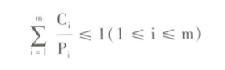

# 1 进程调度的功能和时机

**谁来完成？**

进程调度的功能由操作系统的进程调度程序完成

**具体做啥？**

按照某种策略和算法**从就绪态进程中为当前空闲的CPU选择在其上运行的新进程**

**啥时候需要进程调度**

- 进程正常或异常结束
- 进程阻塞
- 有更高优先级进程进来
- 时间片用完时

# 2 进程调度算法

**什么样的算法是好的算法**

- 作业从提交给系统开始，到作业完成，花费时间短（周转时间短）
- 从用户提交作业开始，到系统开始响应花费时间短（响应时间快）
- 保证作业在开始截止时间前开始，在完成截止时间前完成（截止时间的保证）
- 系统在单位内完成的作业量多（系统吞吐量高）
- CPU的利用率尽可能提高（处理机利用率好）

**平均周转时间**

T=1/n*（T1+T2+...+Tn）

**服务时间Ts**

一个作业在CPU上执行的总时间

**带权平均周转时间**

W=1/n*（T1/T1s+T2/T2s+...+Tn/Tns）

## 2.1 先来先服务调度算法FCFS

**含义：**从就绪队列的队首**选择最先到达就绪队列的进程**，为该进程分配CPU。


## 2.2 短进程优先调度算法SPF

**含义：**从就绪队列中**选择运行时间最短的进程**，为该进程分配CPU。（第一个进入系统的进程无论运行时间多久都最先执行。）


**优点：**与FCFS算法相比，短进程优先算法能有效降低进程的平均等待时间，提高系统吞吐量

**缺点：**对长进程不利；不能保证紧迫进程的处理；进程长短由用户估计，不一定准确。

## 2.3 优先权调度算法

**含义：**该算法中，系统将CPU分配给就绪队列中优先权最高的进程。

**类型：**

- 非抢占式：运行期间，有更高优先权的进程到来，也不能剥夺CPU。
- 抢占式：运行期间，有更高优先权的进程到来，就可以抢占CPU。

**优先权类型：**

- 静态优先权：创建时确定，运行期间保持不变。
- 动态优先权：随着进程推进或等待时间增加而改变。


**存在的问题：**无穷阻塞，即“饥饿问题”

**解决的方案：**增加等待时间很长的进程的优先权，即“老化技术”

## 2.4 时间片轮转调度算法RR

**含义：**把CPU的1s的执行时间分成若干份（分时系统中广泛使用）


**时间片大小 10-100ms**

- 程序需要的时间<时间片大小（当执行结束后自动释放CPU）
- 程序需要的时间>时间片大小（时间片使用完毕让出CPU等待下次时间片分配再执行）

**T=Nq**

- T：系统响应时间
- N：进程数量
- q：时间片

响应时间要求越短，时间片越小；进程数量越多，时间片越小；处理能力越好，时间片越小。

**什么是时间片轮转算法？**

系统将所有就绪进程按先来先服务的原则，排成一个队列，每次调度时把CPU分给队首进程，并令其执行一个时间片。当时间片用完时，调度程序终止当前进程的执行，并将它送到就绪队列的队尾。

## 2.5 多级队列调度算法

**含义：**将就绪队列分成多个独立队列，每个队列有自己的调度算法。

## 2.6 多级反馈队列调度算法

**含义：**建立多个优先权不同的就绪队列，每个队列有大小不同的时间片。

（队列优先权越高，时间片越短；队列优先权越低，时间片越长。）

# 3 实时系统中的调度

## 3.1实现实时调度的基本条件

- 提供必要的调度信息

  - 就绪时间
  - 开始截止时间
  - 完成截止时间
  - 处理时间
  - 资源要求
  - 优先级

- 系统处理能力强

  - 假定系统中有m个周期性的实时进程，他们的处理时间可表示为Ci，周期时间为Pi，则在单处理机的情况下，必须满足如下公式的限制条件：

    

- 采用抢占式调度机制（广泛）

- 具有快速切换机制

  - 对外部中断的快速响应能力
  - 快速的进程切换能力

评价实时系统性能的重要指标时**截止时间**。

例题：在单处理机的情况下如果有6个实时基础进程，周期时间都是30ms，系统为每个进程分配6ms的处理时间，请问系统能否保证每个实时进程都能在截至时间内完成吗？为什么？

答案：不能，6/30+6/30+6/30+6/30+6/30+6/30=1.2>1 ，不满足实时调度的基本条件，不能在截止时间内完成。

## 3.2 常用的实时调度算法

**最早截至时间优先算法EDF：**开始截至时间越早，进程优先级越高，越优先获得CPU

**最低松弛度优先算法LLF：**L=T-Tc-Ts

- T：完成截至时间
- Tc：当前时间
- Ts：处理完该任务还需要的时间


L即空闲时间，空闲时间越少，松弛度越低，越优先处理。

# 4 进程切换

**含义：**当前正在执行的进程成为被替换进程，让出其所使用的CPU，以运行被进程调度程序选中的新进程。

**进程切换的步骤：**

1. 保存包括程序计数器和其他寄存器在内的CPU上下文环境。
2. 更新被替换进程的进程控制块
3. 修改进程状态，把执行台改为就绪态或阻塞态
4. 将被替换进程的进程控制块移到就绪队列或阻塞队列
5. 执行通过进程程序选择的新进程，并更新该进程的进程控制块
6. 更新内存管理的数据结构
7. 恢复被调度程序选中的进程的**硬件上下文**

# 5 多处理器调度

## 5.1 多处理器系统的类型

**根据CPU之间联系是否密切**

- **紧密耦合：**共享主存储器和I/O设备
- **松弛耦合：**有各自的存储器和I/O设备

**根据处理的机构功能是否相同**

- **对称：**处理单元功能和结构相同。
- **非对称：**有多种类型的处理单元，一个主处理器，多个从处理器。

## 5.2 多处理器系统中进程分配方式

**对称**

- 静态分配：就绪队列的进程只能在与就绪队列对应的处理器上运行
- 动态分配：进程随机的被分配到当时处理空闲的某一处理器上运行

**非对称**

- 主机：执行调度程序。
- 分机：运行程序，完成任务。

## 5.3 进程（线程）的调度方式

**自调度**

- 最常用最简单的方式
- 设置一个公共的就绪队列，任何一个空闲处理器都可以从就绪队列中选取一个进程或线程运行（先来先服务）
- 优点
  - **易移植：**很容易将单处理器环境下所用的调度机制移植到多处理器环境中
  - **有利于提高CPU的利用率：**不会出现处理器空闲或忙闲不均的情况
- 缺点
  - **瓶颈问题：**处理器数量很多时。
  - **低效性：**多次更换处理器。
  - **线程切换频繁：**某些线程因其合作的线程未获得处理器而阻塞导致进程切换。

**成组调度**

- 系统将一组相互合作的进程或线程同时分配到一组处理器上运行进程或线程与处理器一一对应。
- 优点：
  - **减少线程切换**
  - **减少调度开销**

**专用处理器分配**

- 在程序执行期间，专门为该程序分配一组处理器，每一个线程一个
- 优点：
  - 加快程序运行速度
  - **避免进程切换**
- 缺点：
  - 处理器资源严重浪费

# 6 死锁

## 6.1 死锁的定义

由于**多个进程竞争共享资源**而引起的**进程不能向前推进**的僵死状态称为**死锁**。


## 6.2 产生死锁的原因和必要条件

**产生原因：**竞争共享资源且分配资源的顺序不当。

**必要条件：**（只有当四个条件同时满足时才能产生死锁）

- 互斥条件
- 请求和保持条件
- 不剥夺条件
- 环路等待条件

## 6.3 处理死锁的基本方法

### 6.3.1 死锁的预防

通过破坏死锁的产生条件来保证不发生死锁

- 无法破坏互斥条件
- 摒弃请求和保持条件
  - 要求进程一次性申请需要的全部资源，申请其他资源前释放已经占用的资源
- 摒弃不剥夺条件
  - 系统抢占被占用的资源分配给需要的进程
- 摒弃环路等待条件
  - 进程必须按规定的顺序申请资源

### 6.3.2 死锁的避免

通过算法的合理分配资源来保证不发生死锁

通过资源合理分配是系统处于安全状态

Q：**啥是安全状态？**（不可能发生死锁）

A：能够找到一个进程执行序列，按照这个序列为每个进程分配资源，就可以保证进程资源的分配和执行顺利完成，不会发生死锁。


**银行家算法**

一个进程提出资源请求后，系统先进行资源的试分配，分配后检测系统是否安全。


```weidaima
1. need 
p0(7, 4, 3)
p1(1, 2, 2)
p2(6, 0, 0)
p3(0, 1, 1)
p4(4, 3, 1)

2. 是否安全
work = available = (3, 3, 3)
finsh[0] = finsh[1] =finsh[2] = finsh[3] = finsh[4] = false
循环策略是否能找到一个进程pi，满足finish[i] = false 且 needi <= work
因为：finish[1]=false need[1] <= work
所以：finish[1]=true work = work + allocation = (5, 3, 2)

因为：finish[3]=false need[3] <= work
所以：finish[3]=true work = work + allocation = (7, 4, 3)

因为：finish[4]=false need[4] <= work
所以：finish[4]=true work = work + allocation = (7, 4, 5)

因为：finish[0]=false need[0] <= work
所以：finish[0]=true work = work + allocation = (7, 5, 5)

因为：finish[2]=false need[2] <= work
所以：finish[2]=true work = work + allocation = (10, 5, 7)

至此，再也找不到满足finish[i]=false 且 needi <= work 的进程，循环结束。所有进程finish[i] = true ，安全。
```

### 6.3.3 死锁的检测

- 检测当前系统是否出现死锁

**何时调用检测算法**

- 死锁可能发生的频率
- 死锁发生时受影响的进程数量

**资源分配图**


**死锁定理**

用于检测系统所处的资源分配状态是否为死锁状态

S为死锁状态的充分条件是当且仅当S状态的资源分配图是不可完全简化的。

### 6.3.4 死锁的解除

- 检测系统有死锁后进行解除

**解除途径**

- 进程终止
  - 终止所有死锁的进程
  - 一次只终止一个处于死锁的进程，直到死锁解除
- 资源抢占
  - 逐步从进程中抢占资源给其他进程使用，直到死锁被打破为止。


