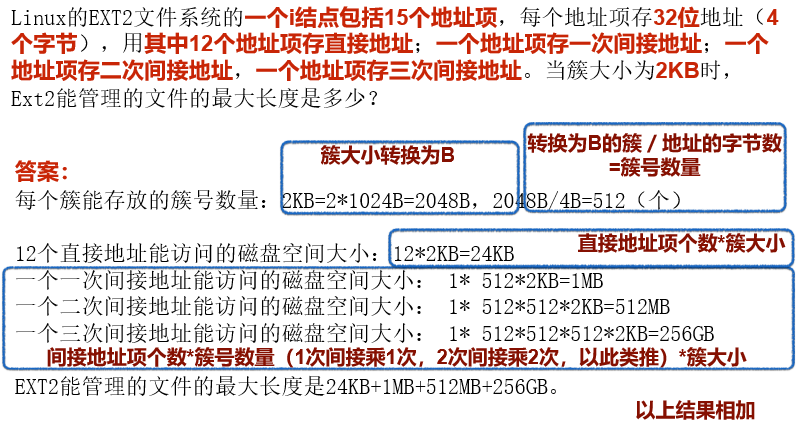
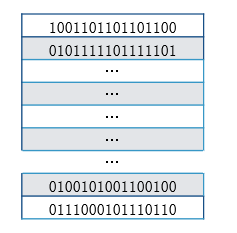

文件系统：能够为用户提供在计算机系统中对数据信息进行长期，大量存储和访问的功能。文件系统包含了文件以及管理文件的软件集合。

# 1 文件

文件系统的用户接口包括文件的**命名**，**类型**，**属性**和**对文件的操作**。

## 1.1 文件命名

所有操作系统都允许用**1~8个字母组成的字符串**。

多数操作系统都支持文件名用圆点隔开分为两部分，圆点后面的部分称为**文件扩展名**。

## 1.2 文件结构

- 无结构字节序列（流式结构）
- 固定长度记录序列
  - 中心思想：读操作返回一个记录，写操作重写或追加一条记录。
- 树形结构
  - 记录长度不定
  - 在记录的固定位置包含一个关键字域
  - 记录树按关键字域排序

## 1.3 文件类型

- 正规文件
  - ASCLL 文件 可显示和打印，通常的文本编辑器可编辑
  - 二进制文件  不能直接显示和打印，需要专门编辑器
- 目录文件
  - 管理文件系统的系统文件
- 字符设备文件
  - 和输入输出有关（ 字符设备文件和输入/输出有关，用于串行I/O设备，如终端、打印机和网络等。 ）
- 块设备文件
  - 用于磁盘类设备（磁盘类设备）

## 1.4 文件存取

- 顺序存取：早期，从文件开始处读取信息，不能跳过。
- 随机存取(直接存取)：又称直接存取，可以以任一顺序读取文件信息。

## 1.5 文件属性

- 除了文件名和文件数据外，其他与文件相关的信息，如创建日期，文件大小，修改时间等。

## 1.6 文件操作

# 2 目录

目录式文件系统中实现**按名访问**的重要结构

## 2.1 层次目录系统

目录文件有两种常见的结构

- 属性放在目录项中
- 属性放在i 结点中（地址）

## 2.2 目录结构

- 单层目录（根目录）
  - 缺点：文件命名，搜索效率低
- 两级目录
  - 优点：解决重名问题，查找快
  - 缺点：增加系统开销
- 树形目录
  - 优点
    - 便于文件分类
    - 层次结构清晰
    - 便于管理和保护
    - 解决了重名问题
    - 查找速度加快
  - 缺点：结构相对复杂

## 2.3 路径名

- 绝对路径名：从根目录到文件
- 相对路径名：从当前工作目录到文件

## 2.4 目录操作

# 3 文件系统的实现

## 3.1 实现文件

文件系统通常是以**2的n次方个连续的扇区**为单位对文件进行磁盘空间的分配，把**分配给文件的连续扇区**构成的**磁盘块**称为**簇**。

- 连续分配

  - 把每个文件作为一连串的数据块放在磁盘上
  - 优点：
    - 实现简单，记录每个文件用到的簇仅需要连个数字即可：第一块的磁盘地址和文件的块数
    - 读操作性能好，在单个操作中就能从磁盘上读取整个文件
  - 缺点：
    - 磁盘变得零碎，空闲的连续簇形成“空洞”

- 磁盘链接表

  - 为每个文件构造簇的链接表，每个簇开始的几个字节用于存放下一个簇的簇号，簇的其他部分存放数据，每个文件可以存放在不同的簇中。
  - 优点：充分利用每个簇，不会因为磁盘碎片而浪费空间，管理也比较简单。
  - 缺点：随机存取非常缓慢，要获得文件的第n块
  - 每一次都要从头开始读取前面的n-1块。

- 内存的链接分配表

  - 将文件所在的磁盘的存放在内存的表（文件分配表）中
  - 缺点：必须把整个表都存放到内存中，磁盘容量很大时，表占的内存比较大。

- i 结点

  - 为每个文件赋予一个被称为i 结点的数据结构，其中列出了文件属性和文件块的磁盘地址。

    

## 3.2 实现目录

- CP/M 中的目录
  - 以簇而不是以字节为单位来记录文件长度
- MS-DOS中的目录
  - 使用 文件分配表FAT 作为索引表来存放文件数据所在簇的簇号
- UNIX
  - i 结点

## 3.3 磁盘空间管理

磁盘空间管理是文件系统的重要功能，包括**记录空闲磁盘信息**，**设计文件的存放方式**，以及规定文件系统的**簇大小**等内容。

**簇**

簇大小：文件系统为文件分配磁盘空间以簇为单位

簇大小过大：容易造成空间浪费

簇大小过小：文件跨越簇，访问文件时间延长

一般簇大小是2的整数次幂个连续的扇区，

如 1 个扇区，512 个字节

连续两个扇区，大小为1 KB

连续四个扇区，大小为2 KB

**记录空闲块跟踪记录空闲块的两种常见方法**

- 空闲簇链接表：用一些空闲簇存放空闲簇的簇号

- 位图：用n位位图对应磁盘的n个簇

  - 空闲簇用1表示
  - 已分配簇用0表示

  

