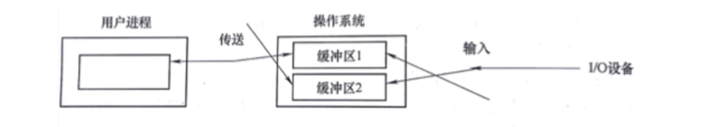

I/O设备即输入/输出设备，适用于计算机系统与人通信或与其他机器通信的所有设备，以及所有外存设备。

# 1 I/O系统的组成

I/O系统不仅包括**各种I/O设备**，还包括与设备相连的**设备控制器**，有些系统还配备了专门用于输入/输出控制的专用计算机，即**通道**。此外，**I/O系统要通过总线与CPU，内存相连**。

## 1.1 I/O系统的结构

I/O系统的结构分为两大类：微机I/O系统 主机I/O系统

**微机I/O系统**

CPU与内存之间可以直接进行信息交换，但是不能与设备直接进行信息交换，必须经过设备控制器。

**主机I/O系统**

主机I/O系统采用四级结构，包括主机，通道，控制器和设备

一个通道可以控制多个设备控制器

一个设备控制器可以控制多个设备

I/O系统不仅包括各种I/O设备，还包括与设备相连的设备控制器，有些系统还配备了专门用于输入/输出控制的专用计算机，即**通道**。

## 1.2 I/O设备的分类

**按传输速率分类**

- 低速设备（鼠标，键盘  传输速率 几个~几百个字节/秒）
- 中速设备（打印机 传输速率 数千个 ~ 数万个字节/秒）
- 高速设备（磁带机，光盘机，磁盘机 传输速率 几十万 ~ 几兆字节/秒）

**按信息交换单位分类**

- 块设备      （磁盘  数据的存取以数据块为单位）
- 字符设备  （打印机  传输字节流 不适用块结构）

**按设备的共享属性分类**

- 独占设备   （例：打印机 必须要作为临界资源以互斥方式访问）
- 共享设备   （例：磁盘  允许多个进程共同访问的设备）
- 虚拟设备   （通过虚拟技术把一台物理设备变成若干逻辑设备）

## 1.3 设备控制器

- 设备控制器是CPU与I/O设备之间的接口，接收I/O的命令并**控制设备完成I/O工作**。
- 设备控制器是一个**可编址设备**，连接多个设备时可有多个设备地址。

**设备控制器的组成**

- 设备控制器与处理机的接口：数据线，控制线，地址线
- 设备控制器与设备的接口：接口中的3类信号为数据，状态，控制信号。
- I/O逻辑：主要由指令译码器和地址译码器两部分功能部件构成，将CPU的命名和地址分别译码，控制指定的设备进行I/O操作。

**设备控制器的功能**

- 接收和识别命令
- 数据交换：通过数据寄存器进行数据交换
- 设备状态的了解和报告
- 地址识别
- 数据缓冲
- 差错控制

## 1.4 I/O通道

一种特殊的处理机，它具有执行I/O指令的能力，并通过执行通道程序来控制I/O操作，大型主机系统中专门用于I/O的专用计算机。

引入通道能够使CPU从控制I/O操作的任务解脱出来，使CPU与I/O并行工作，提高CPU利用率和系统吞吐量。

# 2 I/O控制方式

尽量减少主机对输入/输出控制的干预，提高主机与输入/输出设备的并行程度。

- 轮询控制方式   早期

  - 主机视图发送I/O控制命令之前先通过**反复检测设备控制器状态寄存器的忙/闲标志位**，若设备忙，主机继续检测该标志位，直到该位为空闲，主机发送I/O指令
  - 缺点：使CPU经常处于循环测试状态，造成CPU的极大浪费 影响整个进程的吞吐量。

- 中断控制方式   引入中断机制后

  - 现在计算机系统广泛采用中断控制方式完成对I/O的控制。
  - CPU执行过程中发出I/O请求，若此时I/O设备忙，则进程阻塞等待。当处于 忙 状态的设备工作完毕，通过中断控制器发出中断请求信号，CPU响应中断，执行对该设备的中断处理程序，然后唤醒因等待该设备而被阻塞的进程。CPU继续执行这个进程时，向设备控制器发送I/O指令，然后CPU被调度程序分配给某个进程，继续执行某个进程。本次I/O结束后，设备控制控制器通过向CPU发送中断请求信号告知CPU本次数据传输结束。
  - 优点：使CPU和I/O设备在某些时间段上并行工作，提高CPU的利用率和系统的吞吐量。

- DMA控制方式  提高输入输出性能

  - DMA控制器结构

    - DMA的主机的接口
    - DMA与设备的接口
    - I/O控制逻辑

  - DMA控制器中的寄存器

    - 命令/状态寄存器CR
      - 用于接收从CPU发来的I/O命令或有关控制信息，设备状态
    - 内存地址寄存器MAR
      - 存放内存地址，在输出数据时，存放输出数据在内存中的起始地址，知识DMA应该从内存的什么地方读取输出数据
      - 在输入数据时，存放数据将要被放入内存的起始地址，知识DMA应该把输入数据放在内存的什么地方
    - 数据寄存器DR
      - 用于暂存DMA传输中要输入或输出的数据
    - 数据计数器DC
      - 指示DMA，本次向CPU发中断信号前要读或者写数据的次数。

  - DMA工作方式流程

    

    

- 通道控制方式   使输入/输出更大程度地独立主机的CPU

# 3 缓冲管理

缓冲区使用来保存两个设备之间或设备与应用程序之间传输数据的内存区域

由于CPU的速度远远高于I/O设备，为了尽可能使CPU与设备并行工作，提高系统的性能，通常需要操作系统在设备管理软件中提供缓冲区管理功能。

**缓冲的引入**

在数据到大速率与数据离去速率不通的地方都可以引入缓冲区。

引入缓冲区的主要原因

- 处理数据流的生产者与消费者之间的速度差异
- 协调传输数据大小不一致的设备

引入缓冲的主要作用

- 引入缓冲区除了可以换和CPU与I/O设备之间速度不匹配的矛盾，还能提高CPU和I/O设备之间的并行性。

**单缓冲**

最简单的缓冲类型，在主存储器的系统区中只设立一个缓冲区。

用户进程发出I/O请求时，操作系统为该操作分配一个位于主存的缓冲区

**双缓冲**（缓冲交换）

当一个进程往这一个缓冲区中传输数据（或从这个缓冲区读取数据）时，操作系统正在清空（或填充）另一个缓冲区，这种技术称为双缓冲（double buffering），或缓冲减缓（buffering swapping）

**循环缓冲**

在数据到达和数据离去的速度差别很大的情况下，需要增加缓冲区的数量。

多个指针

- Nextg  用于指示消费者几次呢很难过下一个可用的装有数据的缓冲区
- Nexti   用于指示生产者进程下一个可用的空缓冲区
- Current   用于知识进程正在使用的工作缓冲区

Getbuf过程

- 消费者进程需要使用缓冲区中数据时调用
- 生产者进程需要使用空缓冲区装数据时调用

Releasebuf过程 ：进程使用完缓冲区后，调用Releasebuf过程释放缓冲区。

**缓冲池**

公共缓冲池中设置多个可供若干进程共享的缓冲区，提高缓冲区的利用率

3中类型的缓冲区

- 空缓冲区
- 装满输入数据的缓冲区
- 装满输出数据的缓冲区

3中缓冲队列

- 空缓冲队列
- 输入队列
- 输出队列

4 种工作缓冲区

- 收容输入数据的缓冲区
- 提取输入数据的缓冲区
- 收容输出数据的缓冲区
- 提取输出数据的缓冲区

# 4 设备分配

### 4.1 设备分配中的数据结构

支持设备分配的数据结构需要记录设备的状态（忙或空闲），设备类型等基本信息。

- 设备控制表DCT
  - 系统为每个设备建立一张设备控制表，多台设备控制表构成设备控制表集合。每张设备控制表包含**设备类型**，**设备标识符**、**设备状态**（忙闲）的等信息。
- 控制器控制表COCT
  - 系统为每个控制器设置一张用于记录该控制器信息的控制器控制表，通常包含控制器标识符、控制器状态等信息。
- 通道控制表CHCT
  - 系统为每个通道设备设一张通道控制表，通常包含通道标识符，通道状态等信息。
- 系统设备表SDT
  - 记录了**系统中全部设备**的情况，每个设备占一个表目，其中包括**设备类型，设备标识符，设备控制表及设备驱动程序的入口地址。**

### 4.2 设备分配

**设备分配应考虑一下3个因素**

设备的固有属性

- 独占性 --  独享分配策略
- 共享性 -- 可同时分配给多个进程使用
- 可虚拟性 -- 可同时分配给多个进程使用

设备分配算法

- 先来先服务 -- 根据进程对某设备提出请求后的先后顺序分配
- 基于优先权的分配算法 --  对高优先权进程所提出的 I/O请求也赋予高优先权

设备分配方式

- 安全分配方式     --  发出 I/O请求后进入阻塞状态，摒弃请求和保持条件，使设备分配是安全的。
- 不安全分配方式  --  仅当请求的设备被占用，进程才进入阻塞状态 可能居呗 请求和保持 条件，从而可能造成死锁。

**独占的设备的分配程序**

对于具有I/O通道的系统，在进程提出I/O请求后，系统的设备i分配程序可按下列步骤进行设备分配。

- 分配设备
- 分配控制器
- 分配通道

### 4.3 设备独立性

设备独立性也称设备无关性，应用程序独立于具体使用的物理设备。

应用程序中，使用逻辑设备名称来请求使用某类设备（具有设备独立性）。

系统在实际执行时，必须使用物理设备的名称（无设备独立性）。

**实现设备独立性带来的好处**

- 应用程序与物理设备无关（系统增减或变更外围设备时不需要修改应用程序）
- 易于处理I/O设备的故障（替换设备不需要修改应用程序）
- 提高了系统的可靠性，增加了设备分配的灵活性。

**设备独立软件的功能**

- 执行所有设备的共有操作：包括独占设备的分配与回收，将**逻辑设备名转换为物理设备名**（逻辑设备表LUT）， 对设备进行保护等。
- 向用户层软件提供统一的接口：向应用软件和最终用户提供简单，统一的访问接口。

### 4.4 SPOOLing技术

**含义**

在多道程序环境下，利用一道程序来模拟**脱机输入**时的外围控制及的功能，把低速I/O设备上的数据传输到高速输出磁盘上，再利用另一道程序来模拟脱机输出时外围控制机的功能，把数据从磁盘上传送到低速输出设备上。（用程序来代替通道）

这种再联机情况下实现的同时外围操作称为SPOOLing。

**组成**

- 输入井和输出井
- 输入缓冲区和输出缓冲区
- 输入进程SPi和输出进程SPo
- 请求I/O队列

**利用SPOOLing技术实现共享打印机**

当用户进程提出打印请求时，SPOOLing系统先为用户做下列两件事

- 由输出进程再输出井中申请空闲空间，并将要打印的数据送入其中。
- 输出进程再为用户申请并填写一张**用户请求打印表**，将该表挂到请求打印的队列上当打印机空闲时，输出进程完成以下动作。
  1. 从请求打印队列队首去一张请求打印表
  2. 将打印数据从输出井送到打印机的缓冲区（输出缓冲区）
  3. 打印
  4. 打印完毕，若打印队列不为空，则转第一步。

**SPOOLing 的特点**

1. 提高了I/O速度（使用了磁盘作为低俗设备的大容量缓存）
2. 将独占设备改造为共享设备
3. 实现了虚拟设备功能

# 5 I/O软件原理

输入输出软件的总体目标时**将软件组织成一种层次结构**

**低层软件**用来屏蔽硬件的具体细节

**高层软件**则主要十位用户提供一个简洁，规范的界面。

### 5.1 设备管理的4个层次

- 用户层软件：向系统发出I/O请求，显示I/O操作的结果，提供用户与设备的接口
- 与设备无关的软件层：完成设备命名，设备分配，设备独立性和缓冲管理等功能
- 设备驱动程序 ：与硬件关系最密切
- 中断处理程序（底层）

### 5.2 设备管理软件功能（独 处 一 环 芬芳 空）

1. 实现I/O设备的独立性
2. 错误处理
3. 异步传输
4. 缓冲管理
5. 设备的分配和释放
6. 实现I/O控制方式

### 5.3 中断处理程序

I/O中断处理程序的作用是将发出I/O请求而被阻塞的进程唤醒。

**过程**

用户进程发出I/O请求 -- >  被阻塞 -- >  CPU去执行其他任务 --> I/O任务完成，控制器发出中断请求信号 --> CPU执行中断处理程序，唤醒被阻塞进程。

### 5.4 设备驱动程序

设备驱动程序时I/O进程与设备控制器之间的通信程序，其主要任务时接受上层软件发来的抽象的I/O请求，如 read 和 write 命令，把他们转换为具体要求后，噶送给设备控制器启动设备去执行。

### 5.5 与硬件无关的I/O软件

设备无关的I/O软件的功能如下：

- 设备命名
- 设备保护
- 提高独立于设备的块大小
- 为块设备和字符设备提供必要的缓冲技术
- 块设备的存储分配
- 分配和释放独立设备
- 错误处理

# 6 磁盘管理

磁盘的存储器不仅**容量大，存取速度快**，而且可以实现**随机存取**，是存放大量程序和数据的理想设备。

磁盘管理的重要目标是提高磁盘空间利用率和访问速度。

**磁盘结构**

一个物理存储再一个扇区上，磁盘的存储的物理记录数目是由**扇区数**，**磁道数**以及**磁盘面数**决定的。

在磁盘管理中，利用**磁道号**、**磁头号**以及**扇区号**决定的。

**磁盘类型**

- 固定头磁盘 在每个磁道都有读/写磁头
- 活动头磁盘（移动头） 每一个盘面仅配有一个磁头

**磁盘访问时间**

- 寻道时间：磁头移动到指定磁道所经历的时间。
- 旋转延迟时间：指定扇区移动到磁头下面所经历的时间。
- 传输时间：把数据从磁盘上读出或向磁盘写入数据时所经历的时间。

**磁盘调度**

磁盘调度的一个重要目标时使磁盘的平均寻道时间最少

- 先来先服务FCFS
  - 最简单的磁盘调度算法
  - 根据进程请求访问磁盘的先后顺序进行调度
  - 优点：公平、简单，且每个进程的请求都能依次得到处理，不会出现某一进程的请求长期得不到满足的情况
  - 缺点：平均寻道时间长
- 最短寻道时间优先SSTF
  - 该算法选择的进程：要求访问的磁道与当前磁头所在的磁道距离最近，以使每次的寻道时间最短。
  - 优点：每次的寻道时间最短，较之FCFS有更好的寻道性能
  - 缺点：可能导致某个进程发生“饥饿”现象。
- 扫描算法SCAN（电梯调度算法）
  - 不仅考虑到要访问的磁道与当前磁道的距离，更有先考虑磁头当前的移动方向
  - 优点：有较好的寻道性能，放置“饥饿”现象。
  - 缺点：有时候进程请求被大大推迟。
- 循环扫描算法CSCAN
  - 在扫描算法的基础上，规定磁头是单向移动的。将最小磁道号紧接着最大磁道号构成循环，进行循环扫描。
- NStepSCAN（了解）
  - 将磁盘请求队列分成若干长度为N的子队列，磁盘调度将按照FCFS算法依次处理这些子队列，每处理一个队列时又是按照SCAN算法，对一个队列处理后，再处理其他队列。
- FSCAN(了解)
  - NStepSCAN算法的简化，将磁盘请求队列分成两个子队列，一个是由当前所有请求磁盘访问的进程形成的队列，有磁盘调度占SCAN算法进行处理，将新出现的所有请求磁盘访问的进程放入另一个等待处理的请求队列。

**提高磁盘I/O速度的方法**

1. 提前读（减少读数据的时间）
2. 延迟写（减少写磁盘的次数）
3. 优化物理块分布（减少磁臂移动距离）
4. 虚拟盘（内存空间仿真磁盘，存放临时文件）
5. 磁盘高速缓存（逻辑上属于磁盘，物理上在内存中）

