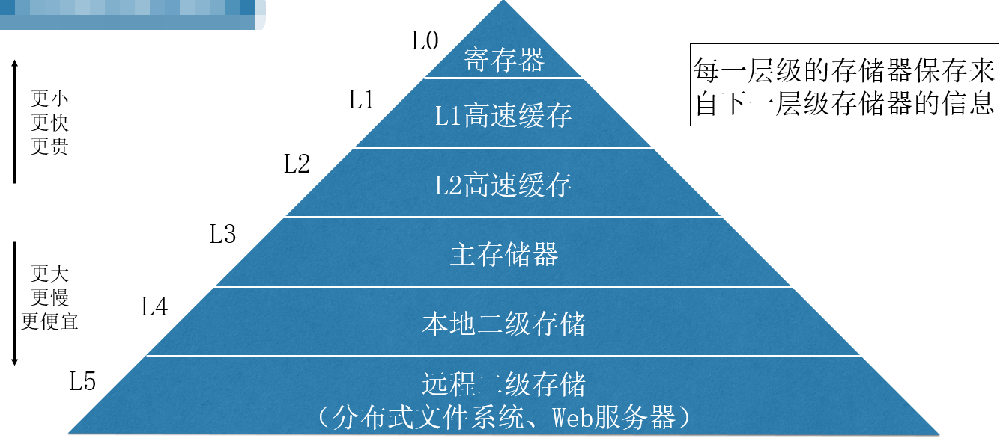
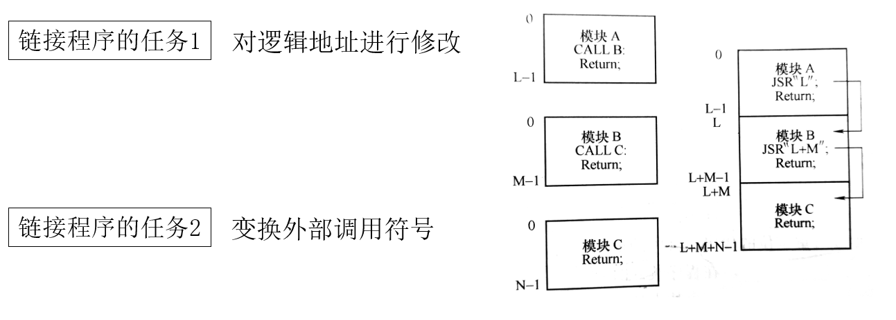
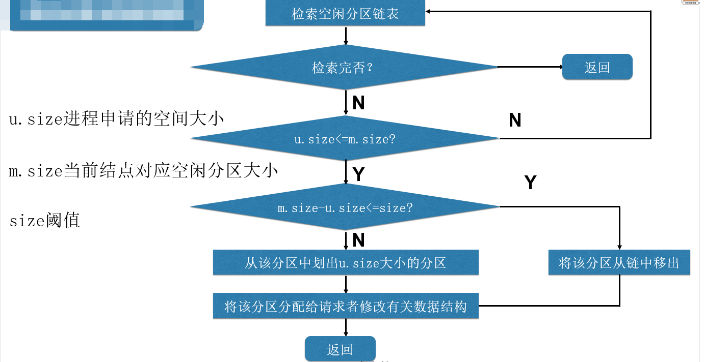
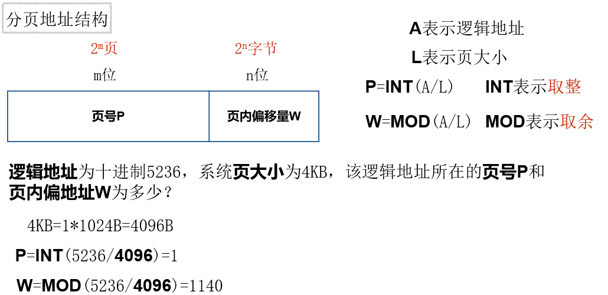
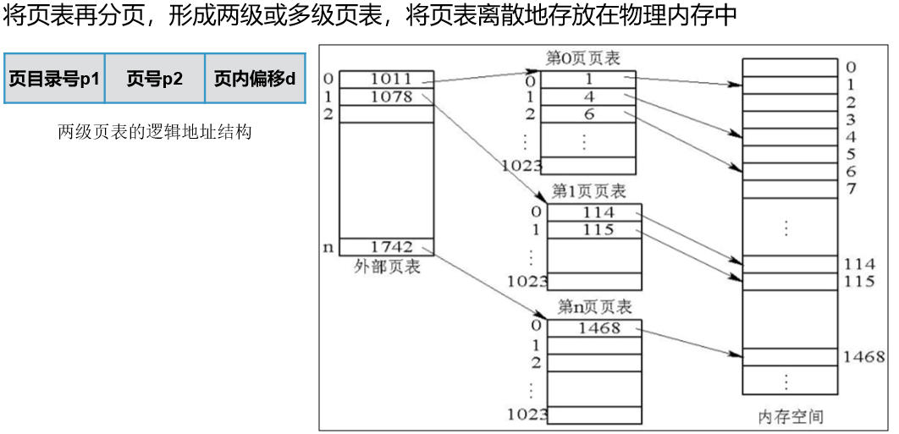
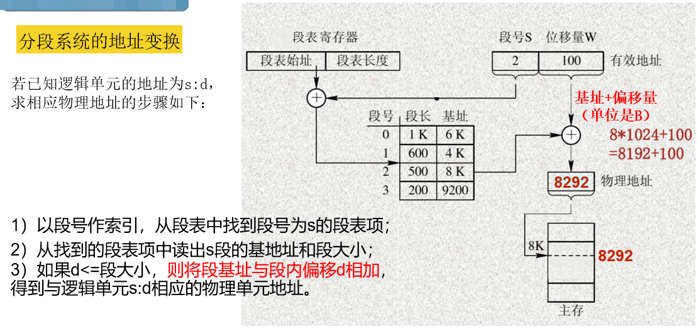
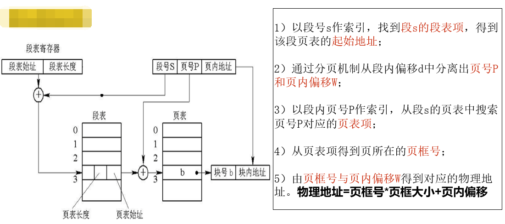
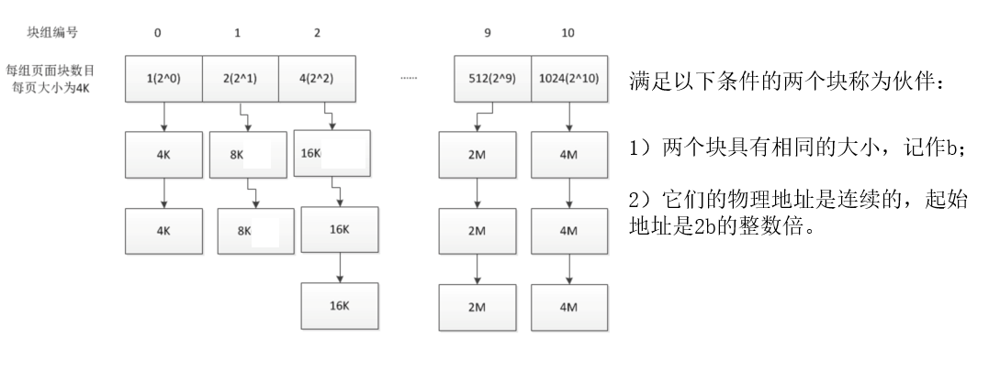

内存管理的目标：实现内存分配和回收；提高内存空间的利用率和内存的访问速度。

# 1 存储器的层次结构

- CPU内部 ： L0 ~ L2
- 内存：主存储器
- 外存：L4 ， L5

**局部性原理**

在一段较短时间内，程序的执行仅限于某个部分，相应地，它所访问的存储空间也局限于某个区域。

- 时间局部性：某条指令一旦执行，不久后该指令可能再次执行。
- 空间局部性：一旦程序访问了某个单元，不久后附近的存储单元也将被访问。

# 2 程序的链接和装入

**程序的链接**

将编译后的目标模块装配成一个可执行程序

- 静态链接：程序运行前，用链接程序将目标模块链接成一个完整的装入模块。（优点：运行速度快）

  

- 动态链接：可将某些目标模块的链接推迟到这些模块中的函数被调用执行时才执行。（优点：节省了空间）

**程序的装入**

- 绝对装入方式
  - 编译时产生物理地址的目标代码
- 可重定位装入方式（静态重定位）
  - 程序装入时对目标程序中的指令和数据地址的修改过程叫重定位。
  - 编译时地址是逻辑地址，装入是通过重定位转换为物理地址。
  - 物理地址 = 逻辑地址 + 程序在内存中的起始地址
- 动态运行时装入（动态重定位）
  - 程序执行时通过重定位转换为物理地址

# 3 连续分配存储管理方式

## 3.1 单一连续分配

任何时刻主存储器最多只有一个作业

## 3.2 固定分区分配

每个分区大小固定不变，每个分区可以且仅可以装入一个作业。

**界限寄存器**

- 上限寄存器
- 下限寄存器

**固定分区说明表**

- 分区编号
- 分区大小
- 分区起始地址
- 分区状态

## 3.3 动态分区分配

分区大小不是预先固定的，而是按作业的实际需求来划分的；分区的个数也不是预先固定的，而是由装入的作业数决定的。

### 3.3.1 空闲分区表

- 分区编号
- 分区大小
- 分区起始地址

### 3.3.2 空闲分区链

动态地为每一个空闲分区建立一个结点（分区起始地址:分区大小）

结点包括

- 分区起始地址
- 分区大小
- 指向前一个空闲分区结点的指针
- 指向后一个空闲分区结点的指针

### 3.3.3 动态分区分配的流程

### 3.3.4 动态分区分配算法

**首次适应算法**

空闲分区链以**地址递增**的顺序链接从链首开始查找，直至找到第一个满足要求的空闲分区，从该分区中划出一块内存给进程，剩下的仍留在空闲链中。

缺点：

- 外部碎片
- 内部碎片

**循环首次适应算法**

从上次找到的空闲分区的下一个空闲分区开始查找。

优点：空闲区分布均匀

**最佳适应算法**

空闲分区链以**分区大小递增**的顺序链接，从链首开始查找直至找到第一个与进程请求的空间大小最接近的空闲分区。

优点：提高内存利用率

注意：从小到大排序，切完仍然需要从小到大排序。

## 3.4 动态分区回收

1. 释放一块连续的内存区域
2. 如果被释放的区域与其他空闲区相邻，则合并空闲区
3. 修改空闲分区链

# 4 基本分页存储管理方式

根据离散内存管理分配内存空间的基本单位的不通，将其分为

- 分页存储管理
- 分段存储管理
- 段页式存储管理

## 4.1分页存储管理的基本原理

**基本概念**

- **页**：将一个进程的逻辑地址空间分成若干个大小相等的片
- **页框**：将物理内存空间分成与页大小相同的若干个存储块
- **分页存储**：将进程中的若干个页分别装入多个可以不相邻的页框中
- **页内碎片**：进程最后一页一般装不满一个页框，形成页内碎片
- **页表**：实现从页号到页框号的映射

**分页地址结构**

- 页号P
  - 页号有n位，代表一共有2的n次幂页
- 页内偏移量W
  - 页内偏移量有m位，代表每一页有2的m次幂字节

**分页地址变换**

逻辑地址 -- **地址变换机构** --> 物理地址

- 进程执行，PCB中页表起始地址和页表长度送CPU的页表寄存器。（找到页表）
- CPU访问某个逻辑单元A（找到逻辑地址）
- 由分页地址变换硬件自动将A分为页号和页内偏移两部分
- 有硬件检索页表，得到A所在的页对应的页框号（找到页框号）
- 页框号和页内偏移地址送物理地址寄存器，计算物理地址。（找到物理地址）

物理地址 = 页框大小 * 页框号 + 页内偏移量

**页大小的选择因素**

512B ~ 4KB（目前计算机系统中，大多数选择4KB）

较小，划分为较多页，页表过长，占内存；

较大，页内碎片大，空间利用率低。

因素：管理内存开销，内存利用率。

## 4.2 快表TLB

快表也称“转换后援缓冲”，是为了提高CPU访问存储速度而采用的专用缓存，用来存放最近被访问过的页表项。

**引入快表后的地址变换过程**

1. CPU产生分页的逻辑地址页号和页内偏移地址后，将页号提交给快表。
2. 查找快表，如果找到页号，得到该页所对应的页框号；否则继续查找内存页表，得到页框号。
3. 如果查找的页表项不在快表中，访问玩内存页表后，把该页表项写到快表中。

**快表的条目由键和值组成**

**引入TLB的性能分析** 

在TLB中找到某一个页号对应的页表项的百分比称为**TLB命中率**

当能在TLB中找到所需要的页表项时：有效访存时间 = 一次访问 TLB 的时间 + 一次访问内存的时间（访问内存读写数据或指令）

当没有在TLB中找到所需要的页表项时：有效访存时间 = 一次访问TLB的时间 + 两次访问内存的时间（一次访问内存页表，一次访问内存读写数据或指令）

有效访存时间 = （访问快表时间 + 访问内存时间） * 命中率 + （访问快表时间 + 访问内存时间 * 2） * （1 - 命中率 ）

## 4.3 两级和多级页表

将页表再分页，形成两级或多级页表，将页表离散地存放再物理内存中。

在耳机分页系统中，为了能在地址映射时得到页表在物理内存中的地址，需要为页表再建立一个**页目录表**（外层页表）。再其中的表项存放了每一个页表在物理内存中所在的**页框号**。

# 5 基于分页的虚拟存储系统

## 5.1虚拟存储器

虚拟存储器是指具有**请求调度功能**和**置换功能**，能从**逻辑**上对内存容量进行扩充的一种存储器系统。

**请求调入**：先将进程的一部分装入内存，其余部分什么时候需要什么时候请求系统装入。

**置换**：如果请求调入时，没有足够的内存，则由操作系统选择一部分内存中的进程内容移到外存，以腾出空间把当前需要装入的内存调入。

**优点**

- 提高内存利用率
- 提高多道程序度
- 把逻辑地址空间和物理地址空间分开

**特征**

- 离散性：实现虚拟存储管理的基础
- 多次性
- 对换性
- 虚拟性：实现虚拟存储系统的最重要目标

## 5.2 请求分页

请求分页系统时最基本，最常用的虚拟存储系统的实现方式。

## 5.2.1请求分页中的硬件支持

- **特殊的页表**
  - 页号
  - 页框号
  - 状态位P
  - 访问字段A
  - 修改位M
  - 保护位
- **缺页异常机构**
  - 在访问内存过程中发现缺页时产生缺页异常信号
- **地址变换机构**
  - 分页地址变换机构计算出页号和页内偏移地址
  - 查找快表，如果找到页号，读出页框号，计算物理地址
  - 若快表无该页信息，转到内存页表中查找页表，如果该页已调入，读出页框号，计算物理地址
  - 如果该页尚未调入内存，则产生缺页异常，请求调入该页，修改页表，重新执行因缺页被中断的指令。

## 5.2.2页分配策略

**Q 至少为进程分配多少个页框才能使进程正常运行？**

- **最少页框数**：保证进程正常运行的所需要的最少页框数

  最少页框数与进程的大小没有关系，它与计算机的硬件结构有关，取决于**指令的格式**，**功能**和**寻址方式**。

**Q 内存不够时，从进程本身选择淘汰页，还是从系统中所有进程页中选择？**

局部置换：内存不够时，从进程本身选择淘汰页

全局置换：内存不够时，从系统中所有进程页中选择

固定分配：每个进程分配固定的页框数

可变分配：执行过程中动态分配页框

- 固定分配局部置换
- 可变分配全局置换
- 可变分配局部置换

**Q 采用什么样的算法为不同进程分配页框？**

- 平均分配算法
  - 页框数按进程数平均分配，余出页框放到页框池
- 按比例分配算法
  - 按照进程所占内存大小进行分配
- 考虑优先权的分配算法
  - 按照进程优先权分配

## 5.2.3 页置换算法

从内存中选择换出页的算法

**最佳置换算法ORA**（主要用于理论研究）

选择以后永远都不会被访问的页或者在未来最长时间内不再被访问的页作为换出页

**先进先出置换算法FIFO**（最简单的页置换算法）

为每个页记录该页调入内存的时间，选择换出页时，选择进入内存时间最早的页

**最近最久未使用置换算法LRU**（实现最佳算法的近似算法）

选择最近最久未使用的页换出（用一个字段记录一个页自上次被访问以来所经历的时间）

**简单clock置换算法**：选择最近没有被访问的淘汰

**改进型clock算法**：选择既没有被访问过有没有被修改过的淘汰

**最少使用置换算法**：选择最近时期内使用次数最少的淘汰

## 5.2.4 请求分页系统的性能

**缺页率对有效访问时间的影响**

P为缺页率，有效访问时间=0.1+24999.9*P

有效访问时间与缺页率成正比，缺页率越高，有效访问时间越长，访问效率越低。

**工作集**：引入工作集的目的：降低缺页率，提高访问内存效率。

含义：某段时间间隔里，进程实际要访问的页的集合。

**抖动**

- 运行进程的大部分时间都用于页的换入换出几乎不能完成任何有效果的工作状态。
- 产生的原因：进程数量太多分配的页框太少
- 预防方法
  - 采取局部置换策略
  - 引入工作集
  - 挂起若干进程

# 6 分段存储管理

在分段存储管理的系统中，程序员使用**二维**的逻辑地址，一个数用来表示段，另一个数用来表示段内偏移。

**分段**（易于信息的共享）

进程的地址空间划分成若干个段。

每个段定义了一组逻辑信息，每个段的大小由相应的逻辑信息组的长度确定，段的大小不一样，每个段的逻辑地址从0开始，采用一段连续的地址空间

系统会为每个段分配一个连续的物理内存区域，各个不同的段可以离散地放入物理内存的不同区域。

系统为每个进程建立一张段表，段表的每一个表项记录的信息包括**段号，段长和该段的基址**，段表存放在内存中。

**分段的逻辑地址结构**

段号：段内偏移（2的段号位数次幂等于段的数量）

**段表**

段表时由操作系统维护的用于支持分段存储管理地址映射的数据结构

每个进程有一个段表，段表由段表项构成，每个段表项包括**段号，段基址，和段长**三个部分

**分段的地址变换**

在分段系统的地址变换过程中，CPU上的段表寄存器中存有当前在CPU上运行进程的段表起始地址。用段号作为段表的索引，根据段表起始地址和段号可以获得存放段s的段表项的内存地址。s号段表项在内存中的起始地址=段表起始地址+段号s*段表项长度。

分页和分段的主要区别**

分页和分段都属于离散分配方式，都要通过数据结构与硬件的配合来实现逻辑地址到物理地址的映射。

- 页是按照物理单位划分的，分页的引入是为了提高内存的利用率和支持虚拟存储；而段是按逻辑单位划分的，一个段含有一组意义相对完整的信息，引入分段的目的是为了方便程序员编程。
- 页的大小是固定的，而段的大小是不固定的，取决于用户编写的程序。
- 分页的地址空间是一维的，分段的地址空间是二维的。

# 7 段页式存储管理

将用户进程的逻辑空间先划分成若干个段，每个段再划分成若干个页。

进程以页为单位在物理内存中离散存放，每个段中被离散存放的页具有**逻辑相关性。**

为了实现地址映射，操作系统为每个进程建立一个段表，再为每个段建立一个页表。

进程段表的每一个段表项存放某个段的**页表起始地址**和**页表长度**。

**地址变换过程**

# 8 Linux 的伙伴系统

