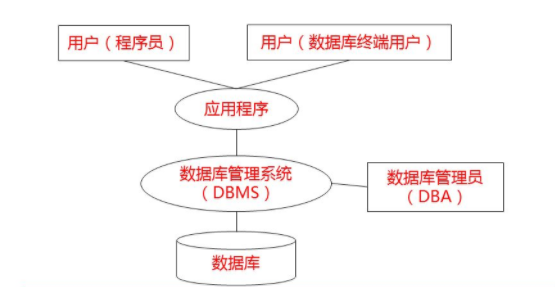

# 1 数据基本概念

## 1.1 什么是数据

​		数据（Data）是描述事物的符号记录，是指利用物理符号记录下来的，可以鉴别的信息。

​		数据是信息存在的一种形式，只有通过解释或处理的数据才能称为有用的信息。

## 1.2 什么是数据库

​		数据库（Database ，DB）是指长期储存在计算机中的有组织的，可共享的数据集合。

​		数据要按照一定的数据模型组织，描述和存储，具有较小的冗余度，较高的数据独立性，系统易于扩展，并可以被多个用户分享。

​		**特点**

- 永久储存（长期存储，可以永久存储）
- 有组织
- 可共享

## 1.3 数据库管理系统及其功能

​		数据库管理系统（DBMS）是专门用于建立和管理数据库的一套软件，介于应用程序和操作系统之间。

​		**功能**（简答）

- 数据定义功能
- 数据操纵功能
- 数据库运行管理功能
- 数据库的建立和维护功能
- 数据组织，存储和管理功能
- 其他功能（网络通信功能）

## 1.4 数据库系统的构成

​		通常，一个完整的数据库系统（DBS）包括数据库，数据库管理系统及相关实用工具，应用程序，数据库管理员和用户。

# 2 数据库管理技术的发展

## 2.1 人工管理阶段

​		**特点**

- 数据不保存
- 应用程序管理数据
- 数据面向应用程序

## 2.2 文件系统阶段

​		**优点**  物理数据独立性（数据的逻辑结构与应用程序之间相互依赖，也就是说逻辑并非独立的，改变文件夹的结构会影响应用程序。但是改变存储方式，和应用程序是无关的，怎么样存储，应用程序不在乎，只在乎数据。）

​		**缺点** 不能实现普通共享，只能实现文件级别的共享。

## 2.3 数据库系统阶段

- 数据集成
  - 把不同来源，格式等等把他们集成到一起。（主要目的）
- 数据共享性（高）
- 数据冗余（小）
- 数据一致性
- 数据独立性（高）
- 实施统一管理与控制
  - 数据库管理系统具有对数据的统一管理和控制功能，主要包括数据的独立性（安全性），完整性，并发控制与，故障恢复等，及数据库保护。
- 减少应用程序开发与维护的工作量

​        数据定义与使用数据的应用程序分离称为数据独立（逻辑独立）

​		数据的组织分为逻辑组织和物理组织两种。数据的逻辑组织是用户或应用程序所使用的数据结构形式，而物理组织则是数据在物理存储设备上的结构形式，这两者之间可以相互独立。

# 3 数据库系统的结构

## 3.1 从DBA的视角

- 内部系统结构（采用三级模式）

  ​		在一个数据系统中，只有唯一的数据库，因而作为定义，描述数据库存储结构的内模式和定义，描述数据库逻辑结构的模式，也是唯一的，但建立在数据库系统之上的应用则是非常广泛多样的，所以对应的外模式不是唯一的，也不可能是唯一的。

  - 模式

    - ​    模式也叫概念模式或者逻辑模式，它是由数据库设计者综合所有用户的数据，按照统一的观点构造的全局逻辑结构，是对数据库全部数据的逻辑结构的特征的总体描述，是所有用户的公共数据视图（全局视图）。他是由数据库管理系统提供的数据模式描述语言（DDL）来描述，定义的。概念模式反应了数据系统的整体观。
    - 模式是数据库的核心，也是数据库设计的关键。
    - 视图类型：概念视图。

  - 内模式

    - ​     内模式又称存储模式，对应于物理级。他是数据库中全体数据的内部表示或底层描述，是数据库最低一级的逻辑描述，他描述了数据在存储介质上的存储方式和物理结构，对应着实际存储在外存储介质上的数据库。内模式由内模式描述语言来描述，定义的。内模式反映了数据库系统的存储观。
    - 视图类型：内部视图，或存储视图。

  - 外模式

    - ​    外模式又称子模式或用户模式，对应用户级。他是某个或某几个用户所看到的数据库的数据视图，是与某一应用有关的数据的逻辑表示。外模式是从模式导出的一个子集，包含模式中允许特定用户使用的那部分数据。用户可以通过外模式描述语言来进行描述，定义对应于用户的数据记录（外模式），也可以利用数据操纵语言（DML）对这些数据记录进行操作。外模式反映了数据  库系统的用户观。
    - 视图类型：数据视图，即用户视图。

  - 三级模式结构的两层映像与数据独立性

    ​	所谓映像，就是一种对应规则，他指出映像双方是如何进行转换的。

    - 模式和/内模式映像
      - 保证数据与程序的物理独立性
        - 数据库中只有一个模式，也只有一个内模式，所以模式/内模式映像是唯一的，它定义了数据全局逻辑结构与存储结构之间的对应关系。当数据库的存储结构改变了，由数据库管理员对模式/内模式映像作相应改变，可以使模式保持不变，从而应用程序也不必改变，这就保证了数据与程序的物理独立性。也就是说存储结构（内模式）是否改变和应用程序无关。
    - 外模式/模式映像
      - 保证数据与程序的逻辑独立性
        - 模式描述的是数据全局逻辑结构，外模式描述的是局部逻辑结构。对应于同一个模式可以有任意多个外模式。对于某个外模式，数据库系统都有一个外模式/模式映像，它定义了该外模式与模式之间的对应关系。当模式改变的时候，由数据库管理员对各个外模式/模式的映像做相应的改变，可以使外模式保持不变。应用程序是依据数据的外模式进行编写的，从而应用程序不必改变，保证了数据与程序的逻辑独立性。也就是说模式是否改变和应用程序无关。

- 外部系统结构
  - 集中式结构
    - 集中式结构也称主从式结构，是一个主机带多个终端用户结构的数据库系统，在这种结构中，包括应用程序，DBMS，数据，都集中存放在主机上，所有处理任务都由主机来完成。各个用户通过主机的终端可同时或并发地存取数据库，共享数据库资源。集中式结构的优点是结构简单，易于管理、控制与维护，缺点是当终端用户数目增加到一定的程度后，主机的任务会过分繁重，称为瓶颈，使系统性能下降。系统的可靠性以来主机，当主机出现故障时，整个系统都不能使用。
  - 分布式结构
    - 数据在逻辑上相互关联，是一个整体，但是在物理上分布在计算机网络的不同结点上，网络中的每个节点都可以独自处理本地数据库中的数据，执行局部应用，同时也可以通过网络通信执行全局应用。
  - 并行结构
    - 共享内存（SM）
      - 各个处理器通过高速通讯网络与共享内存连接，并均可直接访问系统中的一个、多个或全部的磁盘存储，在系统中，所有的内存和磁盘存储均由多个处理器共享
    - 共享硬盘（SD）
      - 此结构由多个拥有独立内存的处理器和多个磁盘组成，各个处理器之间没有直接的信息和数据的交换，每个处理器都可以读写全部硬盘，处理器与硬盘告诉通信网络连接。
    - 无资源共享（SN）
      - 这种结构由多个处理节点构成，每个处理节点有自己独立的处理器，独立的内存，独立的磁盘。多个处理节点在处理器级上由由通信网络连接，系统中各个处理器用自己的内存处理数据。根据数据模式和应用特点，全局数据或者被划分到各个节点上，或者被复制到每个节点上（如某些只读的数据）。事务根据其所涉及的数据，或局部化到某个节点上执行，或由多个站点协作完成。

## 3.2 从数据库应用的用户的视角

- 客户/服务器结构（C/S）

  C（客户端，前台或表示层）主要完成与数据库使用者的交互任务；S（服务器，后台或数据层）主要负责数据管理。

  - 单机方式
    - 在同一台计算机上
  - 网络方式
    - 在不同的计算机

- 浏览器/服务器结构（B/S）

  是一种基于Web应用的客户/服务结构，也成为三层客户/服务器结构。

  三层为：表示层、处理层（中间层）、数据层。

# 4 数据模型

## 4.1 什么是数据模型

模型（Model）是现实世界特征的模拟和抽象表达。

数据模型是对现实世界数据特征的抽象，描述的是数据的共性内容。

## 4.2数据的特征

- 静态特征
  - 数据的基本结构
  - 数据间的联系
  - 数据取值范围的约束（如性别）
- 动态特征
  - 指对数据可以进行符合一定规则的操作。

## 4.3数据模型组成要素

- 数据结构

  - 描述的是系统的静态特征，即数据对象的数据类型，内容，属性，以及数据对象之间的联系。

- 数据的操作

  描述的是系统的动态特征

  - 增删改查

- 数据约束

  - 描述数据结构中数据间的语法语义关联

## 4.4数据模型的分类

数据模型是模型化数据和信息的工具，也是数据库系统的核心和基础。

​		**满足三点**

- 比较真实地模拟现实
- 容易为人们理解
- 便于在计算机上实现

现实世界--（抽象）-->概念模型--（转换，组织）-->逻辑模型-->物理模型（机器的世界）

数据模型中具有“型”（type）和“值”（value）两个概念。

- 型（表头）
- 值（具体的值）

## 4.5什么是概念层数据模型

​		概念层是数据抽象级别的最高层。概念层数据模型，也成为数据的概念模型或信息模型，这类模型主要用于数据库的设计阶段。

## 4.6信息世界涉及的基本概念

- 实体（Entity）客观存在并可相互区别的事物。
- 属性（Attribute）实体所具有的某种特征
- 码或键（Key）一种特殊的属性（可以作为唯一标识的属性）
- 域（Domain）取值范围（性别 男 女）
- 实体型（Entity Type）具有相同属性的实体必然有共同的特征用实体名和属性名的集合可以抽象刻画同类的实体，就叫实体型。
- 实体集（Entity Set）同类型实体的集合，就是实体集。
- 联系（Relationship）实体和实体之间的联系。

## 4.7 概念模型的表示方法

## 4.8 什么是逻辑层数据模型

​		逻辑层是数据抽象级别的中间层。逻辑层数据模型，也称为数据的逻辑模型。任何DBMS都是基于某种逻辑数据模型。

## 4.9 逻辑模型的类型

​		**层次模型**

- 是最早使用的一种数据模型
- 有且仅有一个结点没有父结点，称作根结点
- 其他结点有且仅有一个父结点

​        **网状模型**

- 以网状结构标识实体和实体间的联系
- 允许结点有多余一个父结点
- 可以有一个以上的结点没有父结点

​        **关系模型**

- 建立在严格的数学概念基础上
- 概念单一
- 存取路径对用户透明，有更高的数据独立性，更好的安全保密性

​		**面向对象模型**（正在开发）

- 既是概念模型又是逻辑模型
- 表达能力丰富，对象可复用，维护方便

​        

## 4.10 物理层数据模型

​		物理层数据模型，也成为数据的物理模型，描述数据在存储介质上的组织结构，是逻辑模型的物理实现；

​		是数据库最底层的抽象；

​		设计目标是提高数据库性能和有效利用存储空间。

​		这三个不同的数据模型之间即相互独立，又存在关联。从现实世界到概念模型的转换是由数据库设计人员完成的；从概念模型到逻辑模型的转换可以由数据库设计人员完成，也可以用数据库设计工具协助设计人员完成；从逻辑模型到物理模型的转换主要是由数据库管理系统完成的。

