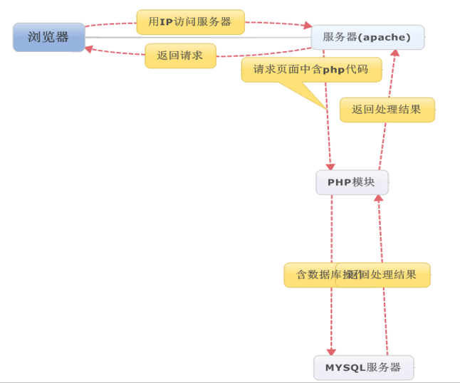

​		以数据库的生命周期为演化主线，数据库应用软件的设计与开发过程可由需求分析，系统功能与数据库的设计（ER图），系统功能与数据库的实现（SQL），测试与维护等阶段构成。


# 1 基于 php 语言的mysql 数据库应用

## 1.1 php 语言简介

php 是 hypertext preprocessor(超文本预处理器)的递归缩写，目前使用相当广泛，他是一种在服务器端执行的嵌入HTML文档的脚本语言。

当前时间上最流行的构建B/S模式Web应用程序的变成语言之一。

## 1.2 php工作原理



## 1.3 php操作mysql数据库的基本步骤

通过是同内置函数mysql，php程序可以很好地与mysql数据库进行交互。

- 首先建立于mysql数据库服务器的连接。
- 然后选择要对其进行操作的数据库。
- 再执行相应的数据库操作，包括对数据的添加，删除，修改和查询等。
- 最后关闭于mysql书库服务器的连接。

```php
// 非持久连接 mysql_connect
<?php
	$con = mysql_connect('localhost:3306','root','123456')
    if(!$con)
    {
        echo "连接失败 ！ <br>";
        echo "错误编号：“.mysql_errno().”<br>"
        echo "错误信息:“.mysql_error().”<br>"
        die();   // 终止程序运行
    }
	echo  "连接成功 ！<br>"
?>
        
// 持久连接 mysql_pconnect
<?php
    $server="localhost:3306";
	$user="root";
	$pass="123456";
    $con = mysql_pconnect($server,$user,$pass);
	    {
        echo "连接失败 ！ <br>";
        echo "错误编号：“.mysql_errno().”<br>"
        echo "错误信息:“.mysql_error().”<br>"
        die();   // 终止程序运行
    }
	echo  "连接成功 ！<br>"
    mysql_select_db('db_name',$con) or die("连接数据库失败<br>");
	mysql_query("set names 'gbk'") //设置中文字符
    $sql = " select cust_name from mysql_test.cust where cust_id = 21; "
    $result = mysql_query($sql,$con)
    $array = mysql_fetch_arry($result,Mysql_NUM);
    echo '所要查询教师的姓名是:'.$array[0];
	mysql_close($con)
?>
```


