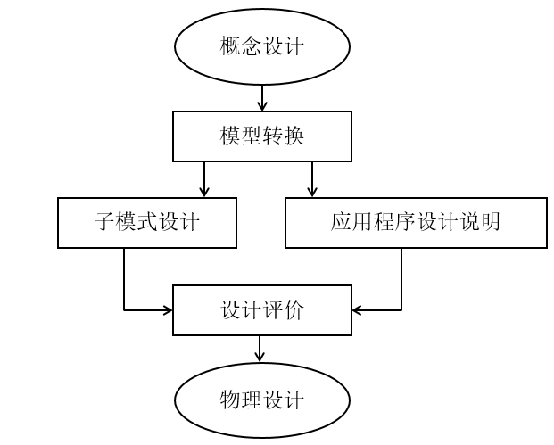
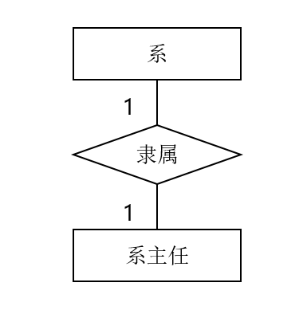
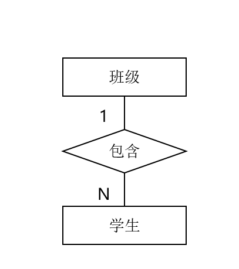
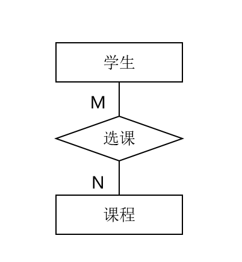

# 1.数据库设计概述

## 1.1 数据库生命周期

- 数据库的分析与设计阶段
  - 需求分析
  - 概念设计
  - 逻辑设计
  - 物理设计
- 数据库实现与操作阶段
  - 实现
  - 操作与监督
  - 修改和调整

## 1.2 数据库设计的目标

- 满足应用功能的需求
  - 增删改查
- 良好的数据库性能
  - 数据库的高效率存取和空间的节省共享性，完整性，一致性，安全保密性

## 1.3 数据库设计的内容

- 数据库结构设计（静态的）
  - 数据库概念结构设计
  - 逻辑结构设计
  - 物理结构设计
- 数据库行为设计（动态的）
  - 功能设计
  - 事务设计
  - 程序设计

## 1.4 数据库设计的方法

- 直观设计法
  - 最原始的数据库设计方法
- 规范设计法
  - 新奥尔良设计方法
    - 需求分离
    - 概念设计
    - 逻辑设计
    - 物理设计
  - 基于E-R模型的数据库设计方法
  - 基于第三范式的设计方法，是一类结构化设计方法
- 计算机辅助设计法
  - 辅助软件工程工具

## 1.5 数据库设计的过程

- 需求分析
- 结构设计
  - 概念结构设计
  - 逻辑结构设计
  - 物理结构设计
- 行为设计
  - 功能设计
  - 事务设计
  - 程序设计
- 数据库实施
  - 加载数据库设计
  - 调试运行应用程序
- 数据库运行与维护

# 2.数据库设计的基本概述

## 2.1 需求分析

数据库设计的起点

目标：是了解与分析用户的信息及应用处理要求，并将结果按一定格式整理而形成需求分析报告。

该分析报告是后续概念设计，逻辑设计，物理设计，数据库建立与维护的依据。

- 确定数据范围

  数据库的第一项工作

  - 有效地利用计算机设备及数据库系统的潜在能力
  - 提高数据库的应变能力
  - 避免应用过程中对数据库做太多或太大的修改
  - 延长数据库的生命周期

- 分析数据应用过程

  了解分析数据与数据处理间的关系

  应用过程分析的结果是数据库结构设计的重要依据，因为从中可以初步导出那些数据要存入数据库中，哪些数据可作为报告输出而不存入数据库中，同时也可看出对不同数据的不同数据的不同使用权限和共享范围。

  - 用到那些数据
  - 数据使用的顺序
  - 对数据作何处理的策略及结果

- 收集与分析数据

  数据收集与分析的任务是了解并分析数据的组成格式及操作特征，每个数据元素的语义及关系等，并将他们收集起来整理归档。

  - 静态结构：不施加应用操作于其上时数据的原始状况

    - 数据分类表（用于数据的总体描述）

      | 数据ID | 数据名 | 用途 | 主人 | 用户 | 来源 | 去向 | 存档时间 | 数据量 |
      | ------ | ------ | ---- | ---- | ---- | ---- | ---- | -------- | ------ |
      |        |        |      |      |      |      |      |          |        |

    - 数据元素表（指通常意义下的数据项或属性）

      | 数据ID | 数据元素ID | 元素名 | 意义 | 类型 | 长度 | 算法 | 备注 |
      | ------ | ---------- | ------ | ---- | ---- | ---- | ---- | ---- |
      |        |            |        |      |      |      |      |      |

  - 动态结构：将应用操作施加于数据之上后数据的状态

    - 任务分类表（一个任务指为完成某一特定处理功能的相对独立的操作序列）

      | 任务ID | 名称 | 功能 | 类型 | 主人 | 用户 | 执行日期 | 频率 | 操作过程 | 队列 |
      | ------ | ---- | ---- | ---- | ---- | ---- | -------- | ---- | -------- | ---- |
      |        |      |      |      |      |      |          |      |          |      |

    - 数据特征操作表（用以描述任务和数据之间的关系，它包括不同任务对数据执行不同操作的频率）

      | 任务ID | 数据ID | 建立 | 查询 | 插入 | 修改 | 删除 | 数据量 |
      | ------ | ------ | ---- | ---- | ---- | ---- | ---- | ------ |
      |        |        |      |      |      |      |      |        |

  - 数据约束：使用数据时的特殊要求

    - 数据的安全保密性
    - 数据的完整性
    - 响应时间
    - 数据恢复

- 编写需求分析报告

  - 数据库的应用功能目标
  - 标明不同用户视图范围
  - 应用处理过程需求说明，包括：数据流程图；任务分类表；数据操作特征表；操作过程说明书。
  - 数据字典，是数据库系统中存储三级结构定义的数据库，通常指的是数据库系统中各类数据详细描述的结合。功能是存储和检索各种数据描述，即元数据。包括数据分类表，数据元素表和各类原始资料。
  - 数据量
  - 数据约束

## 2.2 概念结构设计

- 实体分析法（自顶向下法）

  独立于任何软件于硬件。

  主要目标：最大限度满足应用需求。

- 属性综合法（自底向上法）

## 2.3 逻辑结构设计

将概念模型转换为等价的，并为特定DBMS所支持数据模型的结构。（ER-->关系）

在逻辑结构设计阶段，根据用户处理的要求，安全性的考虑，在基本表的基础上再建立必要的视图，形成数据的外模式。

- **模型转换**是指将概念模型等价地转换为特定DBMS支持的关系模型、网状模型、层次模型或面向对象模型表示。
- **子模式设计**的目标是抽取或导出模式的子集，以构造不同用户使用的局部数据逻辑结构。
- **编制应用程序设计说明**的目的是为可实际运行的应用程序提供依据与指导，并作为设计评价的基础。
- **设计评价任务**是分析并检验模式及子模式的正确合理性。

## 2.4 物理设计

具体任务主要是确定数据库在存储设备上的存储结构及存取方法，因DBMS的不同还可能包括建立索引和聚集，以及物理块大小，缓冲区个数和大小，数据压缩的选择等。

在物理结构设计阶段，根据关系数据库管理系统的特点和处理的需要，进行物理存储安排，建立索引，形成数据库的内模式。

## 2.5 数据库实施

- 加载数据
  - 收集，分类，整理，校验，输入等
- 应用程序设计
- 数据库试运行
  - 有利于工作人员掌握并熟悉系统；
  - 有利于正式运行时避免人为操作的不当等损害

## 2.6 数据库运行与维护

- 系统维护最困难的工作是数据库重组与重构

# 3.关系数据库设计方法

## 3.1 E-R图方法

- 一对一

  

- 一对多

  

- 多对多

  

## 3.2 局部信息结构设计

- 确定局部范围
  - 局部范围主要依据需求分析报告中标明的用户视图范围来确定
  - 往往与子模式范围相对应
-  选择实体
  - 数据分类表是选择实体的直接依据
  - 实体选择最大的困难是如何区别实体与属性
- 选择实体的关键字属性
- 确定实体间联系
  - 数据间的联系必须在概念设计时设定
- 确定实体的属性
  - 属性分类标识属性和说明属性

**注：**

- 联系可以有属性如果有一定要画出来
- 联系的属性是只有产生这个情况才会产生的属性
- 联系表的主属性的即是主键也是外键

## 3.3 逻辑结构设计的方法

### 3.3.1 E-R图向关系模型的转换

- 一个实体型转换为关系模式，实体的属性作为关系的属性，实体的码作为关系的码。
- 一个一对一联系可以转换为一个独立的关系模式，也可以与任一一端对应的关系模式合并。（外键，外码联系在一起）
- 一个一对多联系可以转换为一个独立的关系模式，也可以可以与N端对应的关系合并。（多的那边时外码）
- 一个多对多联系可以转换为一个关系模式。与该联系相连的各实体的码以及联系本身的属性均转换为关系的属性。
- 三个或以上实体间的一个多元联系可以转换为一个关系模式。
- 具有相同主码的关系模式可以合并。

### 3.3.2 数据模型的优化

​		数据库逻辑设计的结果，不是唯一的（关系既可以使用联系表，也可以使用外键。）

- 确定各属性间的函数依赖关系
- 对于各个关系模式之间的数据依赖进行极小化处理，消除冗余的联系。
- 判断每个关系模式的范式，根据实际需要确定最适合的范式。
- 按照需求分析阶段得到的处理要求，分析这些模式对于这样的应用环境是否合适，确定是否要对某些模式进行合并或分解。
- 对关系模式进行必要的分解，提高数据操作的效率和存储空间的利用率。

### 3.3.3 设计用户子模式

- 可以通过视图机制在设计用户视图时，重新定义某些属性的别名，使其更符合用户的习惯，以方便用户使用。
- 可以对不同级别的用户定义不同的视图，以保证系统的安全性
- 简化用户对系统的使用

## 3.5 物理设计方法

- 建立索引（逻辑连接）
  - 静态索引：初始创建的时候已经定型了，不会变化。
  - 动态索引：会随着数据的增删改而变化。
- 建立聚集（物理聚集）
  - 聚集是将相关数据集中存放的物理存储技术。
  - 数据聚集结构的一种有效方式时块结构方式
  - 数据聚集可在一个或多个关系上建立

