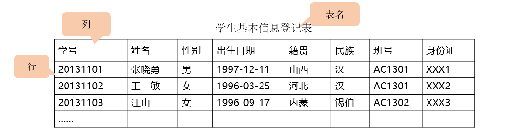
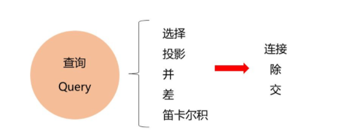
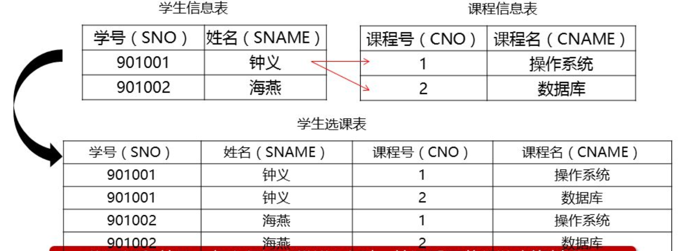
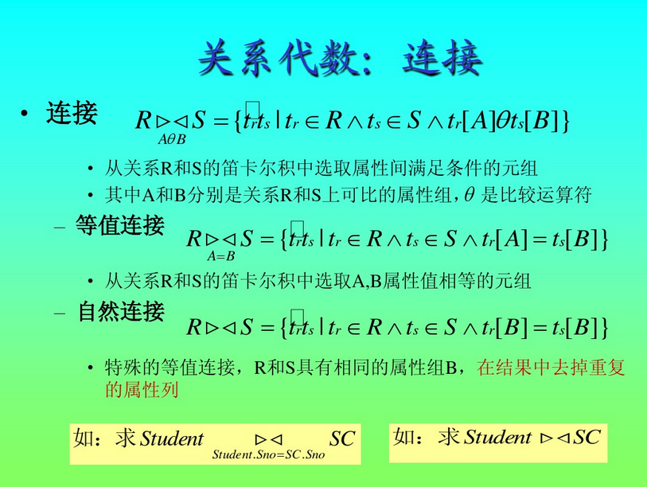
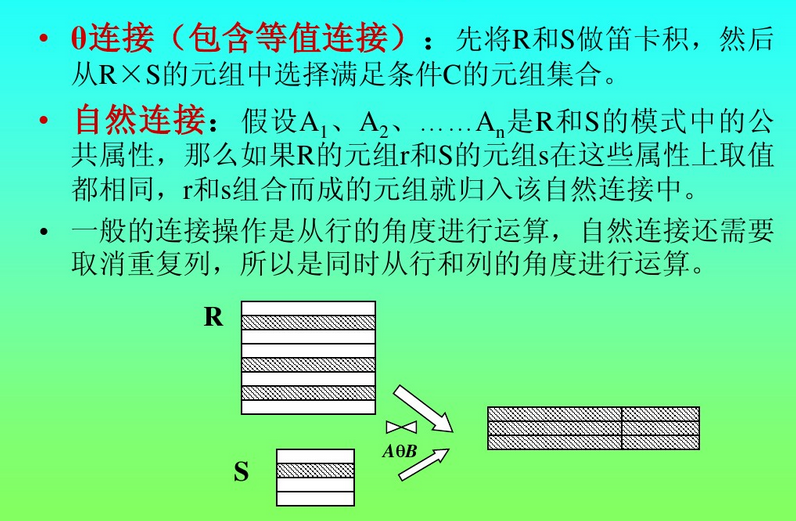
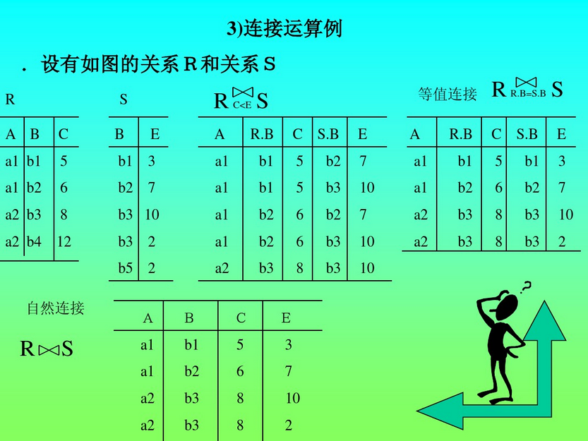
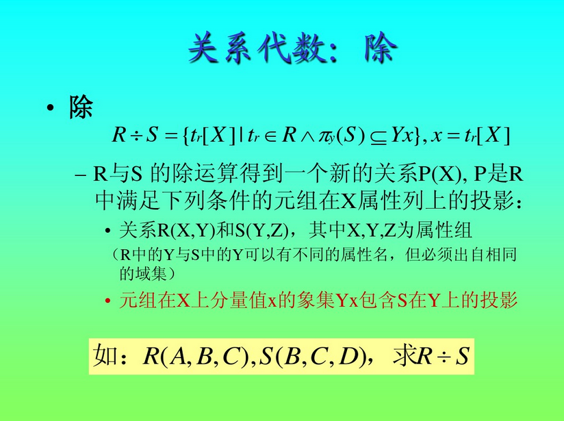
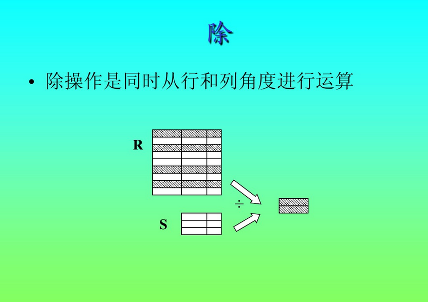
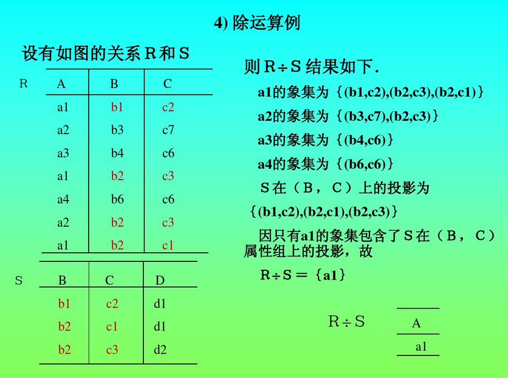

# 1关系数据库概述

## 1.1 关系数据的产生历史

- 1970年  IBM的E.F.CoddE.F.Codd 提出了关系模型，奠定了关系数据库的理论基础。
- 20世纪70年代末 关系方法理论研究和软甲那系统的研制取得的重大突破
- 1981年 出现了比较成熟的关系数据库管理技术，证实了关系数据库的优点：高级的非过程语言接口，较好的数据独立性。
- 20世纪80年代后  网状模型和层次模型与底层实现的结合紧密。关系模型具有坚实理论基础，成为主流数据模型。

## 1.2 关系数据模型的组成要素

- 关系数据结构
- 关系操作集合
- 关系完整性约束

# 2关系数据模型

## 2.1 数据库中的名词

- 表（table）

  也称为关系，是一个二维的数据结构，由表名，列，若干行数据组成。每个表有唯一的表名，表中每一行数据描述一条具体的记录值。

- 关系（Relation）

  一个关系逻辑上对应一张二维表，可以为每个关系取一个名称进行表示，他可称之为表名或者关系名。

  - 基本关系（基本表，基表）实际存在的。
  - 查询表（导出的虚表）真实存储的时候都是散列存储，为了方便我们查看，显示出来的。
  - 视图表（导出的虚表）真实存储的时候都是散列存储，为了方便我们查看，显示出来的。

- 列（Column）

  列也成为字段（Field）或者属性（Attribute），在一个表格中列名是不重复的，同一列数据类型是相同的。

  属性的个数称为元或度，

  列的值称为属性值，其取值范围称之为值域。

- 行（Row）

  也称为元组（Tuple）或记录，表中的数据按行存储。

  每一个行（元组）中一个属性值，称为分量。

- 码或键（key）

  属性（或属性组（两个及以上属性））的值都能用来唯一标识该关系的元组，则称这些属性（或属性组）为该关系的码或键）

- 超码或者超键（Super Key）

  在码中去除某个属性，它仍然是这个关系的码。

- 候选码或候选键（Candidate Key）

  在码中不能从中移去任何一个属性，否则他就不再是这个关系的码或者键。（一个属性一定是候选码）候选键或候选码是这个关系的最小的超码或超键。（这里面的最小可以理解为候选码是超码的一部分（超码不可以被移除的一个键可以被认为成侯选码））

- 主属性（Primary Attribut）或非主属性（Nonprimary Attribut）

  包含在任何一个候选码中的属性称为主属性或码属性。

  不包含在任何一个候选码中的属性称为非主属性。

- 主码或主键（Primary Key）

  在若干个候选码中指定一个唯一标识关系的元组（行）

  一个关系中只能有唯一一个主码

- 全码或全键（All Key）

  一个关系模式的所有属性集合是这个关系的主码或主键，这样的主码或主键称为全码或全键。

- 外码或外键（Foreign Key）

  某个属性（或属性组）不是这个关系的主码或候选码，而是另一个关系的主码。

- 参照关系（Referencing Relation）和被参照关系（Referenced Relation）

  参周关系也成为从关系，被参照关系也成为主关系，他们是指外码相关联的两个关系。

- 域（Domain）

  标识属性值的取值范围

## 2.2 关系数据结构

每个类都有相应的数据类型，它用于限制（或容许）该列中存储的数据。

## 2.3 关系模式（Relation schema）

关系实际上就是关系模式在某一时刻得状态或者内容，也就是说，关系模式是型，关系是它的值。

关系的描述称为关系模式/关系模式是对关系的描述。（型是对值得描述）

关系模式是静态得，稳定的，而关系是动态的，随时间不断变化的，因为关系操作在不断地更新着数据库中的数据。但在实际当中，常常把关系模式和关系统称为关系，读者可以从上下文中加以区别。（关于型和值可以参考第一章）

## 2.4 关系数据库（Relation Database）

所有关系得集合，构成一个关系数据库。

以关系模型作为数据库得逻辑模型，并采用关系作为数据组织方式得一类数据库，其数据库操作建立在关系代数得基础上。

关系数据库对关系的限定/要求

- 每一个属性都是不可分解的（不允许表中有表）；
- 每一个关系仅仅有一种关系模式（表头，型）；
- 每一个关系模式种的属性必须命名，属性名不同；
- 同一个关系中不允许出现候选码或候选键完全相同的元组；
- 在关系中元组的顺序（即行序）是无关紧要的，可以任意交换；
- 在关系中属性的顺序（即列序）是无关紧要的，可以任意交换。

## 2.5 基本的关系操作

查询的操作是最多的，因为进行其他三个操作需要先进行查询。

- 查询（Query）

  由于我们每次操作都会使用到很多基本的或者专门的小操作，所以我们叫集合操作方式，一次一集合。

  - 基本的关系操作

    - 选择
    - 投影
    - 并
    - 差
    - 笛卡尔积

  - 专门的关系操作

    由基本的多个（两个或者三个等）完成一个功能。

    - 连接
    - 除
    - 交

- 插入（Insert）

- 删除（Delete）

- 修改（Update）

## 2.6 关系数据语言的分类

### 2.6.1 关系代数语言

SQL是介于关系代数和关系演算之间的结构化查询语言。

- 任何一种操作都包含三大要素
  - 操作对象
  - 操作符
  - 操作结果
- 传统的集合运算
  - 并（UNION）R1UR2
    - 在两个关系必须有相同的属性个数，和属性（型）。
    - 实际操作即使把两个关系合并去重。
  - 差（DIFFERENCE） R3=R1-R2
    - 在两个关系必须有相同的属性个数，和属性（型）。
    - 实际操作时R1减去R2中和自己重复的元组，剩下与R2比较没有重复的元组。
  - 交（INTERSECTION）R3=R1nR2
    - 在两个关系必须有相同的属性个数，和属性（型）。
    - R3为R1和R2重复的部分
  - 笛卡尔积（CARTESIAN PRODUCT）R3=R1xR2
    - 做了笛卡尔积的关系列数为 R1列数+R2列数
    - 做了笛卡尔积的行数为 R1行数*R2行数
    - 笛卡尔结果会去掉重复列

- 专门的关系运算

  - 选择 （SELECT） σF(R)
    - 选出来行（如选择除性别等于男的行）
    - σ为固定语法
    - F为要选的属性值条件（性别=男、年龄>20）(也可以用属性所在列来表示，如 2<20 即为第二列大于小于二十的元组)
    - R为表名

  - 投影(PROJECTION) ΠA(R)
    - 选择出来列
    - Π为固定写法
    - A为属性名（年龄,班级）
    - R为表名
    - 去除重复的元组
  - 连接（JOIN）,也称θ 连接  
    - 等值连接
  - 自然连接
      - 自然连接是一种特殊的等值连接，他会把重复列消除掉。
    -  自然连接要求再两个关系中有公共属性，而等值连接不必。
  

  

  

  
- 除(DIVISION) R÷S
  

  
  
  
  

### 2.6.2 关系演算语言

- 元组关系演算
- 域关系演算

### 2.6.3 SQL（结构化查询语言）

后期会做详细讲解

**ps 共同特点**

具备完备的表达能力，是非过程化（非过程化指的是以结果为导向，只要给出你想要干什么，他自己知道怎么干，但是过程化是你需要把每一细节性的小步骤都告诉他，他才知道怎么干。）的集合操作语言，功能强，能够独立使用也可以嵌入高级语言中使用。cheng'huang

## 2.7 关系的完整性约束

​	数据库的数据完整性是指数据库的数据正确性，相容性，一致性。

**性质的体现**

- 正确性：在一个关系表中，学生的学号必须是唯一的。
- 正确性：性别必须是男女，不能是漂亮，美丽。
- 相容性、一致性：学生所选修的课程必须是已经开设的课程。

**完整性分类**

- 实体完整性约束（Entity Integrity Constraint）： 主码的组成不能为空，主属性不能是空值NULL（具有不变性（无论在那个行业都是这样））（候选键也不能为空，因为他是候选的主码）
- 参照完整性约束（Referential Integrity Constraint）：定义外码和主码之间的引用规则。外码可以为空，但是如果不为空一定是在被参照表（主表）的主码中存在，如不存在，则破坏了参照完整性的约束。（具有不变性（无论在那个行业都是这样））
- 用户定义完整性约束 （User-defined Integrity Constraint）：在某一个应用领域的用户根据需求自定义的完整性约束。

**操作体现**

- 执行插入操作的检验
  - 检验优先级
    - 检查实体完整性约束
    - 检查参照完整性约束
    - 检查用户定义完整性约束
- 执行删除操作
  - 一般只需要对被参照关系检查参照完整性约束（是否被引用）
- 执行更新操作
  - 更新操作其实就是先删除再插入，那么完整性约束也就时删除操作和插入操作的完整性约束。

# 3关系数据库的规范化理论

## 3.1 关系模式中可能存在的冗余和异常问题

- 数据冗余
  - 指同一数据被反复存储（如外码，如性别属性（男女不断重复））
- 更新异常
  - 数据冗余造成的，多个内容更改使操作错误（如两个表修改相同数据，一个改了，另外一个没改，就可能造成问题）
- 插入异常
  - 是指插入的数据违反了数据库对象的规定，而导致插入不正确的结果（如有一个表分别有三个列，而你插入的时候写了四个属性，数据就会插入不进去。）
- 删除异常
  - 指的是当你需要删除的时候，数据不能被删除而导致的删除错误。（如，当表中有外键限制的时候，删除数据就会出错）

## 3.2 函数依赖与关键字

- 函数依赖

  **定义**

  - 关系中属性间的对应关系
  - 设R为任一给定关系，如果对于R中属性X的每一个值，R中的属性Y只有唯一值与之对应，则称X函数决定Y或称Y函数依赖于X，记作X-->Y。其中X称为决定因素。（码-->其他属性）
  - 对于关系R中的属性X和Y，若X不能函数决定Y，记作X -/-> Y

  **分类**

  - 完全函数依赖
    - 设R为任一给定关系，X、Y为其属性集，若X --> Y,且对X中的任何真子集X'，都有 X' -/-> Y ,则称 Y 完全函数依赖于 X。 （候选码是一个例子，没有任何一部分是没有用的，去掉一个就不能作为码）
  - 部分函数依赖
    - 设R为任意给定关系，X,Y为其属性集，若X-->Y,且X中存在一个真子集 X' ，满足 X' -->  Y，则称Y部分函数依赖于X。（超码是一个例子）
  - 传递函数依赖
    - 设R为任一给定关系，X、Y、Z为其不同属性子集，若X  --> Y ,Y -/-> X, Y --> Z , 则有 X --> Z ,称为 Z 传递函数依赖于X。

- 关键字

  **定义**

  - 设R为任一给定关系，U为其所含的全部属性集合，X为U的子集，若有完全依赖函数 X --> U,则 X 为 R的一个候选关键字。（候选码）

## 3.3 范式与关系规范化的过程

​	一个低一级的关系模式通过模式分解（Schema Decompositin）可以转换为若干个高一级范式的关系模式的集合，这种过程就叫规范化（Normalization）

- 第一范式 1NF
  - 设R为任一给定关系，如果R中每个列与行的交点处的取值都是不可再分的基本元素，则R为第一范式。
- 第二范式 2NF
  - 设R为任一给定关系，若R为1NF，且其所有非主属性都完全函数依赖于候选关键字，则R为第二范式。（消除部分函数依赖）
- 第三范式 3NF
  - 设R为任一给定关系，若R为2NF，且其每一个非主属性都不传递函数依赖于候选关键字，则R为第三范式。（消除传递函数依赖）
- 第三范式的改进形式（BCNF）
  - 设R为任一给定关系，X、Y为其属性集，F为其函数依赖集，若R为3NF，且其F中所有函数依赖X-->Y(Y不属于X)中的X必包含候选关键字，则R为BCNF。（消除主属性之间得传递函数依赖）
  - 满足BCNF的条件有：所有非主属性对每一个候选键都是完全函数依赖；所有的主属性对每一个不包含它的候选键，也是完全函数依赖；没有任何属性完全函数依赖于非候选键的任何一组属性。

**解题思路**

- 1NF --> 2NF
  - 找到候选关键字，看其余的属性是否完全函数依赖候选关键字
    - 是        与候选关键字一同抄下来形成一个表格
    - 不是    抄下来，形成第二个表格，并且将候选关键字里能够唯一决定表格2的属性组抄在第一列
- 2NF --> 3NF
  - 找到表格中的传递函数依赖关系的三个属性组，设为 x,y,z
  - 将这三个属性组拆分成两个表格
  - 第一个表格为 x,y
  - 第二个表格为 y,z
- 3NF --> BCNF
  - 列出表格中所有的函数依赖关系
  - 每个关系拆出一个表格

