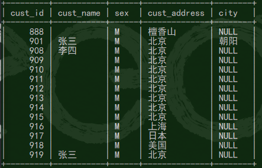

# 1 SQL概述

## 1.1 什么是 SQL

​		结构化查询语言（Structured Query Language）是专门用来与数据库通信的语言，它可以帮助用户操作关系数据库。

- SQL-89   1989年
- SQL2  1992年
- 颁布SQL3的年份是1999年。

## 1.2 SQL 的特点

​		SQL不是某个特定数据库供应商专有的语言。

​		SQL简单易学。

​		SQL强大、灵活、可以进行非常复杂和高级的数据库操作。

## 1.3 SQL 的组成

数据查询 数据定义  数据控制

- 数据定义语言：DDL 创建删除修改数据库，表，等数据库对象（除了具体的值，剩下的都是数据库对象）。
  - create  创建数据库或数据库对象
  - alter    对数据库或数据库对象进行修改
  - drop    删除数据库或数据库对象
- 数据操纵语言：DML 对数据进行增删改查
  - select  从表或视图中检索数据
  - insert  将数据插入到表或视图中
  - update  修改表或视图中的数据
  - delete  从表或视图中删除数据
- 数据控制语言：DCL 用户权限控制
  - grant  用于授予权限
  - revoke 用于收回权限

## 1.4 嵌入式和动态SQL规则

​		嵌入式和动态SQL规则规定了 SQL 语句在高级语言程序设计中使用的规范和方法，以便适应较为复杂的应用

## 1.5 SQL调用和会话规则

在SQL组成中，SQL会话规则可使程序连接到多个SQL服务器中的某一个，并与之交互。

- SQL调用

  以便提高SQL的灵活性，有效性，共享性以及使SQL具有更多的高级语言特征。

  - SQL例程
  - 调用规则

## 1.6 SQL 数据类型

| 名称         | 写法      |
| ------------ | --------- |
| 整型         | int       |
| 浮点型       | double    |
| 布尔型       | bool      |
| 日期型       | date      |
| 时间戳       | timestamp |
| 时间型       | time      |
| 定长字符类型 | char      |
| 可变长字符   | varchar   |

# 2 MySQL预备知识

## 2.1 MySQL使用基础

关系数据库管理系统（RDBMS）

优点：体积小，速度快，开放源代码，遵循GPL。

## 2.2 MySQL扩展语言要素

- 常量 也称字面值或标量值

  - 字符串常量：用单引号或双引号括起来的字符序列。
  - 数值常量：整数，浮点数。
  - 十六进制常量：梅对十六进制数字被转换为一个字符，其最前面有一个字母"X"或"x"
  - 时间日期常量：用单引号将日期时间的字符串括起来而构成的'2018-06-05'
  - 位字段值：格式为b'value'二进制值
  - 布尔值：TRUE 1 FALSE 0
  - NULL值：没有数据。

- 变量

  - 用户变量：用户变量前常添加一个符号@，用于将其与列名区分开。
  - 系统变量：大多数系统变量应用于其他SQL语句中时，必须在系统变量前添加两个@

- 运算符

  | 名称       | 含义                                                         |
  | ---------- | ------------------------------------------------------------ |
  | 算数运算符 | + - * / % （加减乘除求模（取余））                           |
  | 位运算符   | & (位与)、\| (位或)、^(位异或)、~(位取反)、>>(位右移)、<< (位左移) |
  | 比较运算符 | =(等于)、> (大于)、<(小于)、>=(大于等于)、<=(小于等于)、<>(不等于)、!=(不等于)、<=>(相等或都等于空) |
  | 逻辑运算符 | NOT 或 ! (逻辑非)、AND 或 &&(逻辑与)、OR 或 \|\| (逻辑或)、XOR(逻辑异或) |

- 表达式

  - 表达式是常量，变量，列名，复杂计算，运算符和函数的组合
    - 字符表达式
    - 数值型表达式
    - 日期表达式

- 函数

  | 函数名         | 函数表达式     |
  | -------------- | -------------- |
  | 数学函数       | ABS()......    |
  | 聚合函数       | COUNT()......  |
  | 字符串函数     | ASCLL()......  |
  | 日期和时间函数 | NOW()......    |
  | 加密函数       | ENCODE()...... |
  | 控制流程函数   | IF()......     |
  | 格式化函数     | FORMAT()...... |
  | 类型转换函数   | CAST()......   |
  | 系统信息函数   | USER()......   |


# 3 数据定义

## 3.1  数据库模式定义

```sql
-- （如果没有已经存在的hello库）创建名为hello的数据库
-- IF NOT EXISTS 如果要创建的数据库不存在则创建
create databse if not exists hello;

-- 查看数据库
show databases;

-- 跳转数据库
use hello;

-- 修改数据库的字符集和对照规则（可以在创建数据库的时候进行指定）
alter DATABASE hello default character set gb2312 default collate gb2312_chinese_ci; 

-- 如果数据库存在（if exists）删除数据库
drop database if exists hello;
```

## 3.2 表定义

​	**这里注意，在做题的时候一定要先 use  databasename; 要么创建表的时候需要 alter table mysql_test.customers;**

### 3.2.1 创建表

```sql
-- 创建表
-- 数据表，被定义位字段的集合
-- 按行和列的格式来存储的
-- 每一行代表一条记录
-- 每一列代表记录中一个字段的取值

create[temporary]table tbl_name(
字段名1 数据类型[列级完整性约束条件][默认值],
字段名2 数据类型[列级完整性约束条件][默认值],
...,
[表级完整性约束条件]
)[ENGINT=引擎类型];

-- temporary 临时表

mysql> create table customers(
    -> cust_id int not null auto_increment,
    -> cust_name char(50) not null,
    -> cust_sex char(1) not null default 0,
    -> cust_address char(50) null,
    -> cust_contact char(50) null,
    -> primary key(cust_id)
    -> );

-- null                           -- 空值
-- not null                       -- 不允许为空值
-- auto_increment                 -- 自增（数据必须为整形）（自增长在插入的时候就会自增涨）
-- char                           -- 字符串最大长度为50
-- default 0                      -- 默认值为0
-- primary key(cust_id)           -- 设置主键
-- index [idnex_name](a,b)        -- 创建索引
-- unique index [idnex_name](a,b) -- 创建唯一性索引
-- foreign key [index_name](a,b)  -- 创建该表的外键


-- 修改主键
alter table cust drop primary key;
mysql> alter table cust add primarykey(cust_name);
```

### 3.2.2 更新表

​		使用 alter table 语句，增加或删除列，创建或取消索引（主键等），更改原有列的数据类型，重新命名列或表，更改表的评注和表的引擎类型，为表重新创建触发器，存储过程，索引和外键等。

**add[column]子句**

```sql
-- add[column]

alter table mysql_test.customers
    -> add column cust_city char(10) not null default 'Wuhan' after cust_sex;
    
    
-- mysql.test.customers  -- mysql.test库下的customers表
-- add column            -- 添加列
-- after cust_sex        -- 在 cust_sex 列后添加
-- char(10)              -- 题目不给长度可以随便给


```

**change[column]子句**

修改表中列的名称或数据类型

```sql
-- 修改cust_sex 列名、是否为空、属性、默认值。
alter table mysql_test.customers change column cust_sex sex char(100) null default 'm';
 

```

**alter[column] 子句**

修改或删除表中指定列的默认值

```sql
-- 修改 sex 列的默认值为 w
alter table mysql_test.customers alter column sex set default 'w';


-- 删除 sex 列的默认值
alter table mysql_test.customers alter column sex set default null;
```

**modify[column]子句**

只修改指定列的数据类型，不会干涉它的列名。

```sql
-- first 修改 sex 列为第一位 
-- 数据类型修改位 char(200)
alter table mysql_test.customers modify column sex char(200) first;
```

**drop[column]子句**

删除列

```sql
-- 删除 cust_contact 列
alter table mysql_test.customers drop column cust_contact;
```

**rename [to] 子句**

修改表名字

```sql
-- 修改表的名字为  cust
alter table mysql_test.customers rename to mysql_test.cust;
-- 修改表的名字为 hello
rename table mysql_test.cust to mysql_test.hello;
```

### 3.2.3 删除表

```sql
 drop table if exists mysql_test.hello;
```

### 3.2.4 查看表

```sql
-- 查看表结构
show columns from mysql_test.cust;
describe cust;
desc cust;
```

## 3.3 索引定义

### 3.3.1 索引的优缺点

- 索引时提高数据文件访问效率的有效方法

- 索引存在的弊端
  - 索引是以文件的形式存储的，如果有大量的索引，索引文件可能比数据文件更快达到最大的文件尺寸。
  - 索引在提高查询速度的同时，会降低更新表的速度。

### 3.3.2 索引的分类

- 普通索引 INDEX 或 KEY  （普通的码）
- 唯一性索引 UNIQUE （候选码）（唯一性不代表个数，而是表示有唯一标识的作用，并且其他的行与之不能重复）
- 主键 PRIMARY KEY 

索引通常被创建成单列索引（单属性）和组合索引（多个属性）

### 3.3.3索引的创建

```sql
create [unique] index index_name on table_name(cust_id,cust_address) 

-- unique 为可选项 添加标识创建唯一性索引
-- cust_id,cust_address 为列名


-- 根据cust_address的前三个字符创建一个升序索引（ASC 为升序 DESC为降序）
 create index index_name1 on mysql_test.cust(cust_address(3) ASC);
 
-- 根据 cust_name  cust_id 创建一个组合索引 index_cust
create index index_cust on mysql_test.cust(cust_id,cust_name);


 create table seller
    -> (
    -> seller_id int not null auto_increment,
    -> seller_name char(10) not null,
    -> seller_sales int not null,
    -> seller_type char(10) default 'shi',
    -> seller_number int(11) null,
    -> primary key(seller_id,seller_type),
    -> index seller_sales_index(seller_sales)
    -> );
    
-- seller_id,seller_type 联合主键
-- index seller_sales_index(seller_sales) 创建普通索引
```

### 3.3.4 索引插入与删除

```sql
-- 索引的插入
 alter table mysql_test.cust add column index index_name(cust_id);
 
-- 索引的删除
alter table mysql_test.cust drop index index_name;
drop index index_name on mysql_test.cust;
```

## 3.3.5 索引的查看

```sql
show index from mysql_test.cust;
```

# 4 数据更新

## 4.1 插入数据

- insert ...values 语句

  使用 insert ...value 语句插入单行或多行元组数据

  ```sql
  insert[into] tbl_name [(col_name...)] {values|value}(expr|default)
  
  
  -- 按照表结构插入一行数据
  insert into mysql_test.cust values(901,'张三','M','北京','朝阳');
  insert into mysql_test.cust values(0,'张三','M','北京',null); -- 这里面用 0 和null 占位。
  -- 给定属性进行插入
  insert into mysql_test.cust(cust_id,cust_address) values(909,'北京')
  -- 主键自增的体现（插入数据不给定主键，会发现主键按照其上元组主键进行自增）
  insert into mysql_test.cust(cust_address) values('北京');
  -- 插入多行数据
  insert into mysql_test.cust(cust_address) values('北京'),('上海'),('日本'),('美国');
  ```

  如下图，注意区分 null 和 空。

  

- insert ...set 语句

  ```sql
  insert into tbl_name set col_name = {expr | default}...
  
  -- 指定属性进行设置
  insert into mysql_test.cust set cust_name='宫博生',sex=default,city='吉林';
  ```

- insert ...select语句

  ```sql
  -- 将 cust表的 cust_name 字段的值插入到 seller 表的 seller_name
  insert into mysql_test.seller(seller_name) select cust_name from mysql_test.cust;
  
  -- 当为*时代表复制所有，需要注意 字段数，和字段的类型（数据类型）一定是完全一致的。常用于备份，这里不做演示。
  ```


## 4.2 删除数据

使用 delete 语句删除一行或多行数据

```sql
delete from table_name
	[where where_condition] -- 条件
	[order by ...]          -- 暂不了解
	[limit row_count]       -- 暂不了解
	
	
-- 删除 cust_name 为空的行
delete from mysql_test.cust where cust_name='';
```

## 4.3 更新数据

使用update语句修改更新一个表中的数据

```sql
update table_name 
set col_name1 = {expr1 | default}{,col_name2 = {expr2 | default}}    
[where where_condition]  -- 条件
[order by ...]          -- 暂不了解
[limit row_count]       -- 暂不了解

-- 将 cust_name 为 张三的 cust_address属性值修改为 武汉
 update mysql_test.cust set cust_address='武汉' where cust_name='张三';
```

# 5 数据查询

## 5.1 select 语句语法

```sql
select
	[all|distinct|distinctrow]       -- 输出的字段
	select_expr [,select_expr ...]
	from table_name                  -- 数据的来源
	where where_condition            -- 数据的选择条件
	[group by {col_name|expr|position}[ASC|DESC]， ...[with rollup]]      -- 对检索到的记录进行分组
	[having where_condition]         -- 指定组的选择条件
	[order by {col_name}|expr|position] {ASC|DESC},...]   --对查询的结果进行排序
	[limit {[offset,]row_count|row_count offset offset}]  --限制行数
	
```

| 子句     | 说明               | 是否必须使用                                 |
| -------- | ------------------ | -------------------------------------------- |
| select   | 要返回的列或表达式 | 是                                           |
| from     | 从中检索数据的表   | 尽在从表选择数据时使用（还可以查看用户变量） |
| where    | 行级过滤           | 否                                           |
| group by | 分组说明           | 仅在按组计算聚合时使用                       |
| having   | 组级过滤           | 否                                           |
| order by | 数据排序顺序       | 否                                           |
| limit    | 要检索的行数       | 否                                           |

## 5.2 选择指定的列

```sql
-- 查询 cust 表中 cust_name cust_address sex 信息
select cust_name,sex,cust_address from mysql_test.cust ;
```

## 5.3 选择全部信息

```sql
-- 查询所有信息
select * from mysql_test.cust;
```

## 5.4 定义并使用别名

```sql
-- 将 cust_address 别名为 dizhi 进行显示
select cust_name,cust_address as dizhi from mysql_test.cust;
```

## 5.5 替换查询结果集中的数据

```sql
mysql> select cust_name,case
    -> when sex='M'
    -> then '男'
    -> else '女'
    -> end as '性别' from mysql_test.cust;
    
-- 如果 sex 等于 M 则 为男 不等于 则 为 女
```

## 5.6 计算列值

```sql
 select cust_name,sex,cust_id+100 from mysql_test.cust;
 
 -- 将 id 的结果 + 100
```

## 5.7 聚合函数与 group by

**count 与 group by  会联用**

聚合函数通常是数据库系统中一类系统内置函数

```sql
group by {col_name | expr | postition} {asc | desc},...[with rollup]


-- asc 升序（默认）
-- desc 降序
-- whithroolup  可选项，指定在结果集中不仅包含由group by 子句分组后的数据行，还包括各分组的汇总行，以及所有分组的整体汇总行，可以得到每个分组以及每个分组汇总级别的值。（其实就是总人数）

select sex,cust_address,count(*) as '人数' from mysql_test.cust group by cust_address,sex;

-- 以上为固定写法，有个小技巧就是group by 后面 和 select 后面要是一致的。(实际使用根据结果而定，但是在考试中和 mysql 5.5 版本中这是硬性要求的。)
-- 以上结果为 
+------+--------------+--------+
| sex  | cust_address | 人数   |
+------+--------------+--------+
| w    | 1            |      1 |
| M    | 1            |      1 |
| M    | 北京         |      1 |
| w    | 武汉         |      2 |
+------+--------------+--------+
-- 查询的是  sex 为 w cust_address 的有一人...
-- 其余自行理解
-- 加了 with rollup 结果如下
+------+--------------+--------+
| sex  | cust_address | 人数   |
+------+--------------+--------+
| M    | 1            |      1 |
| w    | 1            |      1 |
| NULL | 1            |      2 |
| M    | 北京         |      1 |
| NULL | 北京         |      1 |
| w    | 武汉         |      2 |
| NULL | 武汉         |      2 |
| NULL | NULL         |      5 |
+------+--------------+--------+

-- null 武汉代表 武汉的为2 人
-- 那你一定好奇，为啥 没有 w null 呢 经过测试发现，这个和 group by 后面写的顺序有关系，可以理解为 写在前面的为主统计属性。


===============================================
-- 查询各个出版署图书的最高价格，最低价格和平均价格
select 出版社,max(单价),min(单价),avg(单价) from 图书 group by 出版社;

===============================================


	这块简单来记就是按照给定属性进行分组，给定属性一致为一组，当给定属性只有一个的时候就相当于在属性名去重之后就是各个的组，当给定属性为多个的时候，则要保证多个属性组成的集合不重复。
```

## 5.8 from 子句与多表连接查询

交叉连接，又称笛卡尔积

```sql
 -- 交叉连接，笛卡尔积
 select * from mysql_test.cust cross join mysql_test.seller
 select num1 from tb1 cross join tb2;
 
 -- 当参加笛卡尔积的表中的属性重名时需要指定要查的属性所属的表
 select mysql_test.tb1.hello from mysql_test.tb1 cross join mysql_test.tb2;
 
 -- 简化版本
 select * from mysql_test.cust,mysql_test.seller;
 
 -- 当某些条件成立时
  select hello,hello2 from tb1 cross join tb2 on num1=1 and num2 = 7;
```

## 5.9 内连接

关于内连接的使用，可以将一个表与它本身进行连接，这种连接方式称为自连接。

```sql
 select * from tb1 inner join tb2;
 select * from tb1 join tb2;
 
 -- 当 num1 = 1 and num2 =7 时 打印 hello 和 hello 2
  select hello,hello2 from tb1 inner join tb2 on num1=1 and num2 = 7;
 -- (如外键和主键的对应需要用到)
```

## 5.10 外连接

- 左外连接：在 from 子句中使用关键字 left outer join 或 left join。即把左表作为基表对应右表

- 左(外)连接，左表(a_table)的记录将会全部表示出来，而右表(b_table)只会显示符合搜索条件的记录。右表记录不足的地方均为NULL。

- 上一点不要想的那么复杂 全部显示出来表示原表全部显示出来。

  ```sql
  select * from tb1 left outer join tb2;
  
  select hello,hello2 from tb1 left join tb2 on num1=1 and num2=7 ;
  ```

  

- 右外连接：在 from 子句中使用关键字 right outer join 或 right join 。即把右表作为基表对应左表。

-  与左(外)连接相反，右(外)连接，左表(a_table)只会显示符合搜索条件的记录，而右表(b_table)的记录将会全部表示出来。左表记录不足的地方均为NULL。 

  ```sql
  select * from tb1 right outer join tb2;
  select hello,hello2 from tb1 right join tb2 on num1=1 and num2=7 ;
  ```

## 5.11 where 子句与条件查询

| 比较运算符 | 说明                   |
| ---------- | ---------------------- |
| =          | 等于                   |
| <>         | 不等于                 |
| !=         | 不等于                 |
| <          | 小于                   |
| <=         | 小于等于               |
| >          | 大于                   |
| >=         | 大于等于               |
| <=>        | 等于  不会返回 unknown |

<=> 当等号两边为空的时候也不会返回unknown，其余的关于等于的判断当等号两边为空的时候会返回 unknown

## 5.12 判断范围

当查询的过滤条件被限定在值得某个范围时，可以使用关键字 between.

```sql
-- 查询 cust_id 在 901 在 920 之间得数据
 select * from mysql_test.cust where cust_id between 901 and 920;
 
```

使用关键字“in” 可以指定一个值得枚举表，该表会列出所有可能得值

```sql
-- 查询 cust_id in（901，902） 之间得数据。（感觉就像列表，在列表中则返回）
select * from mysql_test.cust where cust_id in (901,904);
```

## 5.13 判定空值

```sql
-- 查询 cust表中 city 属性值为空的值
select * from mysql_test.cust where city is null;
-- 查询 cust表中 city 属性值不为空的值
select * from mysql_test.cust where city is not null;
```

## 5.14 where 子句与条件查询

- 表子查询
  - 返回结果是个表
- 行子查询
  - 返回结果一行还有多行
- 列子查询
  - 返回结果是个列
- 标量子查询
  - 返回结果是个分量

子查询结合关键字 in 使用子查询，主要是用于判断一个给定值是否存在于查询结果集中

```sql
select cust_name,cust_id from mysql_test.cust where cust_name in (select cust_name from mysql_test.cust where cust_id > 919);
-- 注意这里再实际应用中是两个表（而且这里 cust_name in 应该切换为 主键in 要么结果在 cust_name 不唯一的时候会出错）（这里的cust_name 实际使用中一般是 外键）
```

子查询结合比较运算符使用的子查询

all  some any （选择 ）


子查询结合关键字 exists 使用子查询，这里的子查询的结果集不为空，则返回 true ，否则返回 false 。

```sql
select cust_name from mysql_test.cust where exists(select * from mysql_test.cust where cust_id > 100);

-- 也就是说当子查询结果成立的时候 cust_name 才会被查询，要么会返回空的集和，从这里我们可以看出，where其实也是判断的布尔值，比如cust_id属性值大于 100 则为 true ，才会向下查询 ，如果不成立 为 false  则会跳过本条记录继续向下查询，以此反复，直到最后一条记录
```

## 5.15 having

```sql
-- having 主要用来过滤分组

select cust_id,cust_address,count(*) as '人数' from  mysql_test.cust group by cust_address having count(*) < 3 ;

-- 要求在返回结果集中，列出相同客户地址中满足客户人数少于 3  的所有客户姓名及对应地址

-- 注意！！ 在考试中要如下写，因为 mysql5.5版本要求 group by 一定要和 select 后面给出的属性一致
select cust_id,cust_address,count(*) as '人数' from  mysql_test.cust group by cust_id,cust_address having count(*) < 3 ;
```


## 5.16 having 子句和 where 子句的区别

| having               | where                |
| -------------------- | -------------------- |
| 过滤分组             | 可以过滤数据行       |
| 可以包含聚合函数     | 不可以包含聚合函数   |
| 在数据分组后进行过滤 | 在数据分组前进行过滤 |


## 5.17 order by  （排序）

```sql
-- 依据按照客户姓名和地址的降序方式输出客户的姓名和性别
select sex,cust_name from mysql_test.cust order by cust_name desc ,cust_address desc ;

-- 注意 order by 后面的每个属性后面都需要添加 desc 不添加的话就证明前面的就是默认升序了。

-- asc 升序
-- desc  降序
```

## 5.18 limit

```sql
-- 查找第五位客户开始的三位客户的id号和姓名（包括第五位）
select cust_id,cust_name from mysql_test.cust limit 4,3;
-- 为什么是 limit 4，3 呢  ，因为从 下标从 0 开始


select cust_id，cust_name from mysql_test.cust order by cust_id limit 3 offset 0;
-- 先排序再 截取，注意这里是另外一种写法  limit 3 offset 0 ,offset 0 代表初值即下标， limit 3 代表三位。
```


## 注：

（考试使用在涉及到多表联查不要使用交叉连接，笛卡尔积等方法进行解题，要使用where子句）

```sql
 select num1,num2 from tb1 cross join tb2 on num2 = (select max(num2) from tb2) ;
 
 -- 两个表做交叉连接，条件为 打印出 当num2属性值为最大时 num1列和num2 列
```


# 6 视图

## 6.1 什么是视图

视图是数据库中的一个对象，它是数据库管理系统提供给用户的以多种角度观察数据库中数据的一种重要的机制。

视图不是数据库中真实的表，而是一张虚拟表，其自身并不存储数据。

## 6.2 使用视图的优点

- 集中分散的数据
- 简化查询语句
- 重用SQL语句
- 保护数据的安全
- 共享所需的数据
- 更改数据的格式
- 简化复杂的表连接

## 6.3 创建视图

使用create view 创建视图

```sql
 create or replace view mysql_test.cust_view as select * from mysql_test.cust where sex = 'm' with check option;
 
 -- create or replace  创建或替换类似于 if not exist 
 -- whth check option 表示以后对视图的修改仍然遵循 select 的条件即 sex = 'm'  而且这里如果你执行 select * from mysql_test.cust_view  他会重用你在创建视图的时候 执行 select 语句 ，这里就体现了 视图 重用sql 语句的特性
 
```

## 6.4 删除视图

```sql
drop view if exists mysql_test.cust;
```

## 6.5 修改视图定义

```sql
alter view cust_view as select * from cust where sex ='w' with check option;
```

## 6.6 查看视图定义

```sql
show create view cust_view;
-- 查看视图的定义 结构
```

## 6.7 更新视图数据

**修改视图基本表数据会发生改变**

**插入**

```sql
insert into mysql_test.cust_view values(909,'周明','w','武汉市','萧山区');
```

**更新**

```sql
update cust_view set city='北京' where cust_name='辛潇烨';
```

**删除**

```sql
 delete from mysql_test.cust_view where cust_name = '张三';
```

**查询**

```sql
 select cust_name,cust_address from cust_view where cust_id = 1;
```

