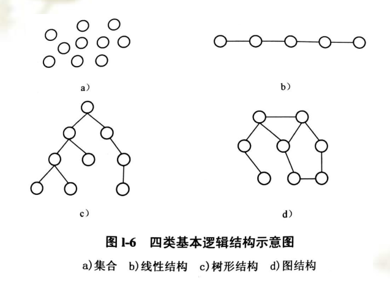
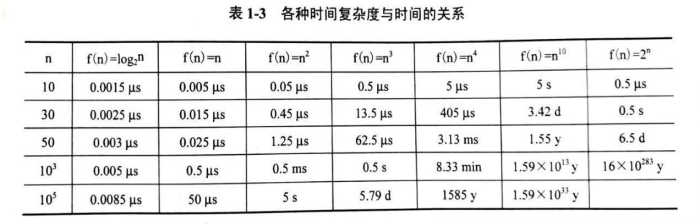

# 1.1 引言

数据结构（Data structure）是指一组相互存在一种或多种特定关系的数据的组织方式和它们在计算机内的存储方式，以及定义在该组数据上的一组操作。

**数据结构主要研究：**

- 数据（计算机加工对象）的逻辑结构。
- 实现各种基本操作的算法。

# 1.2 基本概念和术语

## 1.2.1 数据、数据元素和数据项

**数据：**  所有被计算机存储、处理的对象。

**数据元素：**  数据的基本单位，是运算的基本单位。常常又简称为元素。

**数据项：**  数据元素常常还分为若干个数据项，数据的不可分割的最小标识单位。又称为字段，域。

## 1.2.2 数据的逻辑结构

**逻辑结构：** 指数据元素之间的结构关系。与数据元素本身的形式、内容、相对位置、个数无关。

**物理结构：**  也称为存储结构，指数据结构在机内的标识、数据的逻辑结构在计算机中的实现。

**数据的四类逻辑：**

- 图结构：任何两个节点都可以相邻接。（最复杂）
- 集合：任何两个节点之间都没有邻接关系，组织形式松散。（hash）
- 线性结构：节点按逻辑关系一次排列形成一条“锁链”
- 树形结构：具有分支、层次特性，上层的节点可以和下层多个结点相邻接，但下层结点只能和上层的一个结点相邻接。

逻辑结构与数据元素本身形式，内容无关，逻辑结构与数据元素的相对位置无关，逻辑结构与所含结点个数无关。

## 1.2.3 数据的存储结构

数据结构的存储包含数据元素的存储及其逻辑关系的存储。存储结构可分为：顺序存储结构，链式存储结构，索引存储方式和散列存储方式等。

顺组存储结构与链式存储结构时最基本，应该重点长我。如，如何操作，各有什么特点，什么时候选择顺序结构，什么时候选择链式结构等。

- 顺序存储方式
  - 定义： 借助数据元素的相对存储位置来表示数据的逻辑结构；线性表的顺序存储方法：将表中的结点一次存放在计算机内存中一组连续的存储单元中。
  - 特点：
    - 预先分配好长度，需要预估存储数据需要的存储量。
    - 插入和删除需要移动其他元素。
    - 存取快捷，是随机存取结构。
- 链式存储方式
  - 定义： 借助数据元素地址的指针表示数据的逻辑结构。
  - 特点：
    - 动态分配，不需要预先确定内存分配；
    - 插入和删除不需要移动其他元素；
    - 非随机存取结构。
- 索引存储方式
  - 定义： 借助索引表中的索引指示各存储节点的存储位置。
- 散列存储方式
  - 定义： 用散列函数指示各节点的存储位置。

## 1.2.4 运算

运算指在某种逻辑结构上施加的操作，即对逻辑结构的加工。

线性表，栈和队列中元素具有相同的逻辑结构。（即线性机构），但有不同的运算集，他们是不同的数据结构。

# 1.3 算法及描述

算法规定了求解给定类型问题所需的所有 处理步骤 及执行刚需，使给定类型问题能在有限时间内被机械求解。

算法必须使用某种语言描述：

- 程序
- 介于自然语言和程序设计语言的伪代码
- 非形式算法（自然语言）
- 框图（N-S图）

# 1.4 算法分析

评价算法好坏因素包括一下几个方面：

- 正确性：  能正确地实现预定的功能，满足具体问题的需要。
- 易读性： 易于阅读，理解和交流，便于调试，修改和扩充。
- 健壮性： 既是输入非法数据，算法也能适当地做出反应或进行处理，不会产生预料不到的运行结构。
- 时空性： 一个算法的时空性是指该算法的时间性能（或时间效率）和空间性能（或空间效率），前者是算法包含的计算量，后者是算法需要的存储量。

## 1.4.1 时间复杂度

算法运行时需要的总步数，通常是问题规模的函数。以算法在所有输入下的计算量的最大值作为算法的计算量，成为算法的醉话情况时间复杂度。以算法在所有输入下的计算量的加权平均值作为算法的计算量，称为算法的平均情况时间复杂度。最坏情况时间复杂度和平均情况时间复杂度通称为时间复杂度。

常见的时间复杂度按数量级递增排列依次为：

常数O(1) 对数阶O(log2n) 线性阶O(n) 线性对数O(nlog2n) 平方阶(n2) 多项式阶0(nc) 指数阶 O(cn)

## 1.4.2 空间复杂度

算法执行时所占用的存储空间，通常是问题规模的函数。

空间复杂度是对一个算法在运行过程中临时占用存储空间大小的量度。

一个算法在执行期间所需要的存储空间量包括一下部分：

- 程序代码所占用的空间
- 输入数据所占用的空间
- 辅助标量所占用的空间

估算算法空间复杂度时，一半只分析辅助变量所占用的空间。

