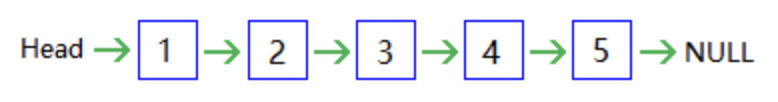

# 一、 线性表的基本概念

线表是由 n (n >= 0) 个数据元素（结点） a1, a2, a3, a4, a5 组成的有限序列。数据元素的个数 n 定义为表的长度。n = 0 时称为空表记作 O/

非空的线性表 (n > 0) 记作： L = (a1, a2, a3, ..., an)  a1 称为起始节点， an 称为终端节点。 对任意一对相邻节点 ai 和 ai+1 (1<=i<n) 有 ai 称为 ai+1 的直接前驱， ai+1 称为 ai 的直接后继。

数据元素 ai (1<= i <= n) 只是个抽象符号，其具体含义在不同情况下可以不同。

线性表中只有一个起始节点，一个终端结点，起始节点没有直接前驱，终端结点没有直接后继。除此二结点外，每个结点都有且只有一个直接前驱和一个直接后继。

## （1） 线性表的基本运算

- 初始化 `Initiate(L)`    建立一个空表 L=() ， L 不含数据元素
- 求表长度  `Length(L)`  返回线性表 L 的长度
- 取表元 `Get(L,i)`  返回线性表第 i 个元素， 当 i 不满足 1<=i<=Lengh(L) 时， 返回一个特殊值。
- 定位 `Locate(L,x)` 查找线性表中数据元素值等于 x 的结点序号，若有多个数据元素与 x 相等 返回序号最小值， 若无该结点， 则运算结果为 0
- 插入 `Insert(L,x,i)` 在线性表 L 中的第 i 个数据元素之前插入一个值为 x 的新数据元素。
- 删除 `Delete(L,i)` 删除线性表 L 的第 i 个数据元素 ai。


# 二、 线性表的顺序存储

顺序存储线性表时，需要存储 

- 线性表大小
- 线性表长度
- 所存放数据的类型

```c
Const int Maxsize = 100;
typeof struct
{
  int data[Maxsize];
  int length;
}Seqlist;

Seqlist L;
```

顺序表时用一位数组实现的线性表，数组下标可以堪称是元素的相对地址。

逻辑上相邻的元素，存储在物理位置也相邻的单元中。

**顺序存储结构的特点：**

- 线性标的逻辑结构与存储结构一致
- 可以对数据元素实现随机读取

**存储地址：**

设线性表中所有结点的类型相同，则每个结点所用存储空间大小亦相同。

假设表中每个结点占用 L 个存储单元，其中第一个单元存储地址则是该结点的存储地址。

并设表中开始结点 a1 的存储地址是 d ，那么结点 ai 的存储地址 LOC(ai)

```
LOC(ai) = d + (i-1)*L
```


## （1）插入

线性表的插入运算是指在表第 i 个位置上，插入一个新结点 x

- 当表空间已满，不可在做插入操作。
- 当插入位置为非法位置，不可做正常插入操作。

**插入过程：**

将表中位置为 n, n - 1, ... i 上的结点，依次后移到鹅日志 n + 1， n ... i+ 1 上空出 i 个位置。在该位置插入新结点 x 。

- 仅当插入位置为 i = n + 1 时，才无需移动结点，直接将 x 插入表的末尾。
- 该顺序表长度加一

**插入算法分析：**

```c
int insertArray(int L[maxlength], int len, int i)
{
    int x;
    if (len == maxlength) exit(1);
    if (i < 1 || i > (len + 1)) exit(2);
    for (x = len; i <= x; x--)
    {
        L[x] = L[x-1];
    }
    L[i-1] = 0;
    len++;
    return len;
}
```

假设线性标中含有 n 个数据元素， 在进行插入操作时， 有 n + 1 个位置可插入，在每个位置插入数据的概率是 ： 1/(n+1) 在 i 位置插入时，需要移动 n - i + 1个数据（i不为下标） 假定在 n + 1 个位置上插入元素的可能性均等， 则平均移动元素的个数为 n/2 平均时间复杂度 O(n) 

## （2） 删除

线性表的删除运算是指将表的第 i 个结点删去，使长度为 n 的线性表变为长度为 n - 1 的线性表

- 当要删除元素的位置 i 不在表长范围内 为非法位置， 不能做正常的删除操作。

**删除过程**

若 i = n  则只要删除终端结点， 无需移动结点； 若  1 <= i <= n-1 则必须将表中位置 i + 1， i + 2 ... n 的结点，依次向前移到 位置 i + 1，... n- 1上，以填补删除操作造成的空缺。 该表长度减一。

**删除算法分析**

```c
int deleteArray(int L[maxlength], int len, int i)
{
    int x;
    if (i < 1 || i > len) exit(3);
    for (x=i; x <= len; x++ )
    {
        L[x-1] = L[x];
    } 
    len--;
    return len;
}
```

假设线性表中含有 n 个数据元素， 在进行删除操作时，有 n 位置可删除 在每个位置删除数据的概率是 1/n 在 i 位置删除是， 需要移动 n - i 个数据，假定在 n 个位置上删除元素的可能性均等， 则平均移动元素的个数为 （n-1）/2 平均时间复杂度 O(n)

## （3） 定位

从第一个元素 a1 起以此和 x 比较，直到找到一个与 x 相等的数据元素，则返回他在顺序表中的存储下标或序号；或者查遍整个表都没有找到与 x 相等的元素，返回 0。(n+1/2)

```c
int indexArray(int L[maxlength], int len, int n)
{
    int x;
    for (x=0; x< len; x++)
    {
        if ( L[x] == n)
        {
            return x;
        }
    }
    return 0;
}
```

## （4） 顺序表的优缺点

**优点**

- 无需为表示结点间的逻辑关系而增加额外存储空间
- 可以方便地随机存取表中任意结点

**缺点** 

- 插入和删除运算不方便，必须移动大量的结点
- 顺序表要求占用连续的空间，存储分配职能预先进行，因此当表长变化较大时，难以确定合适的存储规模。

# 三、 线性表的链接存储

链接方式存储的线性表简称为链表

链表的具体存储表示为：

- 用一组任意的存储单元来存放。
- 链表中结点的逻辑次序和物理次序不一定相同。还必须存储指示其候机结点的地址信息。

data 域 -- 存放结点值的数据域

next 域 -- 存放结点的直接后继的地址（位置） 的指针域（链域）

所有结点通过指针链接而组成单链表， NULL 称为空指针 Head 称为头指针，存放链表中第一个结点地址。


由于我们通常只注重结点间的逻辑顺序，不关心每个结点的实际位置，可以用箭头来表示链域中的指针，单链表就可以表示为下图形式。



单链表中第一个结点内不存数据，称为头结点利用头结点指针存放该结点地址。 head 是链表的头指针，所以是指针类型变量， head 内存放的是头结点的地址。 增加头结点是为了方便运算的实现。 第一个元素结是 head - > next


```c
typedef struct node
{
    int data;
    struct node *next;
} Node, *LinkList;
```

## （1） malloc 

动态分配内存函数 malloc 

```c
int *p ; 
p = malloc (sizeof (int));
```


## （2） 初始化

建立一个空链表 L InitiateLinkList (L) 一个空的单链表是一个头指针和一个头结点构成的， 假设已定义指针变量 t， 令 t 指向一个头结点并令头结点的 next 为 NULL， 注意： 产生头结点时由 malloc 函数产生一个新结点。

```c
LinkList InitiateLinkList()
{
    LinkList head;
    head = malloc(sizeof(Node));
    head->next = NULL;
    return head; 
}
```

在算法中， 变量 head 是链表的头指针， 它指向新创建的结点，即头结点。一个空单链表仅有一个头结点，它的指针域为 NULL。


## （3） 求表长

在单链表存储结构中，线性表的长度等于单链表所含结点的个数（不包含头结点）

1. 令计数器 count 为 0
2. 令 p 指向头结点
3. 当下一个结点不空时 count + 1 p 指向下一个结点
4. j 的值几位链表中结点个数， 即表长度。

```c
int LengthLinkList(LinkList head)
{
    int count = 0;
    LinkList p = head;
    while(p->next != NULL)
    {
        count++;
        p = p->next;
    }
    return count;
}
```

## （4） 读表元素

1. 令计数器 count 为 0
2. 令 p 指向头结点
3. 当下一个结点不为空时， 并且 count < i 时 count + 1 p 指向下一个结点
4. 如果 j 等于 i， 则 p 所指向结点为要找的 第 i 结点， 否则，链表中无第 i 结点。

```c
LinkList GetLinkList(LinkList head, int i)
{
    int count = 0;
    LinkList p = head;
    while ((count !=  i) && p->next != NULL) 
    {
        p = p->next;
        count++;
    }
    if (count == i)
    {
        return p;
    }
    else
    {
        return NULL;
    }
}
```

## （5） 定位

线性表的定位运算，就是对给定表元素的值，找出这个元素的位置。在单链表的实现中，则是给定一个结点的值，找出这个结点是单链表的第几个结点。定位运算又称作按值查找。

```c
int LocateLinkList(LinkList head, int n)
{
    int count = 0;
    LinkList p = head->next;
    while ((p->next != NULL) && (p->data != n))
    {
        p = p->next;
        count++;
    }

    if (p->data == n)
    {
        return count + 1; // 返回第几个而非下标
    }
    else
    {
        return 0;
    }
}
```

## （6） 插入

```c
int InsertLinkList(LinkList head, int i, int n)
{
    LinkList GetLinkList(LinkList head, int i);
    LinkList p, new;
    p = GetLinkList(head,i-1); // 找到要插入的位置之前的结点

    if (p != NULL)
    {
        new = malloc(sizeof(Node));
        new->data = n;
        new->next = p->next;
        p->next = new;
        return 1;
    } 
    else
    {
        return 0;
    }
}
```

## （7） 删除

1. 找到 ai-1存储位置 p
2. 令 p -> next  指向 ai 的直接后继结点
3. 释放结点 ai 的空间，将其归还给“存储池”

```c
int DeleteLinkList(LinkList head, int i)
{
    LinkList GetLinkList(LinkList head, int i);
    LinkList p = GetLinkList(head,i-1);
    if (p != NULL)
    {
        LinkList temp = p->next;
        p->next = temp->next;
        free(temp);
        return 1;
    }
    return 0;
}
```


# 四、 其他运算在单链表上的实现

## （1） 建表

这个过程分为三步；首先建立带头结点的空表；其次建立一个新结点，然后将新结点链接到头结点之后，这个结点为尾结点（也是首结点）； 复建立新结点和将新结点链接到表尾这两个步骤，直到线性表中的所有元素链接到单链表中。

- 通过已实现的插入算法 InsertLinkList 来实现，依次增大插入位置 i ， 使新的结点链入到链表中。
- 上面的算法由于每次插入都从表头开始查找，比较浪费时间。因为每次都是把新的结点链接到表尾，我们可以用一个指针指向尾结点，这样就为下一个新机诶单指明了插入位置。

## （2） 删除重复节点

1. 找到值为 x 的第一个结点位置， p 指向该结点。
2. 从 p 所指结点开始向后查找。

# 五、 其他链表

## （1） 循环链表

普通链表的终端结点的 next 值为 NULL

循环链表的终端结点的 next 指向 头结点

在循环链表中， 从任意结点出发都能呕扫描整个链表。

尾结点为 p->next = head

## （2） 双向循环链表

在链表中设置两个指针域， 一个指向后继结点，一个指向前驱结点，这样的链表叫做双向链表。

```c
struct dbnode
{
	int data;
	struct dbnode *prior, *next;
}DBnode, *DBLinklist;
```

假设双向链表中 p 指向某结点则有 `p->prior->next = p->next->prior`

双向循环链表设置应用在需要经常查找结点的前驱和后继的场合。找前驱和后继的复杂度均为 O(1)

### a. 双向链表中结点的删除

```c
p->prior->next = p->next;
p->next->prior = p->prior;

// 这两个语句的顺序可以颠倒
```

### b. 双向链表中结点的插入

```c
t->prior = p
t->next = p->next
p->next->prior = t
p->next = t
```


# 六、 顺序实现与链接实现的比较

线性表与链表的优缺点:

- 单链表的每个结点包括数据域与指针域，指针域需要占用额外空间。
- 从整体考虑，顺序表要预分配存储空间，如果预先分配得过大，将造成浪费，若分配得过小，又将发生.上溢;单链表不需要预先分配空间，只要内存空间没有耗尽，单链表中的结点个数就没有限制。

时间性能比较：

- 顺序表
  - 读表元 O(1)
  - 定位 O(n)
  - 插入 O(n)
  - 删除 O(n)
- 链表
  - 读表元 O(n)
  - 定位 O(n)
  - 插入 O(n)
  - 删除 O(n)