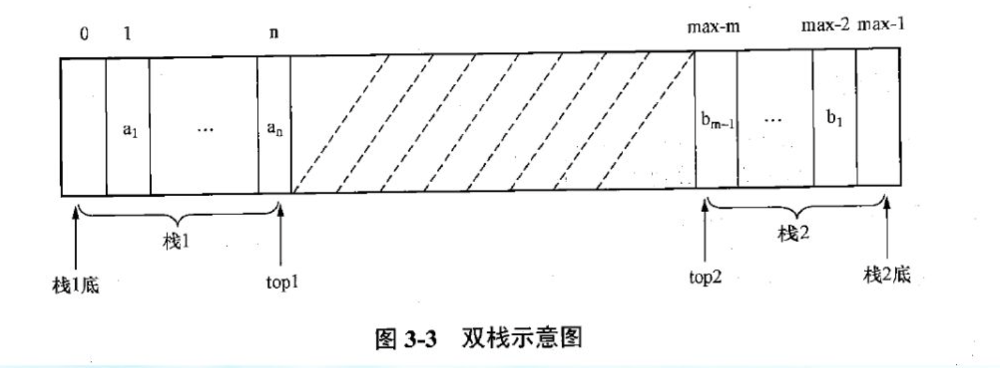

# 一、 栈

## （1） 栈的基本概念

栈是只能在表的一端（表尾）进行插入删除的线性表，其中允许插入及删除的一端（表尾）成为栈顶（Top）另一端（表头）称为栈底（Bottom）。当表中没有元素时称为空栈。

- 进栈 -- 在栈顶插入一个元素
- 出栈 -- 在栈顶删除一个元素

**栈的特点：** - 后进先出。 

**栈的基本操作 ：** 栈的用途 -- 常用于暂时保存有待处理的数据。

**栈的基本运算：**  

- 初始化栈 InitStack(S)
- 判栈空 EmptyStack(S)
- 进栈 Push(S,x)
- 出栈 Pop(S)
- 取栈顶 GetTop(S)


## （2） 栈的顺序实现

- 顺序栈 - 即栈的顺序实现
- 栈容量 - 栈中可存放的最大元素个数
- 栈顶指针 - 指示当前栈顶元素在栈中的位置
- 栈空 - 栈中无元素时，表示栈空
- 栈满 - 数组空间已被占满时，称栈满
- 下溢 - 当栈空时，再要求出栈运算，则称 下溢
- 上溢 - 当栈满时，再要求进栈运算，则称 上溢

```c
const int maxlength = 200;
typedef struct seqstack
{
    int data[maxlength];
    int top;
}SeqStk;
```

s->top == 0 代表顺序栈 s 为空。

s->top == maxsize - 1 代表顺序栈 s 为满。

### a. 初始化

```c
int InitStack(SeqStk *stk)
{
    stk->top = 0;
    return 1;
}
```


### b. 取栈顶

```c
int GetTopStack(SeqStk *stk)
{
    if (stk->top != 0)
    {
        return stk->data[stk->top];
    }
    return -1;
}
```

### c. 进栈

```c
int PushStack(SeqStk *stk, int i)
{
    if ((stk->top + 1) != MAXLENGTH)
    {
      	stk->top++;
        stk->data[stk->top] = i;
        return 1;
    }
    else
    {
        return 0;
    }
}
```

### d. 判栈空

```c
int EmptyStack(SeqStk *stk)
{
    if (stk->top == 0)
    {
        return 1;
    }
    return 0;
}
```

### e. 出栈

```c
int PopStack(SeqStk *stk)
{
    if (stk->top != 0)
    {
        stk->top--;
        return 1;
    }
    else
    {
        return 0;
    }
}
```

某些应用中，为了节省空间，让两个数据元素类型一致的栈共享一位数组空间 data[max],  称为双栈，两个栈的栈底分别设在数组两端，让两个栈彼此迎面 增长， 两个栈的栈顶变量分别为 top1 top2 ,仅当两个栈顶的位置在中间相遇top1 + 1 = top2 才发生上溢。



## （3） 栈的链接实现

栈的链式存储结构称为链栈，他是运算受限的单链表，插入和删除操作仅限制在表头位置上进行。栈顶指针就是链表的头指针。不考虑栈满现象，下溢条件为`LS->next = NULL`

```c
typedef struct linkstack
{
    int data[MAXLENGTH];
    struct linkstack *next;
} LinkStk;
```

### a. 初始化

```c
LinkStk * InitStack()
{
    LinkStk *stk = malloc(sizeof(LinkStk));
    return stk;
}
```


### b. 取栈顶

```c
int GetTopStack(LinkStk *stk)
{
    return stk->next->data;
}
```


### c. 进栈

```c
void PushStack(LinkStk *stk, int i)
{
    LinkStk *temp = malloc(sizeof(LinkStk));
    temp->data = i;
    temp->next = stk->next;
    stk->next = temp;
}
```


### d. 出栈

```c
int PopStack(LinkStk *stk)
{
    if (stk->next != NULL)
    {
        LinkStk *temp = stk->next;
        stk->next = temp->next; 
        free(temp);
        return 1;
    }
    return 0;
}
```


### e. 判栈空

```c
int EmptyStack(LinkStk *stk)
{
    if (stk->next != NULL)
    {
        return 1;    
    }
    return 0;
}
```


## （4） 栈的应用和递归

```c
#include <stdio.h>

int factorial(int n);

int main()
{
    int n;
    scanf("%d",&n);
    printf("%d\n",factorial(n));
}

int factorial(int n)
{
    if (n == 1)
    {
        return 1;
    }
    else
    {
        return n * factorial(n-1);
    }
}
```


# 二、 队列

## （1） 队列的基本概念

队列（Queue） 也是一种运算受限的线性表。队列是允许在表的一端进行插入，而在另一端进行删除的线性表。

- 允许删除的一端称为 队头（front）
- 允许插入的另一端称为 队尾 (rear)

**队列的基本操作**

- 队列初始化 `InitQueue(Q)`
- 判队列空 `EmptyQueue(q)`
- 入队列 `EnQueue(Q,x)`
- 出队列 `OutQueue(q)`
- 取队列首元素 `GetHead(Q)`


## （2） 队列的顺序实现

```c
const int maxlength = 200;

typedef struct 
{
    int data[maxlength];
    int front, rear;
} SeqQueue;
```

**普通顺序队列**

- 队满（上溢） `c.rear + 1 == c.front`
- 队空（下溢） `c.front == c.rear`

普通队列会出现假溢出的情况，即 `c.rear == maxsize - 1 ` 但队列中实际容量并未达到最大容量的现象。


**循环顺序队列**

- 队满（上溢）`(c.rear+1)%maxsize == c.front`。（尾追头）
- 队空（下溢） `c.front == c.rear`
- 入队列 `(c.rear++)%maxsize`
- 出队列 `(c.front++)%maxsize`

浪费一个空间，队满时实际容量 = maxsize - 1 （因为 front 不存值，如果存值会出现 虽然 `c.front == c.rear` 但队列不为空的情况。）

### a. 初始化

```c
CycQue* InitQueue()
{
    CycQue *cq = malloc(sizeof(CycQue));
    cq->front = 0;
    cq->rear = 0;
    return cq;
}
```


### b. 判队列空

```c
int EmptyQueue(CycQue *cq)
{
    if (cq->front == cq->rear)
    {
        return 1;
    }
    return 0;
}
```


### c. 入队列

```c
int EnQueue(CycQue *cq, int i)
{
    if ((cq->rear + 1) % maxlength != cq->front)
    {
        cq->rear = (++cq->rear)%maxlength;
        cq->data[cq->rear] = i;
        return 1;
    }
    return 0;
}
```


### d. 出队列

```c
int OutQueue(CycQue *cq)
{
    if (!EmptyQueue(cq))
    {
        cq->front = (++cq->front)%maxlength;
        return 1;
    }
    return 0;
}
```


### e. 取队列首元素

```c
int GetHead(CycQue *cq)
{
    return cq->data[cq->front+1];
}
```


## （3） 队列的链接实现

链式队列 -- 用链表表示的队列，即它是限制仅在表头删除和表尾插入的单链表。

```c
typedef struct linkqueuenode
{
    int data;
    struct linkqueuenode *next;
}LinkQueueNode;

typedef struct
{
    struct linkqueuenode *front, *rear;
}LQ;
```

### a. 初始化

```c
LQ* InitLinkQueue()
{
    LQ *lq = malloc(sizeof(LQ));
    LinkQueueNode *temp =  malloc(sizeof(LinkQueueNode));
    lq->front = temp;
    lq->rear = temp;
    lq->front->next = NULL;
}
```


### b. 判队列空

```c
int EmptyLinkQueue(LQ *lq)
{
    if ((lq->front == lq->rear) || (lq->front->next == NULL))
    {
        return 1;
    }
    return 0;
}
```


### c. 入队列

```c
void EnLinkQueue(LQ *lq, int i)
{
    LinkQueueNode *temp =  malloc(sizeof(LinkQueueNode));
    temp->data = i;
    temp->next = NULL;
    lq->rear->next = temp;
    lq->rear = temp;
}
```


### d. 出队列

```c
int OutLinkQueue(LQ *lq)
{
    if (!EmptyLinkQueue(lq))
    {
        LinkQueueNode *temp = lq->front->next;
        lq->front->next = temp->next;
        if (temp->next == NULL)
        {
            lq->rear = lq->front;
        }
        free(temp);
        return 1;
    }
    return 0;
}
```


### e. 取队列首元素

```c
int GetHead(LQ *lq)
{
    if (!EmptyLinkQueue(lq))
    {
        return lq->front->next->data;
    }
    return -1;
}
```


## （4） 队列应用

# 三、 数组

数组可看成是一种特殊的线性表，其特殊在于，表中的数组元素本身也是一种线性表。

## （1） 数组的逻辑结构和基本运算

数组是线性表的推广，其每个元素由一个值和一组下标组成，其中下标个数称为数组的维数，

数组是我们最熟悉的数据类型，在早期的高级语言中，数组是唯一可供使用的数据类型。由于数组中各元素具有统一的类型，并且数组元素的下标一般具有固定的上界和下界，因此，数组的处理比其他复杂的结构更为简单。多为数组是线性表的推广。例如，二维数组。

二维数组 Amn 可以看成是由 m 个行向量组成的响亮，也可以堪称是 n 个列向量组成的向量。

数组一旦被定义，它的维数和维界就不再改变。因此，除了结构的初始化和销毁之外，数组通常只有两种基本运算。

- 读 -- 给定一组下标，读取相应的数据元素
- 写 -- 给定一组下标，修改相应的数据元素

## （2） 数组的存储结构

由于计算机的内存结构是一维的，因此用- -维内存来表示多维数组，就必须按某种次序将数组元素排成一列序列，然后将这个线性序列存放在存储器中。又由于对数组一-般不做插入和删除操作，也就是说，数组- -旦建立,结构中的元素个数和元素间的关系就不再发生变化。因此，一般都是采用顺序存储的方法来表示数组。

例如，二维数组Amn按“行优先顺序”存储在内存中，假设每个元素占用k个存储单元。元素a的存储地址应是数组的基地址加.上排在a前面的元素所占用的单元数。因为a位于第i行、第j列，前面i行一共有`i*n`个元素，第i行上a;前面又有j个元素，故它前面一共有`i*n+j`个元素，因此，a;的地址计算函数为:`LOC(aj)=LOC(ao0)+(i*n+j)*k`


## （3） 矩阵的压缩存储

为了节省存储空间，我们可以根据这类矩阵进行压缩存储：即多个相同的非零元素只分配一个存储空间；对零元素不分配空间。

### a. 稀疏矩阵

假设 m 行 n 列的矩阵有 t 个非零元素，当 t＜＜m*n 时，则称矩阵为稀疏矩阵。

稀疏矩阵压缩存储的三元组表示法：

用三个项来表示稀疏矩阵中的非零元素 aij，即（i， j，aij)，其中 i 表示行序号，j 表示列序号，aij是非零元素的值，通常称为三元组。将稀疏矩阵中的所有非零元素用这种三元组的形式表示，并按照一定的次序组织在一起，就形成了三元组表示法。

```c
[
  [1, 0, 0, 1],
  [2, 0, 0, 0]
]

(0,0,1)
(0,3,1)
(1,0,2)
```


### b. 对称矩阵

若一个 n 阶方阵中 A 的元素满足下述条件 `aij = aji`  `0<=i,j<=n-1` 则 A 称为对称矩阵。

将对称矩阵压缩为数组 M 设矩阵元素 aij 在数组 M 中 的位置为 k， (i,j) 和 k 存在如下对应关系。

```c
if (i >= j)
{
  k = i(i+1)/2+j;
}
else if (i < j)
{
  k = j(j+1)/2+i;
}
```


### c. 三角矩阵

以主对角线为界的上（下）半部分是一个固定的值 c 或零，这样的矩阵叫做下（上）三角矩阵。

**上三角矩阵**

```c
if (i <= j)
{
  k = i(2n-i-1)/2 + j // 获取到的结果是 压缩后的下标 如第多少个元素 需再加 1
  // = ni - i(i+1)/2 +j  
  // = (2ni - i*i - i)/2 +j
  // = i(2n -i -1)/2 +j 
}
else if (j > i)
{
  k = n(n-1)/2; // n 为行数
}
```

**下三角矩阵**

将下三角矩阵压缩为数组 M

```c
if （i >= j）
{
  k = i(i-1)/2 + j;
}
elif (j > i)
{
  k = n(n-1)/2; // n 为行数
}
```

