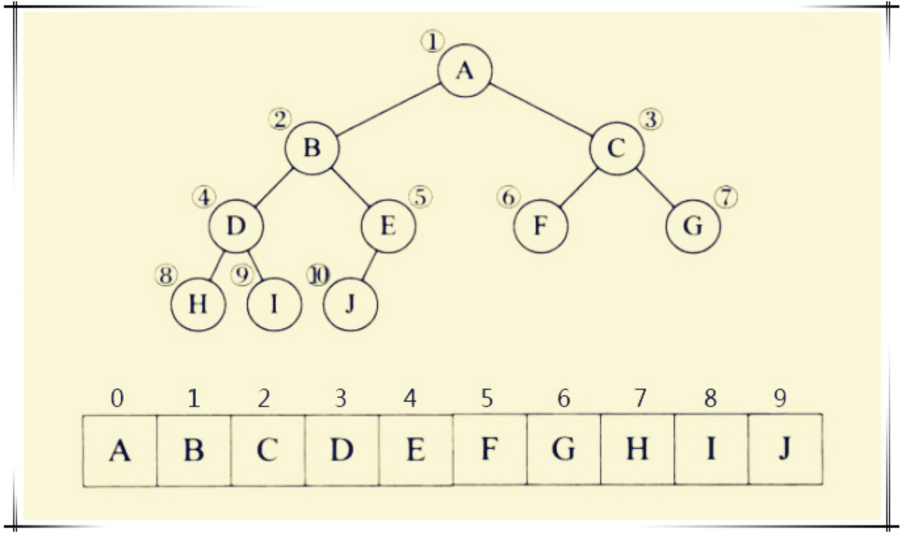

# 一、 树的基本概念

树型结构是一类重要的线性结构。树型结构是结点之间有分枝，并且具有层次关系的结构，他非常类似于自然界中的树。树结构在客观世界中是大量存在的，例如家谱，行政组织结构都可用树形象的表示。树在计算机领域中也有个广泛的应用，例如在编译程序中，用树来表示源程序的语法结构；在数据库系统中，可用树来组织信息；在分析算法的行为时，可用树来描述其执行过程等等。


## （1） 树的定义

树是n（n >= 0）个结点的有限集 T， 满足：

- 当 n = 0 时，称为空树。
- 当 n > 0 时，有且仅有一个特定的称为根的结点；其余的结点可分为 m (m >= 0 ) 个互不相交的子集 T1， T2， T3 ... Tm 其中每个子集 Ti 又是一个树，并称其为子树。

## （2） 树的术语

- 结点 - 由一个数据元素及其若干个指向其他结点的分枝所组成
- 度
  - 结点的度 ： 所拥有子树的树木。
  - 树的度： 树中所有结点的度的最大值。
- 叶子（终端结点） ： 度为 0 的结点
- 非终端结点： 度不为 0 的结点
- 孩子（子结点） ： 结点的子树的根称为该结点的孩子。
- 双亲（父结点） ： 一个结点称为该结点所有子树根的双亲
- 祖先 ：结点祖先指根到此结点的一条路径上的所有结点。
- 子孙 ：从某结点到叶结点的分枝上的所有结点称为该结点的子孙。
- 兄弟 ：同一双亲的孩子之间互称兄弟（父结点相同的结点）
- 结点的层次 ： 从根开始算起，根的层次为 1， 其余结点的层次为其双亲的层次加 1.
- 堂兄弟 ： 其双亲在同一层的结点
- 树的深度，高度 ： 一棵树中所有结点层次数的最大值
- 有序树 ： 若树中各结点的子树丛左到右是有次序的，不能互换，称为有序树。
- 无序树 ： 若树中各结点的子树是无次序的，可以互换，则称为无序树。
- 森林 ： 是 m(m >= 0 ) 棵树的集合。

## （3） 树的基本运算

- 求根 root(T) : 求树 T 的根结点
- 求双亲 Parent(T,X) ： 求结点 X 在树 T 上的双亲，若 X 是树 T 的根或 X 不在 T 上， 则结果为一特殊标志。
- 求孩子 Child（T,X,i） : 求树 T 上结点 X 的第 i 个孩子结点； 若 X 不在 T 上或没有第 i 个孩子， 则结果为一特殊标志。
- 建树 Create (X,T1,...Tk)： K> 1建立一棵以 X 为根， 以 T1  ... Tk 为 第 1 .. k 棵子树的树
- 剪枝 Delete(T, X ,i ) : 删除树 T 上结点 X 的第 i 棵子树； 若 T 无第 i 棵子树， 则为空操作。
- 遍历 TraverseTree(T) ：遍历树，即访问树中每个结点，且每个结点仅被访问一次。

# 二、 二叉树

二叉树在树结构的应用中起着非常重要的作用， 因为二叉树有很多良好的性质和简单的物理表示，而任何树都可以和二叉树相互转换，这样就解决了树的存储结构及运算中存在的复杂性。

## （1） 二叉树基本概念

二叉树是 n(n >= 0) 个结点的有限集合，他或为空 (n = 0), 或是由一个根及两棵互不相交的左子树和右子树组成， 且左子树和右子树也均为二叉树。

这是一个递归的定义。二叉树可以是空集合，根可以有空的左子树或空的右子树。二叉树有五种基本形态。

**特点：**

-  二叉树可以是空的，称二叉树。
- 每个结点最多只有两个孩子。
- 子树有左、右之分且次序不能颠倒。

## （2） 二叉树的基本运算

- 初始化 Initiate(BT) ：建立一棵空二叉树。
- 求双亲 Parent(BT,X) : 求出二叉树 BT 上结点 X 的双亲结点，若 X 是 BT 的根或 X 根本不是 BT 上的结点，运算结果为 NULL。
- 求左孩子 Lchild(BT,X) 求右孩子 Rchild(BT,X) ： 分别求出二叉树 BT 上结点 X 的左、右孩子，若 X 为BT 的叶子或 X 不在 BT 上，运算结果为 NULL。
- 建二叉树 Create(BT) 建议一棵二叉树 BT
- 先序遍历 PreOrder(BT)  按先序对二叉树 BT 进行遍历，每个结点被访问一次且仅被访问一次， 若 BT 为空，则运算为空操作。（根左右）
- 中序遍历 InOrder(BT) 按中序对二叉树 BT 进行遍历，每个结点被访问一次且仅被访问一次， 若 BT 为空，则运算为空操作。 （左根右）
- 后序遍历 PostOrder(BT) 按后序对二叉树 BT 进行遍历，每个结点被访问一次且仅被访问一次， 若 BT 为空，则运算为空操作。（左右根）
- 层次遍历 LevelOrder(BT) 按层从上往下，同一层中结点按从左往右的顺序对二叉树进行遍历，每个结点被访问一次且仅被访问一次， 若 BT 为空，则运算为空操作。

## （3） 二叉树的性质

- 在二叉树的第 i(i >= 1) 层上最多有 2**(i-1) 个结点

- 深度为 k(K >= 1) 的二叉树上至多有 2**k -1个结点

- 叶结点数 n0 = 度为 2 的结点树 n2 + 1

  ```c
  n0 + n1 + n2 = 0 * n0 + n1 * 1 + 2n2 + 1
            n0 = n2 + 1
  // n0 为度为 0 的结点
  // n1 为度为 1 的结点
  // n2 为度为 2 的结点
  // 常数 1 为 根结点
  // 想象树枝的数量(树枝的数量加一等于结点数量)
  ```

  

- 满二叉树 为 深度为 k( k>= 1) 且有 2**(k-1)个结点的二叉树

- 完全二叉树 为 深度为 K 的二叉树中， K-1层的结点数是满的， K 层结点是左连续的（满二叉树是完全二叉树的特例）

- 具有 n 个结点的完全二叉树的深度为 |log2n| + 1（结果向下取整）

- 对有 n 个结点的完全二叉树的结点按层编号 (从第一层到第 |log2n+1| 层，每层从左到右)则对任一结点 i (i<= i<=n) 有

  - 如果 i = 1 则结点 i 无双亲，是二叉树的根
  - 如果 i > 1 则 i 的双亲 Parent(A) 是|i/2| 向下取整
  - 如果 2 * i <= n  则其左孩子的结点是 2*i 否则，结点 i 无左孩子，且为叶子结点。
  - 如果 2 * i + 1 < n  则其右孩子的结点是 2*i + 1 否则，结点 i 无右孩子。

# 三、 二叉树的存储结构

## （1） 二叉树的顺序存储结构

它是用一组连续的存储单元存储二叉树的数据元素。因此，必须吧二叉树的所有结点安排成一个恰当的序列，结点在这个序列中相互位置能反应出结点之间的逻辑关系，可用编号的方法。

对二叉树按照完全二叉树进行编号，然后用一维数组进行存储，其中编号为 i 的结点存储在数组中下标为 i 的分量中。该方法称 以编号为地址 策略

从树根起，自上层至下层，每层自左至右的给所有结点编号的缺点是可能对存储空间造成极大的浪费，在最坏的情况下，一个深度为 H 且只有 H 个结点的右单枝树却需要 2**h -1 个结点存储空间。而且，若经常需要插入与删除树中结点时，顺序存储方式不是最好的。

对于非完全二叉树，则用某种方法将其转化为完全二叉树，为此可增设若干个虚拟结点。

用于一般二叉树会浪费空间




## （2） 二叉树的链式存储结构

在含 n 个结点的二叉链表中有 2n 个指针域

其中有 n -1 指向左右孩子 （除根之外都有指针指向）

其余 n + 1 个空指针域（2n - (n -1) = n + 1） 

**二叉链表：**

```c
typedef struct btnode
{
	int data;
	struct btnode *lchild , * rchid;
}*BinTree;
```

**三叉链表：**

```c
typedef struct btnode
{
	int data;
	struct btnode *lchild , * rchid, *parents;
}*BinTree;
```

