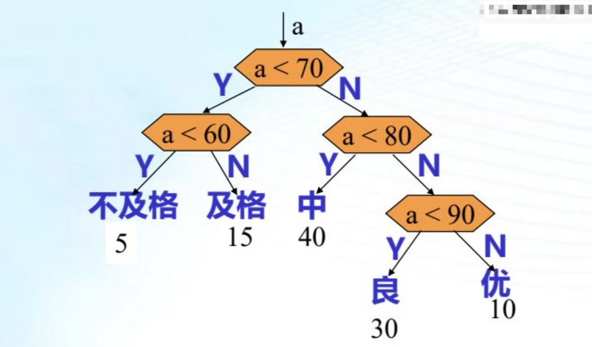
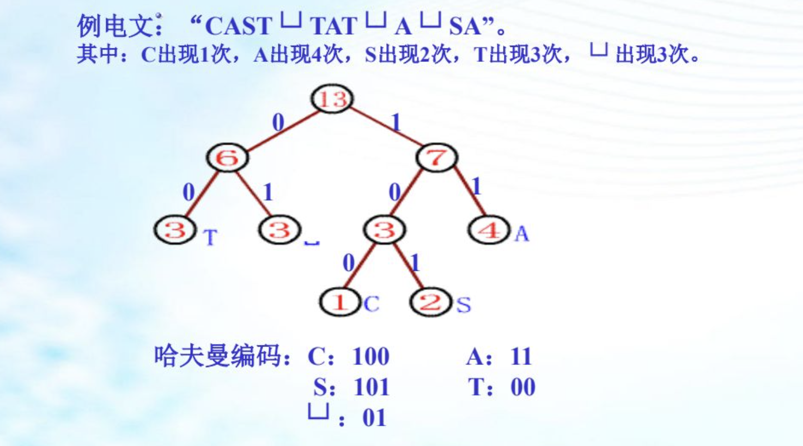

# 一、 树的基本概念

树型结构是一类重要的线性结构。树型结构是结点之间有分枝，并且具有层次关系的结构，他非常类似于自然界中的树。树结构在客观世界中是大量存在的，例如家谱，行政组织结构都可用树形象的表示。树在计算机领域中也有个广泛的应用，例如在编译程序中，用树来表示源程序的语法结构；在数据库系统中，可用树来组织信息；在分析算法的行为时，可用树来描述其执行过程等等。


## （1） 树的定义

树是n（n >= 0）个结点的有限集 T， 满足：

- 当 n = 0 时，称为空树。
- 当 n > 0 时，有且仅有一个特定的称为根的结点；其余的结点可分为 m (m >= 0 ) 个互不相交的子集 T1， T2， T3 ... Tm 其中每个子集 Ti 又是一个树，并称其为子树。

## （2） 树的术语

- 结点 - 由一个数据元素及其若干个指向其他结点的分枝所组成
- 度
  - 结点的度 ： 所拥有子树的树木。
  - 树的度： 树中所有结点的度的最大值。
- 叶子（终端结点） ： 度为 0 的结点
- 非终端结点： 度不为 0 的结点
- 孩子（子结点） ： 结点的子树的根称为该结点的孩子。
- 双亲（父结点） ： 一个结点称为该结点所有子树根的双亲
- 祖先 ：结点祖先指根到此结点的一条路径上的所有结点。
- 子孙 ：从某结点到叶结点的分枝上的所有结点称为该结点的子孙。
- 兄弟 ：同一双亲的孩子之间互称兄弟（父结点相同的结点）
- 结点的层次 ： 从根开始算起，根的层次为 1， 其余结点的层次为其双亲的层次加 1.
- 堂兄弟 ： 其双亲在同一层的结点
- 树的深度，高度 ： 一棵树中所有结点层次数的最大值
- 有序树 ： 若树中各结点的子树丛左到右是有次序的，不能互换，称为有序树。
- 无序树 ： 若树中各结点的子树是无次序的，可以互换，则称为无序树。
- 森林 ： 是 m(m >= 0 ) 棵树的集合。

## （3） 树的基本运算

- 求根 root(T) : 求树 T 的根结点
- 求双亲 Parent(T,X) ： 求结点 X 在树 T 上的双亲，若 X 是树 T 的根或 X 不在 T 上， 则结果为一特殊标志。
- 求孩子 Child（T,X,i） : 求树 T 上结点 X 的第 i 个孩子结点； 若 X 不在 T 上或没有第 i 个孩子， 则结果为一特殊标志。
- 建树 Create (X,T1,...Tk)： K> 1建立一棵以 X 为根， 以 T1  ... Tk 为 第 1 .. k 棵子树的树
- 剪枝 Delete(T, X ,i ) : 删除树 T 上结点 X 的第 i 棵子树； 若 T 无第 i 棵子树， 则为空操作。
- 遍历 TraverseTree(T) ：遍历树，即访问树中每个结点，且每个结点仅被访问一次。

# 二、 二叉树

二叉树在树结构的应用中起着非常重要的作用， 因为二叉树有很多良好的性质和简单的物理表示，而任何树都可以和二叉树相互转换，这样就解决了树的存储结构及运算中存在的复杂性。

## （1） 二叉树基本概念

二叉树是 n(n >= 0) 个结点的有限集合，他或为空 (n = 0), 或是由一个根及两棵互不相交的左子树和右子树组成， 且左子树和右子树也均为二叉树。

这是一个递归的定义。二叉树可以是空集合，根可以有空的左子树或空的右子树。二叉树有五种基本形态。

**特点：**

-  二叉树可以是空的，称二叉树。
- 每个结点最多只有两个孩子。
- 子树有左、右之分且次序不能颠倒。

## （2） 二叉树的基本运算

- 初始化 Initiate(BT) ：建立一棵空二叉树。
- 求双亲 Parent(BT,X) : 求出二叉树 BT 上结点 X 的双亲结点，若 X 是 BT 的根或 X 根本不是 BT 上的结点，运算结果为 NULL。
- 求左孩子 Lchild(BT,X) 求右孩子 Rchild(BT,X) ： 分别求出二叉树 BT 上结点 X 的左、右孩子，若 X 为BT 的叶子或 X 不在 BT 上，运算结果为 NULL。
- 建二叉树 Create(BT) 建议一棵二叉树 BT
- 先序遍历 PreOrder(BT)  按先序对二叉树 BT 进行遍历，每个结点被访问一次且仅被访问一次， 若 BT 为空，则运算为空操作。（根左右）
- 中序遍历 InOrder(BT) 按中序对二叉树 BT 进行遍历，每个结点被访问一次且仅被访问一次， 若 BT 为空，则运算为空操作。 （左根右）
- 后序遍历 PostOrder(BT) 按后序对二叉树 BT 进行遍历，每个结点被访问一次且仅被访问一次， 若 BT 为空，则运算为空操作。（左右根）
- 层次遍历 LevelOrder(BT) 按层从上往下，同一层中结点按从左往右的顺序对二叉树进行遍历，每个结点被访问一次且仅被访问一次， 若 BT 为空，则运算为空操作。

## （3） 二叉树的性质

- 在二叉树的第 i(i >= 1) 层上最多有 2**(i-1) 个结点

- 深度为 k(K >= 1) 的二叉树上至多有 2**k -1个结点

- 叶结点数 n0 = 度为 2 的结点树 n2 + 1

  ```c
  n0 + n1 + n2 = 0 * n0 + n1 * 1 + 2n2 + 1
            n0 = n2 + 1
  // n0 为度为 0 的结点
  // n1 为度为 1 的结点
  // n2 为度为 2 的结点
  // 常数 1 为 根结点
  // 想象树枝的数量(树枝的数量加一等于结点数量)
  ```

  

- 满二叉树 为 深度为 k( k>= 1) 且有 2**(k-1)个结点的二叉树

- 完全二叉树 为 深度为 K 的二叉树中， K-1层的结点数是满的， K 层结点是左连续的（满二叉树是完全二叉树的特例）

- 具有 n 个结点的完全二叉树的深度为 |log2n| + 1（结果向下取整）

- 对有 n 个结点的完全二叉树的结点按层编号 (从第一层到第 |log2n+1| 层，每层从左到右)则对任一结点 i (i<= i<=n) 有

  - 如果 i = 1 则结点 i 无双亲，是二叉树的根
  - 如果 i > 1 则 i 的双亲 Parent(A) 是|i/2| 向下取整
  - 如果 2 * i <= n  则其左孩子的结点是 2*i 否则，结点 i 无左孩子，且为叶子结点。
  - 如果 2 * i + 1 < n  则其右孩子的结点是 2*i + 1 否则，结点 i 无右孩子。

# 三、 二叉树的存储结构

## （1） 二叉树的顺序存储结构

它是用一组连续的存储单元存储二叉树的数据元素。因此，必须吧二叉树的所有结点安排成一个恰当的序列，结点在这个序列中相互位置能反应出结点之间的逻辑关系，可用编号的方法。

对二叉树按照完全二叉树进行编号，然后用一维数组进行存储，其中编号为 i 的结点存储在数组中下标为 i 的分量中。该方法称 以编号为地址 策略

从树根起，自上层至下层，每层自左至右的给所有结点编号的缺点是可能对存储空间造成极大的浪费，在最坏的情况下，一个深度为 H 且只有 H 个结点的右单枝树却需要 2**h -1 个结点存储空间。而且，若经常需要插入与删除树中结点时，顺序存储方式不是最好的。

对于非完全二叉树，则用某种方法将其转化为完全二叉树，为此可增设若干个虚拟结点。

用于一般二叉树会浪费空间


## （2） 二叉树的链式存储结构

在含 n 个结点的二叉链表中有 2n 个指针域

其中有 n -1 指向左右孩子 （除根之外都有指针指向）

其余 n + 1 个空指针域（2n - (n -1) = n + 1） 

**二叉链表：**

```c
typedef struct btnode
{
	int data;
	struct btnode *lchild , * rchid;
}*BinTree;
```

**三叉链表：**

```c
typedef struct btnode
{
	int data;
	struct btnode *lchild , * rchid, *parents;
}*BinTree;
```

# 四、 二叉树的遍历

## （1） 遍历含义

在二叉树的一些应用中，常常要求在树中查找具有某些特征的结点，或者对树中全部结点逐一进行某种处理。这就引入了遍历二叉树的问题。

遍历二叉树 -  是指按某种次序访问二叉树上的所有结点，使每个可点被访问一次且仅被访问一次。

## （2） 先序遍历

- 若二叉树为空，执行空操作。
- 访问根结点
- 先序遍历左子树
- 先序遍历右子树

```c
void preorder(Bintree bt)
{
  if (bt != NULL)
  {
    visit(bt);
    preorder(bt->lchild);
    preorder(bt->rchild);
  }
}
```

## （3） 中序遍历

- 若二叉树为空，执行空操作。
- 先序遍历左子树
- 访问根结点
- 先序遍历右子树

```c
void preorder(Bintree bt)
{
  if (bt != NULL)
  {
    preorder(bt->lchild);
    visit(bt);
    preorder(bt->rchild);
  }
}
```

## （4） 后序遍历

- 若二叉树为空，执行空操作。
- 先序遍历左子树
- 先序遍历右子树
- 访问根结点

```c
void preorder(Bintree bt)
{
  if (bt != NULL)
  {
    preorder(bt->lchild);
    preorder(bt->rchild);
    visit(bt);
  }
}
```

## （5） 层次遍历

- 设置一个队列 Q，用于存放结点，以保证二叉树结点按照层次顺序从左往右进入队列。若二叉树 bt 非空
- 将根结点插入队列
- 从队列中删除一个结点，访问该结点，并将该结点的孩子插入队列
- 若此时队列非空，再从队列中删除一个结点，访问该结点并将它的孩子结点插入队列。依次重复进行，直到队列为空。

```c
int levelOrder(Bintree bt)
{
    int p;
    LQ *lq = InitLinkQueue();
    if (bt != NULL)
    {
        EnLinkQueue(lq, bt);
    }
    if (!EmptyLinkQueue)
    {
      	p = GetHead(lq);
        OutLinkQueue(lq);
        visit(bt);
      	if (p ->lchild != NULL)
        {
          EnQueue(lq,p->lchild);
        }
        if (p ->rchild != NULL)
        {
          EnQueue(lq,p->rchild);
        }
    }
}
```

# 五、 遍历二叉树的应用

遍历时二叉树各种操作的基础，可以在遍历的过程中对结点进行各种操作，如：对于一棵已知二叉树。

- 求二叉树中结点的个数

```c
int count(Bintree bt)
{
  int m,n;
  if (bt != NULL)
  {
    return 1;
  }
  else
  {
    m = count(lchild);
    n = count(rchild);
    return m + n;
  }
}
```


- 求二叉树中叶子结点的个数

```c
int count(Bintree bt)
{
  int m,n;
  if (bt == NULL)
  {
    return 0;
  }
  if (bt->lchild == NULL && bt->rchild == NULL)
  {
    return 1;
  }
  else
  {
    m = count(lchild);
    n = count(rchild);
    return m + n;
  }
}
```


- 求二叉树中度为1的结点个数

```c
int count(Bintree bt)
{
  int m,n;
  if (bt == NULL)
  {
    return 0;
  }
  if ((bt->lchild == NULL && bt->rchild != NULL) ||  (bt->lchild != NULL && bt->rchild == NULL))
  {
    return 1;
  }
  else
  {
    m = count(lchild);
    n = count(rchild);
    return m + n;
  }
}
```


- 求二叉树中度为2的结点个数

```c
int count(Bintree bt)
{
  int m,n;
  if (bt == NULL)
  {
    return 0;
  }
  if (bt->lchild != NULL && bt->rchild != NULL)
  {
    return 1;
  }
  else
  {
    m = count(lchild);
    n = count(rchild);
    return m + n;
  }
}
```


- 求二叉树中非终端结点的个数

```c
int count(Bintree bt)
{
  int m,n;
  if (bt == NULL)
  {
    return 0;
  }
  if (bt->lchild != NULL || bt->rchild != NULL)
  {
    return 1;
  }
  else
  {
    m = count(lchild);
    n = count(rchild);
    return m + n;
  }
}
```


- 交换结点左右孩子

```c
int exchange(Bintree bt)
{

  if (bt != NULL)
  {
    Bintree temp = malloc(sizeof(Bintree));
    bt->rchild = temp;
    bt->rchild = bt->lchild;
    bt->lchild = temp;
    exchange(bt->lchild);
    exchange(bt->rchild);
  }
}
```


- 判定结点所在层次

```c
int laye(Bintree bt, int key, int *L)
{
  if (bt != NULL)
  {
    if (bt->data == key)
    {
      return L
    }
    else 
    {
      (*L)++
      laye(bt->lchild);
      laye(bt->rchild);
    }
  }
}
```

根据先序和中序可以确定唯一二叉树

根据中序和后续可以确定唯一二叉树

# 六、 树和森林

## （1） 树的存储结构

### a.   双亲表示法

以一组连续空间存储树的结点，即一个一维数组构成，数组每个分量包含两个域：数据域和双亲域。 数据域用于存储树上一个结点的元素值，双亲域用于存储本结点的双亲结点在数组中的序号（下标值）。

双亲表示法更方便找到父结点，但是找到孩子结点则需要遍历整张表。

双亲表示法采用顺序表 存储普通树 其实现的核心思想是 ： 顺序存储各个节点的同时， 给各结点附加一个记录其父结点位置的变量。

注意，根结点没有父结点（赋结点又称为双亲结点），因此根结点记录父结点位置爹变量通常置为 -1。

```c
#define MAXSIZE 200

typedef struct Snode
{
  int data;    // 结点数据类型
  int parent;  // 结点双亲下标
} PTNode;

typedef struct
{
  PTNode t[MAXSIZE];  // 结点列表
  int n;              // 结点个数
} *Tree;
```


### b. 孩子链表表示法

孩子表示法存储普通树采用的是 顺序表 + 链表的组合结构，其存储过程是 ： 从树的根结点开始， 使用顺序表一次存储树中各个结点，需要注意的是，与双亲表示法不通，孩子表示法会给各个结点配备一个链表，用于存储各结点的孩子结点位于顺序表中的位置。

```c
#define MAXSIZE 200
typedef struct CTNode
{
  int parent;         // 带双亲的孩子链表表示法
  int child;          // 链表中每个结点存储不是数据本身，而是数据在数组中存储的位置下标。
  struct CTNode *next;
} ChildPtr;

typedef struct 
{
	int data;   // 结点的数据类型
  ChildPtr * firstchild;  // 孩子链表的头指针
} CTBox;

typedef struct 
{
   CTbox nodes[MAXSIZE]; // 存储结点的数组
   int n,r;     // 结点数量和树根的位置
} *Tree;
```

### c. 孩子兄弟链表表示法

孩子兄弟链表的结构形式与二叉链表完全相同，但结点中指针的含义不同。

```c
typedef struct BS  
{
   int data;
   BS *son, *brother;
} *Tree;
```

## （2） 树、森林与二叉树的关系

### a. 一般树和二叉树的转换

1. 各兄弟之间加连线
2. 对任意结点， 除最左孩子外，抹掉该结点与其余孩子的各枝
3. 以根为轴心，将连线顺时针转 45度 

### b. 森林和二叉树的转换

1. 将每棵树转换成相应的二叉树
2. 将 1 中得到的各棵二叉树的根结点看作是兄弟连接起来

### c. 二叉树还原成树

1. 从根结点起
2. 该结点左孩子左孩子枝子上的右结点依次作为该结点的孩子
3. 重复 1

根无右孩子的二叉树可以变成一般树

### d. 森林还原为二叉树

1. 从根结点起
2. 断掉右子树
3. 重复1
4. 得到二叉树再还原树

## （3） 树和森林的遍历

### a. 树的遍历

- 先序： 先访问根结点，然后依次先序编译根的每个子树
- 后序： 先一次后续遍历每棵子树，最后访问根结点
- 层次： 逐层访问

树的先序遍历对应二叉树的先序遍历

树的后序遍历对应二叉树的中序遍历

### c. 森林的遍历

- 先序： 访问森林汇总每棵树的根结点，先序遍历森林汇总第一棵树的根结点的子树组成的森林，先序遍历出去第一棵树之外其余的树组成的森林
- 中序： 中序访问森林中第一棵树的根结点的子树促成的森林；访问第一棵树的根结点，中序遍历出去第一棵树其余的树组成的森林

森林的先序遍历对应二叉树的先序遍历

森林的后序遍历对应二叉树的中序遍历（但在森林中只有中序遍历对应二叉树的中序遍历，但实际算法为后序遍历）

# 七、 判定树和哈夫曼树

## （1） 分类与判定树

用于描述分类过程的二叉树，其中，每个非终端结点包含一个条件，对应一次比较；每个终端结点包含一个种类标记，对应一种分类结果。

优化为将概率较大的结果放到前面进行判定。



如何构造时间性能最高的判定树 - 哈夫曼树

## （2） 哈夫曼树与哈夫曼算法

权重大的叶子离根近，权重小的叶子离根远。

哈夫曼树没有度为 1 的 只有度为2 和 0 的

初始森林有 n 棵二叉树，每棵树中都仅有一个孤立的结点，要进行 n - 1 次合并才能得到哈夫曼树，每次合并产生一个新的结点。最终有 2n -1 个结点

带权路径长度等于到结点的分枝数乘以结点的权重值的和

```c
const int n = 10;
typedef struct
{
	float w;  // w 为结点的权值
  int parent, lchild, rchild;
}node;

typedef node hftree[2*n-1];
```


## （3） 哈夫曼编码

- 以 n 个字符的权值，构造哈夫曼树
- 求 n 个字符的哈夫曼编码




