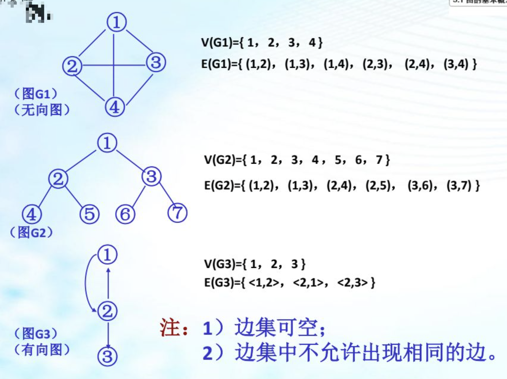
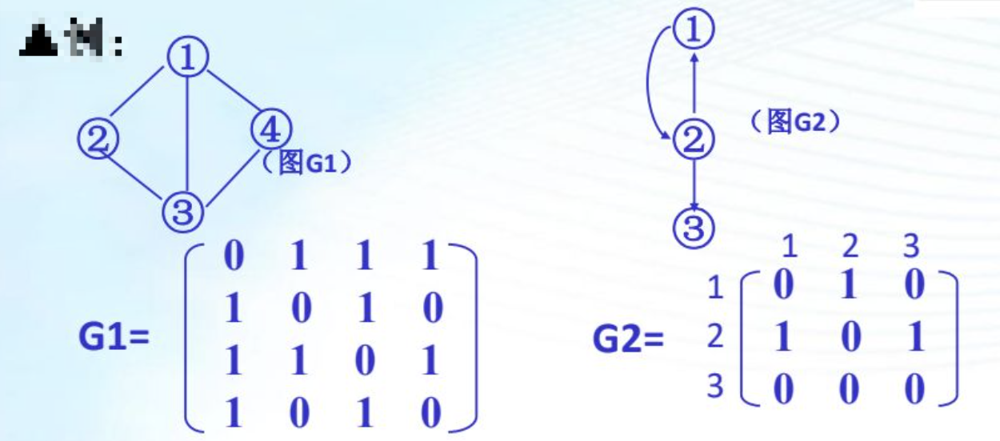
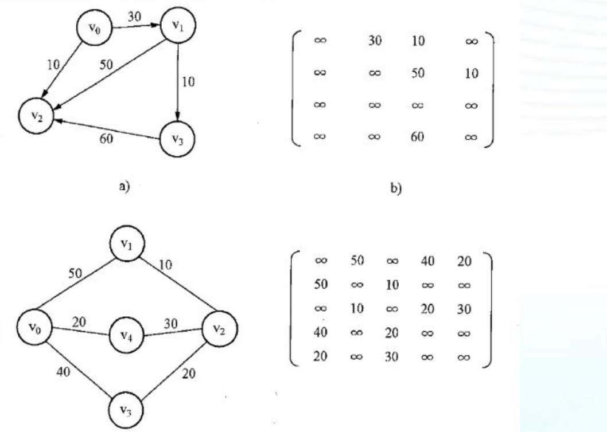
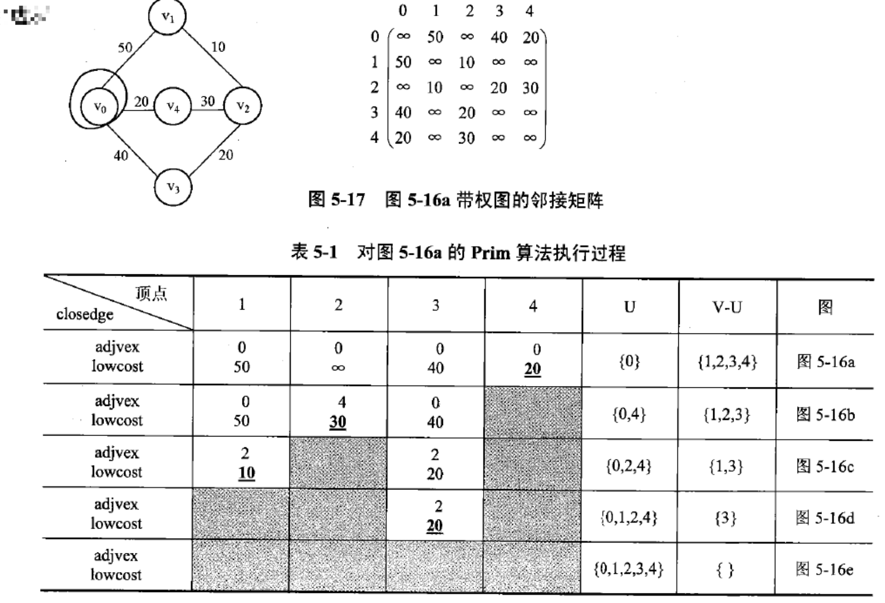
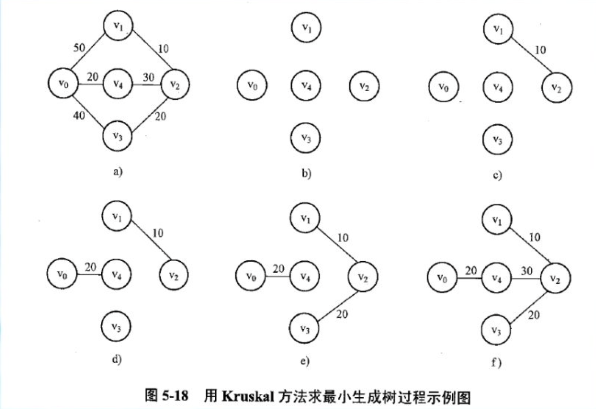
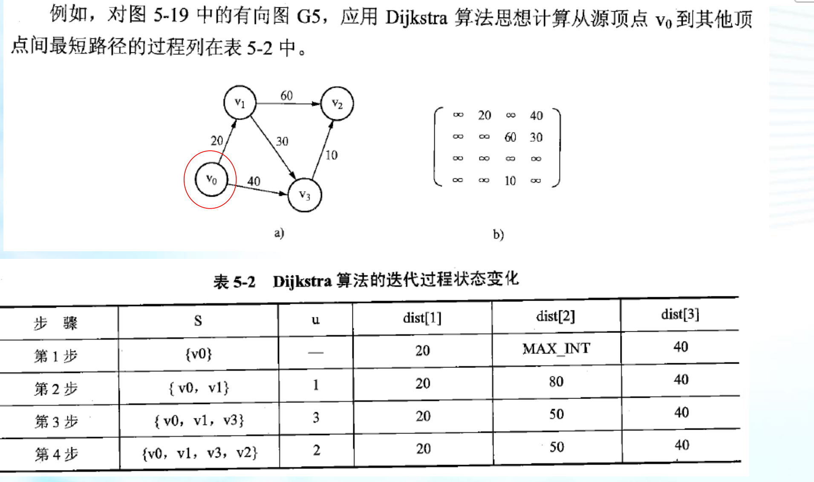
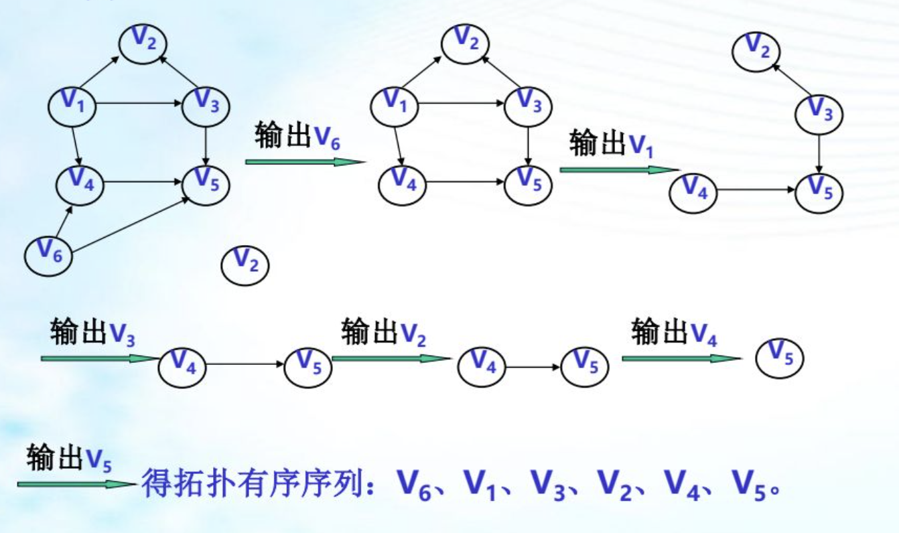

# 一、 图的基本概念

## （1） 基本概念

图 G 是由顶点集 V 和 边集 E 组成 记成 G = (V,E)

- V 顶点集 (非空)
- E 边集 (可空)

边是顶点的有序对或无序对，边反映了两顶点之间的关系。

有向图： 边是顶点的有序对的图。（图中每条边都用箭头指明了方向）

无向图： 边是顶点的有序对的图。

## （2）图的定义和术语

### a. 图的定义



### b. 基本术语

- 顶点（Vertex） ：  图中的数据元素
- <vi,vj> ： 顶点 vi 到 顶点 vj 的变，也称弧
  - 弧头  （终端点） 箭头端
  - 弧尾  （初始点） 无箭头端
- 完全图 
  - 无向完全图 ： 边数 =  n*(n-1)/2 的无向图
  - 有向完全图 ： 边数 =  n*(n-1) 的有向图
- 权 ： 与图中的边相关的数
- 子图 ： 图 G1 和 G2 若有 V(G2) 属于 V(G) 和 E(G2) 属于 E(G) 则称 G2 为 G的子图
- 邻接 ： 若 (Vi,Vj) 属于 E(G)  则称 Vi 和 Vj 互为邻接点。（邻接是指顶点之间的关系） 若 <vi,vj> 属于 E(G) 则称 vj 是 vi 的邻接点
- 关联 ： 若 (Vi,Vj) 属于 E(G)  则称(Vi,Vj) 关联与顶点 Vi 和 Vj （关联是指边与顶点间的关系）
- 度（所有顶点的度数和除以2就是边的个数）
  - 无向图： 顶点 vi 的度为与 vi 相关联的边的个数
  - 有向图
    - 出度： 顶点 vi 的出度为以 vi 为尾的出边数
    - 入度： 顶点 vi 的入度为以 vi 为头的入边数
    - 度： 有向图 度 = 入度 + 出度
- 路径 ： 顶点 Vp 到 顶点 Vq 的路径是顶点序列。
- 路径长度： 路径上面边或弧的数目。
- 简单路径： 除第一个和最后一个外，其余各结点均不相同的路径。
- 回路： 第一个和最后一个顶点相同的路径，也称环。
- 简单回路： 第一个和最后一个顶点相同的简单路径。（回路可以有多个圈，但简单回路只能有一个圈）
- 连通： 无向图中，若从顶点 vi 到 vj 顶点有路径，则称 vi 和 vj 是连通的
- 连通图（针对无向图而言） 图中每对顶点之间都连通
- 连通分量（针对无向图而言）： 图中极大的连通子图（再扩大一点就不连通了）（两个不连通的连通图即可组成一个连通分量）
- 强连通图（针对有向图）： 图中任意对顶点 vi 和 vj 都有顶点 vi 到顶点 vj 的路径，也有从 vj 到 vi 的路径，两个顶点之间双向连通
- 强连通分量（针对有向图） ： 有向图的极大连通子图。
- 生成树 ： 含有该连通图的全部顶点的一个极小连通子图。若连通图 G 顶点个数为 n ，则G生成树的边数为 n -1
  - G1 的子图 G2 边数大于 n -1 则 G2 中一定有环
  - G1 的子图 G2 边数小于 n -1 则 G2 中一定不连通
- 生成森林 ： 在非连通图中，每个连通分量都可得到一个极小的连通子图，也就是生成树。这些生成树就组成了一个非连通图的生成森林。 

### c. 图的基本运算

- 建立图。CreateGraph(G,V,E)
- 取顶点信息 GetVex(G,u)
- 取边信息 Getarc(G,u,v)
- 查询第一个邻接点 FirstVex(G,u) 
- 查询下一个邻接点 NextVex(G,u,v)
- 插入顶点 InsertVex(G,v)
- 删除顶点 DeleteVex(G,v)
- 插入边 InsertArc(G,v,w)
- 删除边 DeleteArc(G,v,w)
- 遍历图 Travers(G, tag)


# 二、 图的存储结构

## （1） 邻接矩阵表示法

### a. 邻接矩阵

**定义：**   设 G =(V,E) 是 n 个顶点的图，则 G 的邻接矩阵为下列 n 阶方阵：

```
A[i][j] = { 1 (Vi,Vj) 或 <Vi, Vj> 属于 E(G)
          { 0 否
```

- 无向图的邻接矩阵是对称矩阵（ 因为 (vi,vj) 属于 E(G) 则 (vj,vi) 属于 E(G) ）
- 从邻接矩阵容易判断任意两顶点间是否有边相连，容易求出各顶点的度
  - 无向图： 顶点 vi 的 D(Vi) 等于矩阵中第 i 行或第 j 列元素之和
  - 有向图： （行为出度，列为入度）
    - OD(Vi)  = 矩阵中第 i 行元素之和
    - ID (Vi) = 矩阵中第 i 列元素之和



### b. 带权邻接矩阵

```c
A[i][j] = { wij (Vi,Vj) 或 <Vi, Vj> 属于 E(G)
          { 无穷
```



```c
#define VNUM 20
typedef struct gp
{
  VertexType vexs[VNUM];  // 顶点信息
  WeightType arcs[VNUM];  // 边
  int vexnum,arcnym;      // 顶点数， 边数
} Graph;
```

构建带权五项链接矩阵

```c
#define MAXINT 999;
void CreateGraph(Graph *g)
{
  char ch;
  int i,j,b,e,w;
  scanf("%d %d",&n,&e)
  g->vexnum = n;
  g->arcnum = e;
  for (i=0;i<n;i++)
  {
    scanf("%c",ch);
    g->vexs[i] = ch;
  }
  for (i=0;i<n;i++)
    for (j=0;j<n;j++)
    	g->arcs[i][j] = MAXINT;
  for (k=0;k<e;k++)
  {
    scanf("%d $d $d",$&i, &j, &w);
    g->arcs[i][j] = w;
    g->arcs[j][i] = w;
  }
}
```


## （2） 邻接表

**定义：**  对图中每个顶点都建立一个单链表，第 i 个单链表（称边表） 链接图中与 顶点 vi 相邻接的所有顶点。

- 在有向图中，描述每个点向别的节点连的边（点a->点b这种情况）。
- 在无向图中，描述每个点所有的边(点a-点b这种情况)

```c
 #define MAX_VERTEX_NUM 20
 typedef struct ArcNode
 {
   int adjvex;              /* 该弧所指向的顶点的位置 */
   struct ArcNode *nextarc; /* 指向下一条弧的指针 */
   int *weight.             /* 权值域 */
 }ArcNode;                  /* 表结点 */
 typedef struct
 {
   VertexType data;         /* 顶点信息 */
   ArcNode *firstarc;       /* 第一个表结点的地址,指向第一条依附该顶点的弧的指针 */
 }VNode,AdjList[MAX_VERTEX_NUM]; /* 头结点 */
 typedef struct
 {
   AdjList vertices;
   int vexnum,arcnum;      /* 图的当前顶点数和弧数 */
   GraphKind kind;         /* 图的种类标志 */
 }ALGraph;
```

- n 个顶点，e条边的无向图，则其邻接表的表头结点树为 n 链表结点总数为 2e

- 对于无向图，第 i 个链表的结点数为顶点 vi 的度

  对于有向图，第 i 个链表的结点树为顶点 vi 的出度

- 在边稀疏时，邻接表比邻接矩阵更节省单元

- 邻接表表示在检测边数方面比邻接矩阵表示效率要高

- 对于无向图，第i个链表的结点数为顶点V:的度;

- 对于有向图，第i个链表的结点数只为顶点V:的出度;若要求入度，必须遍历整个邻接表。在单链表中，其邻接点域的值为i的结点个数是顶点V的入度。

- 对于有向图，有时候就要建立一个你邻接表。即队每个顶点V  建立一个以V;为弧头的邻接点的链表。这样，逆邻接表第i个单链表中的结点个数就是V 的入度。

# 三、 图的遍历化

图的遍历 ： 从图 G 中某一顶点 v 出发，顺序访问各顶点一次。

为克服顶点重复访问，设置辅助数组 visitend[n]

```c
visited[i] { 1 顶点i已被访问过
					 { 0 顶点i未被访问过
```

遍历方法：

- 深度优先搜索 - 类似先序遍历
- 广度优先搜索 - 类似层次遍历

## （1） 深度搜索优先（DFS）

从图 G(V,E) 中任一顶点 vi 开始， 首先访问 vi ，然后访问 vi 的任一未访问过的邻接点 vj ， 再以 vj 为新的出发点进行深度优先搜索，直到所有顶点都被访问过。

- 为克服顶点重复的问题，设立一标志向量 visited[n]
- 图可用邻接矩阵或邻接表表示
- DFS 规则具有递归性，故需用到栈

**领接表**

```c
int visited[N];
void DFS(ALGraph g, int v)
{
  ArcNode *p;
  visited[v] = 1;
  p = g.AdjList[v].firstarc;
  while (p != NULL)
  {
    if (!visited[p->adjvex])
    {
      DFS(g,p->adjvex);
    }
    p = p->nextarc;
  }
}

// 时间复杂度 O(n+e)
```

**邻接矩阵**

```c
int visited[N];
void DFS(Graph g,int v)
{
  visited[v] = 1;
  for (int i=0;i<n;i++)
  {
    int m = g.AdjList[v][i];
    if ( m && !visited[i])
    {
      DFS(g,i);
    }
  }
}

// 时间复杂度 O(n**n)
```


## （2） 广度搜索优先(BFS)

从图 G(V,E) 中某一点 vi 出发，首先访问 vi 的所有邻接点(W1,w2,...,wt)，然后再顺序访问 w1, w2,  .. 等所有未被访问过的邻接点.. ,此过程知道所有顶点都被访问过。

- 为克服顶点的重复访问，设立一标志向量 visited[n]
- 图可用邻接矩阵或邻接表表示
- 顶点的处理次序 先进先出 需要用到队列

**邻接表**

```c
int visited[N];
void BFS(Graph g, int v)
{
  ArcNode *p;
  visited[v] = 1;
  CycQue *q = InitQueue();
  EnQueue(q,v);
  while (!EmptyQueue)
  {
    v = GetHead(q);
    p = g.AdjList[v].firstarc;
    while ( p != NULL)
    {
      if (!visited[p->adjvex])
      {
        visited[p->Adjvex];
        EnQueue(q,p->adjvex);
      }
      p = p->nextarc;
    }
    OutQueue(q);
  }
}

// 时间复杂度 O(n+e)
```

**邻接矩阵**

```c
int visited[N];
void BFS(Graph g, int v)
{
	visited[v] = 1;
  for (int i=0;i<n;i++)
  {
    for (int j=0;j<n;j++)
    {
      if (g[i][j] == 1 && visited[g[i][j]] != 1)
      {
        visited[g[i][j]] = 1
      }
    }
  }
}

// 时间复杂度 O(n**n)
```

## （3） 应用举例

### a. 判断图的连通性

对图 G 调用一次 DFS 或 BFS ，得到一顶点集合，然后将之与 V(G) 进行比较，若两集合相等，则图 G 是连通图，否则就说明有未访问过的顶点，因此图不连通。

### b. 图的连通分量计算

从无向图每个连通分享的一个顶点出发遍历，则可求得无向图的所有连通分量。（首先从任一结点出发，然后将从此结点出发得到的图的遍历从图中剔除再从图中任一结点出发，如此反复即可得到图的所有的连通分量）

# 四、 生成树和最小生成树

## （1） 生成树

**生成树定义：**  连通图 G = (V,E), 从任一顶点遍历，则图中边分成两部分。

``` 
E(G) = T(G) + B(G)
T(G) 遍历通过的边
B(G) 遍历时未通过的边
```

则 G(V,T) 为 G 的子图，称之为G 的一棵生成树。

- 深度优先搜索生成树： 按深度优先遍历而得的生成树。
- 广度优先搜索生成树： 按广度优先遍历而得的生成树。

图的生成不是唯一的。

## （2） 最小生成树

**最小生成树**是一副连通加权无向图中一棵权值最小的生成树。

### a. Prim 算法

1. 输入：一个加权连通图，其中顶点集合为V，边集合为E；
2. 初始化：Vnew = {x}，其中x为集合V中的任一节点（起始点），Enew = {},为空；
3. 重复下列操作，直到Vnew = V：
4. 在集合E中选取权值最小的边<u, v>，其中u为集合Vnew中的元素，而v不在Vnew集合当中，并且v∈V（如果存在有多条满足前述条件即具有相同权值的边，则可任意选取其中之一）；
5. 将 v 加入集合Vnew中，将<u, v>边加入集合Enew中；
6. 输出：使用集合Vnew和Enew来描述所得到的



```c

```


### b. Kruskal 算法

按照边的权重顺序（从小到大）将边加入生成树中，但是若加入该边会与生成树形成环则不加入该边。直到树中含有 v - 1条边为止。这些边组成的就是该图的最小生成树。Kruskal算法的时间复杂度为 ElogE

```c

```



### c. Dijkstra 算法

Dijkstra算法采用的是一种贪心的策略，声明一个数组dis来保存源点到各个顶点的最短距离和一个保存已经找到了最短路径的顶点的集合：T，初始时，原点 s 的路径权重被赋为 0 （dis[s] = 0）。若对于顶点 s 存在能直接到达的边（s,m），则把dis[m]设为w（s, m）,同时把所有其他（s不能直接到达的）顶点的路径长度设为无穷大。初始时，集合T只有顶点s。

然后，从dis数组选择最小值，则该值就是源点s到该值对应的顶点的最短路径，并且把该点加入到T中，OK，此时完成一个顶点，

然后，我们需要看看新加入的顶点是否可以到达其他顶点并且看看通过该顶点到达其他点的路径长度是否比源点直接到达短，如果是，那么就替换这些顶点在dis中的值。

然后，又从dis中找出最小值，重复上述动作，直到T中包含了图的所有顶点。





## （3）拓扑排序

对一个有向无环图(Directed Acyclic Graph简称DAG)G进行拓扑排序，是将G中所有顶点排成一个线性序列，使得图中任意一对顶点u和v，若边<u,v>∈E(G)，则u在线性序列中出现在v之前。通常，这样的线性序列称为满足拓扑次序(Topological Order)的序列，简称拓扑序列。简单的说，由某个集合上的一个偏序得到该集合上的一个全序，这个操作称之为拓扑排序。



