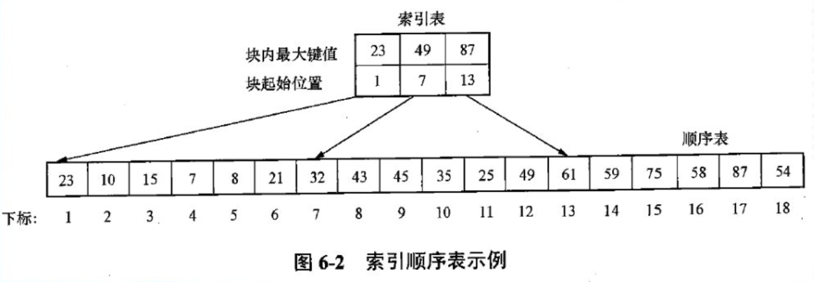
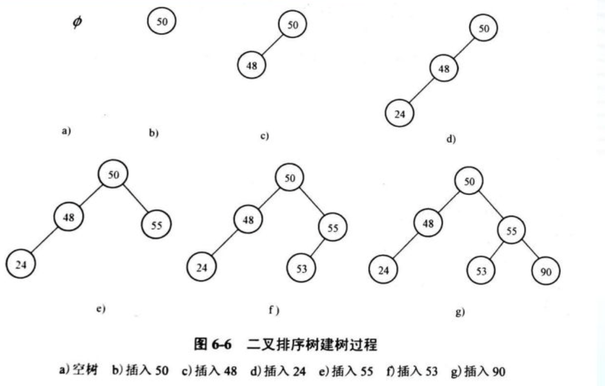
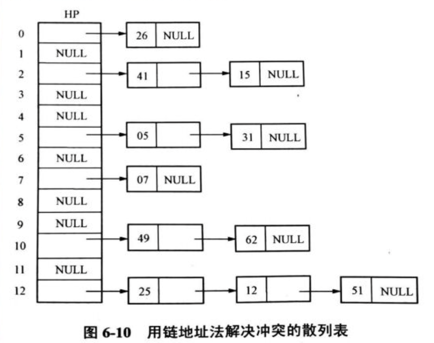

# 一、 基本概念

- 查找表 ： 由同一类型的数据元素（或记录）构成的集合。
- 关键字（键） ： 用来标识数据元素的数据项称为关键字，简称键，其值称为键值。
- 主关键字 ： 可一位标识各个数据元素的关键字
- 查找 ： 根据给定的某个 k 值，在查找表寻找一个其键值等于 k 的数据元素
- 静态查找表 ： 进行的是引用型运算（建表，查找，读表中元素）
- 动态查找表 ： 进行的是加工型运算（初始化，查找，读表中元素，插入，删除）


# 二、 静态查找表的实现

```c
const int maxsize = 20;
typedef struct
{
  keytype key;// 关键字域
  ...         // 其他域
} TableElem;

typedef struct
{
  TableElem elem[maxsize+1]; // 一维数组， 0号单元留空
  int n;                     // 最后一个元素的下标，即表长
} SqTable;
```


## （1） 顺序表的查找

从表中最后一个记录开始顺序进行查找，若当前记录关键字 = 给定值，则查找成功； 否则继续查找上一条记录； 若直到第一个记录尚未找到需要的记录，则查找失败。

```c
int SearchSqTable(Sqtable T,KeyType key)
{
  T.elem[0].key = key;
  int i = T.n;
  while (T.elem[i].key != key)
    i--;
  return i;
}

// 成功查找 (n+1)/2
// 不成功查找 n+1
```

优点： 对表无要求

缺点： 比较次数多

## （2） 有序表的查找

二分查找思想： 每次讲处于查找区间中间位置上的数据元素域给定值 K 进行标价，若不等则缩小查找区间，并在新的查找区间内重复上述过程，直到查找成功或查找区间长度为 0（查找不成功为止）。 需要表顺序方式存储，且元素按关键字有序。

```c
int SearchBin(SqTable T, KeyType key)
{
  int low,high;
  low = 1 ; 
  high = T.n;  // 当 0 的位置不存数据时 low = 1 ; high = T.n;
  while (low <= high)
  {
    int mid = (low + high)/2;
    if (key == T.elem[mid])
    {
      return mid;
    }
    else if (key < T.elem[mid].key)
    {
      high = mid-1; 
    }
    else
    {
      low = mid+1;
    }
  }
  return 0;
}

// 时间复杂度 平均查找长度为 (n+1/n) * log2(n+1) -1
```


## （3） 索引顺序表的查找

1. 先建立最大（或小） 关键字表 -- 索引表 （有序） 即将每块中最大（或最小）关键字及指示块首记录在表中位置的指针依次存入一张表中， 此表称为索引表
2. 查找索引表，以确定所叉元素所在块号。 将查找关键字 k 与索引表中每一元素（即各块中最大关键字） 进行标价哦，以确定所查元素所在的块号。
3. 在相应块中按顺序查找关键字 为 k 的记录(块间有序，块中无序)



每块含 s 个元素， n 为顺序表中数据元素的数目

时间复杂度为 (n/s+1)/2 + (s+1)/2 = (n/s + s)/2 + 1

当 s 取 根号 n 时 时间复杂度达到最小值

## （4） 三种查找表方法比较

静态查找表的上述三种不同实现各有优缺点，其中，顺序查找效率最低但限制最少，二分查找效率最高，但限制最强，而分块查找介于上述二者之间，在实际应用中应根据需要加以选择。

# 三、 动态查找表

## （1）二叉排序树

```c
typedef struct BinNode
{
	int key;
	struct BinNode *child, *rchild;
} BinNode,*BinTree;
```


### a.  二叉排序树查找

表结构是在查找过程中动态生成的，对于给定值 k ，若表中存在其关键字等于 k 的记录，则查找成功返回，否则在表中插入关键字等于 k 的记录。

一棵二叉排序树或者是一棵空二叉树，或者具有下列性质的二叉树

- 若它的左子树不为空，则左子树上所有结点的简直均小于它的根结点的键值
- 若它的右子树不为空，则右子树上所有结点的简直均大于它的根结点的键值
- 根的左右子树叶分别是二叉排序树

性质：

中序遍历一棵二叉排序树所得的结点访问序列时键值的递增序列。



二叉排序树上的平均查找长度是介于O(n) 和 O(log2n) 之间的，其查找效率与树的形态有关。

需要在二叉排序树的动态变化过程中随时调整其形态，使之保持平衡。

```c
BinTree SearchBST(BinTree bst,KeyType key)
{
  if (bst == NULL) return NULL;
  else if (key == bst->key) return bst;
  else if (key < bst->key) return SearchBST(bst.lchild,key);
  else renturn SearchBST(bst.rchild,key);
}
```

从上面的查找过程可知：在二叉排序树上进行查找，若查找成功，则是从根结点出发走了一条从根结点到待查结点的路径；若查找不成功，则是从根结点出发走了一条从根到某个叶子的路径。因此与二分查找类似，关键字比较次数不超过二叉树的深度。

### b. 二叉排序树的插入和生成

对序列 R ={k1, k2, k3, ..., kn}, k1 ~kn 均为关键字值，则按下列原则可构造二叉排序树。

1. 令 k1 为根
2. 若 k1 < k2 ， 则令 k2 为 k1 的右孩，否则为左孩
3. k3, k4, ... kn 递归重复 （2）

```c
void CreateBST(KeyType R[])
{
  	BinTree *bst = malloc(sizeof(BinNode));
  	for (int 1=0;i<n;i++)
    {
      SearchBST(bst,R[i]);
    }
}

BinTree InsertBST(BinTree bst,KeyType key)
{
  if (!bst)
  {
    temp =  
    bst->key = key;
  }
  else if (key < bst->key) InsertBST(bst.lchild,key);
  else InsertBST(bst.rchild,key);
}
```


## （2） 散列表

通过散列法建立的表称为散列表

散列函数（哈希函数） -- 设记录表 A ，长为n， ai(1<=i<=n) 为表中某一元素，ki为其关键字，则关机子ki和元素ai 在表中的地址之间有一函数关系，即：

```c
Addr(ai) = H(ki)
// Addr ai 在表中地址
// H 散列函数，关键字与元素地址的函数
```

散列地址 -- 由散列函数决定数据元素的存储位置，该位置称为散列地址。

### a. 散列查找

1. 获取给定关键字
2. 散列函数转换为在表中的地址
   - 在此位置上有欲查元素 - 输出信息
   - 在此位置上无欲查元素 - 将它填到此位置上

### b. 开放寻址法

开发寻址法就是但我们遇到了哈希冲突，我们就重新探索一个空闲位置，然后插入。

#### 1. 冲突

同义词之间出现了冲突叫冲突

定义：  k1 != k2 单 H(K1) = H(K2) 的现象称为冲突。即：不同的关键字映射到同一存储单元，摒弃 k1 和 k2 是同义词。

- 线性探测
  - 当我们往散列表中插入数据时，经过散列函数发现位置已经被占用了，我们就从当前位置开始，依次往后查找，直到找到空闲位置为止。
- *链表法  = ../../c.链表法
- 二次探索
  - 和线性探索原理一样，先行探索每次的步长为 1 ，探索的下标依次为 hash(key)+0，hash(key)+1，hash(key)+2...，二次探索每次的步长变为原来的二次方，所以每次探索的下边为 hash(key)+0，hash(key)+1^2，hash(key)+2^2。
- 双重散列
  - 原来我们使用一个散列函数，双重散列，我们使用多个散列函数，我们先用第一个散列函数，如果计算得到的位置已经被占用，就使用第二个散列函数，以此类推，直到找到空闲时的位置。
- 公共溢出
  - 按照这种方法，散列表由两个一维数组组成。一个称为基本表，它实际上就是上面所说的散列表。另一个称为溢出表。插入首先在基本表上进行，加入发生冲突，则将同义词存入溢出表。这样，基本表不可能发生堆积。

#### 2. 散列法主要工作

- 选择一个好的散列函数
  - 函数计算简便，运算速度快
  - 随机性好，地址尽可能均匀分布
  - 冲突小
- 解决冲突

#### 3.堆积

非同义词之间冲突了叫聚集（堆积）

### c. 链表法

链表法是一种更为常用的解决散列冲突的方法，比开放寻址法更加简单。在散列表中每个下标位置对应一个链表，所有经过散列函数得到的散列值相同的元素，我们都放到对应下标位置的链表中。

插入元素时，经过散列函数得到散列值，然后插入到对应下标位置的链表中即可，时间复杂度为 O(1)。查找和删除同样的对对应位置的链表进行操作，对应的时间复杂度和链表的长度有关系，也就是 O(n)。



查找成功时平均查找长度为 （查找成功次数为1的个数+ 2的个数 + ...） / 元素总个数

查找失败时平均查找长度为   元素的个数/表的长度（不包含空指针的比较）

### d. 二次探测法

二次探测法的基本思想： 生成的后记散列地址不是连续的，而是跳跃式的，以便为后序数据元素留下空间从而减少堆积。按照二次探测法，键值 key 的散列地址序列为

```
 d = H(key)    
 di(d0+i) mod m
```

其中 m 为散列表的表长， i = 1ˆ2 , -1ˆ2,2ˆ2,-2ˆ2 ... +- kˆ2 （k<=m/2）

二次探测法的缺点是不易探测到整个散列表的所有空间，也就是说，上述后继散列地址可能难以包括散列表的所有存储位置。

### d. 散列表动态扩容

前边我们提到过，当散列表的装载因子过大的时候，散列表的空闲位置变得很少，散列冲突的概率就变得很大，而且插入和查找数据的效率也会变得很低。 这个时候我们就需要对散列表动态扩容，重新申请一个更大的散列表，然后把原有的数据移到新的散列表中。

如果扩容的时候我们重新申请一个原来散列表两倍大的新散列表，原来的转载因子如果为 0.8，那么重新申请的散列表的装载因子即为 0.4。前边我们讲过数组的动态扩容，数据的迁移比较简单，而散列表数据的迁移就相对比较复杂了，因为散列表的大小变了，那么数据存储的位置也就变了，我们需要通过散列函数重新计算数据的存储的位置。

我们可以设定一个阈值，当装载因子大于阈值的时候，就需要对散列表动态扩容。

如果我们内存空间比较紧张，也可以设定另外一个阈值，当散列表的装载因子小于阈值的时候，对散列表进行动态缩容，但这样做散列表的执行效率就会降低。

所以装载因子的阈值我们要选择得当，根据实际情况来权衡时间、空间复杂度的平衡。如果更在意性能，可以适当的牺牲一些内存空间；如果内存空间紧张，可以牺牲一些性能来换取内存空间。

当我们插入数据的时候，如果装载因子大于阈值，就需要先扩容，再执行插入操作，如果散列表很大，我们扩容搬迁数据的就会非常慢，所以就导致插入数据变得非常慢。

### e. 散列函数构造方法

中转输出

#### 1.数字分析法

如果关键字是位数较多的数字（比如手机号），且这些数字部分存在相同规律

则可以采用抽取剩余不同规律部分作为散列地址

比如手机号前三位是接入号，中间四位是 HLR 识别号，只有后四位才是真正的用户号

也就是说，如果手机号作为关键字，那么极有可能前 7 位是相同的

此时我们选择后四位作为散列地址就是不错的选择

同时，对于抽取出来的数字，还可以再进行反转

右环位移，左环位移等操作

目的就是为了提供一个能够尽量合理地将关键字分配到散列表的各个位置的散列函数


数字分析法通常适合处理关键字位数比较大的情况

如果事先知道关键字的分布且关键字的若干位分布较均匀，就可以考虑用这个方法


#### 2.除留余数法

取关键字被某个不大于散列表长m的数p除后所得的余数作为散列地址。

```
H(key) = key mod p (p<=m)
```

- p 不取偶数
- p 不取关机子字符符基的n倍
- 一般选p为质数且最接近表长m的质数


#### 3.平方取中法

即取关键字平方的中间位数作为散列地址

比如假设关键字是 4321，那么它的平方就是 18671041，抽取中间的 3 位就可以是 671，也可以是 710，用做散列地址平方取中法比较适合于不知道关键字的分布，而位数又不是很大的情况


#### 4.基数转换法

例如对于十进制键值443730 ，先把她看成是十三进制的数，并转换成十进制树，然后根据散列表的长度从中选取几位作为散列地址。


#### 5.随机数法

选择一个随机数

当关键字的**长度不等**时**采用**这个方法构造散列函数是比较**合适**的


#### 6.折叠法

折叠法是将关键字从左到右分割成位数相等的几部分（注意最后一部分位数不够时可以短些）

然后将这几部分叠加求和

并按散列表表长，取后几位作为散列地址

比如假设关键字是 9876543210，散列表表长为三位

则我们可以将它分为四组 987|654|321|0

然后将它们叠加求和 987+654+321+0=1962

再取后 3 位得到散列地址即为 962

有时可能这还不能够保证分布均匀

那么也可以尝试从一端到另一端来回折叠后对齐相加

比如讲 987 和 321 反转

再与 654 和 0 相加，变成 789+654+123+0=1566

此时散列地址为 566


折叠法事先不需要知道关键字的分布，适合关键字位数较多的情况
