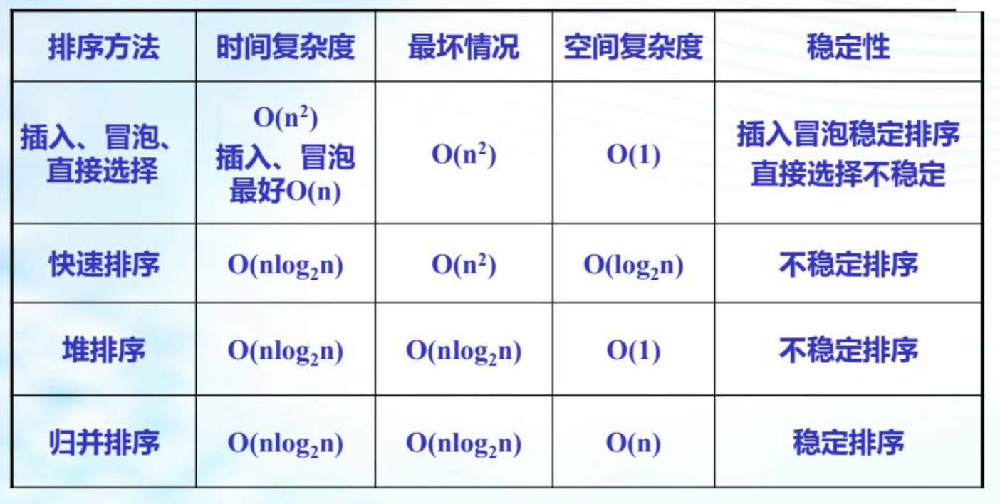

# 一、 概述

- 数据排序： 将一个问价你的记录按关机子不减（或不增）次序排列，使文件称为有序文件，此过程称为排序。
- 稳定排序： 若排序后，相同关键字的记录保持他们原来的相对次序，则此排序方法称为稳定排序。
- 不稳定排序： 排序后，相同关键字无法保持他们原来的相对次序。
- 排序类型： 
  - 内部排序： 全部数据存于内存
  - 外部排序： 需要对外存进行访问的排序过程

```c
const int n = 20;

typedef struct
{
    int key;
    int data;
} Record;

typedef Record list[n+1];

// list[0] 位置不存数据， 设立岗哨。
```


# 二、 插入排序


```c
void StraightInsertSort(list R, int n)
{
  int i,j;
  for (i=2; i<=n; i++)
  {
    R[0] = R[i];
    j = i - 1;
    while(R[0] < R[j])
    {
      R[j+1] = R[j];
      j--;
    }
    R[j+1] = R[0];
  }
}

// 基本有序 时间复杂度 O(n)
// 空间复杂度 O(1) 
// 时间复杂度 0(nˆ2) 
// 稳定性 ： 稳定排序
// 最理想情况 O(n)
```


插入排序适用于已经有部分数据已经排好，并且排好的部分越大越好。一般在输入规模大于1000的场合下不建议使用插入排序

**常用的插入排序方法有：**（洗值班表）

- 直接插入排序
- 折半插入排序
- 表插入排序
- 希尔排序

# 三、 交换排序

## （1） 冒泡排序

**基本思想：**  通过多次重复比较，交换相邻记录而实现排序，每一趟的效果都是将当前键值最大的记录换到最后。


```c
void xx(list R, int n)
{
  int i,j,s;
  for (i=1;i<n;i++)
  {
    for (j=1;j<=(n-i);j++)
    {
      s = 0
      if (R[j].key>R[j+1].key)
      {
        s = 1
        R[0] = R[j+1];
        R[j] = R[0];
      }
    }
    if (!s) return;
  }
}

// 基本有序 时间复杂度 O(n)
// 空间复杂度 O(1) 
// 时间复杂度 0(nˆ2) 
// 稳定性 ： 稳定排序
// 最理想情况 O(n)
```


## （2） 快速排序

**基本思想：** 通过分部排序完成整个表的排序，首先取第一个记录，将之与表中其余记录比较并交换，从而将它放到记录的正确的最终位置，使记录表分成两部分，{其一 （左边的）诸记录的关键字均小于它，其二（右边的）诸记录的关键字均大于它}； 然后对整个两部分重新执行上述过程，以此类推，直至排序完毕。


```c
void quickSort(list R, int h, int p)
{
  int i = h,j = p, key = R[h];
  while (i<j)
  {
    while (R[j] > key && i < j)
    {
      j--;
    } 
    if (i<j)
    {
      R[i] = R[j];
      i++;
    }

    while (R[i] < key && i < j)
    {
      i++;
    }
    if (i<j)
    {
      R[j] = R[i];
      j--;
    }
	}
  if (h<i-1) quickSort(R,h,i-1);  // 左边最多一位数
  if (j+1<p) quickSort(R,j+1,p);  // 右边最多一位数
}

// 空间复杂度O(log2n)
// 时间 O(nlog2n) 最差 O(n**2)
// 若初始记录表有序或者基本有序，则快速排序将退化为冒泡排序，其时间复杂度O(n**2)
// 不稳定排序
```


# 四、 选择排序

以重复选择的思想为基础进行排序

## （1） 直接选择排序

直接选择排序(Straight Select Sorting) 也是一种简单的排序方法，它的基本思想是：第一次从R[0]~R[n-1]中选取最小值，与R[0]交换，第二次从R[1]~R[n-1]中选取最小值，与R[1]交换，....，第i次从R[i-1]~R[n-1]中选取最小值，与R[i-1]交换，.....，第n-1次从R[n-2]~R[n-1]中选取最小值，与R[n-2]交换，总共通过n-1次，得到一个按排序码从小到大排列的有序序列。


```c
void chioseSort(list R, int n)
{
  int i,j;
  for (i=1;i<n;i++)
  {
    int min = i;
    for (j=i+1;j<=n;j++)
    {
      if (R[j]>R[min])
      {
        min = j;
      }
    }
    if(min != i)
    {
      R[0] = R[i];
      R[i] = R[min];
      R[min] = R[0];
    }
  }
}

// 不稳定排序
// 时间复杂度 O(n**2) 数组的内容不会对时间复杂度造成影响
// 空间复杂度 O(1)
```


## （2） 堆排序

将给定的数组对应称完全二叉树。

**最小堆：**  根比左右孩子小 。

**最大堆：**  根比左右孩子大。

**把非堆转换为堆：**


**堆排序过程**

1. 创建一个堆 H[0……n-1]；
2. 把堆首（最大值）和堆尾互换；
3. 把堆的尺寸缩小 1，并调用 shift_down(0)，目的是把新的数组顶端数据调整到相应位置；
4. 重复步骤 2，直到堆的尺寸为 1。


**算法：**

```c
// 时间复杂度O(nlog2**n)
// 空间复杂度O(1)
// 稳定性: 不稳定排序
```


# 五、 归并排序

思想： 比较各个子序列的第一个记录的键值，最小的一个就是排序后的序列的第一个记录。取出这个记录，继续比较各个子序列现有的第一个记录的键值，便可找出排序后的第二个记录。如此继续下去，最终就可以找到排序结果。


```c
void Merge(list a, int h , int m, int n)
{
	int k = h, j = m + 1;
  list R;
  while ((h<m)&&(j<=n))
  {
    if (a[h].key <= a[j].key)
    {
      R[k] = a[h];
      h++;
    }
    else
    {
      R[k] = a[j];
      j++
    }
    k++
  }
  while (h<=m) 
  {
    R[k] = a[h];
    h++; 
    k++;
  }
  while (j<=n)
  {
    R[k] = a[j];
    j++;
    k++;
  }
}

// 空间 O(n)
// 时间 O(nlog2n)
// 稳定性 稳定排序
```

# 六、 排序算法比较



