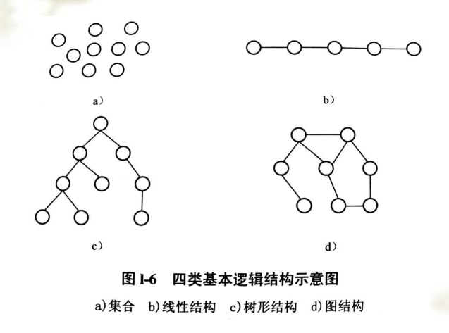

# 1.1 引言

数据结构（Data structure）是指一组相互存在一种或多种特定关系的数据的组织方式和它们在计算机内的存储方式，以及定义在该组数据上的一组操作。

**数据结构主要研究：**

- 数据（计算机加工对象）的逻辑结构。
- 实现各种基本操作的算法。

# 1.2 基本概念和术语

## 1.2.1 数据、数据元素和数据项

**数据：**  所有被计算机存储、处理的对象。

**数据元素：**  数据的基本单位，是运算的基本单位。常常又简称为元素。

**数据项：**  数据元素常常还分为若干个数据项，数据的不可分割的最小标识单位。

## 1.2.2 数据的逻辑结构

**逻辑结构：** 指数据元素之间的结构关系。与数据元素本身的形式、内容、相对位置、个数无关。

**物理结构：**  也称为存储结构，指数据结构在机内的标识、数据的逻辑结构在计算机中的实现。

**数据的四类逻辑：**

- 图结构：任何两个节点都可以相邻接。（最复杂）
- 集合：任何两个节点之间都没有邻接关系，组织形式松散。
- 线性结构：节点按逻辑关系一次排列形成一条“锁链”
- 树形结构：具有分支、层次特性，上层的节点可以和下层多个结点相邻接，但下层结点只能和上层的一个结点相邻接。

## 1.2.3 数据的存储结构

## 1.2.4 运算

# 1.3 算法及描述

# 1.4 算法分析

## 1.4.1 时间复杂度

## 1.4.2 空间复杂度

# 1.5 本书的组织结构

# 1.6 小结