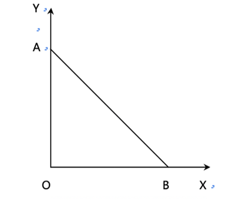

# 1 边际分析

## 1.1 收益

- 总收益： TR  指企业销售一定量的产品所得到的全部收入。 
  - 商品单价  * 销量 ： TR = P * Q
- 平均收益： AR 指企业每销售一单位产品平均得到的收入。
  -  AR = TR / Q = P * Q / Q = P 
- 边际收益： MR 指企业每增加销售一单位产品所增加的收入。
  - 边际收益 = 总收益增量 / 销量增量
  - 边际收益 = 求导

## 1.2 利润最大化

# 2 盈亏平衡分析

## 2.1 盈亏平衡分析的基本原理

**盈亏平衡分析法：**  保本分析法  总收益 = 总成本

- 横轴： 代表企业的产量或者销量
- 纵轴： 代表企业的总成本和总销售收入
- 企业固定成本保持不变
- E点： 盈亏平衡点（总收益 =  总成本）
- Q* ： 盈亏平衡点（保本点） 产量或销量

## 2.2 经营杠杆率

**经营杠杆：**   企业固定成本总额与变动成本总额的比率

# 3 生产可能性曲线及产品产量最佳组合的确定

## 3.1 生产可能性曲线

**生产可能性曲线：**  PPF 在既定资源和技术条件下，能够生产的各种产品产量的最大组合的轨迹。

- 生产可能性曲线是向右下方倾斜的。
- 在一般情况下，生产可能性曲线是向右上方凸出的。
- 通过生产可能性曲线，可以划分：
  - 生产可能性区域：生产可能性曲线上
  - 生产无效率区域：G点，生产可能性曲线内部
  - 生产不可能区域：F点， 生产可能性曲线外部

**边际转化率：** MRT  指在一定的条件下，增加单位某种产品的生产所必须放弃另一种产品的数量。

## 3.2 等收益线

**含义：**  在既定收入条件下，所必须生产的两种产品的产量的最大数量组合轨迹。

**等收益线方程：**  Px * P + Py * P = TR

**斜率：**   -△Y /△X     |    -Px / Py

## 3.3 产品产量的最佳组合确认

**含义：**  X产品的单位收益所消耗的成本  =  Y 产品的单位收益所消耗的成本。

- MCX ：X 产品的边际成本
- PX ： X 商品的价格
- MCY ： Y 商品的边际成本
- PY  ： Y 商品的价格

**注：**  等式两边谁大  少生产谁。

### （1） 资源既定，收益最大

### （2） 收益既定，资源最小

