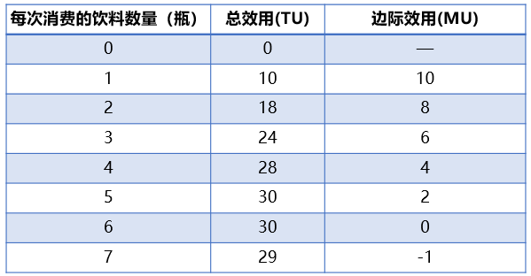
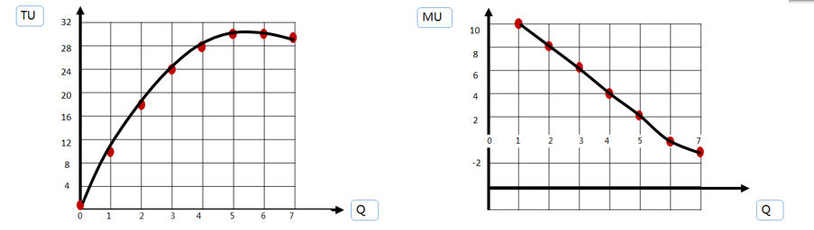
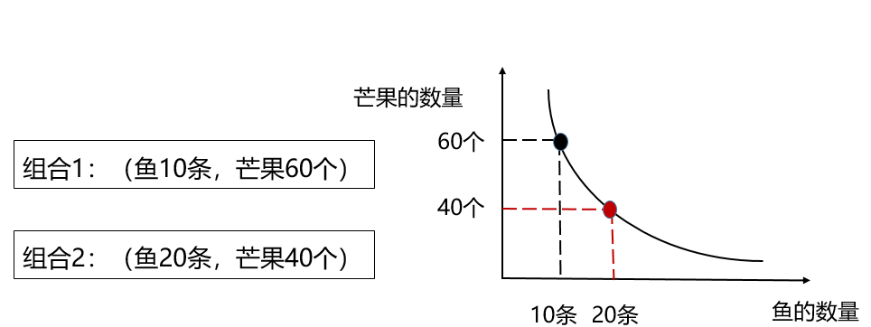
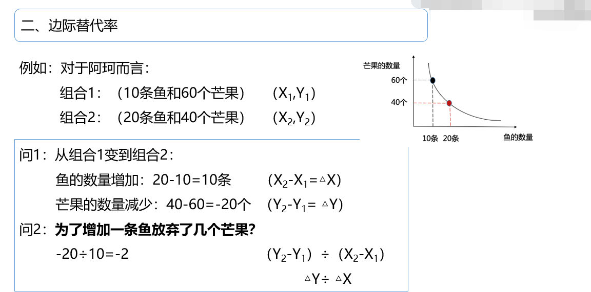
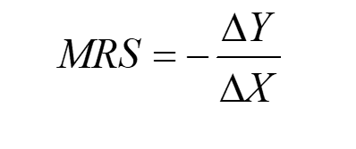
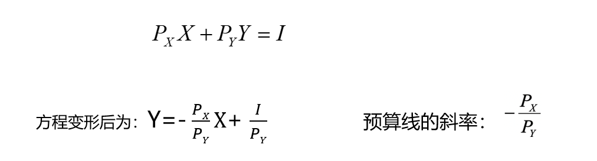
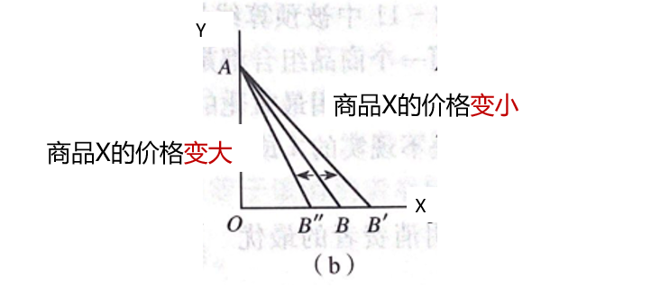
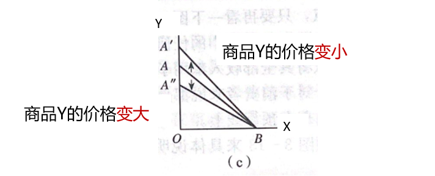
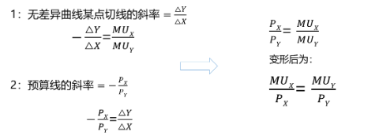

# 1 效用理论概述

## 1.1 效用（utility）

消费者在消费商品或服务时所感受到的满足。

**三个特点：**

1. 效用是消费者对商品和服务的主观评价。
2. 效用因人，因时，因地不同。
3. 效用本身不包括有关是非的价值判断。

## 1.2 效用理论的基本假设

1. 完全信息
2. 偏好次序

## 1.3 基数效用与序数效用

**基数效用论：** 形成于19实际。效用是一个数量概念。认位，一种商品或劳务效用的大小，可以用基数（1，2，3...）测量。衡量单位时效用单位（Util，尤特尔）

**例如：** 

- 吃一个面包得到的满足时 4 Utils
- 看一场电影的满足是 8 Utils

**序数效用论：** 产生于20实际30年代。效用是一个次序概念。认为，效用的绝对量大小根本无法测定，无法用某种统一的单位表示出来，他们只能根据消费者的个人偏好程度排列出效用大小的先后顺序。

**例如：**  A在苹果和桃子中，选择了苹果，放弃了桃子。则对A而言，苹果的效用大于桃子。或者说苹果效用第一（最大），桃子效用第二（次之）。

# 2 基数效用论与边际效用分析

## 2.1 总效用和边际效用

总效用（total Utility,TU）：指消费者在一定时期内从一定数量的商品消费中获得的效用量的总和。

边际效用（marginal Utility，MU）：指消费者在一定时间内增加一单位商品的消费时，所获得的总效用量的增量。

当MU>0 时，总效用曲线呈上升趋势。表明总效用会随着消费量的增加而增加，但增加的幅度是递减的。

当MU<0时，总效用曲线呈下降趋势，表明总效用随着消费量的增加而减小。

当MU=0时，总效用曲线达到最高点，表明总效用取得最大值。这种情形意味着消费者从该商品的消费中所能够得到的一切可能的满足都得到了。

## 2.2 边际效用递减规律

随着消费数量的增加，边际效用呈下降趋势的现象。

某一种商品的边际效用大小，主要取决于商品消费量的大小。

## 2.3 消费者均衡

单个消费者把有限的货币收入分配在对各种商品的购买中获得效用的最大化。

假设消费者收入 I ，之消费两种商品 X 和 Y ，其效用函数 ： U = U(X, Y)

X商品的价格为Px，Y商品的价格为Py，于是收入约束为： PxX + PyY = I

该消费者效用最大化的条件为： MUx/Px = MUy/Py

**均衡条件的含义：** 消费者使用花费在各种商品购买上的最后一元钱带来的边际效用相等，也称等边际效用原则。

**步骤总结：**

1. 利用总效用函数，求商品X和Y的边际效用。（一般是求偏导）
2. 利用消费者均衡条件  MUx/Px = MUy/Py
3. 利用总价钱的约束条件分别确定商品的价格。

**结论：**

MUx/Px = MUy/Py： 处于消费者均衡，消费者效用最大。

MUx/Px > MUy/Py： 最后一单位货币用于购买X商品所得到的边际效用大于购买Y得到的边际效用。因为消费者为了获得更多的效用，将会增加X商品的购买，减少Y商品的购买。

MUx/Px < MUy/Py：最后一单位货币用于购买Y商品所得到的边际效用大于购买X得到的边际效用。因为消费者为了获得更多的效用，将会增加Y商品的购买，减少X商品的购买。

## 2.4 个人需求曲线的推导

**消费者剩余：** 消费者愿意为某一商品支付的价格与他在购买该商品时实际支付的价格之间的差额。

- 并不是实际收入增加，只是心里感觉。
- 生活必需品的消费者剩余更大一些。

# 3 序数效用论与无差异曲线分析

**序数效用论：**  效用是一个次序概念。认为，效用的绝对量大小根本无法测定，无法用某种统一的单位表示出来，它们只能根据消费者的个人偏好程度排列出效果大小先后的顺序。

**消费者偏好：**  消费者对任意两个商品组合所做的一个排序。

## 3.1 无差异曲线

序数效用论用无差异曲线分析法来说明消费者均衡的实现。

**概念：**  表示消费者偏好相同的两种商品的不同数量的各种组合。

**无差异曲线的性质：**

1. 无差异曲线是向右下方倾斜，凸向原点。
2. 同一条无差异曲线表示两种商品不同数量的组合给消费者提供的效用是相同的。
3. 任意两条无差异曲线之间不能相交。
4. 离原点越远的无差异曲线所代表的效用水平越高。

**边际替代率（MRS）：**  消费者在保持自己效用水平不变的情况下，为了增加一种商品X的消费量所愿意放弃的另一种商品Y的消费量。

边际替代率一定为负值，为了方便起见，边际替代率一般用其绝对值表示。

**延伸：** 边际替代率：无差异曲线上某点切线的斜率。即：斜率=边际替代率。

## 3.2 消费者预算线

**预算线：**  在给定的价格和收入下，消费者把所有收入用于消费所能获得的商品组合点的轨迹。

**消费者所有收入（I）都用于购买商品X和Y，商品X和Y的价格分别为Px和Py，则预算线可用方程表示为：**

即得出：预算线的斜率等于 -Px/Py (放在横轴上的价格和放在纵轴上的价格之比)

**消费者预算线的变化：**

## 3.3 消费者均衡

在预算给定的情况下，消费者通过决定两种商品的消费量使得自己的效用最大化的状态。

