# 1 需求分析

## 1.1 需求（demand）

**需求：** 消费者在一定时间内在各种可能的价格水平之下愿意且能够购买的某种商品（或服务）的数量（消费者的数量）。

- 一种商品
- 人们愿意且能够购买
- 在一定时间内
- 除价格外，其他影响需求变动的因素都保持不变。

## 1.2 影响需求的因素

### （1） 商品的价格

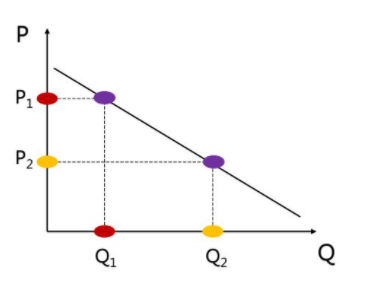

需求曲线

需求向下倾斜 \ 价格与需求成反比

纵轴（纵坐标）：价格，用 P 表示

横轴（横坐标）：需求量，用 Q 表示

### （2） 消费者收入水平

需求向上倾斜 \ 收入水平与需求成正比

### （3） 相关商品的价格

- 替代品：具有相同用途或能满足消费者相同欲望的产品。（一种物品价格上升引起另一种物品需求增加。）

- 互补品：必须要同时使用，互相补充才能满足消费者某种需要的产品。（一种物品价格上升引起另一种物品需求减少）

### （4） 消费者的偏好

此外，消费者对价格的预期，市场规模，地区特殊因素，广告费用等也会影响商品的需求。

## 1.3 需求函数

**需求函数：** 需求量与影响需求量的各因素之间所建立的函数关系。

Qd = f(P,I,PR,T.....)

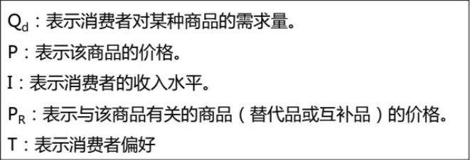

将其他因素视为不变，仅考虑商品价格与需求量之间的关系。（商品的价格对商品的需求影响最大）

函数可以表示为 Qd = f(P)

价格和需求量之间的关系描述方式：需求表 和 需求曲线。

**需求表：**

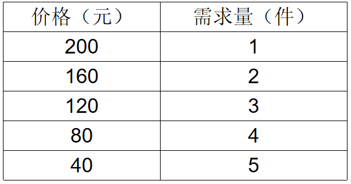

**需求曲线：**

**需求规律（需求定理）：** 同一种商品的需求量与其价格呈反方向变动。

## 1.4 个人需求与市场需求

**个人需求：** 在一定时期内，在其他因素不变的前提下，在该商品的任何一个可能的价格下，消费者个人愿意并且能够购买的某种商品的数量。

**市场需求：** 在一定时期内，在其他因素不变的前提下，在该商品的任何一个可能的价格下，市场是所有消费者愿意并且能够购买的某种商品的数量。

## 1.5 需求量的变动和需求的变动

| 名称       | 因素           | 表现形式       |
| ---------- | -------------- | -------------- |
| 需求量变动 | 价格           | 沿需求曲线变动 |
| 需求变动   | 消费者收入水平 | 需求曲线移动   |
| 需求变动   | 相关商品的价格 | 需求曲线移动   |
| 需求变动   | 消费者偏好     | 需求曲线移动   |

**需求量的变动：** 在某个时期内，在其他的条件不变的情况下，由于商品价格变动所引起的消费者愿意且能够购买的商品数量发生变动。

**需求的变动：** 在某个时期内，在某商品价格不变的条件下，由于其他因素变动所引起的该商品的需求数量变动。

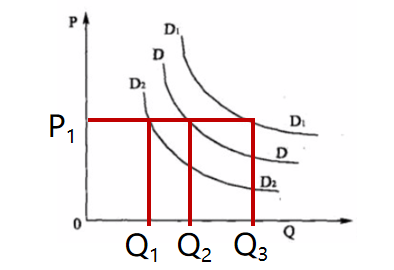

## 1.6 需求估计的方法

**市场需求曲线的估计和预测的方法：**

- 市场调查的方法
  - 访问调查法
  - 市场实验法
- 统计分析法 -- > 回归分析法
  - 建立理论模型
  - 收集数据
  - 选择函数形式
  - 对结果的估计和解释

# 2 供给分析

## 2.1 供给

**供给：** 生产者在一定时间内在各种可能的价格水平下愿意提供而且有能力提供的某种商品（或服务）的数量。

- 一种商品（或服务）；
- 生产者愿意且能够提供；
- 在一定时间内；
- 除价格外，其他影响供给变动的因素都保持不变。

## 2.2 影响供给的因素

### （1）商品的价格

供给曲线

供给向上倾斜 \ 供给与价格成正比

纵轴（纵坐标）：价格，用P表示

横轴（横坐标）：供给量，用Q表示

### （2）生产成本

生产成本越低，供给越多

### （3）替代品的价格

生产中的替代品：两种产品的效用相似，从而可以相互替代。（小米手机 or 红米手机 （同一厂商有能力并且且愿意生产的商品））

替代品的价格越高，生产替代品的利润越大，企业越愿意生产。

### （4）生产者对价格的期望

## 2.3 供给函数

供给函数：供给量与影响供给量的各因素之间所建立的函数关系。

Qs = f(P,C,PR,E......)

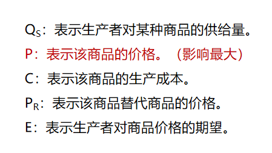

将其他因素视为不变，仅考虑商品价格与供给量之间的关系

函数可以表示为： Qs = f(P)

价格和供给量之间的关系描述方式：可以用供给表和供给曲线。

**供给表：**

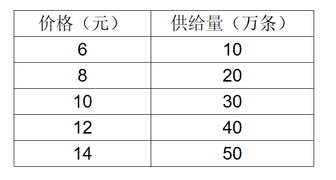

**供给曲线：**

**供给定理（供给规律）：** 同一种商品的供给量与其价格成同方向变动。

## 2.4 供给量的变动和供给的变动

| 名称       | 因素               | 表现形式       |
| ---------- | ------------------ | -------------- |
| 供给量变动 | 价格               | 沿供给曲线变动 |
| 供给变动   | 生产成本           | 供给曲线移动   |
| 供给变动   | 相关商品的价格     | 供给曲线移动   |
| 供给变动   | 生产者对价格的预期 | 供给曲线移动   |

**供给量变动：** 指某个时期内，当其他的条件不变的情况下，由于商品价格的变动所引起的企业愿意并且能够提供商品数量发生变动。

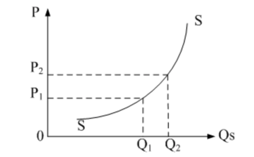

**供给变动：** 指某个特定时期内，当商品价格不变的情况下，由于其他因素的变动所引起的企业愿意并且能够提供商品数量发生变动。

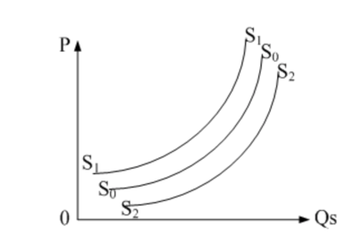

# 3 市场均衡分析

## 3.1 市场均衡与供求法则

**市场均衡：** 在影响需求和供给的其他因素都给定不变的条件下，市场上的商品价格达到这样的一种水平，即消费者愿意购买的数量等于生产者愿意供给的数量。

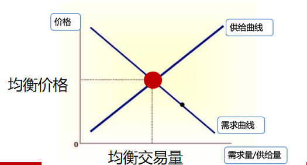

**均衡价格：** 市场处于均衡状态时的价格。

**均衡交易量（均衡产量、均衡销量、均衡数量）：** 与均衡价格相对应的成交数量。

**Q：** 给出需求函数：Qd，给出供给函数Qs ；怎么求均衡价格和均衡数量？

**A：** Qs = Qd

## 3.2 市场均衡的变动

|          | 供给未变     | 供给增加       | 供给减少       |
| -------- | ------------ | -------------- | -------------- |
| 需求未变 | 不变         | 均衡价格降低   | 均衡价格上升   |
| 需求未变 | 不变         | 均衡数量增加   | 均衡数量减少   |
| 需求增加 | 均衡价格上升 | 均衡价格不确定 | 均衡价格上升   |
| 需求增加 | 均衡数量增加 | 均衡数量增加   | 均衡数量不确定 |
| 需求减少 | 均衡价格降低 | 均衡价格降低   | 均衡价格不确定 |
| 需求减少 | 均衡数量减少 | 均衡数量不确定 | 均衡数量减少   |

**供给和需求都变动：**

- 供给曲线和需求曲线移动的一样多
  - 需求增加供给增加
    - 均衡价格不变
    - 均衡数量增加
  - 需求增加供给减少
    - 均衡价格增加
    - 均衡数量不变
  - 需求减少供给增加
    - 均衡价格降低
    - 均衡数量不变
  - 需求减少供给减少
    - 均衡价格不变
    - 均衡数量降低
- 供给曲线移动的比需求曲线移动的少
  - 需求增加供给增加
    - 均衡价格增加
    - 均衡数量增加
  - 需求增加供给减少
    - 均衡价格增加
    - 均衡数量增加
  - 需求减少供给增加
    - 均衡价格降低
    - 均衡数量降低
  - 需求减少供给减少
    - 均衡价格降低
    - 均衡数量降低
- 供给曲线移动的比需求曲线移动的多
  - 需求增加供给增加
    - 均衡价格降低
    - 均衡数量增加
  - 需求增加供给减少
    - 均衡价格增加
    - 均衡数量降低
  - 需求减少供给增加
    - 均衡价格降低
    - 均衡数量增加
  - 需求减少供给减少
    - 均衡价格增加
    - 均衡数量降低

## 3.3 价格管制对市场均衡的影响

### （1）政府规定最低价格

**最低价格（支持价格，价格下限）：**  政府为了扶持某一行业的生产、保护生产者的利益而规定的高于该行业产品均衡价格的一种非市场价格。

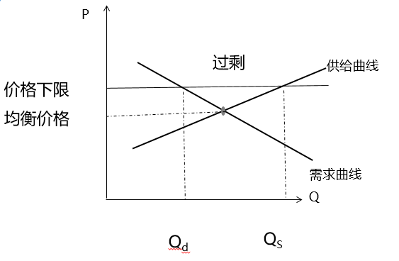

价格下限高于均衡价格：市场需求为Qd，市场供给为Qs 导致 **供给过剩** 

例如：最低工资规定；粮食最低收购价；机票最低折扣；

### （2）政府规定最高价格

**最高价格（限制价格、价格上限）：**  是指政府为了防止某些生活必需品的物价上涨而规定了低于这些物品的均衡价格的价格，即规定最高价格。

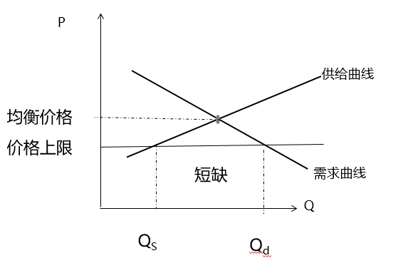

价格上限低于均衡价格：市场需求为Qd，市场供给为Qs 导致了稀缺物品。

例如：房价；

