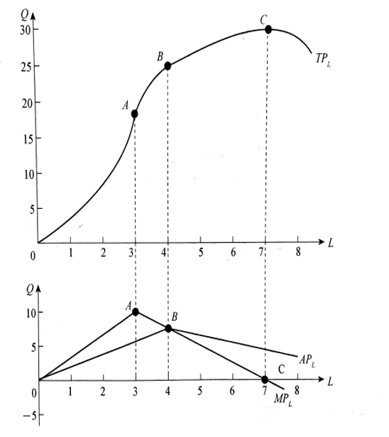

# 1 生产函数

## 1.1 生产函数的概念

**生产要素：**  指从事生产所必须投入的各种经济来源。包括： 土地、劳动、资本、企业家才能。

| 生产要素   | 标识 | 含义                                                         |
| ---------- | ---- | ------------------------------------------------------------ |
| 劳动       | L    | 人类在生产过程中提供的体力和智力的总和。                     |
| 资本       | K    | 劳动与土地两种生产要素生产出来，再用于生产过程的中间产品。   |
| 企业家才能 | E    | 企业家经营企业的组织能力、管理能力与创新能力。               |
| 土地       | N    | 自然界中一切能用于生产的物质，包括土地、矿产、阳光、雨水、海洋和森林等。 |

**生产函数：**  在一定时期内，在技术水平不变的情况下，生产中所使用的各种生产要素的数量与所能生产的最大产量之间的关系。

生产函数的一般形式为： Q  = f (L , K , N , E)

**注1：**  一定技术条件为前提。

**注2：**  生产函数表明的是一定数量的生产要素所能产出的最大产量。 

## 1.2 常见的生产函数

**柯布-道格拉斯生产函数：**  在美国制造业中，产量与劳动和资本之间的关系可用如下的函数式表示：

- Q ： 制造业生产量
- L ： 劳动
- K ： 资本
- A ： 技术水平
- α、β  都是正的常数，常用的假定是 A=1，α+β=1。

# 2 短期生产函数分析

**短期：**  在这个时期内，企业不能根据它所能达到的产量来调整其全部生产要素，只能调整部分可变要素。

## 2.1 短期生产函数的概念

**短期生产函数（单变量生产函数）：**  指企业在此期间，只有一种投入要素的数量是可变的（如：劳动力），其他投入要素的数量不变（如：厂房、机器设备等。）

-  Q ：产量
-  L ：劳动（可变的）
-  K ：资本（固定的）

短期生产函数主要研究产出量与投入的变动要素之间的关系，以确定单一可变要素的最佳投入量。  

## 2.2 总产量、平均产量和边际产量

**总产量 TP：** 一定量的某种生产要素所生产出来的全部产量。例如： TPL ： 指一定量的劳动投入所生产出来的全部产量，则：

 **平均产量 AP：** 指平均每单位某种生产要素所生产出来的产量。例如 ： APL ： 指平均每单位劳动所生产出来的产量，则：

**边际产量 MP：** 指某种生产要素每增加一单位所增加的产量。例如：MPL：指每增加一单位劳动所增加的产量，则 ：

**总产量、平均产量边际产量三者的关系：**

- 当 MPL 为 0 时 TPL 达到最大值
- MPL曲线与APL曲线在APL曲线的最高点B点相交。  

## 2.3 边际收益递减规律

**含义：** 在技术水平不变的条件下，当把一种可变的生产要素连续地投入到生产中时，最初这种生产要素的增加会使边际产量增加，但当该审查和你要素的增加超过一定数量之后，继续增加该要素的投入，边际产量开始递减，最终还会使产量绝对减少。

## 2.4 生产三阶段

- 第一阶段： 平均产量一直在递增，直至最大值。
- 第二阶段： 平均产量和边际产量都开始递减。
- 第三阶段： 边际产量变为负值，总产量开始递减。

第一第二阶段为合理阶段。L3 最合理的点。

## 2.5 一种生产要素变动时要素最佳投入量的确定

**边际产品价值 VMP：**  每增加一单位某种可变生产要素所增加的收入。

**生产要素的边际成本 MFC：**  每增加一单位的某种可变生产要素所增加的成本。

**最佳投入量：**  假定这种变动要素L的价格为PL，并且假定要素的价格（PL）固定不变，并且在企业诸多投入要素中，确定只有L要素是唯一的可变投入要素，则L生产要素的边际成本可以表示为： 边际产品价值(VMP)=变动要素的价格(PL)  

# 3 长期生产函数分析

## 3.1 等产量曲线

**含义：**  在技术水平不变的条件下，生产同一产量的两种生产要素投入量的各种不同组合的轨迹。

- 向右下方倾斜的曲线。
-  在同一平面上可以有无数条等产量曲线，原点越远的等产量曲线所代表的产量水平越高。
- 在同一平面图上，任意两条等产量曲线不能相交。
- 等产量曲线的形状反映出两种投入要素的替代性。
- 等产量曲线是一条图像远点的曲线，边际替代率递减所决定的

**边际技术替代率：**

等产量曲线上某一点的边际替代率 =  等产量曲线在该点切线的斜率

**生产要素的完全替代：**

**生产要素完全不可替代：**

**一般替代性：**

## 3.2 等成本线

**含义：**  表明成本与生产要素价格既定的有条件下，可以购买到的两种生产要素的数量最大组合的线。

- 要素价格不变，等成本线是一条直线。
- 投入成本增加，等成本线平行右移。
- 距离原点越远的等成本线表明吃出的成本越高。

**斜率：**

## 3.3 生产要素最佳组合的确定

- MPL ： 要素 L 的边际产量
- MPK ： 要素 K 的边际产量
- PL ： 要素 L 的价格
- PK ： 要素 K 的价格

MPL / PL  > MPK / PK ： 在L要素上多投入1单位货币所得到的产量**大于**在K要素上少投入1单位货币所损失的产量。    增加L要素投入，减少K要素投入。

MPL / PL  < MPK / PK ： 在L要素上多投入1单位货币所得到产量要小于在K要素上少投入1单位货币所损失的产量。    减少L要素投入，增加K要素投入。

## （1） 既定产量

选择一种要素投入的组合，使得企业能够在既定的产量下，所费成本最少。

## （2） 既定成本

选择一种要素投入的组合，使得企业能够在既定的成本下，所生产产量最大。

# 4 规模报酬

**含义：**  在一定的技术条件下，所有生产要素的投入都按同一比例变化，从而生产规模变动时所引起的产量或收益的变动。

- 第一阶段：规模报酬**递增**阶段。产量或收益增加的幅度**大于**各种要素投入增加的幅度。
- 第二阶段：规模报酬**不变**阶段。产量或收益增加的幅度**等于**各种要素投入增加的幅度。
- 第三阶段：规模报酬**递减**阶段。产量或收益增加的幅度**小于**各种要素投入增加的幅度。

**规模报酬递增的原因：**

- 技术方面的经济效果
- 管理方面的经济效果
- 商业方面的经济效果
- 金融方面的经济效果
- 承担风险方面的经济效果

# 5 生产函数与技术进步

## 5.1 技术进步导致生产函数的改变

新知识的应用和技术进步的表现：较少的投入，能够生产出与以前同样多的产品。

技术进步导致生产函数的改变，这种改变可以用等产量曲线的位移来说明。

等产量曲线位移的程度越大，说明技术进步越快。
