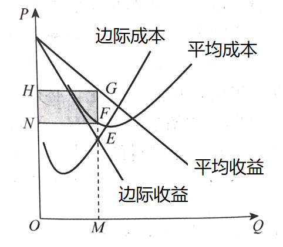

# 1 四种市场的对比

|          | 厂商数量 | 近似例子             |
| -------- | -------- | -------------------- |
| 完全竞争 | 大量     | 农产品               |
| 垄断竞争 | 较多     | 轻工业品市场、日用品 |
| 寡头垄断 | 几家     | 中国运输航空公司     |
| 垄断     | 唯一     | 电力、煤气、自来水   |

# 2 完全竞争市场中企业决策

## 2.1 完全竞争市场的条件及企业收益规律

### 2.1.1 完全竞争市场的条件

**含义：** 竞争不受任何阻碍和干扰的市场结构。

- 市场上有**大量**的卖者和买者。
  - 市场均衡价格由供求关系决定，不由买者或卖者决定。
- 市场上所出售的还是那个品和劳务是**同质**的，即不存在产品差别。
- 市场上的各种生产资源可以充分**自由**的流动，不受任何因素的阻碍。
- 市场信息是**畅通**的。

### 2.1.2 完全竞争市场中的企业收益规律

- 企业需求曲线（dd 曲线）： 市场上对某企业的产品的需求状况

  

- 平均收益曲线（AR 曲线）

  

- 边际收益曲线（MR 曲线）

  

在完全竞争市场中：企业是市场价格的接受者。

也就是企业不做价格决策

但是产出决策（成本、收益、利润）还是要做的。

## 2.2 完全竞争市场中的企业决策

### 2.2.1 企业短期决策

- 盈利均衡图（赚钱）

  

  企业成本水平低：平均成本 SAC  < 价格P

  利润最大化原则：边际收益 MR  = 边际成本  MC （E点）

  总收益：长方形 NOME

  总成本：长方形 DOMF

  利润：长方形 NDFE

- 盈亏平衡均衡图（不赚不赔）

  

- 亏损均衡图（赔钱）

  

**停业营业点原则：**  在短期生产状态下，企业处于亏损状态，这时在决策中将固定成本看成沉没成本，不考虑其大小和回收问题。根据价格 P 和平均变动成本 AVC最低点  的关系，来决定企业是否继续维持生产。

- 若价格＞平均变动成本，继续生产；
  若价格＝平均变动成本，继续生产或停止生产均可；
  若价格＜平均变动成本，停止生产；

### 2.2.2 企业短期长期决策   

**企业短期内出现亏损：**

- 长期内企业会考虑退出或缩小生产规模
- 整个行业生产和供给减少
- 需求不变，供给减少：市场均衡价格上升
- 平均收益和边际收益提高，需求曲线上移
- 亏损消失

**企业短期出现超额利润：**

- 长期内扩大自己的生产规模或吸引新企业
- 整个行业生产和供给增加
- 需求不变，供给增多：市场均衡价格下降
- 平均收益和边际收益减少，需求曲线下移
- 超额利润小时，企业获得正常利润

## 2.3 完全竞争市场经济绩效的评价

**竞争战略：** 在一个行业或一组经营活动中寻求经济优势或者一个有利竞争地位。

在完全竞争市场，从长期来看，完全竞争企业的许多竞争优势都不会长久保持，既不可能获得持久的经济利润，最终企业只能获得正常利润。

竞争程度越高，经济效率越高。

垄断程度越高，经济效率越低。

**生产者剩余：**  卖者得到的货币额减去可变生产成本后的差额。生产者剩余实际上是衡量卖者参与市场所得到的收益。

**资源配置：**  在完全竞争市场中，企业利润最大化的均衡点上出现价格 = 边际成本，说明了资源在各种产品的生产之间的配置处于最优状态。

# 3 垄断市场中的企业决策

## 3.1 垄断市场的条件及企业规律

### 3.1.1 垄断市场的条件及其形成原因

**垄断市场：**  一家企业完全控制整个行业的市场结构，即一家企业控制了某种产品或服务的市场。

**垄断市场形成的根本原因：**  进入障碍

**垄断市场的条件：**

- 关键资源由企业拥有。
- 某一企业比其他企业拥有更改的效率。
- 政府给与企业排他性生产或销售某种产品或服务的权利。

### 3.1.2 垄断市场中的企业收益规律

- 垄断市场的需求曲线 dd 曲线

  

- 垄断市场平均收益曲线  AR 曲线

  

- 垄断企业边际收益曲线  MR 曲线

  

## 3.2 垄断市场的中的企业决策

**限制：**  

- 收到市场需求状况的限制
- 收到生产成本的限制

### 3.2.1 短期决策

- 盈利

  

  利润最大化原则：边际收益MR=边际成本MC，E点
  确定产量：线段OM
  价格：线段OH
  平均成本：线段MF
  总收益：OMGH
  总成本：OMFN
  利润：NFGH

- 盈亏平衡

  

- 亏损

  

**停业营业点原则：**  在短期生产状态下，企业处于亏损状态，这时在决策中将固定成本看成沉没成本，不考虑其大小和回收问题。根据价格 P 和平均变动成本 AVC最低点  的关系，来决定企业是否继续维持生产。

- 若价格＞平均变动成本，继续生产；
  若价格＝平均变动成本，继续生产或停止生产均可；
  若价格＜平均变动成本，停止生产；

### 3.2.2 长期决策

**企业短期出现超额利润：**  在垄断市场中，短期获得超额利润，这时如果别的企业想进入市场，会有进入壁垒，所以垄断企业在长期依然存在超额利润。

**企业长期均衡的条件：**   MR = LMC

**垄断企业没有供给曲线**

### 3.2.3 垄断企业的竞争战略

- 细分市场
- 进入障碍
  - 绝对成本优势，规模经济，先行合约，剩余生产能力
  - 先驱品牌优势，推出成本，信息障碍 

## 3.3 垄断管制

### 3.3.1 垄断与低效率

**垄断和消费者剩余**

**寻租：**   指个人和团体为了把别的收入重新分配（或转移）到自己手中，而花费资源来影响政府的公共政策的行为。

**净损失：**  部分笑着剩余的减少并没有转移给生产方或其他方。

### 3.3.2  政府对垄断的管制

- 价格管制
  - 按边际成本定价：提高效率，使得社会资源得到最优配置。
  - 按平均成本定价：更低的公平价格。
- 反垄断法 （西方 反托拉斯法 ）

# 4 垄断竞争市场中的企业决策

## 4.1 垄断竞争市场的条件和企业收益规律

### 4.1.1 垄断竞争市场的条件

**垄断竞争市场：**  在一个市场中，有许多企业生产和销售有差别的同种商品的市场结构。

**垄断竞争市场具备的条件：**

- 市场上有较多企业，彼此之间存在激烈的竞争。
- 产品之间既存在一定的差别，又有一定的替代性。
- 企业进出行业比较自由。  

### 4.1.2 垄断竞争市场企业收益规律

（三个图和垄断市场一样）

在任何轻快下  dd 和 AR 都是重合的 。

- 企业需求曲线（dd）  

  

- 平均收益曲线（AR）

  

- 边际收益曲线（MR）

  

## 4.2 垄断竞争企业中的市场决策

### 4.2.1 企业的短期决策

- 盈利
- 盈亏平衡
- 亏损

**确定企业盈亏四部：**

- 边际收益 = 边际成本
- 确定产量
- 有产量确定价格、平均成本
- 总收益和总成本

**垄断竞争与垄断企业决策的区别：**

- 垄断企业成本：生产成本
- 垄断竞争企业：有生产成本，还有销售成本（广告，人工促销，新品展览等）

### 4.2.2 企业长期决策

长期无超额利润，和亏损

经济利润 = 0 即长期均衡

### 4.2.3 垄断竞争起的竞争战略

- 品质竞争
- 促销活动

# 5 寡头垄断市场中的企业决策

## 5.1 寡头垄断市场的条件和企业收益规律

### 5.1.1 寡头垄断市场的条件

**寡头垄断市场：**  少数几家企业控制了某一行业的市场，供给该行业生产的大部分产品。

- 在一个行业中只有，少数几家企业。
  - 寡头垄断市场中，最大的 4 家企业市场占有率一般为 70% - 100% （市场集中度）
  - 垄断竞争市场中，最大的 4 家企业市场占有率一般为 20% - 40 %
- 企业之间存在相互制约、相互依存的关系。
- 新企业进入行业比较困难

### 5.1.2 寡头垄断市场的形成原因及分类

**寡头垄断形成原因：**  进入障碍

- 规模经济的存在
- 行业中现有寡头垄断企业拥有重要原材料或关键技术，阻止了竞争者进入行业，从而少数几家企业就可实现寡头垄断。
- 由几家企业控制了分销渠道。
- 现有寡头垄断企业可能受到政府的保护，或政府的规定有时提供了反对垄断的抵消力量。

**寡头垄断市场的分类：**

- 产品差别程度
  - 纯粹寡头垄断：各企业所生产的产品性质一致，产品彼此之间没有差别。企业之间彼此关系密切、相互依存程度高。
  - 差别寡头垄断：各企业所生产的产品性质一致，但存在一定程度的差别。企业之间彼此依存的程度比较低。
- 企业的行动方式
  - 共谋行为的寡头垄断：各寡头企业相互勾结起来形成一个像垄断企业那样的整体，并像垄断企业那样行动，由此各企业就可以联合获取最大利润。 
           勾结：在一个行业中企业相互间有着明示或暗示的不再竞争的协议。
                     例如：卡特尔
  - 独立行为的寡头垄断

**共谋行为的寡头垄断形成的条件：**

- 行业中只有很少几个企业，且相互之间非常了解；
- 关于生产成本和生产技术，相互之间没有什么秘密；
- 有相似的生产方法和平均成本，使得它们愿意在相同的时间以相同的比例改变价格；
- 生产的产品相似，容易在价格上达成一致；
- 有一个主导企业（在行业中占统治地位或支配地位的企业）；
- 存在有效的进入障碍；
- 市场需求是稳定的；
- 没有政府对企业之间的共谋进行控制。

## 5.2 寡头垄断市场的企业决策

### 5.2.1 古诺模型 （独立行动寡头垄断）

​    19世纪法国经济学家安东万•奥古斯汀•古诺在1938年出版的《财富理论的数学原理研究》一书中研究了寡头垄断市场的一种特例：两家寡头垄断一个市场(双头垄断市场)。
最早提出对双头垄断市场的均衡解释，一般称为古诺模型。

**古诺模型假设条件：**

- 一种产品市场上只有两家企业（假定为甲企业与乙企业）；
- 两家企业生产和销售的产品完全相同；
- 生产的变动成本为零；
- 共同面临的需求曲线是线性的，即需求曲线是一条向右下方倾斜的直线，两家企业分享市场，且双方对需求状况了如指掌；
- 各方都根据对方的行动做出自己的决策，即每个企业决策时，假定其他企业产出固定不变，并都通过调整产量来实现最大利润。

### 5.2.2 斯威齐模型 （独立行动寡头垄断）

**斯威齐模型（弯折的需求曲线模型）：**  美国经济学家斯威齐在1939年对价格刚性提出一种解释。

**价格刚性：**  当成本有一定量的改变时，价格却保持不变。（价格决定之后，就具有一定的相对稳定性，即使成本改变，每个寡头企业都不会轻易改变价格。）

**斯威齐模型基本假定条件： **  竞争对手响应降价但不响应提价。

- 当一家企业降价时，所有其他企业为了不减少销售量，会马上做出反应降低价格；
- 当一家企业提价时，所有其他企业为了增加自己的销售量则毫无反应，并不提高价格。

### 5.2.3 非合作博弈 （独立行动寡头垄断）

**博弈论：**  数学家约翰·冯·诺伊曼和经济学家奥斯卡·摩根斯坦提出。用来分析个人或者组织在目标冲突时的决策行为。

**决策者在博弈过程中：** （以完全利己注意的方式行事）

- 视图通过博弈行动使自己达到最优地位
- 充分认识到在博弈过程中参与者相互影响的特性
- 预测其他决策者的行为

**企业在以下条件可能出现合作：**

- 重复博弈
- 外界强制性力量加入

**在博弈论中，最重要的概念是：策略和收益。**

### 5.2.4 共谋寡头模型 （共谋寡头垄断）

**共谋行为的寡头垄断：**各寡头企业相互勾结起来形成一个像垄断企业那样的整体，并像垄断企业那样行动，由此各企业就可以联合获取最大利润。 

**勾结：**在一个行业中企业相互间有着明示或暗示的不再竞争的协议。

**共谋寡头模型分类：**

- 卡特尔：
  - 含义： 一个行业的各独立企业之间通过对有关价格，产量和市场划分等事项达成明确的协议而建立的组织。是寡头市场中各企业用公开的方式互相勾结以达到协调行动的一种形式。
  - 原则：组建卡特尔组织的目的是维持高价，使联合利润最大化。
  - 卡特尔组织不稳定的原因
    - 产量分额分配中的问题
      - 成本高，产量配额少；成本低，产量配额搞。
    - 在许多国家，公开的卡特尔是违法的。
    - 作弊问题：
      - 当产品价格弹性高时候，稍微一降价，会获得高额利润（暗中）
    - 市场进入问题
- 价格领袖：
  - 含义： 一个行业的价格通常由某一企业率先制定，其余企业追随其后确定各自的价格。这是寡头企业之间的一种默契，因而是一种暗中勾结。 
  - 价格领袖的模式：
    - 支配性价格领袖模式： 领先确定价格的企业是本行业中最大的、具有支配地位的企业。  
    - 效率型价格领袖模式：领先确定价格的企业是本行业中成本最低，效率最高的企业。  
    - 晴雨表型价格领袖： 一般是一个企业首先对价格进行变动，而这个变动又能为其他企业所接受。  

