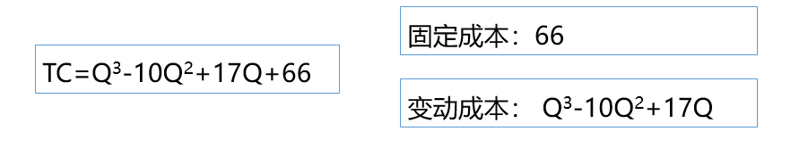
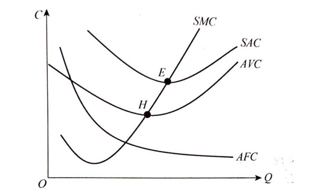

# 1 成本与利润概述

## 1.1 成本的含义

**成本  C：**   企业进行生产经营活动所使用的生产要素的价格，或生产要素所有者必须得到的报酬或补偿。

## 1.2 成本的分类

### （1）固定成本和变动成本

**固定成本：**  成本的总额不随产量变化。

**变动成本：**  成本的总额会随着产量变化。

### （2）增量成本和沉没成本

**增量成本（相关成本）：** 由于某项生产决策而产生的相关成本，即总成本的增量。

**沉没成本（非相关成本）：**  企业已经发生而无法收回，或不因生产决策改变的成本。

### （3）显性成本和隐性成本

**显性成本：**  企业购买或租用所需要的生产要素的实际支出。

**隐性成本：**  在形式上没有支付义务的，企业为使用自己提供的那一部分生产要素而支付的作为报酬的费用。

### （4）会计成本和机会成本

**会计成本：**  在财务分析中使用的一种成本概念。它指企业在生产活动中按市场价格支付的一切生产要素的费用。

**机会成本：**  生产者所放弃的使用相同生产要素在其他生产用途中所能得到的最高收入。

## 1.3 利润

### （1）正常利润

**含义：**  企业家才能的报酬，承担风险的报酬，企业家人才的价格，企业家人才的机会成本。

### （2）经济利润（超额利润）

**含义：**  指企业的总收益和总成本之间的差额。

### （3）会计利润

**含义：**  企业销售产品的总收集减去会计成本（显性成本）后的余额。

### （4）利润贡献

**含义：**  总收益减去变动成本后的余额。

# 2 短期成本和长期成本分析

## 2.1 短期成本分析

- **短期总成本：**  STC 指企业在短期内生产一定量产品所消耗的全部成本
  - **总固定成本：**  TFC  
  - **总变动成本：**  TVC
- **短期平均成本：** SAC 指企业在短期内平均每一单位产品所消耗的成本
  - **平均固定成本：** AFC
  - **平均变动成本：** AVC
- **短期边际成本：** SMC 指企业在短期内每增加一单位产品所增加的成本 。
  - **短期总成本的增量：**  △STC
  - **总产量的增量：** △Q 

1. AFC—直向右下方倾斜，表明随着产量的增加，分摊到每件产品中的固定费用减少。
2. AVC、SAC、SMC曲线都呈“U”形，表明这三种成本最初都随着产量的增加而下降，当下降到一定程度后，又随着产量的增加而上升。
3. SMC与SAC一定相交于SAC的最低点（E点）  .
4. SMC与AVC相交于AVC的最低点（H点）。

## 2.2 长期成本分析

- **长期总成本：**  LTC 企业在长期中调整生产规模，生产各种产量所需的最低成本点的轨迹。
- **长期平均成本：**  LAC  单位产量所分摊的长期总成本。 （LTC / Q）
- **长期边际成本：**  LMC  当企业有足够的时间根据生产产量调整其固定要素时，每增加一个单位的产量所增加的总成本。

