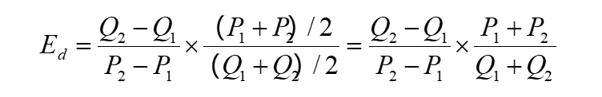

>  **弹性（elasticity E）：**  因变量的相对变化对自变量相对变化的敏感程度。  
>
> 价格弹性 = 因变量 / 自变量

# 1 需求弹性

## 1.1  需求价格弹性

**含义：**  一种商品需求量变动对其价格变动的敏感程度。一般用需求价格弹性系数来表示需求价格弹性的大小。

> 根据需求定理，在其他因素不变的条件下，同一种商品的需求量与其价格的变化方向相反，所以对于大部分商品而言，其需求价格弹性的计算结果是负值。
>
> 在实际应用中，为了方便期间，商品的需求价格弹性一般都用绝对值
>
> 计算出来的需求价格弹性系数越大，说明该商品的需求量对其价格变动的反应灵敏度越高

**需求价格弹性的种类：**   根据需求价格弹性系数绝对值大小，可以把商品的需求价格弹性分为五种类型。

| 需求价格弹性系数（绝对值） | 需求价格弹性类型 | 例子       |
| -------------------------- | ---------------- | ---------- |
| Ed = 0                     | 需求完全无弹性   | 食盐       |
| Ed < 1                     | 需求缺乏弹性     | 食品、药品 |
| Ed = 1                     | 需求单位弹性     | 无         |
| Ed > 1                     | 需求富有弹性     | 奢侈品     |
| Ed = 无穷大                | 需求完全弹性     | 无         |

**影响需求价格弹性的主要因素**

1. 商品的替代性
2. 商品用途的广泛性
3. 商品对消费者生活的重要程度
4. 商品的消费支出在消费者预算总支出中所占的比重
5. 所考察的消费者调节需求量的时间

**需求价格弹性的应用：**

- 当富有弹性时，降价使企业的销售收入增加，而涨价会使企业的销售收入减少。
- 当缺乏弹性时，降价使企业的销售收入减少，而涨价会使企业的销售收入增加。
- 当需求单位弹性时，无论涨价还是降价，企业的销售收入不变（涨价和降价比）
- 当需求完全弹性时，在既定价格上， 消费者对这一商品的需求量是无穷大的，收入可以无限增加，因此，企业不会降价销售。但如果企业提高商品的价格，该商品便无人问津，企业销售收入减少为零。

### (1) 一般公式

> Q 和 P 的值分别是变化前的商品需求量和商品价格。

- Ed 为需求价格弹性系数
- Q为商品需求量
- △Q 为商品的变化量
- P为商品价格
- △P为商品价格的变化量

### (2) 弧弹性公式

>  Q 与 P 取需求量和价格变化前后的平均值。

- Q1 ： 变化之前的商品需求量
- Q2 ： 变化之后的商品需求量
- P1 ： 变化之前的价格
- P2 ： 变化之后的价格

### (3) 点弹性公式

> 前提是必须已知该商品的需求函数。

- dQ/dP ： 求导
- P  ： 价格
- Q ： 需求量

## 1.2 需求收入弹性

**含义：**  指一种商品需求量的变动对收入变动的反应程度。

- EM ： 需求收入弹性系数
- M ： 为消费者收入水平
- △M ： 消费者收入的变动量
- Q ： 某商品的需求量
- △Q ： 某商品需求量的变动量

**注1：**  需求收入弹性的公式和 需求价格弹性公式相同。

**注2：**  需求收入弹性系数不需要取绝对值。

**收入弹性的种类：**  

| 需求收入弹性系数 | 类型             | 例子       |
| ---------------- | ---------------- | ---------- |
| EM < 0           | 需求收入负弹性   | 公共交通   |
| EM = 0           | 需求收入无弹性   | 食盐       |
| EM > 0           | 需求收入缺乏弹性 | 生活必需品 |
| EM = 1           | 需求收入单位弹性 | 衣服       |
| EM > 1           | 需求收入富有弹性 | 奢侈品     |

- EM <= 0 的商品 ：特殊商品或低档商品
- EM > 0 的商品 ： 正常商品

**食物支出的收入弹性：**

- 恩格尔系数越高，越贫困。

## 1.3 需求交叉弹性

**含义：**  一种商品的需求量的变动对于它的相关商品的价格变动的反应程度。

- Ec : 需求交叉弹性系数
- △Qx ： x 商品需求变动量
- Qx ： x 商品的需求量
- △Py ： y 商品的价格变动量
- Py ： y 商品的价格

**注1：**  需求收入弹性的公式和需求价格弹性公式相同。

**注2：**  弹性 =  因变量 / 自变量

**注3：**  与需求价格弹性公式的区别就是 x 商品的需求量 与 y 商品价格之比。

**交叉弹性的种类：**

- Ec > 0 ： 两种产品间有替代关系。
- Ec < 0 ： 两种产品间有互补关系。
- Ec = 0 ： 两种产品之间没有关系。

# 2 供给弹性

## 2.1 供给价格弹性

**含义：**  指一定时期内一种商品供给量相对变动相对于其价格的相对变动的反应程度。

## 2.2 供给价格弹性分类

| 供给价格弹性系数 | 类型         | 例子             |
| ---------------- | ------------ | ---------------- |
| Es = 0           | 供给无弹性   | 珍贵艺术品、古董 |
| 0 < Es < 1       | 供给缺乏弹性 | 农产品           |
| Es = 1           | 供给单位弹性 | 无               |
| Es > 1           | 供给富有弹性 | 工业品           |
| Es = 无穷大      | 供给无限弹性 | 无               |

