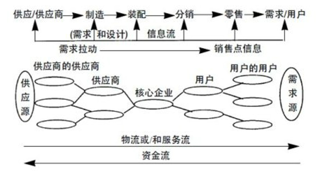

# 1 供应链管理概述

## 1.1 供应链的概念

**供应链： **  围绕核心企业，通过对信息流、物流、资金流的控制，从采购原材料开始，制成中间产品以及最终产品，最后由销售网络把产品送到消费者手中的将供应商、制造商、分销商、零售商，直到最终用户连成一个整体的网链结构模式。

- 中心：核心企业
- 控制：信息流、资金流、物流                      **（三流）**
- 网络：原料供应商、制造商、分销商、零售商、最终消费者**（四商一者）**

## 1.2 供应链管理的概念

- 供应链管理的目标是为了给顾客提供满意的产品或服务
- 供应链管理是一种集成管理模式
- 供应链管理最终为供应链中所有成员带来价值增值
- 供应链管理强调提高整个供应链的竞争能力
- 对供应链进行优化配置来实现目标

## 1.3 供应链管理与传统管理的区别

**传统管理的特点：**

- 传统管理模式强调的是企业内部的协调
- 传统管理模式强调提高企业自身的核心竞争力
- 传统管理模式强调提高企业自身效率
- 传统管理模式强调大规模生产

**供应链管理与传统管理的区别**

- 供应链管理强调采用集成的思想和方法
- 供应链管理强调提高整个供应链的核心竞争力
- 供应链管理强调提高整个供应链的效率
- 供应链管理强调大规模定制

## 1.4 供应链管理的意义

**供应链管理最完美的状态：**

将合适的**产品**在合适的**时间**、按照合适的**数量**、合适的**质量**和合适的**状态**送到合适的**顾客**的合适**地点**，从而使总成本最小或收益最大。

**供应链管理的7R原则：**

- 合适的产品
- 合适的时间
- 合适的数量
- 合适的质量
- 合适的状态
- 合适的地点
- 合适的顾客

**供应链管理的意义：**

- 实现了对顾客需求的快速反应
- 减少库存，降低成本
- 提高产品的生产和服务质量
- 简化组织，提高效率
- 提高供应链的竞争优势

# 2 供应链管理环境下的生产管理

## 2.1 制定生产计划面临的问题

**企业生产计划： ** 是在企业总体计划的指导下，用来指导总进度计划的较为详细的计划。

**制定生产计划面临的问题：**

- 生产能力
- 生产进度
- 柔性约束：有效应对不确定的因素

## 2.2 供应链管理环境下生产计划的制定

- 具有纵向和横向的信息集成过程：纵向指供应链由下游向上游的信息集成，横向指生产相同或类似产品的企业之间的信息共享
- 计划信息循环过程中突破了企业的限制：在供应链管理的环境下，生产计划的信息流跨越了企业运行
- 能力平衡在生产计划中发挥了重要作用：能力平衡是通过分析生产任务与生产能力之间的差距来对计划进行修正的过程

## 2.3 供应链管理环境下的生产控制

- 生产进度控制
- 供应链的生产节奏控制
- 库存控制和在制品管理
- 提前期管理：供应商提前供应，交货时提前交货，有利于应对不确定因素

# 3 供应链管理环境下的物流管理

## 3.1 物流管理的含义

**物流： ** 供应链范围内企业之间的物资转移活动（不包括企业内部）。一般认为，供应链是物流、信息流、资金流等的统一。

## 3.2 供应链管理环境下物流管理的特点

- 提高了物流系统的快速反应能力
- 提高了顾客的满意度
- 增进了物流系统的无缝连接
- 物流服务方式的多样化
- 降低了物流系统的成本

## 3.3 供应链管理环境下物流管理的策略

- **利用第三方物流：**第三方物流是由供应方与需求方以外的物流企业提供物流服务的业务模式。

  **利用延迟化策略：**不提前进行物流运输，而是拿到顾客具体订单后，再进行物流运输。

# 4 供应链管理环境下的库存管理

## 4.1 库存成本

- 存储成本
  - 折旧、退化、变质、损坏、偷窃等
- 订货成本
  - 订货与收到库存的成本

## 4.2 供应链管理环境下库存管理的要求

- 应确立供应链的**整体观念**
- 应重视**不确定性**对库存的影响——企业库存高的**最主要因素**
- 库存控制策略应**灵活化**
- 应进行**有效的**合作与协调
- 产品的**过程设计**应考虑供应链上库存的影响

## 4.3 供应链库存管理的方法

- 供应商管理用户库存（Vendor Managed Inventory，VMI）

  - VMI的思想是供应商在用户的允许下设立库存，确定库存水平和补给策略，拥有库存控制权。

  - 库存状态透明性是实施供应商管理用户库存的关键——供应商随时跟踪检查销售商的库存状态，可以快速响应市场需求变化

    

- 联合库存管理（Joint Managed Inventory，JMI）

  - 联合库存强调供应链节点企业同时参与，共同制定库存计划、

# 5 供应链管理环境下的采购管理

## 5.1 供应链采购管理的特点

- 从为库存而采购到为订单而采购的转变
- 从采购业务管理向外部资源管理转变
- 从一般买卖关系向战略协作伙伴关系转变

## 5.2 准时采购特点

准时采购的基本思想：在恰当的时间、恰当的地点，以恰当的数量、恰当的质量提供恰当的物品。它是从准时生产发展而来的，是为了消除库存和不必要的浪费而进行持续性的改进。

