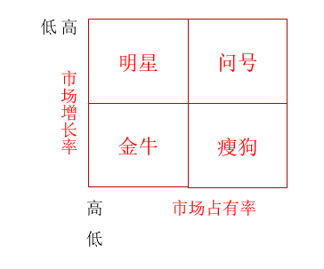

# 1 战略的性质与类型

## 1.1 企业战略的三个层次

- 企业的总体战略：又称经营战略，是企业整体运行的指导思想。
- 事业层战略：又称竞争战略，业务层次战略、SBU战略，指导具体战略经营单位。
- 职能战略：又称职能部门战略，是企业研发，生产，财务，人力等部门的战略计划。

## 1.2 企业战略管理的特点

- 整体性
- 长期性
- 权威性
- 环境适应性

## 1.3 企业战略管理的过程

1. 确定企业使命
2. 明确企业的目的和目标
3. 企业战略条件分析
4. 制定战略方案
5. 战略方案选优
6. 战略的实施和修正 

# 2 企业战略环境分析

## 2.1 企业环境的构成

**微观环境：**

- 企业自身
- 供应商
- 顾客
- 竞争对手

**宏观环境：**

- 人口环境
- 经济环境
- 自然环境
- 政治环境等... ... 

**宏观环境特点：**

- 相对稳定状态（大的趋势）
- 缓慢发展状态
- 动荡不定状态（偶尔）

## 2.2 产业环境分析的内容

- 产业的特性
- 产业的寿命周期
- 产业发展的状况
- 产业的竞争结构

产业环境决定了企业参与竞争的领域特征，产业的发展制约着企业的发展。

## 2.3 产业的寿命周期

- 导入期
  - 风险： 高
  - 收益： 负
  - 企业数量： 少
- 成长期
  - 风险：高
  - 收益：有但是很少
  - 企业数量：变多
- 成熟期
  - 风险：低
  - 收益：高
  - 企业梳理：高
- 衰退期
  - 收益：降低
  - 企业数量：减少

## 2.4 产业的竞争结构分析

**迈克尔·波特 的五力竞争说：**

- 行业内的竞争者
- 顾客
- 潜在的加入者
- 供应者
- 替代品

# 3 企业资源和能力分析

## 3.1 企业的核心能力

**核心能力：**  是企业独有的、能够支撑企业长期竞争优势的能力。

**核心产品是核心能力的载体。**

**核心能力要素：**

- 员工的知识和技能
- 技术体系 -- 经过多年的积累，经过整理而成的技术知识系统。
- 管理体系 -- 使用知识和创造知识的控制系统。
- 价值观念与行为规范 -- 是企业文化的一种形式。

## 3.2 核心能力的特性

- 异质性
- 难模仿性
- 动态性
- 扩展性
- 不可交易性
- 有价值的创造能力

## 3.3 企业核心能力的源泉

- 企业的资源
  - 有形的资产
  - 无形的资产
- 企业的内聚能力 -- 协调资源并创造价值的技能。

**如何判断企业资源的价值：**

- 稀缺性
- 持久性
- 可替代性

# 4 经营战略的分析与制定

## 4.1 战略分析

**战略分析的主要内容和方法：**

- 市场细分： 企业按照某个（些）“细分变数”把整个市场细分为若干需要不同产品和市场营销组合的亚市场。
- 产业分析
- 竞争对手分析
- 竞争优势分析【价值链模型】
  - 基本活动（和消费者有直接关系）
    - 生产经营
    - 市场销售
    - 售后服务
    - 内部后勤
    - 外部后勤
  - 辅助活动
    - 企业基础设施
    - 人力资源管理
    - 技术开发
    - 采购

**战略选择：**

- 发展性企业战略
- 稳定性战略
- 紧缩型战略
- 组合战略

## 4.2 发展型企业战略

- 集中发展型战略：集中企业的全部资源，以快于过去的增长速度来增加现有产品的劳务的销售额，利润额或市场占有率。
- 纵向一体化战略：在两个可能的方向上扩大企业现有经营业务。
- 横向一体化战略：通过购买，联合或者兼并与自己有竞争关系的企业。
- 同心多样化战略：增加同企业现有产品或劳务相类似的新产品或新劳务。
- 复合多样化战略：增加与组织现有产品或劳务大不相同的新产品或劳务。

## 4.3 资源分配

**波士顿矩阵对战略经营单位的分类：**

- 明星类资源：增加投资力度，减少现金消耗，争取可观的盈利。（击退竞争对手）
- 金牛类资源：继续保持优势或投入大量资金，击败竞争对手。
- 问号类资源：在大量投资和及时推出中做出果断选择。
- 瘦狗类资源：及时抛弃，避免浪费。

# 5 竞争战略的分析与选择

## 5.1 竞争战略的基本类型

**波特提出三种企业竞争战略：**

- 总成本领先战略：以低成本取得行业中的领先地位
  - 优势：
    - 在价格战中保护自己
    - 有利于采用灵活的定价策略
    - 讨价还价时仍能获得足够的利润
    - 相对竞争对手处于更有利地位
    - 有利于建立起行业壁垒
  - 风险：
    - 使企业过去在生产效率上的投资失去效用
    - 低成本生产技术和管理方法容易被模仿出来
    - 顾客的价格敏感性会下降
    - 使企业局限于目前的技术和战略之中，缺乏灵活性
  - 使用情况：
    - 所选择的市场必须对某类产品有稳定、持久和大量的需求
    - 产品的设计便于大规模创造和生产，如印刷、钢铁、肥料、塑料、木材、大宗的化工产品等行业。
    - 不大可能很容易地创造出产品特色。
    - 绝大多数顾客的需求是相似的，使用产品的方式也相同。
    - 顾客在转换产品品牌时不会发生很大的转换成本。
- 差别化战略：使企业在行业中具有独特性
  - 优势：
    - 所建立起的顾客忠诚和产品独特性对新进入者是一种障碍。
    - 产品的特色使其有很少的替代品，从而减少顾客讨价还价的能力
    - 由于有一部分忠诚的顾客从未减少了替代品带来的威胁。
  - 风险：
    - 企业为使产品具有独特性而必须进行进一步的投资，这回导致成本增加。
    - 在一定的时期内，顾客可能并不需要产品的特色性能，一般大众化产品更能满足他们的需要。
    - 对手可能会很快以低的代价模仿本企业产品特色，从而使顾客很难辨别出其中的差别及其价值所在。
  - 使用情况：
    - 购买者对产品的需求和使用方式是有差别的。
    - 能使产品或服务产生差异化或形成自己的特色，而且顾客会认为产品的这些特色是有价值的。
- 重点战略：主攻某一个细分市场或一种特殊产品。
  - 适用情况：
    - 具有完全不同的用户群，这些用户有不同的需求，或以不同的方式使用产品。
    - 在相同的目标细分市场中，其他竞争对手不打算实行重点集中战略。
    - 企业的资源不允许其追求广泛的细分市场
    - 行业中各细分部门在规模，成长率，获利能力方便存在很大的差异，致使某些细分部门比其他部门更有吸引力。

## 5.2 价值创新战略

价值创新战略是基于对顾客价值分析基础之上的战略。