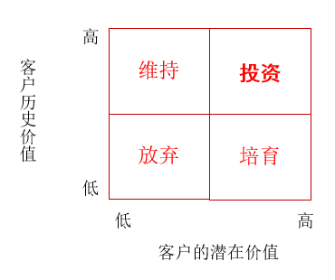

# 1 客户关系管理概述

**客户关系管理 CRM ：** 企业为提高核心竞争力，树立的以客户位中心的经营理念，建立的改善企业与客户之间关系的新型管理机制，包含一整套解决方案。

## 1.1 客户关系管理的特点

- 客户关系管理是一种经营理念：以客户为中心。
- 客户关系管理是一种旨在改善企业与客户关系的新型管理机制。
- 客户关系管理包含一整套解决方案。

## 1.2 客户关系管理产生的背景

- 经营理念更新的需要：企业经营的基本理念是随着市场环境的变化而不断演变的。
- 企业管理模式更新的需要。
- 提高核心竞争力的需要。
- 信息技术的推动。

# 2 客户关系管理的流程

## 2.1 客户分析

**客户分析的步骤：**

- 首先是要收集客户的数据
- 定义和计算终生价值
- 客户投资和利润的分析
- 客户分组
- 制定相应的客户措施

**关键要分析客户的终生价值（一个新客户在未来所能给企业带来的期望净现值）**

- 历史价值：到目前位置已经实现了客户的价值。
- 当前价值：如果客户当前行为模式不发生改变的话，在将来会给企业带来的客户价值。
- 潜在价值：跳动客户购买积极性或向别人推荐产品和服务等，从而可能增加的客户价值。

**影响终生价值的因素：**

- 初次购买的收益流。
- 客户购买的频率。
- 客户购买的时间长度。
- 客户购买其他产品的喜好及其收益流。
- 推荐给朋友，同事及其他人的可能。

**客户投资和利润的分析客户分类：**

- 期望的用户
- 普通的客户
- 重复购买的客户
- 忠诚的客户

**客户组合分析方法：**

## 2.2 深入了解目标客户

知道就行

## 2.3 发展关系网络

- 客户
- 员工
- 供应商
- 分销商
- 业主
- 投资者

## 2.4 创造客户价值

关键在于理解客户的需求。

## 2.5 管理客户关系

根据以上确定的价值观念，改进组织、流程、评价方式和激励机制等，最终达到管理客户关系的目的。

# 3 客户关系管理的解决方案

## 3.1 客户关系管理系统的 4 个子系统

- 业务操作管理：
- 客户合作管理：目的在于形成企业与客户的互动
- 数据分析管理：客户数据库建设。
- 信息技术管理：ERP 、ERM 、 IT 等系统的集成。

## 3.2 业务操作管理子系统

- 营销管理模块
  - 市场分析
  - 市场预测
  - 市场活动管理
- 销售管理模块
  - 销售部件
  - 现场销售部件
  - 销售业绩部件
  - 渠道销售部件
- 客户服务模块
  - 服务部件
  - 客户关系部件
  - 移动现场服务部件
  - 合同部件

## 3.3 企业与客户互动的渠道

- 呼叫中心
- 电话交流
- 网上交流
- 电子邮件
- 传真
- 信件
- 与客户直接接触

## 3.4 客户关系管理的关键技术

- 呼叫中心：企业集中处理大量打入或打出的场所，是收入中心。
- 数据仓库：是一个面向主题的数据集合。
- 商业智能：对数据进行快速和准确分析。
- Web的集成管理：应用 Internet 体系结构进行的管理活动。

# 4 客户关系管理的实施

## 4.1 客户关系管理的八步法

- 确立业务计划（准备阶段）
- 建立客户关系管理项目团队（准备阶段）
- 分析客户需求，开展信息系统初建（需求调研）
- 明确企业应用需求（需求调研）
- 为客户关系管理不同级别系统设置优先级（制定方案）
- 选择合适的方案（制定方案）
- 组织员工用户培训（实施阶段）
- 使用、维护、评估和改进（实施阶段）

## 4.2 实施客户关系管理的条件

- 设计长远规划
- 遵循专业化的运作思路
- 重视人的因素
- 加强应用系统的集成
- 加强支持网络应用的能力

