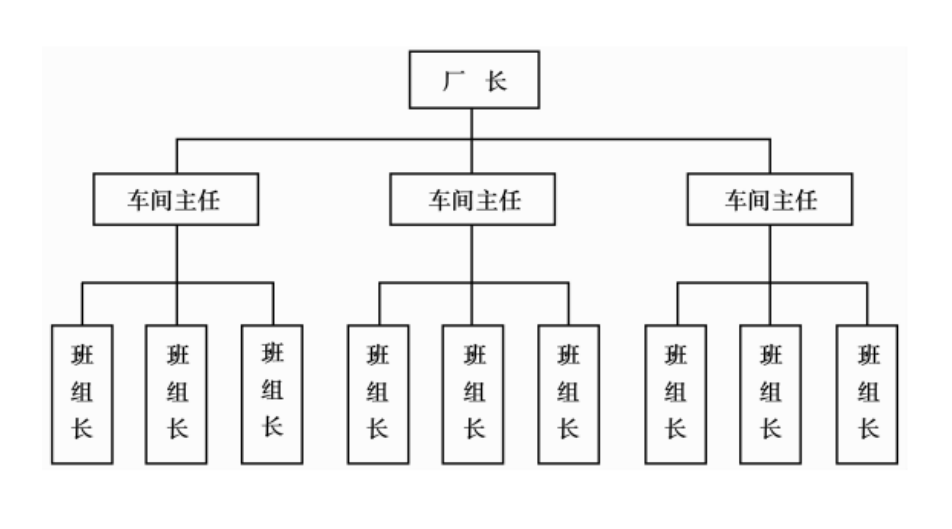

# 1 企业组织管理概述

**组织：**  根据一定目的的建立，包含不同职位，每个职位具有相应的职责的动态复杂系统。

## 1.1 企业组织的基本职能

- 保证企业功能的实现
- 保持企业活动的协调性和提高企业的效率
- 维护企业的稳定性和适应性

## 1.2 企业组织管理的含义

**组织管理：** 为了有效配置企业内部的有限资源，为了实现一定的共同目标而按照一定的规则和程序构成的一种责权安排和人事安排。

## 1.3 企业组织管理的内容

- 组织设计：根据组织目标设计和建立一套组织机构和职位系统。
- 组织运作：组织运作是使设计好的组织运行和运转起来。
- 组织调整：组织结构调整的动力更多的是来自企业的外部。

# 2 企业组织结构的形式

## 2.1 直线制结构

最早最简单的一种组织结构

- 优点：一元领导，结构简单。
- 缺点：对管理者要求高，信息传递慢。
- 适用：人员少、规模少、任务单一

## 2.2 职能制结构

设置职能机构，有权发布指令。

- 优点：充分发挥职能机构的专业作用。
- 缺点：未被统一指挥原则。
- 适用：技术复杂、知识专业的组织。

## 2.3 直线职能制结构

职能机构知识作为直线管理者的助理和助手，它们不具备对下面直接指挥的权力。

- 优点：统一指挥、职能分工专业化。
- 缺点：部门联系交叉，信息传递路线较长。
- 适用：一种普遍适用的组织形式。

## 2.4 事业部制结构

- 优点：各事业部独立运行，适应性强。
- 缺点：资源重复配置，事业部之间协作较差。
- 适用：产品多样化、大型、巨型企业。

## 2.5 矩阵型结构

垂直部门和项目负责人同时指挥

- 优点：利于合作、利于创新。
- 缺点：容易引起冲突、机构臃肿。
- 适用：科研、项目等创新性强的工作。

## 2.6 控股型结构

母公司和子公司和关联公司之间是出资人对持股企业的产权管理关系。

# 3 网络时代企业组织的创新

## 3.1 组织结构扁平化

**金字塔式组织结构的弊端：**  传统的金字塔式的层级结构是工业经济时代最成熟，最有影响的组织结构。

- 对外部环境反应慢、调整慢。
- 内部难协调、难创新。
- 信息流动慢、易失真。

**扁平化：** 组织结构减少管理层次、扩大管理幅度。

**组织结构扁平化的条件：**

- 现代技术巨大进步
- 成员工作能力大幅提高

## 3.2 组织结构柔性化

临时性的、以任务为倒向的团队式组织、柔性化的典型组织形式是临时团队。

## 3.3 虚拟化

企业和其他企业之间结成战略联盟。

**组织虚拟化的具体形式：**

- 外包
- 战略联盟（滴滴快滴）
- 特许经营（连锁店）
- 合资企业
- 虚拟销售网络

## 3.4 网络型结构

网络型组织是由多个独立的个人、部门和企业为了共同的任务而组成的联合体。

- 多边联系
- 互利和交互的合作

**网络型组织的基本类型：**

- 内部网络：企业内部减少层级、加快信息流动。
- 垂直网络：供应链一条龙合作。
- 市场间网络：不同行业的企业达成的合作（投资）。
- 机会网络：围绕顾客形成的企业群。

**网络型组织的优点：**

- 促进专业化的发展
- 实现核心竞争力的连接
- 降低交易成本
- 优化资源配置

# 4 企业组织再造

## 4.1 3C理论

- 顾客（Customer）
- 竞争（Competition）
- 变化（Change）

迈克·哈默和詹姆斯·钱皮提出：流程再造（BPR）

## 4.2 企业再造

**企业再造：**  为了在衡量绩效的关键指标上取得显著改善，从根本上重新思考，彻底改造业务流程。

**企业再造的特点：**

- 企业再造是一个彻底的变革（企业再造是什么？）
- 企业再造使之上是管理和组织的创新（企业再造是什么？）
- 以顾客为中心是企业再造的出发点（从何处入手企业再造）
- 企业再造从重新设计业务流程着手（从何处入手企业再造）
- 企业再造需要从根本上重新思考已经形成的基本概念（如何进行企业再造）
- 企业再造实施人本管理（如何进行企业再造）
- 企业再造重视信息技术的应用（如何进行企业再造）
- 企业通过业务流程再造取得显著的进步（企业再造的好处什么）

**企业再造的实施步骤：**

- 构造企业再造的团队
- 对现有流程进行全面的分析
- 业务流程再造
- 组织实施与持续改善

**企业再造的基础工作：**

- 建立有效的组织保障
- 建立流程管理信息系统
- 重塑企业文化
- 培养复合型人才

# 5 学习型组织

**学习型组织：**  在共同愿景之下，通过培养弥漫整个组织的学习氛围，充分发挥员工的创造性思维能力而建立起来的有机的，符合人性的，具有持续学习能力的组织。

**学习型组织的特点：**

- 组织成员拥有一个共同的愿景
- 领导者的新角色
- 建立知识联盟
- 自主管理
- 善于不断学习
- 由多个创造性个体组成的团队

**五项修炼：**

- 自我超越：是学习型组织的精神基础
- 改善心智模式：需要企业不断随着外部环境的变化适时调整、革新习惯做法。
- 建立共同愿景：是组织成员的共同理响
- 团队学习：是学习型组织最基本的学习形式，是构建学习型组织的基本过程。
- 系统思考：是建立学习型组织最重要的修炼，是 5 项修炼的核心。

