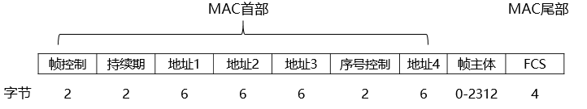
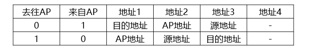

# 1 无线网络

## 1.1 无限网络基本结构

- 无限主机
- 无限链路
- 基站：
  - 蜂窝网络中的蜂窝塔（cell tower）
  - IEEE 802.11 无限局域网中的计入点（AP）
- 网络基础设施

**无限网络模式：**

- 基础设施模式：无限主机与基站关联。
- 自组织网络、特定网络、Ad Hoc网络：无线主机不通过基站，直接与另一个无线主机直接通信。
  - 自组织网络：由一组用户群构成，不需要基站、没有固定的路由器的移动通信模式。自组织网络中的每个结点都兼有路由器和主机两种功能。

## 1.2 无线链路与无线网络特性

**无线链路的特点：**

- 信号强度的衰减：路径损耗
- 干扰
- 多径传播

**隐藏站现象：**

- 站点A、C都向站点B发送数据；
- 站点A、C之间有物理阻挡，双方都无法检测出对方发送的信号。
- 站点A、C都向站点B发送数据时，发生碰撞，站点B无法正确接收任何一方的数据。

# 2 移动网络

## 2.1 移动网络基本原理

**移动网络的术语：**

- 移动结点的永久居所：归属网络，家网。 
- 在归属网络中代表移动结点执行移动管理功能的实体：归属代理 ，家代理。
- 移动结点当前所在非归属网络：外部网络，被访网络。 
- 在外部网络中帮助移动结点做移动管理功能的实体：外部代理。
- 通信者：与该移动结点通信的实体。 

## 2.2 寻址

**移动寻址：** 当移动结点位于一个外部网络时，所有指向此结点永久地址的流量需要导向外部网络。 

- **方法一：** 外部网络通过向所有其他网络发通告，告诉它们该移动结点正在它的网络中。(不适合用于大规模网络)
- **方法二：** 将移动性功能从网络核心搬到网络边缘，由该移动结点的归属网络来实现。(实际上移动网络采取的做法)
  - 将外部代理放置在外部网络的边缘路由器上。外部代理为移动结点创造一个转交地址(Care-Of Address , COA)
  - 移动结点与永久地址和转交地址都相连。
  - 外部代理告诉归属代理该移动结点的转交地址。

## 2.3 移动结点的路由选择

### 2.3.1 间接路由选择

通信者将数据报寻址到移动结点的永久地址。

**网络层新功能：**

- 移动结点到外部代理的协议：注册，取消。
- 外部代理到归属代理的注册协议：外部代理告诉归属代理COA。
- 归属代理数据报封装协议：归属代理封装原始数据报，转发。
- 外部代理拆封协议：从封装好的数据报中提取原始数据报，转发。

**三角路由选择问题：**

通信者和移动结点之间存在一条更有效的路由，发往移动结点的数据报也要先发给归属代理，然后在发送到被访网络。

### 2.3.2 直接路由选择

- 通信者所在网络中的通信者代理先获取移动结点的COA。通信者代理将数据报发往移动结点的COA。

**引入的两个问题：**

- 需要一个移动用户定位协议，以便通信者代理向归属代理查询获得移动结点的COA
- 归属代理仅在会话开始时被通信者代理询问一次COA。

# 3 无限局域网 IEEE 802.11

## 3.1 IEEE 802 家族

IEEE 802.11发表于1997年，是原始标准。支持速率：2Mbit/s，2.4GHz。

| 标准          | 频率范围 | 数据率            |
| ------------- | -------- | ----------------- |
| IEEE  802.11b | 2.4GHz   | 最高为11  Mbit/s  |
| IEEE  802.11a | 5GHz     | 最高为54  Mbit/s  |
| IEEE  802.11g | 2.4GHz   | 最高为54  Mbit/s  |
| IEEE  802.11n | 2.4/5GHz | 最高为600  Mbit/s |

共同点: 

- 都使用相同的介质访问控制协议CSMA/CA(冲突避免)
- 链路层帧使用相同的帧格式。
- 都具有降低传输速率以传输更远距离的能力。 
- 都支持“基础设施模式”和“自组织模式”两种模式。 

## 3.2 IEEE 802.11 体系结构

**IEEE 802.11体系结构的基本构件：**

- 基站：接入点（AP）
- 基本服务集（BSS）： BSS包含：一个接入点，一个或多个无线站点    

**AP 发现：** 无限主机怎么找到 AP

- 被动扫描：无线主机扫描信道和监听信标帧。 
- 主动扫描：无线主机向其范围内的所有AP广播探测帧。 

## 3.3 IEEE 802.11 的 MAC 协议

IEEE 802.11的MAC协议采用CSMA/CA协议。

CSMA/CA：带碰撞避免的载波监听多路访问协议。

**CSMA/CA协议工作原理：**  通过请求发送(RTS)帧和允许发送(CTS)帧的交换，实现信道预约占用，避免数据帧传输过程中冲突。 

**CSMA/CA协议工作步骤：**

- **源站发送数据：**先监听，若空闲，等待一个分布式帧间间隔(Distributed Inter-Frame Space , DIFS)的短时间后，发送一个很短的请求发送(Request To Send , RTS)控制帧。

     RTS控制帧：源地址，目的地址，本次通信所需的持续时间。

- **目的站正确收到源站发来的RTS帧** ：物理介质空闲，等待一个短帧间间隔(Short Inter-Frame Spacing , SIFS )时间后，发送一个很短的允许发送(Clear To Send , CTS)控制帧作为响应。

     CTS控制帧：本次通信持续时间等

- **其他站点：**监听到两者要通信，其他站点在其持续通信时间内不会发送。其他站根据监听到的RTS或CTS帧中的持续时间来确定数据帧传输的时间。

- **源站收到CTS帧：**等待一段时间后，发送数据帧，若目的站正确收到了数据帧，在等待时间后，就向源站发送确认帧(ACK)。

## 3.4 IEEE 802.11 帧

- 控制帧：提高工作站数据传输的可靠性。
- 数据帧：运输想要发送的数据。
- 管理帧：加入网络，退出网络的管理事宜。

**数据帧结构：**

- MAC首部：共30字节。	
  - 帧控制：包含多个子字段。用于区分RTS帧、CTS帧、ACK帧和数据帧。
  - 持续期：IEEE 802.11的MAC协允许传输结点预约信道一段时间，持续值被包括在该帧的持续期字段中。
  - 4个地址字段
  - 序号控制：在IEEE 802.11网络中，站点正确收到其他站点的帧后，都会发一个确认帧。确认帧可能丢失，发送站点会发送一个帧的多个副本，使用序号可以区分新传输的帧和以前帧的重传。
- 帧主体：帧的数据部分，不超过2312字节。
- 尾部：帧检验序列FCS，共4字节。

# 4 蜂窝网络

## 4.1 蜂窝网络体系结构

**小区(Cell)：** 蜂窝网覆盖的区域分成的六边形的区域  

**收发基站(Base Transceiver Station , BTS)： ** 负责小区内的移动站点发送或接收信号。

**基站控制器(Base Station Controller , BSC )： ** 服务于收发基站，为用户分配收发基站无线信道、执行寻呼， 执行移动用户的切换。   

**移动交换中心(Mobile Switching Center , MSC)：** 在用户鉴别和账户管理以及呼叫建立和切换中起决定性作用。单个MSC包含5个基站控制器。

## 4.2 蜂窝网络中的移动性管理

**间接路由选择方法管理移动性：**

- 归属网络维护一个归属位置注册器(Home Location Register , HLR)的数据库：  每个用户的永久蜂窝电话号码，用户个人信息，用户当前的位置信息。
- 被访网络维护一个访问位置注册器(Visitor Location Register , VLR)的数据库：为每一位当前在其服务网络的移动用户提供一个表项。

**通信过程：**

- 第一步：通信者拨打移动用户的电话号码。
- 第二步：归属移动交换中心收到该呼叫，查询归属位置注册器来确定移动用户的位置。确定移动用户的漫游号码。
- 第三步：漫游号码确定后，归属移动交换中心通过网络呼叫被访网络的移动交换中心，被访网络的移动交换中心呼叫移动用户

## 4.3 移动通信2G/3G/4G/5G网络

### 4.3.1 2G

全球移动通信(Global System for Mobile Communication，GSM)系统

短信服务

通用无线分组业务(General Packet Radio Service , GPRS) 

增强数据速率的 GSM 演进技术 (Enhanced Data Rate for GSM Evolution , EDGE)

- GSM系统是第二代移动电话系统的开端。
- GSM业务可以分为承载业务、电信业务、附加业务三大类。
- GSM系统采用的是FDMA和TDMA混合接入的方式。

### 4.3.2 3G

- 国际电信联盟(ITU)提出并研究。

  ​      WCDMA、CDMA2000、**TD-SCDMA**三大技术标准。

- 3G采用CDMA。

- 关键技术：无线传输技术

### 4.3.3 4G / LTE

- 长期演进(Long Term Evolution,LTE)标准化项目
- 4G特点：
  - 高速率传输
  - 智能化
  - 业务多样化
  - 无缝接入
  - 后向兼容
  - 经济  

### 4.3.4 5G

- 5G技术目的：构建网络社会。
- 5G特点：
  - 超高速率传输
  - 超高容量
  - 超可靠性
  - 随时随地可接入性

# 5 移动 IP 网络

**移动IP(Mobile IP)：**  国际互联网工程任务组（The Internet Engineering Task Force，IETF）开发，允许计算机移动到外地时，任然保持其原来的IP地址。

## 5.1 代理发现

代理发现：当移动IP站点到达一个新网络时，移动站点都必须知道相应的外部代理或归属代理的身份。

- 代理通告：代理周期性的广播一个ICMP报文。
- 代理请求：移动结点广播一个ICMP报文。

## 5.2 向归属代理注册

- 移动 IP 定义了外部代理向一个移动结点的归属代理注册或注销COA所使用的协议

  步骤：

  - 移动结点向外部代理发送一个移动IP注册报文。
  - 外部代理收到注册报文并记录移动结点的永久IP地址，分配一个COA。
  - 外部代理把注册请求发送给归属代理，归属代理检查真实性和正确性。
  - 外部代理接收注册应答。

# 6 其他典型无限网络简介

## 6.1 WiMax

全球微波互联接入(World Interoperability for Microwave Access , WiMax)  又名IEEE 802.16标准，宽带无线标准  。

Wi Max优势：更远的传输距离；更高速的宽带接入。

Wi Max劣势：

- 不能支持用户在移动过程中无缝切换 
- 产业基础薄弱
- 和传统的蜂窝网络无法完全兼容 

## 6.2 蓝牙

IEEE 802.15.1标准。

无线个人区局域网(Wireless Personal Area Network , WPAN)标准。

工作在全球通用的2.4GHz的频段。 

特点：

- 小范围
- 低功率
- 低速率和低成本运行。 （一小三低）

## 6.3 ZigBee

IEEE 802.15.4标准

第二个个人区域网络标准。

低功率、低数据速率、低工作周期