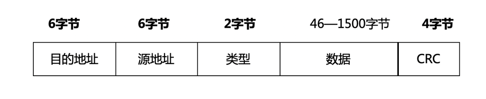
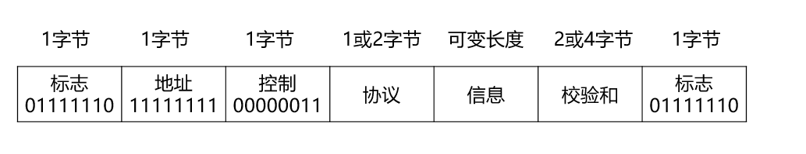
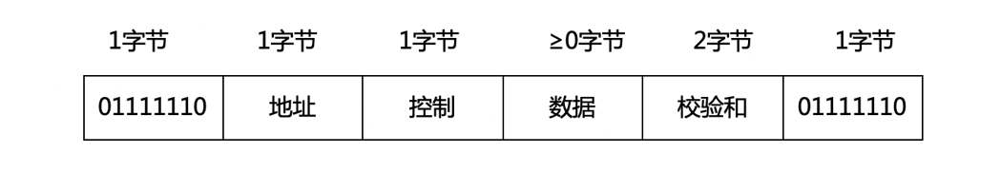

# 1 数据链路层服务

**数据链路层：**  负责通过一条链路，从一个结点向另一个物理链路直接相连的相邻结点，传送网络层数据报，中间不经过任何其他交换结点。

**数据链路：**  网络中的两个结点之间的逻辑通道。实现控制数据传输协议的硬件（网卡）和软件加到链路上构成的。

**数据链路层的传输单元：** 帧

**数据链路层提供的服务：**

- 组帧： 帧头 -> 数据报 -> 帧尾
  - 帧头：发送结点和接收结点的地址信息，定界字符。
  - 帧尾：用于差错检测的差错编码。
- 链路接入：
  - 点对点链路：发送结点和接收结点独占信道
  - 广播链路：通信链路被多个结点共享。
- 可靠交付
  - 无线链路（出错率搞）：支持可靠数据传输
  - 光纤、双绞线（出错率低）：不提供可靠数据传输服务。
- 差错控制
  - 数据链路层帧在物理媒介上的传播过程，可能会出现比特翻转的差错。
  - 误比特率：出现差错的比特数/传输比特总数。

# 2 差错控制

**噪声：**  信号在信道传输过程中，会收到各种噪声的干扰，从而导致传输差错。

- 随机噪声 -- 随机差错或独立差错
- 冲击噪声 -- 突发差错

## 2.1 差错控制的基本方式

通过差错编码技术，实现对信息传输差错的检测，并基于某种机制运行差错纠正和处理。

### 2.1.1 检错重发

**发送端：**  待发送数据进行差错编码，然后发送。

**接收端：** 利用差错编码检测数据是否出错，若出错，接收端请求发送端重发数据加以纠正。

### 2.1.2 前向纠错

**发送端：** 对数据进行纠错编码，然后发送。

**接收端：** 收到数据，利用纠错编码进行差错检测，且纠错。

**适用：** 单工链路

### 2.1.3 反馈校验

**接收端：** 将收到的数据原封不动发回发送端。

**发送端：** 通过对比接收端反馈的数据与发送的数据确认接收端是否正确接收的已发送数据。若有不同，立即重传数据。

**优点：** 原理简单，易于实现，无须差错编码；

**缺点：** 需要相同传输能力的反向信道，传输效率低，实时性差。

### 2.1.3 检错丢弃

网络应用对可靠性要求不高，可以采用不纠正出错数据，直接丢弃错误数据。

## 2.2 差错编码的基本原理

在待传输数据信息基础上，附加一定的冗余信息。（冗余信息：与数据信息建立某种关联关系：复制一次，复制两次等）

**例如：**

- 复制一次：待传输数据为10。 传输数据+冗余信息：1010
- 复制两次：待传输数据为10。 传输数据+冗余信息：101010

## 2.3 差错编码的检错与纠错能力

**编码集：**  差错编码的所有有效码字的集合。

**汉明距离：**  两个等长码字之间，对应位数不同的位数。  

**检错编码：**  编码集的汉明距离ds=r+1，则该检错编码可以检测r位的差错。

**纠错编码：**  编码集的汉明距离ds=2r+1，则该差错编码可以纠正r位的差错。

## 2.4 典型的差错编码

**异或：**  相同为 0 不同为 1

### 2.4.1 奇偶校验码

**奇校验码：**  1位冗余位，取值为“0”或“1”，使得编码后的码字中1的个数为奇数。  

**偶校验码：**  1位冗余位，取值为“0”或“1”，使得编码后的码字中1的个数为偶数。  

**优缺点：**

- 优点： 编码简单、编码效率高、开销最小的检错编码。
- 缺点： 检错率不高。

### 2.4.2 循环冗余码 CRC

在数据链路层广泛应用的差错编码。  

**基本思想：**   将二进制位串看成是系数为0或1的多项式的系数。  

**例如：**  多项式G(x)= x5+x2+1，请写出多项式对应的二进制位串。  100101 

**步骤：**

- 第一步：写出多项式对应的位串：10011
- 第二步：在待编码位串后面添加 G(x)对应二进制位串的位数 - 1 个 0
- 第三步：用新的待编码位串除以多项式对应的位串
- 第四步：求得的余数添加在待编码位串后，即为CRC编码后的码

**接收方在收到 CRC 码的帧后，怎么判断是否有错？**、

用收到的位串除以多项式对应的位串。余数为0，无错。余数不为0，有错，丢弃。

**优选的典型G(x)**

| 名称             | 生成多项式                                         |
| ---------------- | -------------------------------------------------- |
| CRC-12           | x12+x11+x3+x2+x+1                                  |
| CRC-16           | x16+x15+x2+1                                       |
| CRC-CCITT        | x16+x12+x5+1                                       |
| CRC-32-IEEE802.3 | X32+x26+x23+x22+x16+x12+x11+x10+x8+x7+x5+x4+x2+x+1 |
| CRC-64-ISO       | x64+x4+x3+x+1                                      |

# 3 多路访问控制协议

**点对点信道：**  一对一通信方式，信道被双方共享。（例如：拨号上网）

**广播信道（共享介质）：**  一对多通信方式，信道上连接的点很多，信道被结点共享。  （例如：总线以太网， WiFi）两个或两个以上结点同时传输数据：冲突→失败！-- >  多路访问控制(Multiple Access Control , MAC)协议

**多路复用的基本思想：**  将信道资源划分后，分配给不同的结点，各节点通信时只使用其分配到的资源，避免多结点通信时的相互干扰。

## 3.1 信道划分 MAC 协议

### 3.1.1 频分多路复用 FDM 

​      在频域内将信道带宽划分为多个子信道，将原始信号调制到对应的某个子信道的载波信号上，使同时传输的多路信号在整个物理信道带宽的允许范围内频谱不重叠，从而共用一个信道  

### 3.1.2 时分多路复用 TDM

​     将通信信道的传输信号划分为多个等长的时隙，每路信号占用不同的时隙。使多路信号合用单一的通信信道在时域上不重叠，从而实现信道共享。  

- 按照固定顺序把时隙分配给各路信号
  - 同步时分多路复用 STDM
- 时隙和用户没有固定的对应关系
  - 异步时分多路复用 ATDM
  - 统计时分多路复用 STDM

### 3.2.3 波分多路复用 WDM

​     广泛用于光纤通信。在光纤通信中，光载波频率很高，通常用光的波长来代替频率讨论，所以叫做波分多路复用。在光纤通信中，为了实现长距离的高速传输，通常采用波分多路复用和光纤放大器。

### 3.2.4 码分多路复用 CDM

​     通过利用相互正交的码组分别编码各路原始信息的每个码元，使得编码后的信号在同一信道中混合传输。是一种扩频的通信形式。  

## 3.2 随机访问 MAC 协议

所有用户都可以根据自己的意愿随机地向信道上发送信息。  

- 没有其他用户：发送成功。
- 有两个及以上用户：产生冲突或碰撞，用户发送信息失败。每个用户随机退让一段时间后，再次尝试，直至成功。

### 3.2.1 ALOHA 协议

最早的，最基本的午先数据通信协议。

- 纯 ALOHA
  - 工作原理： 任何一个站点有数据发送时就可以直接发送至信道。发送数据后对信道进行侦听：如果收到应答信号，说明发送成功；否则说明发生冲突，等待一个随机时间重新发送，直到成功为止。
  - 性能：网络负载不能大于0.5
- 时隙 ALOHA
  - 工作原理：把信道时间划分为离散的时隙，每个时隙为发送一帧所需的时间，每个通信站点只能在每个时隙开始的时刻发送帧。如果在一个时隙内发送帧出现冲突，下一个时隙以概率p重发该帧，直到帧发送成功。p不能为1，否则会出现死锁。
  - 性能：网络负载不能大于1 

### 3.2.2  载波监听多路访问协议 CSMA

**工作原理：**  通过硬件装置（载波监听装置），在通信站发送数据之前，先监听信道上其他站点是否在发送数据，如果在发送，则暂时不发送。

**分类：**  根据监听策略的不同

- 非坚持 CSMA：监听到有人在发送，等待一个随机时间，再监听。
- 1-坚持 CSMA：监听到有人在发送，一直监听，直到没人发送，立即发送数据。
- P - 坚持 CSMA：监听信道，若发现信道空闲，则以 概率 P 再最近时隙发送数据。

### 3.2.3 带冲突检测的载波监听多路访问协议  CSMA / CD

**工作原理：**  通信站使用CSMA协议进行数据发送，在发送期间如果能检测到碰撞，立即终止发送，并发出一个冲突强化信号，使所有通信站点都知道冲突的发生。发出冲突强化信号，使所有通信站都知道冲突的发生；发出冲突强化信号后，等待一个随机时间，再重复上述过程。

**CSMA / CD 的工作状态分为 ：**

- 传输周期
- 竞争周期
- 空闲周期

**信道有三种状态：**

- 传输状态
- 竞争状态
- 空闲状态

使用CSMA/CD协议实现多路访问时，通过共享信道通信的两个通信站之间相距的最远距离D，信号的传播速度V，数据帧长度L，以及信道信息传输速率R之间满足以下约束：

`Lmin / R >= 2 Dmax / v `

为了实现 CSMA/CD，需要限定帧的长度。在发送帧的最后一位前，发送站点必须检测冲突，如有任何冲突都要放弃传输。这是因为一旦整个帧都被发送啦，站点就无法保留帧的副本，并无法掌控线路中的冲突检测。因此，帧的传送时间必须至少是最长传播时间的2倍。

## 3.3 受控接入 MAC 协议

**受控接入：**  各个用户不能随意的接入信道，而必须服从一定的控制。

### 3.3.1 集中式控制

系统中有一个主机负责调度其他通信站接入信道，从而避免冲突。

**方法：**  轮询

- 轮叫轮询（迭代）
- 传递轮询（递归）

### 3.3.2 分散式控制

**方法：**   令牌技术

​     令牌是一种特殊的帧，代表了通信站使用信道的许可。在信道空闲时一直在信道上传输。一个通信站想要发送数据就必须首先获得令牌。  

**令牌操作过程：**

1. 网络空闲时，只有一个令牌在环路上绕行。
2. 当一个站点要发送数据时，必须等待并获得一个令牌，将令牌的标志位置为 “1”，随后便可发送数据。（空令牌：0 被占用：1）
3. 环路中的每个站点边转发数据，边检查数据帧中的目的地址，若为本站点的地址，便读取其中所携带的数据。
4. 数据帧绕环一周返回时，发送战将其环路上撤销，即自生自灭
5. 发送站点完成数据发送后，重新产生一个令牌传至下一个站点，以使其他站点获得发送数据帧的许可权。

令牌丢失和数据帧无法撤销是环网上最严重的两种错误。·

# 4 局域网

采用广播的方式，局域区域网络，覆盖面积小，网络传输速率高，传输的误码率低。

为了使数据链路层更好地适应多种局域网络标准，IEEE802 委员会将局域网的数据链路层分为两个子层。

- 逻辑链路控制子层（LLC） 名存实亡
- 介质访问控制（MAC）  MAC子层

## 4.1 数据链路层寻址与 ARP

**MAC地址：**  MAC地址具有唯一性，每个网络适配器对应一个 MAC 地址。

**MAC地址空间的分配：**   由电气和电子工程师协会(IEEE)统一管理。IEEE分配前24位的MAC地址块。    

**MAC地址表示：**  以太网和IEEE 802.11无线局域网，使用的MAC地址长度为6字节（48位）。通常采用十六进制表示法，每个字节表示一个十六进制数，用 - 或：连接起来： 例如：00-2A-E1-76-8C-39 00:2A:E1:76:8C:39

**MAC广播地址：**  FF-FF-FF-FF-FF-FF

**地址解析协议（ARP）：**  根据本网内目的主机或默认网关的IP地址获取其MAC地址。  

**地址解析协议的基本思想：**  在每一台主机中设置专用内存区域，称为 ARP 告诉缓存（也称 ARP 表）。存储该主机所在局域网中其他主机和路由器的 IP 地址与 MAC 地址的映射关系。

- ARP查询分组：通过一个广播帧发送的
- ARP响应分组：通过一个单播帧发送的
- ARP是即插即用的：一个ARP表是自动建立的，不需要系统管理员来配置。

## 4.2 以太网

**定义：**  目前位置最流行的有线局域网技术。

**以太网成功的原因：**

1. 以太网第一个广泛部署的高速局域网
2. 以太网数据速率块
3. 以太网硬件价格及其偏移，网络造价成本低
4. 其他有线局域网技术复杂、昂贵，组织了网络管理员改用其他技术。

**经典的以太网是采用粗同轴电缆连接的总线型以太网（10Base-5）**

1. 数据传输速率为10Mbit/s，无连接不可靠。 
2. MAC协议采用CSMA/CD协议。 
3. 相距最远主机信号往返的传播时延为51.2μs,所以以太网最短帧长为64字节。

**以太网帧结构：**

- 目的地址和源地址：MAC地址
- 类型：标识上层协议。
- 数据：封装的上层协议的分组；
- CRC：校验采用循环冗余校验。

**以太网最短帧：**

- 以太网帧最短：64字节。
- 以太网帧除数据部分：18字节。
- 数据最短：46字节。

**以太网技术：**

| 分类                   | 传输介质                     | 传输速率   | 标准            |
| ---------------------- | ---------------------------- | ---------- | --------------- |
| 10Base-5（经典以太网） | 粗同轴电缆                   | 10Mbit/s   |                 |
| 10Base-T               | 非屏蔽双绞线（UTP）          | 10Mbit/s   | IEEE 802.3      |
| 100Base-T              | UTP                          | 100Mbit/s  | IEEE 802.3u     |
| 千兆位以太网           | 光纤、UTP、屏蔽双绞线（STP） | 1000Mbit/s | IEEE 802.3 扩展 |
| 万兆位以太网           | 多模光纤                     | 10Gbit/s   | IEEE 802.3ae    |

## 4.3 交换机

**交换机：**  应用最广泛的数据链路层设备。

**网桥：**  网桥：和交换机功能类似。对数据帧实现转发。交换机可以认为是多端口的网桥。

**集线器：**  物理层

**交换机的基本工作原理：**   当一帧到达时，交换机首先需要决策将该帧丢弃还是转发，如果还是转发的话，还必须进一步决策应该将该帧转发到那个或哪些端口去。决策依据时，以目的 MAC 为主键查询内部转发表。

**以太网交换机的自主学习：**

1. 以太网交换机有4个端口，各连接一台计算机，其MAC地址分别是ABCD。
2. 开始，以太网交换机里面的转发表是空白的。
3. 风向火发送一个帧，从端口1进入交换机。
4. 交换机查询转发表，没找到往哪里转发该帧。
5. 交换机把这个帧的源MAC地址A和端口1写入交换表，完成第一次学习。
6. 交换机除端口1以外所有端口泛洪(广播)这个帧。
7. 雷和电丢弃该帧。火收下该帧。

**以太网交换机的优点：**

- 消除冲突
  - 冲突域：早期所有主机共享总线的一个网络范围。现在在以太网中，CSMA/CD能够检测到冲突的网络范围。
- 支持异质链路
- 网络管理

## 4.4 虚拟局域网

**虚拟局域网：**  一种基于交换机的逻辑分割广播域和局域网应用形式，以软件的方式划分和管理局域网中的工作组，限制接收光比信息的主机数，不会因为传播过多的广播信息而引起性能的恶化。

**划分虚拟局域网的方法：** vlan 的设置式在以太网交换机上，通过软件方式实现的。

- 基于交换机端口划分
- 基于 MAC 地址划分
- 基于上层协议类型或地址划分

# 5 点对点链路协议

## 5.1 点对点协议 （PPP）

**含义：**  PPP  是个单个发送方和单个接收方的点对点链路。 

**PPP 帧的格式：**

**PPP 主要提供三类功能：**

- **成帧：**  确定一帧的开始和结束，支持差错检测。
  - 开始标志字节：01111110
  - 结束标志字节：01111110

- **链路控制协议：**  LCP
  - 启动线路
  - 检测线路
  - 协商参数
  - 关闭线路
- **网络控制协议：**  NCP
  - 协商网络层选项

**PPP 是面向字节的：**

- PPP帧的长度都是整数字节。
- 字节填充技术：插入特殊的控制转义字节01111101。

## 5.2 高级数据链路控制协议（HDLC）

**含义：**  应用于点对点链路和点对多点链路。

**HDLC 帧的格式：**

**根据控制位的不同，HDLC有三种类型的帧：**

- 信息帧（I格式）：传输数据。
- 管理帧（S格式）：差错控制，流量控制。
- 无序号帧（U格式）：链路的建立、拆除。

HDLC 协议是面向位的

在发送端数据中连续出现 5  个 1 后在其后插入 0 ，接收端删除 这个 0 

