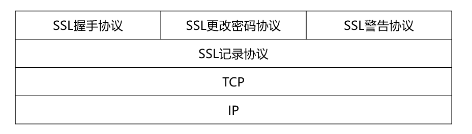
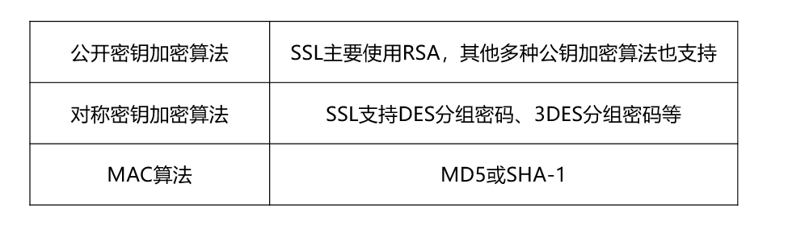

# 1 网络安全概述

## 1.1 基本概念

**网络安全通信的基本属性：**

- 机密性：只有发送方和接收方能理解报文内容。
- 消息完整性：消息未被纂改，发生纂改一定会被检测到。
- 可访问与可用性：对授权用户提供有效服务。
- 身份认证：双方确认彼此的真实身份。

## 1.2 网络安全威胁

**典型的网络安全威胁：**

- 报文传输：传输过程面临窃听、插入、假冒、劫持等安全威胁。
- 拒绝服务Dos、分布式拒绝服务DDoS。
- 映射：先探路，再攻击。
- 分组“嗅探”：Wireshark 是一个典型的分组嗅探软件。
- IP 欺骗。

# 2 数据加密

## 2.1 通信加密模型

**通信加密模型：**

- M 明文空间
- C 密文空间
- K 密钥空间
- E 加密算法
- D 解密算法

**分类标准：** 密码体制的特点、出现的先后时间

- 传统加密方式
- 对称密钥加密
- 非对称/公开密钥加密

## 2.2 传统加密方式

### 2.2.1 替代密码 ： 凯撒密码

例： 对明文“bob,I love you,Alice”，利用k=3的凯撒密码加密，得到的密文是什么？

>  K = 3 的含义就是明文的每个字母按照字母表顺序推后 3 位。

解： 明文： “bob,I love you,Alice”

​         密文：“ere,L oryh brx,Dolfh  ”     

### 2.2.2 换位密码：列置换密码

根据一段规则重新排列明文，以便打破明文的结构特征。只改变明文结构，不改变内容。

**列置换密码加密的过程：**

1. 确定密钥长度（几个字母），并且确定密钥字母在字母表中的先后顺序，用数字表示。  
2. 若明文长度不是n的整数倍，则不足部分用双方约定的方式填充，如双方约定用字母“x”替代空缺处字符。  
3. 设最后得到的字符矩阵为Mmn,m为明文划分的行数。然后，按照密钥规定的次序将Mmn对应的列输出，便可得到密文序列C。
4. 输出密文。按照数字顺序，按照列输出字母。  

例： 假设采用密钥K=nice的列置换密码，对明文“bob i love you”进行加密，加密得到的密文是什么？  

解：bvu iex ooo bly

## 2.3 对称密钥加密

加密密钥和解密密钥是相同的。

- 分组密码（块密码）
  - DES：
    - DES：明文分为64 位分组，使用 56 位的密钥，进行 16 轮加密。
    - 三重DES：使用两个密钥，支持三次 DES 算法，密钥长度达到 112 位。
  - AES：密钥长度 128/ 192/ 256 位。
    - 分组长度和密钥长度均可变
    - 循环次数允许在一定范围内根据安全要求进行修正  
    - 安全、效率、易用、灵活  
    - 抗线性攻击和抗差分攻击的能力大大增强  
    - 如果1秒暴力破解DES，则需要149万亿年破解AES  
  - IDEA：密钥长度 128位

## 2.4 非对称 / 公开密钥加密

加密密钥和解密密钥是不同的。

- 通信双方都有两个密钥
  - 公钥：任何人都可以得到。
  - 私钥：只有自己知道。
- 典型的公开密钥加密算法：Diffie-Hellman算法和RSA算法。
- Diffie-Hellman算法：基于数学中素数原根理论。RSA算法：基于数论设计，安全性建立在大数分解的难度上。应用比较广泛，安全性高。

# 3 消息完整性与数字签名

## 3.1 消息完整性检测方法

**消息完整性的目标：**

- 证明报文确实来自声称的发送方；
- 验证报文在传输过程中没有被篡改；
- 预防报文的时间、顺序被篡改；
- 预防报文持有期被篡改；
- 预防抵赖。

**消息完整性检测方法：**  散列函数

- MD5  128 位散列值
- SHA-1 160 位散列值

**散列函数算法的特性：**

- 散列函数算法公开
- 快速计算
- 对任意长度报文进行散列产生定长输出
- 对于任意报文无法预知其散列值
- 不通报文不产生相同散列值
- 单向性

## 3.2 报名认证

**报文认证：** 消息的接收者能够检测收到的消息是否真实的方法。报文认证要完成消息源的认证和消息的认证。

**报文摘要：**  对报文 m 应用散列函数 H ，得到固定长度散列码。

### 3.2.1简单报文认证 

（无法达到对消息源认证）

- 发送方对报文m应用散列函数，得到固定长度的散列码，获得报文摘要h，将扩展报文(m,h)发送给接收方。
- 同样对报文m应用散列函数H获得新的报文摘要H(m)，将H(m)和h比较。  
- 若相同，报文认证成功。否则报文认证失败。

### 3.2.2 报文认证码 MAC 

 （无法保证消息在接收方没有被篡改。）

- 发送方和接收方共享一个认证密钥s，发送方对报文m和认证密钥s应用散列函数H得到报文认证码h，将扩展报文(m,h)发送给接收方。
- 接收方收到扩展报文后，提取出报文m和报文认证码h，对报文m和认证密钥s应用散列函数H获得新的报文认证码H(m+s)，将H(m+s)与h比较。  
- 若相等，则报文认证成功。否则失败。

## 3.3 数字签名

**数字签名：**  在公开密码体制中，一个主体使用自己的私钥加密消息，得到的密文。密文可以使用该主体的公钥解密，恢复成原来的消息。如此生成的“密文”对该消息提供认证服务。  

**数字签名应满足：**

- 接收方能够确认发送方的签名，但不能伪造。
- 发送方发出签名的消息给接收方后，就不能再否认他所签发的消息。
- 接收方对已收到的签名消息不能否认，有收报认证。
- 第三者可以确认收发双方之间的消息传送，但不能伪造这一过程。

### 3.3.1 简单数字签名

- Bob利用自己的私钥对报文m加密，创建签名报文。将扩展报文(报文，签名报文)发送给Alice。
- Alice收到扩展报文。利用Bob的公钥解密签名报文，并检验解密后的签名报文和报文m是否一致。  
- 若一致，则签名m的一定是Bob的私钥。

### 3.3.2 签名报文摘要

- Bob对报文m应用散列函数H生成报文摘要H(m)，然后Bob通过其私钥对报文摘要进行加密生成加密的报文摘要，将扩展报文(报文，加密的报文摘要)发送给Alice。
- Alice收到报文m以及加密的报文摘要。Alice利用Bob的公钥解密加密的报文摘要，并对m应用散列函数生成新的报文摘要。
- 如果两者一致，则签名报文m的一定是Bob的私钥。

# 4 身份认证

## 4.1 基于共享对称密钥的身份认证

- Alice向Bob发送报文“我是Alice”
- Bob选择一个一次性随机数R，然后把这个值发送给Alice
- Alice使用她与Bob共享的对称秘密密钥加密这个一次性随机数，然后把加密的一次性随机数发回给Bob。
- Bob解密收到的报文。

## 4.2 基于公开密钥的身份认证

- Alice向Bob发送报文“我是Alice”
- Bob选择一个一次性随机数R，然后把这个值发送给Alice
- Alice使用她的私钥来加密R，然后把加密的一次性随机数发回给Bob。
- Bob向Alice索要她的公钥。
- Alice向Bob发送自己的公钥。
- Bob利用Alice的公钥解密收到的报文。

# 5 密钥分发中心与证书认证

## 5.1 密钥分发中心

对称密钥分发的典型解决方案：通信各方建立一个大家都信赖的密钥分发中心(Key Distribution Center , KDC)，解决对称密钥安全可靠的分发。

**通信发起发生成会话密钥：**

- Alice和Bob进行保密通信。Alice随机选择一个会话秘钥。用Alice和KDC之间长期的共享密钥加密会话秘钥，发送给KDC。
- KDC得到后，解密获得会话密钥，以及所希望通信方Bob。KDC利用其和Bob的长期共享密钥加密密钥，发送给Bob。
- Bob解密，获得会话秘钥，并且得知期望和自己通信的是Alice。

**KDC为Alice、Bob生成通信的会话秘钥：**

- Alice在希望和Bob通信时，首先向KDC发送请求消息。
- KDC收到请求消息后，随机选择一个会话秘钥，并将会话秘钥分别用和Alice、Bob的长期共享密钥加密，再分别发送给Alice、Bob。
- Alice、Bob收到KDC的密文后，分别解密，获得会话秘钥。

## 5.2 证书认证机构

要使公钥密码有效，需要证实你拥有的公钥，实际上就是要与你通信的实体的公钥。将公钥与特定的实体绑定，通常由认证中心（Certification Authority,CA）完成。

**认证中心（CA）的作用：**

- CA可以证实一个实体的真实身份。
- 一旦CA验证了某个实体的身份，CA会生成一个把其身份和实体的公钥绑定起来的证书，其中包含该实体的公钥及其全局唯一的身份识别信息等，并由CA对证书进行数字签名。

# 6 防火墙与入侵检测系统

## 6.1 防火墙基本概念

防火墙是能够隔离组织内部网络与公共互联网，允许某些分组通过，而阻止其他分组进入或离开内部网络的软件、硬件或者软件硬件结合的一种设施。

## 6.2 防火墙分类

- 无状态分组过滤器
  - 典型部署在内部网络和网络边缘路由器上的防火墙。路由器卓哥检查数据报，根据访问控制表（ACL）实现防火墙规则
- 有状态分组过滤器
  - 跟踪每个TCP连接建立、拆除，根据状态确定是否允许分组通过。
- 应用网关
  - 应用网关实现授权用户通过网关访问外部网络的服务。  

## 6.3 入侵检测系统 IDS

入侵检测系统(Intrusion Detection System,IDS)是当观察到潜在的恶意流量时，能够产生警告的设备或系统。

# 7 网络安全协议

## 7.1 安全电子邮件

- 机密性
- 完整性
- 身份认证性
- 抗抵赖性

**安全电子邮件标准：PGP标准(Pretty Good Privacy)**

PGP提供的服务：

邮件加密；报文完整性；数字签名；

加密算法：公钥加密算法(如RSA)、对称加密算法(如3DES)、散列算法(如SHA-1) 

## 7.2 安全套接字层SSL

**SSL协议栈：** SSL是介于TCP和HTTP等应用层协议之间的一个可选层，大多数应用层协议直接建立在SSL协议之上，SSL是两层协议。

- SSL握手协议：在握手过程中需要用到SSL握手协议 
  - 主要作用：协商密码组和建立密码组；服务器认证与鉴别和客户认证与鉴别  
- SSL更改密码协议：通信双方修改密码组，标志着加密策略的改变。

- SSL警告协议：为对等实体传递SSL警告或终止当前连接，包含两个字段：警告级别和警告代码。
- SSL记录协议：描述了信息交换过程中的消息格式，前面3个协议需要记录协议进行封装与传输。  

## 7.3 虚拟专用网 VPN 和 IP 安全协议 IP Sec 

### 7.3.1 虚拟专用网VPN

建立在公共网络上的安全通道，是用户通过公用网络建立的临时的、安全的连接。 实现远程用户、分支机构、业务伙伴等与机构总部网络的安全连接，从而构建针对 特定组织机构的专用网络。虚拟专用网最重要的特点就是虚拟。 

虚拟专用网一般指的是构建在Internet上能够自我管理的专用网络 

关键技术：隧道技术，如IPSec。 

### 7.3.2 IPSec体系简介 

IPSec是网络层使用最广泛的安全协议，是一个安全体系。 主要包括：

- 封装安全载荷协议( ESP)
- 认证头( AH)协议

**IPSec 传输模式：**

- 传输模式：主机模式。IPSec数据报的发送和接收都由端系统完成。 
- 隧道模式：将IPSec的功能部署在网络边缘的路由器上，路由器之间建立安全隧道，数据报在其中封装传输。 

**传输模式和协议组合：**

- 传输模式AH
- 隧道模式AH
- 传输模式ESP
- 隧道模式ESP：最广泛和最重要的IPSec形式。