# 1 数据通信基础

## 1.1 数据通信基本概念

**消息：**  人类能够感知的描述。例如：眼睛看到的**文字和图像**；耳朵听到**声音**；鼻子闻到**气味**等。

**信息：**  消息中所包含的有意义的内容。

**通信：**  在一点精确或近似地再生另一点的信息。

**通信系统：**  能够实现通信功能的各种技术、设备和方法的总体。

**信号：**  在通信系统中，信息在传输通道中传播的载体。

**信道：**

- 狭义信道：仅是指信号的传输介质。
- 广义信道：不仅是传输介质，而且包括通信系统中的一些转化装置。

## 1.2 数据通信系统模型

**数据通信系统的构成：**

- 信源：将消息转换为信号的设备。
- 发送设备：将信源产生的信号进行适当变换的装置。
- 信道：传输信号的媒介。
- 接收设备：完成发送设备的反变换，即进行译码和解调。
- 信宿：信号的终点，将信号转换为供人们识别的消息。
- 噪声源：自然界和通信设备所固有的，对通信信号产生干扰和影响的各种信号。

**模拟通信和数字通信：**

- 模拟通信
  - 自变量： 可以连续的，可以离散的。
  - 因变量： 一定连续的。
- 数字信号
  - 自变量： 离散的。
  - 因变量： 离散的。

**数据通信方式：**

1. 数据传输方向：单向通信、双向交替通信（半双工）。
2. 数据传输时空顺序： 并行通信和串行通信。
3. 数据同步技术： 通信系统中实现收发两端动作统一，保持收发步调一致的过程。
   1. 异步通信：发送字符，不需建立同步时钟，实现简单，适用低俗网络。
   2. 同步通信：发送数据块，双方建立同步时钟，实现复杂，适用高速网络。

# 2 物理介质

## 2.1 导引型传输介质：有线信道

以导线为传输介质，信号沿导线进行传输，信号的能量计中在导线附近，传输效率高，部署不灵活。

- 架空明线
  - 优点： 传输损耗较低
  - 缺点： 
    - 易受天气和外界电磁干扰
    - 对外界噪声敏感
    - 带宽有限
- 双绞线
  - 两根相互绝缘的铜线并排绞合在一起
  - 分类：
    - 屏蔽双绞线 STP ： 性能好。价格高，安装工艺复杂。
    - 非屏蔽双绞线 UTP ： 使用更普遍。
- 同轴电缆：由同轴的两个导体构成，外导体和内导体，对外界干扰具有较号的屏蔽作用，具有较好的抗电磁干扰性能。目前多用于优先电视网络。
  - 内导体
  - 绝缘层
  - 外导体屏蔽层
  - 绝缘保护套层
- 光纤：基本的原理是利用光的全反射现象。
  - 分类：
    - 按照光纤内光波传输模式不同：
      - 单模光纤
      - 多模光纤
  - 优点：
    - 光纤通信容量哒，最高可达 100Gbit/s
    - 传输损耗小，对远距离传输特别经济。
    - 抗雷电和电磁干扰性能好。
    - 无串音干扰，保密性好，也不易被窃听或截取数据。
    - 体积小，重量轻。

## 2.2 非导引型传输介质：无限信道

**根据电磁波频率，通信距离与位置的不同，电磁波的传播可分为：**

| 电磁波传播方式 | 频率        | 距离地表高度         | 例子       |
| -------------- | ----------- | -------------------- | ---------- |
| 地波传播       | 2 MHz以下   | 沿地表               | 广播，声呐 |
| 天波传播       | 2 - 30 MHz  | 距离地表 60 - 400 km | 电话，传真 |
| 视线传播       | 高于 30 MHz | 电离层之上           | 电视、GPS  |

# 3 信道与信道容量

## 3.1 信道分类与模型

**信道：**  通信系统中连接发送端与接收端的通信设备，实现从发送端到接收端的信号传输。

- 狭义信道：仅是指信号的传输介质。
- 广义信道：不仅是传输介质，而且包括通信系统中的一些转化装置。

**广义信道的分类与组成：**

- 编码信道：数字信号由编码器输出端传输到译码器输入端经过的部分。

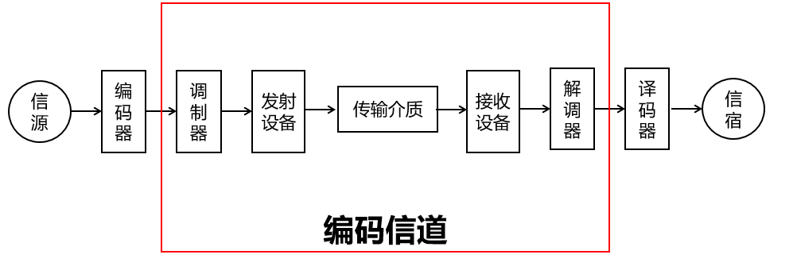

- 调制信道：从调制器的输出端传输到解调器的输入端经过的部分。

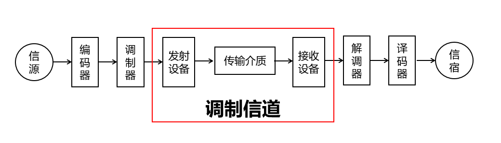

## 3.2 信道传输特性

**不同类型的信道对信号的影响差异较大：**

- 随机参数信道(随参信道)：信号通过信道发生畸变是时变的。
  - 特性：
    - 信号的传输衰减随时间随机变化
    - 信号的传输时延随时间随机变化
    - 存在多径传播现象
- 恒定参数信道(恒参信道)：信号通过信道发生畸变是恒定的。
  - 特性
    - 对信号幅值产生固定的衰减  
    - 对信号输出产生固定的时延

## 3.3 信道容量

**信道容量： ** 信道无差错传输信息的最大平均信息速率。衡量信道的传输能力。

- 信道的带宽是指能够有效通过该信道的信号的最大频带宽度。 用码元速率（或符号速率描述），单位是 Baud 。
- 传输速率是信道单位时间内传输的码元(或符号)或信息的能力用传信率(或信息速率)来描述，单位是bit/s

**连续信道容量：** 

- 奈奎斯特理想的，无噪声的信道容量  C = 2Blog2M
  - C信道容量，单位是bit/s
  - B信道带宽，单位为Hz
  - M进制数，即信号状态数
- 香农有噪声连续信道容量  C = Blog2（1+S/N）
  - C信道容量，单位是bit/s
  - B：带宽，单位Hz
  - S：输入信号功率
  - N：高斯白噪声的功率
  - S/N：信噪比。
  - 分贝和功率的换算公式：
    - （S/N）dB = 10log10（S/N）功率

# 4 基带传输

## 4.1 基带传输基本概念

**基带信号：**   信源发出的没有经过调制的原始信号。

**基带传输：**  直接在信道中传输数字基带信号。

**数字基带传输：**  在信道中传输数字基带信号。

**数字基带传输系统结构：**

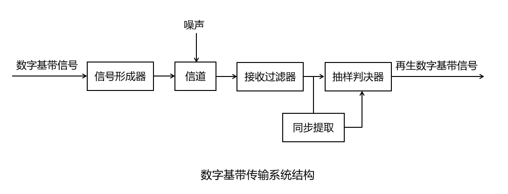

- 信号形成器：把数字基带信号变化成更适合在信道上传输的数字基带信
- 接受过滤器：过滤掉噪声
- 同步提取和抽样判决器两者共同作用，再生数字基带信号

## 4.2 数字基带传输编码

**单极和双极：** 

- 单极：脉冲幅值要么是正电平，要么是零电平，只有一个极性。    
- 双极：脉冲幅值要么是正电平，要么是负电平。

**归零和不归零：**  

- 不归零：在脉冲持续时间呢，电平保持不变，且脉冲持续期结束时不必回归0电平。
- 归零：每个脉冲持续期的中间时刻，电平要回到零电平。  

### 4.2.1 将数据映射为脉冲信号的信号码

#### 4.2.1.1 单极不归零码

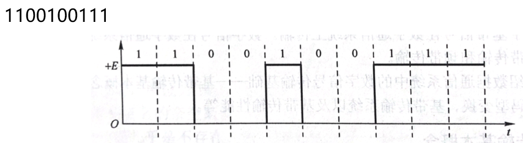

#### 4.2.1.2 双极不归零码

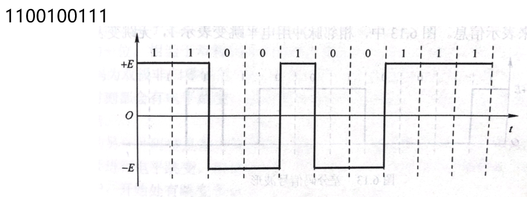

#### 4.2.1.3 单极归零码

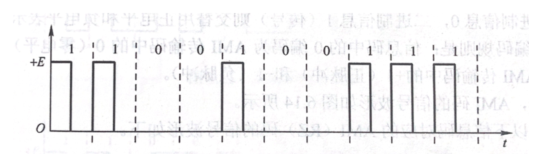

#### 4.2.1.4 双极归零码

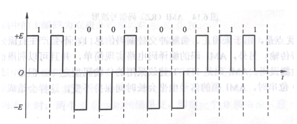

#### 4.2.1.5 差分码（相对码）

当前脉冲时间的电平和前一个脉冲时间的电平做比较。

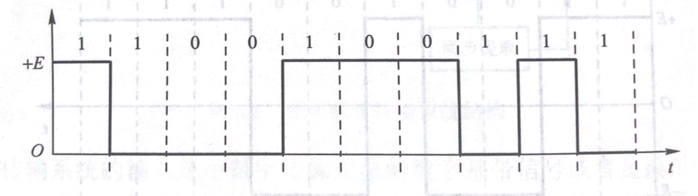

### 4.2.2 将数字基带信号的基本码型变化为适合传输的数字传输基带传输码

#### 4.2.2.1 AMI码

信号交替反转码（Alternative Mark Inversion , AMI码）用3种电平(正电平、负电平、零电平)进行编码

- 0：零电平表示
- 1：交替用正电平和负电平表示，且在脉冲持续的中间时刻回归零电平

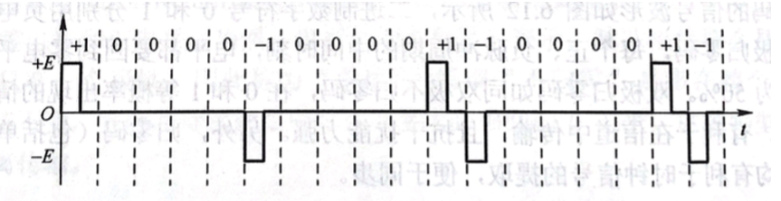

#### 4.2.2.2 双相码

**曼彻斯特码：**

只有正负电平，脉冲持续时间的中间时刻都要进行电平跳变。 

- 0：一个脉冲时间内从负电平跳到正电平（0：负正）
- 1： 一个脉冲时间内从正电平跳到负电平（1：正负）  

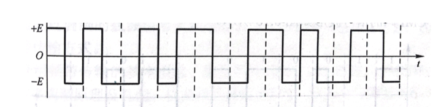

**差分曼彻斯特码：**

- 1：相邻电平有跳变
- 0：相邻电平无跳变

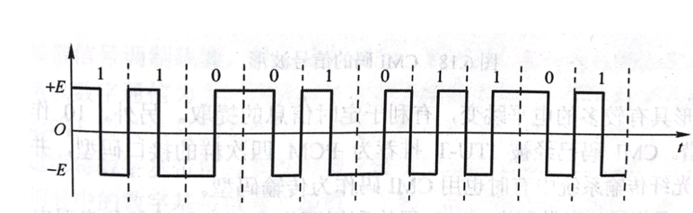

#### 4.2.2.3 米勒码

- 1：正负或负正。  
- 11：交替编码。
- 0：延续前面1的电平，正或负。脉冲期间不跳变。
- 00：前面正，后面负；前面负，后面正。
- 0后的1：延续0的电平，正负或负正。

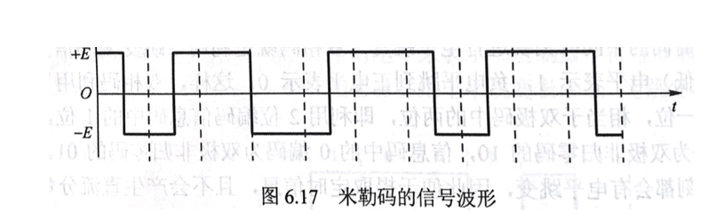

#### 4.2.2.4 CMI码

- 1：正、负，交替编码。
- 0：一个脉冲时间内从负电平到正电平。

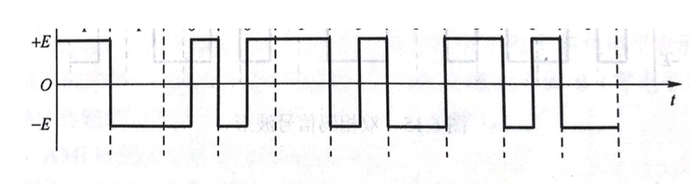

# 5 频带传输

## 5.1 频带传输的基本概念

**基带信号：** 具有低通特性，可以用在低通特性的信道(有线信道)中进行传输。

**无线信道：** 是带通特性。因此只能利用基带信号去调制与对应信道传输特性相匹配的载波信号。

**数字调制**：利用数字基带信号控制载波信号的特征参量，使载波信号的这些参量的变化反映数字基带信号的信息，进而将数字基带信号变换为数字通带信号的过程。

**数字解调**：在接收数据端需要将调制到载波信号中的数字基带信号卸载下来，还原为数字基带信号的过程。

**数字频带传输系统**：实现调制、传输与解调的传输系统。

**数字调制系统基本结构：**

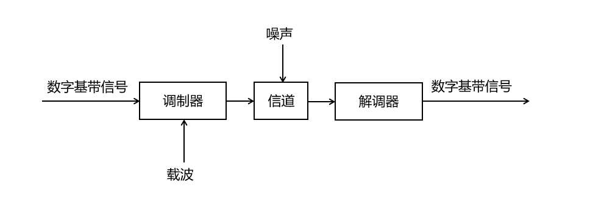

利用数字基带信号控制载波信号的某个(或某些)参数的变化。（利用0或1控制载波的幅值、频率或相位。）

- 幅移键控(ASK)：调制载波的幅值
- 频移键控(FSK)：调制载波的频率
- 相移键控(PSK)：调制载波的相位

## 5.2 频带传输中三种调制方式

### 5.2.1 二进制数字调制

数字通信系统频带传输的基本方式

**分类：**

- 幅移键控调制信号波形（11001001）

  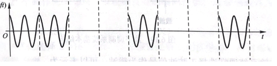

- 频移键控调制信号波形（11001001）

  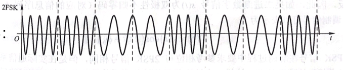

- 相移键控调制信号波形（11001001）

  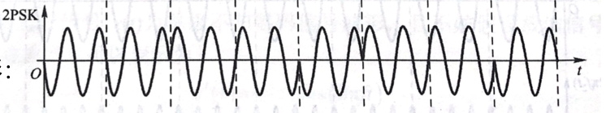

- 二进制差分相移键控（2DPSK）：

  利用相邻两个码元载波间的相对相位变化表示数字基带信号的数字信息。

  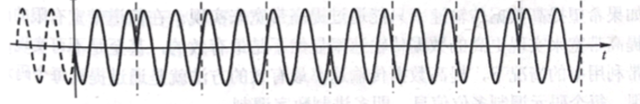

| 调制方式           | 1                | 0                |
| ------------------ | ---------------- | ---------------- |
| 二进制幅移键控     | 有幅值           | 无幅值           |
| 二进制频移键控     | 频率密集         | 频率不密集       |
| 二进制相移键控     | 1 周期开始向下   | 0 周期开始向上   |
| 二进制差分相移键控 | 看前一个周期波形 | 看前一个周期波形 |

**二进制数字调制性能：**

- 频带利用率：频移键控最低。
- 误码率：相移键控误码率最低；幅移键控误码率最高。  
- 对信道特性的敏感性： 幅移键控最敏感。  

### 5.2.2 多进制数字调制

**码元：**  一个固定时长的信号波形。

- 一个脉冲时间（二进制码元）：21
- 两个脉冲时间（四进制码元）：22
- 三个脉冲时间（八进制码元）：23

**数据传输速率Rb (bit/s) 与码元传输速率RB (Baud) 以及进制数M之间的关系为：**  Rb=RBlog2M

### 5.2.3 正交幅值调制

**基本思想：** 二维调制技术，对载波信号的幅值和相位同时进行调制的联合调制技术。

**优点：** 频带利用率高；抗噪声能力强；调制解调系统简单

# 6 物理层接口规程

## 6.1 物理层接口概述

**物理层主要任务：**

- 在传输介质上实现无结构比特流的传输。
- 规定数据终端设备(DTE)和数据通信设备(DCE)之间接口的相关特性。

**注：**

- DTE ：Data Terminal Equipment 
- DCE： Data Communication Equipment

## 6.2 物理层接口特性

- 机械特性：指明通信实体间硬件连接口的机械特点。

     例如：常用的电源插头的尺寸。

- 电气特性：规定了物理连接上，导线的电气连接及有关电路特性。

     例如：信号的电平。

- 功能特性：指明物理接口各条信号线的用途等。

     例如：数据信号线、控制信号线

- 规程特性：通信协议，指明利用接口传输比特流的全过程。

     例如：事件执行顺序。