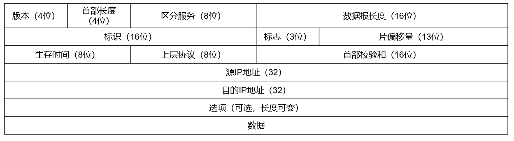
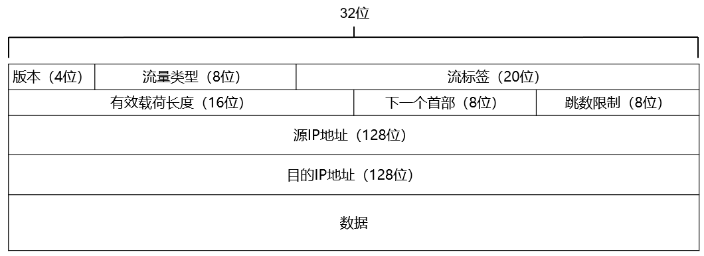

# 1 网络层服务

## 1.1 网络层核心任务

将数据从源主机送达到目的主机。

## 1.2 网络层主要功能

1. 转发：当输入链路接收到一个分组后，路由器需要决策通过那条链路将分组发送出去，并将分组从输入接口转移到输出接口。
2. 路由选择： 当分组从源主机流向目的主机时，必须通过某种方式决定分组经过的路由或路径。
3. 连接建立： 网络层连接是从源主机到目的主机经过的一条路径，这条路径所经过的每个路由器等网路设备都要参与网络层连接的建立。

# 2 数据报网络与虚电路网络

## 2.1 数据报网络

按照目的主机地址进行路由选择的，无连接，分组交换网络。

源主机没要发送一个分组，就为该分组加上目的主机地址，然后将该分组推进网络。每个路由器使用分组的目的主机地址转发分组。

## 2.2 虚电路网络

源主机到目的主机的一条路径上建立一条网络层逻辑连接。

在网络层提供面向连接的分组交换服务。双方通信前先虚电路建立连接，通信结束后再拆除连接。

**虚电路由 3 个要素构成：**

1. 从源主机到目的主机之间的一条路径。
2. 该路径上每条链路的虚电路标识（VCID）
3. 分组交换机的转发表中记录虚电路标识的接续关系。

## 2.3 数据报网络与虚电路网络区别

| 项目         | 虚电路网络                                         | 数据报网络                 |
| ------------ | -------------------------------------------------- | -------------------------- |
| 是否建立连接 | 先建立连接                                         | 无连接                     |
| 地址         | 每个分组含有一个短的虚电路号                       | 每个分组包含源和目的端地址 |
| 分组顺序     | 按序发送，按序接收                                 | 按序发送，不一定按序接收   |
| 路由选择     | 建立 VC 时需要路由选择，只有所有分组沿次路由转发。 | 每个分组独立路由选择       |
| 典型网络     | X.25 帧中继 ATM                                    | 因特网                     |

# 3 网络互连与网络互连设备

## 3.1 异构网络

**异构网络：**  主要是指两个网络的通信技术和运行协议的不同。（例如 wifi 网线）

**异构网络互联的基本策略：**  协议转换和构建虚拟互联网络。

- 协议转换：  采用一类支持异构网络之间协议转换的网络中间设备，来实现异构网络之间数据。
- 构建虚拟互联网络： 在异构网络基础上构建一个同构的虚拟互联网络。

## 3.2 路由器

最典型的网络层设备。具有多个输入端口和多个输出端口的专用计算机，主要任务就是获取与维护路由信息以及转发分组。

**路由器从功能体系结构角度：**

- 输入端口：查找、转发、到达分组缓存排队功能。
- 交换结构
  - 基于内存交换（性能最低价格最便宜）：输入端口——内存、路由处理器——输出端口  
  - 基于总线交换： 输入端口和输出端口连接在一条数据总线上。无须路由处理器介入即可实现交换功能。总线是独占式。
  - 基于网络交换（性能最高，路由器价格昂贵）： 使用一个复杂的互联网络来实现交换结构。克服单一、独占所带来的限制。并行交换传输。
- 输出端口： 缓存排队，从队列中取出分组进行数据链路层数据帧的封装，发送。
  - 先到先服务调度策略
  - 优先级调度、按照 IP 数据报的服务类型调度。
- 路由处理器
  - 执行命令
  - 路由协议运行
  - 路由计算以及路由表的更新与维护

# 4 网络层拥塞控制

## 4.1 网络拥塞

**网络层拥塞：** 用户对网络资源（包括链路带宽，存储空间和处理器处理能力等）的总需求超过了网络固有的容量。

**膝点与崖点：**

- 网络负载在膝点附近时，吞吐量和分组平均延迟达到理想的平衡，网络的使用效率最高。
- 当网络负载超过膝点之后，吞吐量随负载增长的速率放缓，分组平均延迟增长较快；
- 当负载超过崖点，吞吐量随负载的增加不仅不再增长，反而急剧下降，分组平均延迟急剧上升。

**发生拥塞的原因：**

- 缓冲区容量有限
- 传输线路的带宽有限
- 网络节点的处理能力有限
- 网络中某些部分发生了故障

## 4.2 流量感知路由

权值根据网络负载动态调整，可以将网络流量引导到不同的链路上，均衡网络负载。

## 4.3 准入控制

广泛用于虚电路的拥塞预防技术。

对新建的虚电路进行审核，如果新建立的虚电路会导致网络变得拥塞，那么网络拒绝建立该新虚电路。

## 4.4 流量调节

在网络发生拥塞时，通过调整发送方发送数据的速率来消除拥塞。

**路由器如何感知发生了拥塞？**  

通过路由器输出端口的排队时延。

**路由器感知到拥塞时，如何通知其上游结点，并且使上游结点降低发送速率？**  

- 抑制分组：感知到拥塞的路由器选择一个被拥塞的数据报，给该数据报的源主机返回一个抑制分组。
- 背压：抑制分组在从拥塞节点到源结点的路径上的每一条，都发挥抑制作用。

## 4.5 负载脱落

有选择地主动丢弃一些数据报，来减轻网络负载，从而缓解或消除拥塞。  

# 5 Internet 网络层

## 5.1 IPv4 协议

定义了如何封装上层协议（如 UDP、TCP）的报文段；

定义了 Internet 网络层寻址 （IP地址）以及如何转发 IP 数据报等内容；

### 5.1.1 IP 数据报格式

1. 版本号： 4位 。 IP 的版本号。
2. 首部长度：4位。 IP 数据报的首部长度 ： 20 B - 60 B
3. 区分服务：8位。在旧标准种称为服务类型（TOS）字段，用来指示期望获得那种类型的服务。
4. 数据长度：16位。 IP 数据报的总字节数。
5. 生存时间：8位。 Time-To-Live TTL. 标识IP 数据报在网络种可以通过的路由器数（或跳步数。）
6. 上层协议：8位。指示该IP数据报封装的是那个上层协议。TCP 6  UDP 17
7. 首部校验和：16 位，利用校验实现对 IP 数据报首部的差错检测。
8. 源IP地址：32位。发出IP数据报的源主机的IP地址。 
9. 目的IP地址：32位。IP数据报的需要送达的主机的IP地址。
10. 选项：长度可变。   
11. 数据：存放IP数据报所封装的传输层报文段。   
12. 标识：16位。标识一个IP数据报。每产生一个IP数据报， IP协议的计数器加1。该字段的重要用途：在IP数据报分片和重组过程中用于标识属于同一IP数据报。该字段不可唯一标识一个IP数据报。
13. 空，DF，MF
    1. DF  禁止分片
       - DF = 0 允许分片 
       - DF = 1 禁止分片
    2. MF 更多分片
       - MF =  0 未被分片或者是最后一片
       - MF =  1 是分片且不是最后一个
14. 片偏移量：以8B为单位。表示一个 IP 数据报分片与原 IP 数据报的数据的相对偏移量。当该字段值为 0 时 ，且 MF = 1，则表示这是一个 IP 分片，且是第一个分片。

### 5.1.2 IP 数据报分片

**最大传输单元：**   MTU 数据链路层能承载的最大数据量。

**IP 数据报分片的原则：**  尽可能少分片。一个最大分片可封装的数据字节数正好是 8 的倍数。

## 5.2 IPv4 编址

IPv4地址的长度为32位，共有232个不同的IP地址，约为43亿个。

### 5.2.1 IPv4 地址 的三种标记方式

| 方法             | 表示方式                            |
| ---------------- | ----------------------------------- |
| 二进制标记法     | 11000000 10101000 00000001 01100101 |
| 点分十进制标记法 | 192.168.1.101                       |
| 十六进制标记法   | 0xC0A80165                          |

### 5.2.2 IP 地址分配：

**前缀：** 即网络部分（Net ID）。用于描述主机所归属的网络。

- 分类地址：定长前缀
- 无类地址：前缀长度可变

**后缀：**  即主机部分。用于表示主机在网络中的唯一地址。

| 类   | 前缀长度 | 前缀                                | 首字节  |
| ---- | -------- | ----------------------------------- | ------- |
| A    | 8位      | 0xxxxxxx                            | 0-127   |
| B    | 16位     | 10xxxxxx xxxxxxxx                   | 128-191 |
| C    | 24位     | 110xxxxx xxxxxxxx                   | 192-223 |
| D    | 不可用   | 1110xxxx xxxxxxxx xxxxxxxx xxxxxxxx | 224-239 |
| E    | 不可用   | 1111xxxx xxxxxxxx xxxxxxxx xxxxxxxx | 240-255 |

A、B、C 类地址可以用作标识网络中的主机或路由器

D 类地址作为组广播地址

E 保留地址拿来做研究，搜索开发实验使用。

**特殊地址：**

| Net ID | Host id              | 作为IP数据报源地址 | 作为IP数据报目的地址 | 用途                                                         |
| ------ | -------------------- | ------------------ | -------------------- | ------------------------------------------------------------ |
| 全 0   | 全 0                 | 可以               | 不可以               | 在本王范围内标识本机（0.0.00/32）在路由表中用与标识默认路由（0.0.0.0/0） |
| 全0    | 特定值               | 可以               | 不可以               | 标识本网内某个特定的主机                                     |
| 全1    | 全1                  | 不可以             | 可以                 | 本网广播地址                                                 |
| 特定值 | 全0                  | 不可以             | 不可以               | 表示一个网络                                                 |
| 特定值 | 全1                  | 不可以             | 可以                 | 直接广播地址，对特定网络上的所有主机进行广播                 |
| 127    | 非全0或非全1的任何数 | 可以               | 可以                 | 用于本地软件环回测试，称为环回地址                           |

**私有地址： **  一部分分类地址保留用于内部网络。这部分分类地址可以在内网使用，但不能在公共互联网上使用。

| 私有地址类别 | 范围                                          |
| ------------ | --------------------------------------------- |
| A类          | 10.0.0.0 - 10.255.255.255 (10.0.0.0/8)        |
| B类          | 172.16.0.0-172.31.255.255(172.16.0.0/12)      |
| C类          | 192.168.0.0 - 192.168.255.255(192.168.0.0/16) |

**无类地址：** 无类地址中，网络前缀不再被设计为定长的 8 位 、 16 位 、24 位，而变成可以是 0 - 32 位的任意值。（a.b.c.d/x）

**子网划分：** 

- 子网化：将一个较大的子网划分为多个较小子网的过程。
- 超网化：将具有较长前缀的相对较小的子网和并未一个具有较短前缀的相对较大子网。
- 子网掩码：定义一个子网的网络前缀长度。
  - 位数：32位。
  - 书写形式：二进制，点分十进制。
  - 取值规则：对应前缀，全部为1.对应后缀，全部为0。
- 子网地址：子网掩码与主机地址按位与运算。
- 广播地址：子网掩码的反码与主机地址按位或运算。

**路由聚合：**  减少路由表项数，提高路由效率，将可以聚合在一起的子网聚合成一个大的子网。

## 5.3 动态主机配置协议 DHCP

当组织分配到一个网络地址块后，就可以为该组织内的主机和路由器接口分配IP地址。

静态分配：手动配置。

动态分配：动态主机配置协议来分配。

DHCP 服务器端口号 67 客户端端口号 68 

**DHCP 工作过程：**

- DHCP 服务器发现： 广播方式
- DHCP 服务器提供： 广播方式
- DHCP 请求：  广播方式
- DHCP 确认

## 5.4 网络地址转换

**NAT：**  使私有地址在公共 Internet 上正常通信。

**NAT 工作原理：**

1. 从内网出去的 IP 数据报，将其 IP 地址替换为 NAT 服务器拥有的合法的公共 IP 地址，并将替换关系记录到 NAT 转换表中。
2. 从公共互联网返回的 IP 数据报，依据其目的的 IP 地址检索 NAT 转换表，并利用检索到的内部私有IP 地址替换目的 IP 地址，然后将 IP 数据报转发到内部网络。

## 5.5 ICMP

互联网控制报文协议：在主机或路由器之间实现差错报告，信息探测。

**ICMP 报文分类：**

- 差错报告报文
  - 终点不可达
  - 源点抑制
  - 时间超时
  - 参数问题
  - 路由重定向
- 询问报文
  - 回声请求/应答
  - 时间戳请求/应答

## 5.6 IPv6

### 5.6.1 IPv6数据报格式

### 5.6.2 IPv6 地址

- IPv6地址长度为 128 位。

- IPv6地址表示方法（双冒号只能出现一次）

  - 8组冒号分隔的十六进制数： 8000**::**4321:0501:AB96:56CD

  - 在IPv6地址中嵌入IPv4的点分十进制：

    6700::89A1：0321：206.36.45.19

**地址分类：**

- 单播地址：可做源地址和目的地址
- 组播地址：可做目的地址
- 任播地址：可做目的地址

### 5.6.3 IPv4 到 IPv6 的迁移

- 双协议栈：网络结点同时具备发送IPv4与IPv6数据报的能力。
- 隧道：很好地解决IPv6通信中经过IPv4路由器的问题，同时也不会出现信息丢失的问题。  （使用 IPv4 封装 IPv6）

# 6 路由算法与路由协议

## 6.1 路由选择算法的分类、

**分类标准：**

- 是否需要全局信息
  - 需要网络的完整信息 -> 全局式路由算法 -> 链路状态路由选择算法（LS算法）
  - 不需要网络的完整信息 -> 分布式路由选择算法 -> 距离向量选择算法（DV算法）
- 静态动态
  - 静态：人工配置
  - 动态：网络发生变化，自动计算最佳路由。
- 是否敏感
  - 敏感：负载敏感的路由选择算法。
  - 迟钝：负载迟钝的路由选择算法。

## 6.2 链路状态路由选择算法

链路状态路由选择算法是一种全局式路由选择算法，每个路由器在计算路由时，需要构建出整个网络的拓扑图。

**利用 Dijstra 算法求最短路径：**

| func   | 意义                                                         |
| ------ | ------------------------------------------------------------ |
| D(v)   | 到本次迭代位置，源结点（计算结点）到目的结点v的当前路径距离。 |
| P(v)   | 到本次迭代位置，在源结点到目的结点v的当前路径上，结点v的前序结点。 |
| c(x,y) | 结点x与结点y之间直接链路的费用，如果x和y之间没有直接链路相连，则c(x,y)= （横八） |
| S      | 结点的集合，用于存储从源结点到该结点的最短路径已求出的结点集合。初始值只有源结点本身。 |

## 6.3 距离向量路由选择算法

基础是Bellman-Ford方程（简称B-F方程）。令dx(y)表示结点x到结点y的路径的最低费用，根据B-F方程，有以下公式：

`dx(y) =  min{c(x,v)+dv(y)} `  v∈ {x的邻居}

- 路由器分别维护自己的转发表（DV），并且收到邻居的通告。
- 收到通告会进行对比更新。

## 6.4 层次化路由选择算法

大规模网络路由选择最有效可行的解决方案。

**自治系统（autonomous system，AS）：**  互联网按组织边界划分为多个自治系统。每个自治系统由运行相同路由协议和路由选择算法的路由器组成。

**网关路由器：**  每个自治系统存在至少一个与其他自治系统互连的路由器。

**层次化路由选择原理：**  大规模互联网路由划分为两层

- 自治系统内路由选择：计算到达自治系统内目的网络的路由。  
- 自治系统间路由选择：负责其他自治系统网络的可达性信息。

## 6.5 Internet 路由选择协议

### 6.5.1 内部网关协议（IGP）

​     Internet自治系统内路由选择协议。  

- RIP 路由信息协议：封装进 UDP 数据报，较小的 AS ，基于距离向量路由选择算法。

  - RIP 在度量路径时采用的是跳数
  - RIP 的费用定义在源路由器和目的子网之间
  - RIP 被限制的网络直径不超过 15 跳 的自治系统内容使用。

- OSPF 开放最短路径优先协议： 直接封装在 IP 数据报传输，较大规模的 AS。 基于链路状态路由选择算法。

  - 优点
    - 安全
    - 支持多条相同费用的路径
    - 支持区别化费用度量
    - 支持单播路由与多播路由
    - 分层路由

  

### 6.5.2 外部网关协议（EGP）

​     Internet自治系统间路由选择协议。  

**边界网关协议 BGP：**

实现跨自治系统的路由信息交换。典型版本是 BGP4，BGP 封装进 TCP 报文段

**BGP 主要由 4 种报文：**

- OPEN（打开）报文，用来与BGP对等方建立BGP会话
- UPDATE（更新）报文，用来通告某一路由可达性信息，或者撤销已有路由
- KEEPALIVE（保活）报文，用于对打开报文的确认，或周期性地证实会话的有效
- NOTIFICATION（通知）报文，用来通告差错

