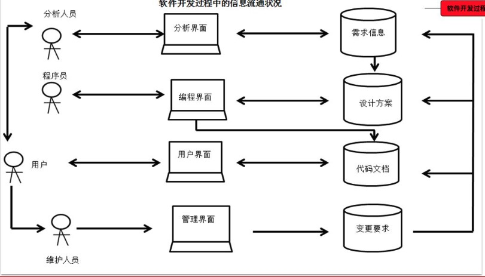
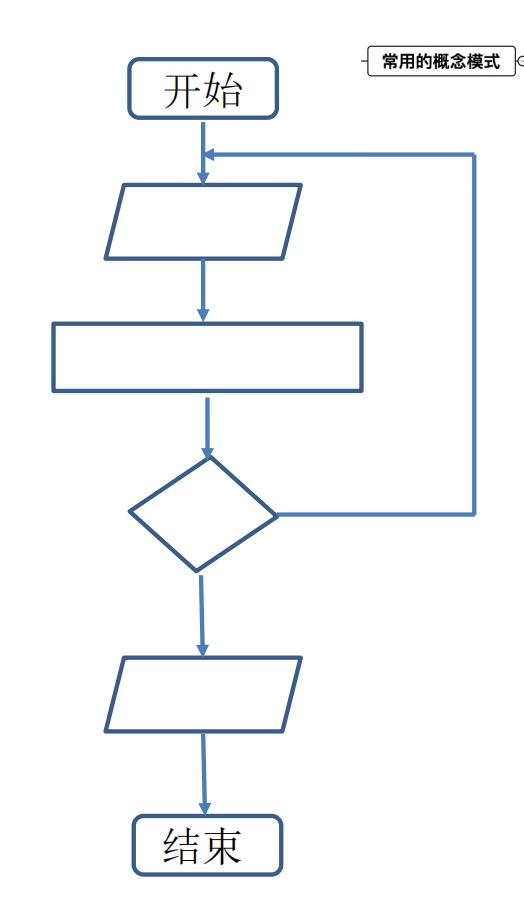
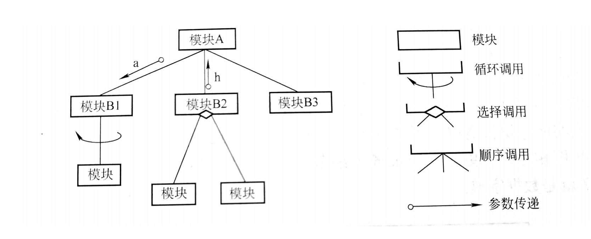
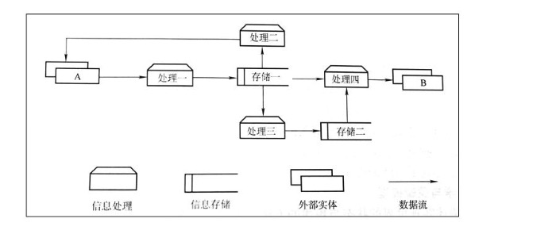
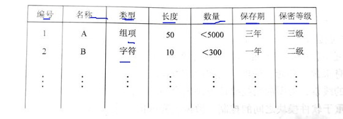
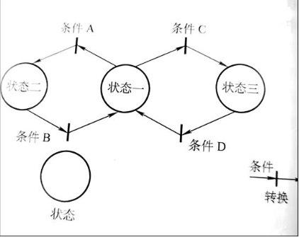
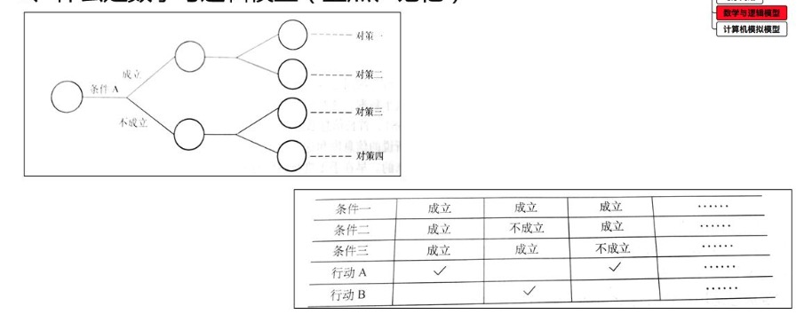

## 1 软件开发过程的信息要求

### 1.1 软件开发过程中信息流通状况

- 有关系统环境、现状及需求的信息。由用户提出，由分析人员采集，需求分析。
- 有关软件的功能设计及物理设计由分析人员设计。
- 软件成果本身，包括程序文档，由程序员编制。
- 用户对系统的各种变更要求，以及系统的各种变更的记录。由维护人员收集。

## 2 概念模式及其作用

### 2.1 什么是概念模式，其作用是什么？

**概念**

概念模式指人们在认识事物过程中，对于某一事物或某一系统形成的，抽象的，一般的框架。

**常用的概念模式有下列几种：**

- 框图
- 结构图
- 数据流程图
- 实体关系图
- 数据字典
- 时序网络
- 数据与逻辑模型
- 计算机模拟模型

**作用**

概念模式在认识中的作用十分重要，同时作为交流与表达工具也是十分重要的。人们在相互配合，互相协调，共同完成某项任务的时候，需要统一思想，统一认识，协同行动就必须用某种公认的方式来进行表述。

### 2.2 什么是框图

描述程序执行的逻辑过程的概念模式，把程序执行的基本步骤归纳为判断、处理、输入、输出、起始和终止几个基本功能。

### 2.3 什么是结构图

当程序模式比较大的时候，直接用框图表示会过于复杂，使人无法分层次地掌握程序结构。针对这种情况，人们引入了结构图。

### 2.4 数据流图的组成和作用

数据流程图（简称DFD） 面对的是一个系统的信息流程。他更多的用于描述某一业务处理系统的信息来源，存储，处理，去向的全面情况。

数据流程图的基本元素是外部实体，数据存储和数据处理，用箭头表示信息的流动情况。

### 2.5 实体关系图的组成和作用

实体关系图是一种用于描述静态数据结构的概念模式。

它以实体，关系，属性三个基本概念概括数据的基本结构。

它广泛应用于数据库的设计中，常常和数据流程图，结构图等相互配合使用。

### 2.6 什么是数据字典

数据字典是一种描述数据内容的概念模式

他用表格的形式列出数据的基本属性以及相互关系，作为人们对于数据的认识和了解，他的雏形是编写软件时的变量说明或者标识符清单。

### 2.7 什么是时序网络，其作用是什么

主要描述系统的状态及其转换方式

状态是指系统在运行中的某特定形态或工作方式，

转换是指状态在一定条件下的相互转换，

经常应用于一些实时控制方面的软件功能描述。

### 2.8 什么是数学与逻辑模型

数学与逻辑模型用于藐视客观世界的状态与规律。

作为逻辑模型的表达方式，决策树和决策表是经常使用的。

### 2.9 计算机模拟模型

利用计算机大量、高速处理信息的能力，在计算机内设置一定的环境（如资源条件），又以程序来实现客观系统中的某些规律或者规则，以便人们观察与预测客观系统的状况。

（模拟婴儿保温箱，蔬菜大棚温度湿度）

## 3 信息库及其一致性（最困难、最核心）

### 3.1 什么是信息库

信息库是一个随着项目进度不断修改与补充的数据集合。

信息库研究的核心问题是保持信息的一致性。

### 3.2 主要研究的内容

- 外部信息
  - 所属软件的工作环境、功能需求，性能需求，有关的各种信息来源的状况，用户状况，硬件环境，以及在该专业领域中的作用等外部信息
- 需求分析
  - 需求分析阶段中收集有关用户的各种信息，包括用户本身提供的，也包括在调查研究中得到的
- 逻辑设计
  - 逻辑设计阶段的各种调查材料和生成各种文档，包括调查记录，原始数据，报表及单证样本，绘制的各种图以及最后生成的系统说明书。
- 设计
  - 设计阶段的各种材料，包括所有的数据库与数据文件格式，数据字典，程序模块的要求，总体结构，各种接口及参数的传递方式以及最后形成的设计方案。
- 编程
  - 编程的所有成果，包括程序代码、框图，变量说明，测试情况（输入数据及输出结果），验收报告，使用说明等。
- 运行
  - 运行及其使用情况的详细记录，包括每次使用的时间，状态，问题，特别是有关错误及故障的记录情况。
- 维护
  - 维护及修改的情况，包括修改的目标，责任人，过程，时间，修改前后的代码与文档以及修改后的结果，原系统的备份。
- 项目管理
  - 项目管理有关的信息，人员变更，资金投入，进度计划及实施情况，这项还包括版本信息，即各个版本的备份，每个版本的推出日志，与以前版本相比的变更说明等。

## 4 人机界面及其管理

### 4.1  用户界面设计的基本原则（通信一致有进展方便用户有帮助）

- 用户界面主要功能是通信
- 用户界面必须始终一致
- 用户界面必须使用户随时掌握任务的进展情况
- 用户界面必须提供帮助
- 宁可让程序多干，不可让用户多干（方便用户）

### 4.2 人机交互手段的八个方面

- 键盘操作
- 屏幕滚动
- 菜单选择
- 帮助系统
- 鼠标操作
- 色彩应用
- 数据录入
- 信息显示

## 5 项目管理和版本管理

### 5.1 项目管理特点

- 子任务多，关系复杂
- 任务不可重复，形式不断变更。项目管理的核心要素是**质量**
- 协调组织的任务十分突出，资源浪费闲置的**风险**与合理优化组合，提高效益的**机会**并存
- 信息处理工作的作用与意义更为突出

### 5.2 项目管理的目标（质度资本）

- 使产品（或工程） 的质量得到有效的控制
- 保证整个系统按照预定的进度完成
- 有效的利用资源，尽可能的使资源的闲置和浪费减少
- 控制与降低成本，从项目的观点来说，最终都体现为成本的升高或者降低。成本的情况是项目管理状况的综合的最终体现。