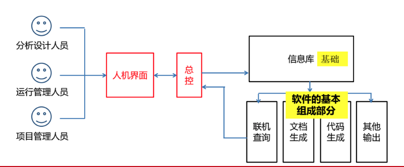
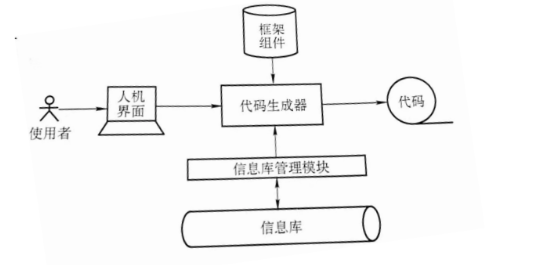

## 1 基本功能与一般结构

### 1.1 软件开发工具的基本功能（概存文代管）

- 提供描述软件状况及其发展过程的概念模式
- 提供存储和管理有关新的机制和手段
- 通过各种的信息的提供，半自动的生成程序代码，测试，修改错误
- 帮助使用者编制，生成及修改各种文档
- 对于历史信息进行跨生命周期的管理，把项目进度与版本更新的有关信息科学的管理起来

### 1.2 软件开发工具的一般结构

在软件开发工具的结构中，处于中心位置的是 **总控和人机界面**。

人机界面的有效实现对于软件开发工具而言，是 **实用性和灵活性** 的保证。

### 1.3 软件的基本组成部分

在信息库内容的基础上，软件开发工具向使用者提供信息的渠道，除了直接通过人机对话提供查询之外，最重要的两个信息出口就是代码生成和文档生成。

项目管理与版本管理是程序的重要的体现。

## 2 总控与人机界面

### 2.1 软件开发工具的三个技术要素

- 面向使用者
- 保证信息的准确传递
- 保证系统的开发性（或灵活性）

### 2.2 软件开发的周期

- 需求分析阶段
  - 建立逻辑模型
    - 领域或者环境模型
    - 数据模型
    - 信息流通的模型
- 分析设计阶段
  - 确定子系统和模块的划分
- 编码阶段
- 测试阶段
  - 安排测试方案
  - 准备测试数据
  - 收集与分析测试结果
  - 并对出现问题的模块作出修改和调整
- 维护阶段

## 3 信息库及其管理

### 3.1 信息库技术应考虑的问题

- 信息库的内容
- 信息库的组织方式
- 信息库的管理功能
- 历史信息的处理方法

### 3.2 信息库中存放的信息

- 系统状况：关于软件应用的领域与环紧的状况
- 设计成果：包括逻辑设计和物理设计的成果。信息系统设计成果包括数据流程图，数据字典，系统结构图，数据库逻辑管理，各模块的设计、各模块的设计要求，以及由此形成的设计文档。
- 运行状况：信息系统运行状况记录包括运行效率，作用，用户反应，故障情况，故障的原因和处理情况
- 项目版本：有关项目管理与版本的信息。

### 3.3 信息库的组织方式

逻辑上统一，物理上分散

设计统一的信息库管理模块来进行管理。通过信息库管理模块来对分散的各个数据库进行存取，并进行一致性的检查与维护。

### 3.4 信息库的管理功能

- 录入更新
- 使用查询
- 一致性维护

### 3.5 历史信息在信息库中保留的难点

- 量大
- 格式不一致
- 数据不标准

## 4 文档生成与代码生成

### 4.1 生成代码依据的资料

- 信息库中已有的有关资料
- 利用各种标准模块的框架和构件
- 依据使用者通过屏幕前的操作送入的信息

代码生成器是统一的一体化的软件开发工具中的一个重要的部分

 

### 4.2 文档生成包括哪些

> 从上到下为从难到易

- 文章
- 图形
- 表格

文档生成与代码生成相比数量大， 内容复杂

## 5 项目管理与版本管理

### 5.1 软件项目管理的主要内容

- 研究确定开发工作的方针和方法
- 开发任务的划分和分工
- 资源状况。包括人力、物力、设备、软件、资金
- 人员状况。包括每个成员或团队的技术水平和工作进度
- 变更情况。包括需求，环境，人员，技术，设备的变更。
- 质量情况。包括质量标准，如何检验。