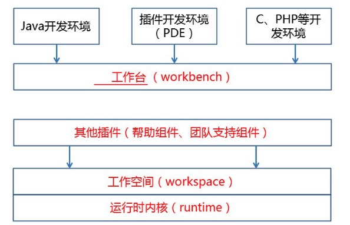

## 1  Eclipse 简介

### 1.1 Eclipse 是啥

是一个开源的，基于 Java 的可扩展集应用程序开发环境

最初主要用来进行 java 语言开发，但并非只有这个用户

### 1.2 Eclipse 的体系结构（内间台插）

- 运行时内核： 平台运行库是内核，他在启动时检查已安装了哪些插件
- 工作空间：负责管理用户资源的插件，包括用户创建的项目、项目中的文件，以及文件变更和其他资源
- 工作台：为 Eclipse 提供用户界面
- 其他插件：包括帮助组件，团队支持组件等

## 2 Eclipse 的获取与安装方法

 使用 Eclipse ，首先需要安装 JDK

安装 JDK 之后， 开发安装专门用于编写 C 和 C ++ 程序的 Eclipse 开发环境 CDT

